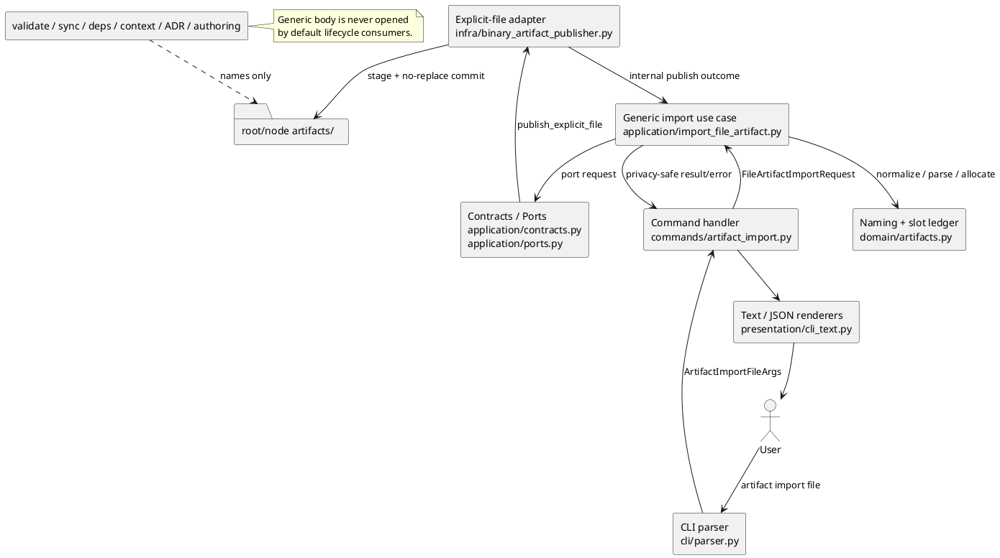
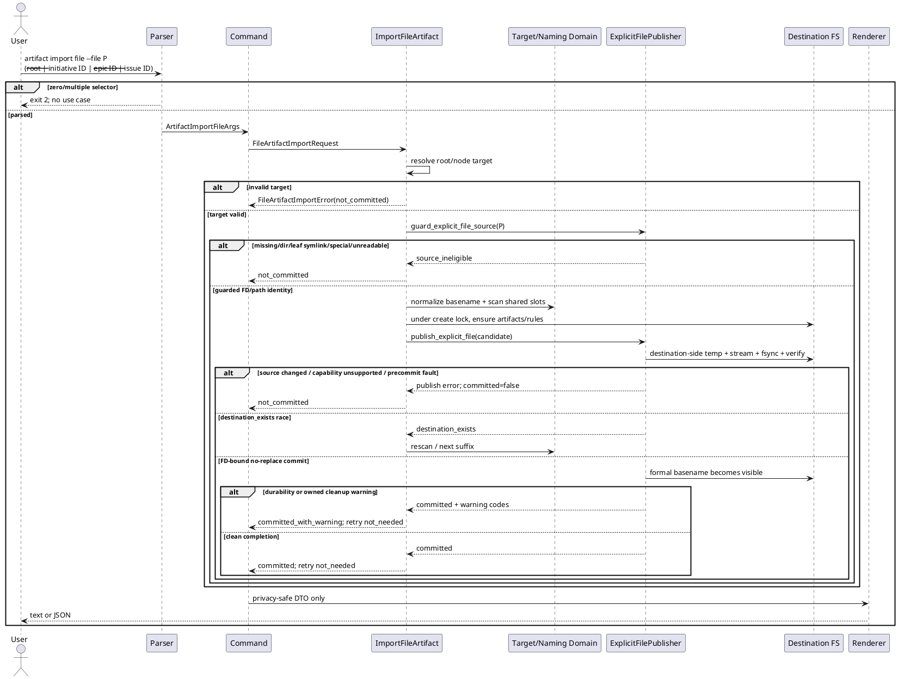
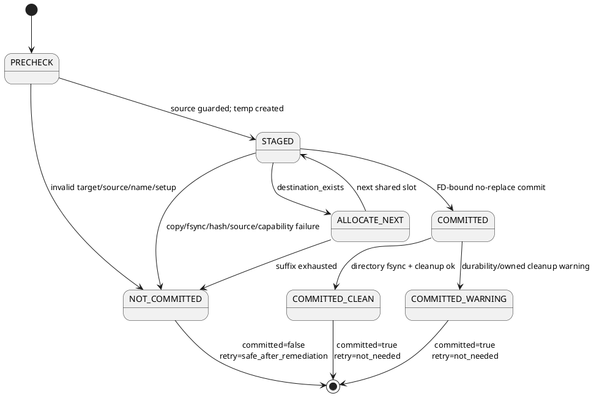

# iss-00345 Generic Single-File Artifact Import — Issue 設計書（Standard）

## 0. 設計の位置づけ

本書は `requirement.md` の `I345-RQ-*` / `I345-AC-*` を実装可能な責務、interface、state、failure mapping、test seam へ落とす canonical design draft である。runtime classification は `standard` であり、本書がcanonical pathに存在することだけではfresh reviewer passやexecution-readyを意味しない。

設計根拠は、current provider source、parent Epic `D-003`〜`D-009`、accepted ADR、review済みのcanonical requirement、Issue authoring workflowである。

## 1. 設計目標

### DES-345-001 独立した public use case

`artifact import file` を既存 `artifact import chatgpt-output` から独立した request/result/error/use-case/rendererとして追加する。既存 commandの Workbench、lowercase `.md`、title/slug、blank identity、hash/count outputを一般化または削除しない。

- Trace: `I345-RQ-001`, `I345-RQ-013`; `I345-AC-001`, `I345-AC-016`。

### DES-345-002 Root と node の明示 target

rootを fake `SpecNode` にせず、application-local `ArtifactTarget` として node targetと同じ downstream interfaceへ束ねる。

- Trace: `I345-RQ-001`, `I345-RQ-012`; `I345-AC-002`, `I345-AC-015`。

### DES-345-003 Name-only generic identity

original basenameをminimal normalizeし、separate generic parserとtyped/blank/generic shared slot ledgerでdestination identityを決める。bodyをidentityやclassificationに使わない。

- Trace: `I345-RQ-005`〜`I345-RQ-007`, `I345-RQ-011`; `I345-AC-006`〜`I345-AC-009`, `I345-AC-014`。

### DES-345-004 Descriptor-bound publication

current `FilesystemBinaryArtifactPublisher` の destination-side staging、bounded stream copy、hash/count internal verification、source stability check、destination parent FD、no-replace commitを再利用する。ただしgeneric use caseを`workbench_source_guard`へ結合しない。

- Trace: `I345-RQ-003`, `I345-RQ-004`, `I345-RQ-008`, `I345-RQ-009`; `I345-AC-004`, `I345-AC-005`, `I345-AC-010`〜`I345-AC-012`。

### DES-345-005 Privacy by contract

raw source pathとinternal verification metadataをpresentationへ到達させない。external sourceはbasenameのみ、pre-commit failureはsource/destination fieldなし、unexpected exceptionはstable tokenへ変換する。

- Trace: `I345-RQ-010`; `I345-AC-013`。

### DES-345-006 Opaque lifecycle and compatibility

validate/sync/deps/context/ADR mirror/authoring discoveryはgeneric bodyをopen/decodeしない。existing typed/blank/chatgpt-output behaviorをcharacterization testsで固定する。

- Trace: `I345-RQ-011`, `I345-RQ-013`; `I345-AC-014`, `I345-AC-016`, `I345-AC-017`。

### DES-345-007 Provider-first delivery boundary

provider runtime/docs/rulesを一次変更面とし、managed dogfood projectionを別観測点として扱う。Issue 346 ownershipを越えない。

- Trace: `I345-RQ-014`, `I345-RQ-015`; `I345-AC-018`, `I345-AC-019`。

## 2. Fixed accepted decisions と Issue-local choices

### 2.1 変更禁止の accepted boundary

| Fixed decision | Authority | 本設計の扱い |
|---|---|---|
| commandは`artifact import file` | Parent `E-RQ-008`, ADR context | parser/handlerをadditiveに追加 |
| exactly one root/Initiative/Epic/Issue | `E-RQ-009`, `D-004` | CLI mutexに加えapplicationでも再検証 |
| repo-root-relative、external explicit path可 | `E-RQ-010`, ADR Decision 5 | `repo_root / raw_path`のlexical normalization |
| regular leaf、leaf symlink reject、ancestor symlink allow | `E-RQ-011`, `D-005` | explicit guardでFD/path identity検証 |
| opaque bytes/source unchanged | `E-RQ-013`, ADR consequence | staging coreを再利用 |
| `<ts>--<basename>` / `<ts>-<nn>--<basename>` | ADR Decision 1 | generic formatterを固定 |
| `--`はtyped tokenでない | ADR Decision 2 | separate parserに限定 |
| full destination basename identity / shared slots | ADR Decision 3 | result `artifact_id`とledgerへ反映 |
| minimal normalization | ADR Decision 4 | content/title/slugを使わない |
| external basename-only / no content-derived output | ADR Decision 6 | public DTOとrendererで構造的に遮断 |
| generic bodyはsemantic inputでない | ADR Decision 7 | lifecycle scannersをname-only化 |
| FD-bound no-replaceがcommit point | ADR Decision 8 | state machineの唯一のcommit transition |
| post-commit warningはretry不要 | ADR Decision 8 | exit success + `committed_with_warning` |
| `chatgpt-output`不変 | `E-RQ-021` | current classes/renderers/portを維持 |
| Issue 346 delivery boundary | Parent Candidate 3 | integrated/distribution/final reviewをdefer |

### 2.2 Issue-local implementation choices

次はaccepted decisionの実現方法であり、Issue-localに具体化する。reviewで不適合なら同じfixed boundary内で修正できる。

| Choice ID | Choice | Rationale |
|---|---|---|
| `LC-345-001` | `FileArtifactImportRequest/Result/Error`をexisting `ArtifactImport*`から分離 | generic privacy fieldsとlegacy hash/count fieldsの混入を型で防ぐ |
| `LC-345-002` | `UseCases.import_file_artifact`を追加し、current `import_artifact`はchatgpt-output専用のまま | compatibilityとcall-site clarity |
| `LC-345-003` | `Ports.explicit_file_artifact_publisher`を追加し、same adapter instanceがlegacy/new portsを実装可能 | staging core再利用とguard分離を両立 |
| `LC-345-004` | `application/import_file_artifact.py`を新設 | existing use caseへのconditional accumulationを避ける |
| `LC-345-005` | root/nodeを`ArtifactTarget(kind,id,path,rules_kind)`に正規化 | rootをgraph nodeにせずsetup helperを共有 |
| `LC-345-006` | generic slot scannerは`os.scandir()`でdirect child name/typeだけを見る | extension-agnostic、body-open防止、symlink/type fail-closed |
| `LC-345-007` | public warning allowlistを`directory_fsync_failed`, `temp_cleanup_retained`, `create_lock_release_failed`に限定 | parent designのdurability/owned cleanup semanticsに一致 |
| `LC-345-008` | pre-commit errorはsource/destination fieldを持たない専用DTO | path leakをrenderer disciplineだけに依存させない |
| `LC-345-009` | root rules sourceを`docs/rules/root/artifacts.md`とする | parent `D-004`のexact pathを採用 |
| `LC-345-010` | filename byte budgetはdestination directoryの`PC_NAME_MAX`を取得し、取得不能/不正値はfail closed | platform limitを推測しない |

## 3. Architecture context

次の図は、利用者入力がlayer boundaryを通り、bodyをsemantic consumerへ渡さずformal destinationへ到達する流れを示す。矢印は依存方向であり、infraやpresentationからdomain/applicationへ逆流させない。



## 4. Layer responsibilities and interfaces

### 4.1 CLI layer

#### Files

- `src/spec_dock/assets/spec_dock/scripts/spec_dock_runtime/cli/parser.py`
- `src/spec_dock/assets/spec_dock/scripts/spec_dock_runtime/cli/registry.py`（registryがcommand specsを自動収集する現行構造の確認・必要時のみ変更）

#### Responsibilities

- `artifact import` subtreeへ`file` leafをadditiveに追加する。
- argparse mutually exclusive groupで`--root`, `--initiative`, `--epic`, `--issue`のexactly oneを要求する。
- `--file`をrequired、`--json`をoptionalにする。
- title/slug/type/encoding/move/overwrite等を登録しない。
- parse failureはexit code 2でuse caseを呼ばない。

#### Proposed symbol

- command registry key: `artifact_import_file`

### 4.2 Command handler layer

#### File

- `src/spec_dock/assets/spec_dock/scripts/spec_dock_runtime/commands/artifact_import.py`

#### Proposed symbols

| Symbol | Contract |
|---|---|
| `ArtifactImportFileArgs` | `target_kind`, `target_value`, `source_path`, `json`だけを持つfrozen args |
| `_add_file_arguments` | generic command専用arg registration |
| `_file_args_factory` | selectorを`root|initiative|epic|issue`へ正規化 |
| `_run_file` | `UseCases.import_file_artifact`を呼び、generic専用rendererを選択 |

#### Error boundary

- `FileArtifactImportError`だけをknown errorとしてrenderする。
- unknown `Exception`はraw message/contextを捨て、`FileArtifactImportError(code="runtime_failed", publication_state="not_committed", cleanup_state="not_created")`相当へ変換する。
- post-commit warning resultをexceptionへ変えない。
- current `ArtifactImportChatGptOutputArgs`, `_run`, renderer callsは既存契約のまま保持する。

### 4.3 Application contracts

#### File

- `src/spec_dock/assets/spec_dock/scripts/spec_dock_runtime/application/contracts.py`

#### Proposed value vocabulary

```text
FileArtifactTargetKind = root | initiative | epic | issue
FileArtifactSourceVisibility = repo_relative | basename_only
FileArtifactPublicationState = not_committed | committed | committed_with_warning
FileArtifactRetryDisposition = safe_after_remediation | not_needed
FileArtifactStorageIdentity = generic
```

#### Request

| Field | Type / rule |
|---|---|
| `target_kind` | root/initiative/epic/issue |
| `target_value` | rootは`None`または内部固定値、nodeはraw id input |
| `source_path` | raw `Path`; public resultへ直接転記しない |

applicationはCLIに依存しないため、request construction後もzero/multiple/invalid target stateを表現できないshapeにする。それでもtype bypass/test doubleを想定して`target_kind`と`target_value`整合を検証する。

#### Public result

`FileArtifactImportResult` は requirement §9.2のfieldsだけを持つ。hash、byte count、absolute source pathをfieldとして持たない。`artifact_id`はdestination basenameと等しい。

#### Public error

`FileArtifactImportError` は次だけを持つ。

- `code`
- `publication_state="not_committed"`
- `committed=False`
- `cleanup_state`
- `retry_disposition="safe_after_remediation"`

source path、destination path、basename、raw cause、hash、countを持たない。internal exception chainingはlogger/debug test面で利用しても、public DTOへ格納しない。

#### Internal publish contracts

`ExplicitFileArtifactPublishRequest`:

- `repo_root`
- `source_path`
- `destination_path`

`ExplicitFileArtifactPublishResult`:

- `source_visibility`
- `source_display`（repo-relative pathまたはbasenameだけ）
- `destination_path`
- `committed=True`
- `cleanup_state`
- `warning_codes`

hash/count/inodeはadapter内部のverification recordとして一時利用し、application/public resultへ返さない。testはsource/destination bytesを直接比較する。

### 4.4 Application use case

#### New file and symbol

- `src/spec_dock/assets/spec_dock/scripts/spec_dock_runtime/application/import_file_artifact.py`
- `import_file_artifact(req: FileArtifactImportRequest, ports: Ports) -> FileArtifactImportResult`

#### Responsibilities

1. `repo_root`, `specdock_dir`, `clock`, `explicit_file_artifact_publisher` availabilityを確認する。
2. targetを`ArtifactTarget`へ解決する。
3. original source basenameをraw explicit pathのleafから得て、空/`.`/`..`を拒否する。
4. source eligibility preflightをpublisherに委ねる。sourceがvalidになる前にroot/node Artifact setupを作らない。
5. timestampをcurrent `_format_artifact_timestamp`と同一UTC grammarで生成する。
6. shared create lockを取得する。
7. target Artifact setupを安全に確認/作成する。
8. direct-child shared slot ledgerをscanし、safe basenameと空きslotからcandidate destinationを作る。
9. publisherの`publish_explicit_file`を呼ぶ。
10. `destination_exists` raceならlock内ledgerを再scanし、bounded retryする。他のpre-commit faultはpublic errorへ変換する。
11. commit後warningをresultへ残す。
12. lock release failureがcommit前ならerror、commit後なら`committed_with_warning`へmergeする。
13. internal resultからprivacy-safe public resultだけを構築する。

#### Bounded retry

standard slot + `01..99`の100候補が上限である。cooperative processはcreate lockで直列化される。non-cooperative processがcandidateを占有した場合だけ再scanし、未使用slotへ進む。全slot使用済みは`artifact_slot_exhausted`とし、無限retryしない。

### 4.5 Target resolution and Artifact setup

#### Proposed internal model

| Field | Root | Node |
|---|---|---|
| `kind` | `root` | `initiative|epic|issue` |
| `id` | `root` | canonical node id |
| `path` | `specdock_dir` | graph node path |
| `artifacts_dir` | `specdock_dir / "artifacts"` | `node.path / "artifacts"` |
| `rules_kind` | `root` | node kind |

#### Resolution algorithm

- root: graph lookupを行わず`specdock_dir`を使用する。ただし`specdock_dir`がrepository内のreal directoryであることをfail closedで確認する。
- node: `load_graph(ports, validate=False)`とcurrent `resolve_id_input` semanticsを再利用し、requested kindとresolved node kindを一致させる。
- rootを`graph.nodes_by_id`へinsertしない。`.meta.json`を作らない。dependency/context node countを変えない。

#### Setup extraction

current `_ensure_artifacts_setup`を、root/node共通のtarget descriptorを受けるprivate helperへ抽出する。existing `create_artifact_doc` call siteはadapter wrapperで互換を維持する。

rules source:

```text
src/spec_dock/assets/spec_dock/docs/rules/root/artifacts.md   # provider authority
spec-dock/docs/rules/root/artifacts.md                        # managed dogfood projection
spec-dock/artifacts/rules.md                                  # relative symlink when root artifacts is initialized
```

preflight:

- `artifacts/`がsymlink/non-directoryならfail。
- `rules.md`がmissingならvalid rules sourceへのrelative symlinkをcreate。
- existing `rules.md`がnon-symlink、broken、wrong targetなら上書きせずfail。
- source eligibilityが失敗した場合、fresh root artifacts setupを作らない。

### 4.6 Domain naming, parser, normalizer, and slot ledger

#### File

- `src/spec_dock/assets/spec_dock/scripts/spec_dock_runtime/domain/artifacts.py`

#### Existing compatibility

- `parse_artifact_filename`のtyped/blank return contractを維持する。
- existing `ArtifactFilename` semanticsをgenericへ無理に拡張しない。
- existing typed/blank callersのreturn typeとartifact idを変えない。

#### New generic parser

Proposed model `GenericImportedArtifactFilename`:

| Field | Meaning |
|---|---|
| `timestamp` | lowercase UTC timestamp token |
| `suffix` | `None`または`1..99` |
| `original_basename` | normalized destination suffix portion |
| `artifact_id` | full destination basename |

Grammar:

```text
<timestamp>--<safe-original-basename>
<timestamp>-<nn>--<safe-original-basename>
```

Conceptual regex:

```text
^(?<ts>[0-9]{8}t[0-9]{6}z)(?:-(?<nn>0[1-9]|[1-9][0-9]))?--(?<basename>.+)$
```

追加validation:

- basenameはsingle component。
- empty、`.`、`..`、NUL/path separatorを拒否。
- `rules.md`をgenericとして扱わない。
- generic `.md`はtyped/blank parserへ渡してsemantic typeを得ない。

#### Shared slot ledger

Proposed model `ArtifactSlot(timestamp, suffix)` と `ArtifactSlotLedger(used_slots)`。

scannerは`artifacts_dir`のdirect childrenを`os.scandir()`で一回走査する。

1. `rules.md`はsetup ruleとして除外する。
2. typed parserにmatchすればslotを登録する。
3. blank parserにmatchすればslotを登録する。
4. generic parserにmatchすればslotを登録する。
5. recognized modern identityがsymlink/directory/special entryならunsafe destinationとしてfailする。
6. malformed timestamp-intent nameはexisting validation policyを維持しつつ、valid generic nameをmalformedと誤認しない。
7. body、extension、frontmatterを読まない。
8. duplicate `(timestamp,suffix)`が複数family/nameにある場合はcorrupt ledgerとしてfail closedする。

allocator:

- standard `(timestamp,None)`がfreeなら使う。
- usedなら`1..99`を昇順で選ぶ。
- exhaustedなら`artifact_slot_exhausted`。
- candidate exists checkはadvisoryで、final truthはpublisher no-replace commit。

#### Minimal basename normalizer

Proposed symbol:

```text
normalize_imported_basename(original_basename, *, name_max_bytes, max_prefix_bytes)
```

Algorithm:

1. raw source argumentのleaf basenameを取得する。resolved target pathの別名から再生成しない。
2. empty / `.` / `..`を拒否する。
3. NUL、`/`、`\\`、Unicode control characters、platform-invalid charactersを`_`へ置換する。連続置換は元の区切り数を隠すためcollapseせず、deterministicに一対一置換する。
4. platform-reserved basenameは先頭に`_`を付ける。trailing dot/spaceは対応位置を`_`へ置換し、他のspacesは保持する。
5. Unicode normalization formを勝手に変えない。case foldingしない。
6. budgetは`PC_NAME_MAX - len(<timestamp>-99--)`のUTF-8 bytesとする。standard nameだけでなく最大suffixでもsafeにする。
7. fitsならそのまま返す。
8. overflow時はextension chainを右側から保護し、stemをUTF-8 code point boundaryで切る。少なくとも一つのstem code pointを残せないextension chainは、右端extension segmentを優先しつつ全体をcode point boundaryで縮める。
9. resultがempty / `.` / `..`またはbudget zeroならcontent-free normalization error。
10. actual candidate prefixを付けた後もUTF-8 byte lengthを再assertする。

Extension chain rule:

- leading-dot-only name（例 `.env`）は全体をstemとして扱う。
- `archive.tar.gz`は`.tar.gz`をchainとする。
- repeated dotやempty suffixは元のbasenameを可能な限り保持し、path semanticsを与えない。

### 4.7 Infra source guard and publication

#### File

- `src/spec_dock/assets/spec_dock/scripts/spec_dock_runtime/infra/binary_artifact_publisher.py`

#### Existing behavior to preserve

current `FilesystemBinaryArtifactPublisher` は次を持つ。

- Workbench/lowercase `.md` guard。
- source `O_NOFOLLOW` open とdevice/inode/mode照合。
- destination-side `O_EXCL` temp。
- bounded chunk copy、stream/staged/source/destination hash/count verification。
- file fsync。
- source mutation/replacement/unlink detection。
- destination parent secure directory FD / identity check。
- Linux `/proc/self/fd/<fd>` hard-link / macOS `fclonefileat` no-replace commit。
- directory fsync、owned-temp cleanup、fault injection。

#### Refactoring boundary

adapterを次の三責務へ内部分解する。

1. `guard_workbench_source`: current legacy behavior。ancestor symlink rejectを含めて変更しない。
2. `guard_explicit_file_source`: generic behavior。repository内外を許可し、leaf symlink reject、ancestor symlink allow、readability/regularity/identityを確認する。
3. `_stage_verify_and_publish`:両entryから使うprivate core。source FD、destination path/parent FD、fault injectorを受ける。

public application port:

- legacy: `publish(BinaryArtifactPublishRequest)`を維持。
- generic: `publish_explicit_file(ExplicitFileArtifactPublishRequest)`を追加。

`import_file_artifact`は`workbench_source_guard`を参照しない。same concrete adapter instanceをbootstrapで両portへwireしても、application dependencyは別Protocolである。

#### Generic source guard

1. relative pathを`repo_root`基準でlexical absoluteへする。`resolve()`でancestor symlink targetやprivate parent pathをpublic identityへ固定しない。
2. raw leafを`lstat`し、symlinkならreject。
3. `os.open(path, O_RDONLY | O_CLOEXEC | O_NOFOLLOW)`。permission/read errorは`source_ineligible`。
4. `fstat`がregular fileであることを確認する。
5. open後のleaf `lstat`とFDのdevice/inode/modeを一致させる。
6. ancestor symlink自体は拒否しない。
7. stage後にFD hash/count、size/mtime/ctime、leaf path identityを再確認する。ancestor retargetやreplaceは`source_changed`。
8. source visibility classificationはfail closedに行う。lexical pathとstrict-resolved pathの双方がrepo root内にあり、strict-resolved pathのstat identityがopen FDのdevice/inode/modeと一致する場合だけ`repo_relative`とする。それ以外は`basename_only`とし、resolved absolute pathやparent componentをapplicationへ返さない。

#### Capability probe

no-replace primitiveはformal destination commit前にdestination parent FDへ対してprobeする。probeはowned hidden namesとopened temp FDを使い、次を確認する。

- FD-bound operationがsupportedである。
- existing probe destinationを置換しない。
- probe entriesをidentity確認後にcleanupできる。

unsupported、probe cleanup uncertainty、`/proc/self/fd` unavailable、macOS symbol unavailableは`publication_unsupported`でfail closedする。Windows/other platformへunsafe fallbackを追加しない。

#### Cross-filesystem support

sourceからformal destinationへhard link/renameしない。source bytesをdestination parent内のtemp FDへstreamし、そのtemp FDだけをformal nameへcommitするため、source deviceとdestination deviceの違いは成功条件を妨げない。

#### Post-commit warning boundary

commit point後に次をwarningへ変換する。

- `directory_fsync_failed`
- `temp_cleanup_retained`
- application lock cleanupの`create_lock_release_failed`

これらは`committed_with_warning`, `committed=true`, `retry_disposition=not_needed`。

current legacy publisherの`destination_read_failed` / `destination_mismatch` warningは`chatgpt-output` compatibility面として残し得るが、generic resultには公開しない。generic commit primitiveとsame-inode/clone contractからdestination mismatchを許容する必要が生じた場合は、silent mappingをせずstop-and-escalateする。

### 4.8 Presentation

#### File

- `src/spec_dock/assets/spec_dock/scripts/spec_dock_runtime/presentation/cli_text.py`

#### New renderers

- `render_file_artifact_import_text`
- `render_file_artifact_import_json`
- `render_file_artifact_import_error_text`
- `render_file_artifact_import_error_json`

legacy renderer names/bodiesは変更しない。

#### Field allowlist

rendererはDTOのallowlisted fieldsだけを出す。generic resultにhash/count fieldsが存在しないため、誤ってserializeできない。JSONはexplicit dict constructionを使い、`dataclasses.asdict`や`__dict__`でfuture/internal fieldを漏らさない。

#### Text examples

成功概念形:

```text
spec-dock: ok (artifact import file) import_kind=file storage_identity=generic target_kind=issue target_id=iss-00345 artifact_id=20260730t010203z--Report FINAL.PDF source_visibility=basename_only source=Report FINAL.PDF destination=spec-dock/initiatives/init-local-00002-prototype-feature-expansion/epics/epic-00343-workbench-shell-and-explicit-file-artifact-import/issues/iss-00345-generic-single-file-artifact-import/artifacts/20260730t010203z--Report FINAL.PDF committed=true publication_state=committed retry_disposition=not_needed canonical=false warning_codes=-
```

pre-commit failure概念形:

```text
spec-dock: error (artifact import file) import_kind=file storage_identity=generic code=source_ineligible committed=false publication_state=not_committed cleanup_state=not_created retry_disposition=safe_after_remediation canonical=false
```

### 4.9 Bootstrap and dependency injection

#### Files

- `application/contracts.py`: `UseCases.import_file_artifact`
- `application/ports.py`: `ExplicitFileArtifactPublisher`
- `cli/bootstrap.py`: application importとport wiring

`build_runtime`はcurrent `FilesystemBinaryArtifactPublisher()` instanceを次へwireする。

- existing `workbench_source_guard`
- existing `binary_artifact_publisher`
- new `explicit_file_artifact_publisher`

同一instanceの共有はfault injector/stateを持たないproduction adapterでは安全だが、Protocolは分離する。testはgeneric use caseがlegacy guard portを参照しないことをfake portで証明する。

### 4.10 Lifecycle consumers

#### Domain validation / duplicate detection

- `domain/artifacts.py`のmalformed candidate判定にvalid generic parserを先行させる。
- generic `.md`をtimestamp-intent malformed typed artifactとして拒否しない。
- recognized generic nameのbodyを読まない。

#### `validate`

- graph/meta/canonical docs validationを維持する。
- Artifact directory inventoryはnames/types/rulesだけを確認する。
- generic bodyをauthority artifactとして検証しない。

#### `sync` / ADR mirror

current `_collect_adr_mirror_sources`はartifact basenameをtyped parserでfilterしてからfrontmatterを読む。generic parser導入後も、`--` familyはtyped ADR parserへmatchせず、`_parse_required_adr_front_matter`へ進まないことをspy testで固定する。

root `artifacts/`はgraph scopeではないため、ADR mirror source collectionへ追加しない。root generic bodyをdefault projectionへ入れない。

#### Dependency / context-pack

node metadataとcanonical docsだけをsourceにするcurrent flowを維持し、generic Artifact discoveryを追加しない。regression testはgeneric binary/invalid UTF-8追加前後のdeps/context output equivalenceを比較する。

#### Authoring discovery

- generic namesをtyped/blank delegated authoring candidateへ昇格しない。
- authoring pack explicit file selectionが将来generic fileを選ぶ場合も、別の明示binary-safe pathだけを使い、default discoveryではbodyを読まない。

### 4.11 Public docs and rules

Provider-first targets:

- `src/spec_dock/assets/spec_dock/docs/README.md`
- `src/spec_dock/assets/spec_dock/docs/guide.md`
- `src/spec_dock/assets/spec_dock/docs/reference_naming.md`
- `src/spec_dock/assets/spec_dock/docs/rules/root/artifacts.md`（new）
- 必要なroot/node artifact rules reference

Managed dogfood projection:

- `spec-dock/docs/` 配下の対応する managed files
- `spec-dock/scripts/spec_dock_runtime/` 配下の generated runtime projection

projectionは`spec-dock update .`またはrepository-approved provider projection flowで行い、consumer filesの手修正をsource of truthにしない。Issue 345はmanaged parity/focused local observationまでを扱い、candidate wheelからのfresh consumer E2EはIssue 346へ残す。

## 5. End-to-end flow

### 5.1 Main sequence

次の図は、selector/source rejection、pre-commit failure、commit、post-commit warningを一つのsequenceで示す。commit pointを越えた後はerror branchへ戻さない。



### 5.2 Detailed algorithm

1. CLI parser validates exact selector count.
2. command constructs a request without resolving source against current working directory.
3. application resolves `repo_root` and `specdock_dir` from ports.
4. application resolves target; no directory mutation yet.
5. infra opens/guards explicit source; no destination mutation yet.
6. application derives original basename and safe basename.
7. application computes timestamp and maximum prefix byte budget.
8. application acquires shared create lock.
9. application ensures target `artifacts/` / rules setup.
10. domain scans direct child names and allocates a shared slot.
11. infra probes publication capability, stages source, verifies source/temp.
12. infra commits with FD-bound no-replace.
13. if candidate exists, application repeats ledger allocation within bounded slots.
14. if commit happened, result always remains committed even if later warning arises.
15. application releases lock and merges post-commit lock warning if needed.
16. presentation emits only privacy-safe fields.

## 6. State model

このstate diagramは、formal destination visibilityとretry semanticsを結び付ける。`COMMITTED`から`NOT_COMMITTED`への遷移は存在しない。



### 6.1 State invariants

| State | Formal destination | Exit status | Retry |
|---|---|---|---|
| `not_committed` | absent for this attempt | failure | `safe_after_remediation` |
| `committed` | present under returned identity | success | `not_needed` |
| `committed_with_warning` | present under returned identity | success with stable warning | `not_needed` |

## 7. Error and warning mapping

### 7.1 Proposed stable pre-commit codes

| Internal condition | Public code | State | Notes |
|---|---|---|---|
| missing/invalid target | `target_invalid` | `not_committed` | no source field |
| node missing/kind mismatch | `target_invalid` | `not_committed` | do not disclose internal graph path |
| source missing/dir/symlink/special/unreadable | `source_ineligible` | `not_committed` | one content-free code |
| source identity/content changed | `source_changed` | `not_committed` | no hash/count |
| basename cannot be made safe | `basename_invalid` | `not_committed` | no raw basename in error |
| rules/setup unsafe | `destination_ineligible` | `not_committed` | no destination path in public error |
| slot corruption/scan failure | `artifact_allocation_failed` | `not_committed` | internal detail not public |
| all 100 slots unavailable | `artifact_slot_exhausted` | `not_committed` | stable exhaustion token |
| temp create/copy/file fsync/hash mismatch | current content-free publisher codes | `not_committed` | cleanup state preserved |
| leaf no-follow / FD identity guard unavailable | `source_guard_unsupported` | `not_committed` | do not degrade to ordinary path open |
| no safe publication primitive | `publication_unsupported` | `not_committed` | no fallback |
| non-race publish fault | `publication_failed` | `not_committed` | no raw OSError |
| bounded destination races exhausted | `artifact_publication_retry_exhausted` | `not_committed` | distinct from ledger exhaustion |
| unknown exception | `runtime_failed` | `not_committed` | handler-level redaction |

Exact token names that differ from existing parent design require fresh spec review before public release; token changes must not alter the three-state/retry/privacy contract。

### 7.2 Post-commit warnings

| Warning | Meaning | Public state |
|---|---|---|
| `directory_fsync_failed` | formal name committed; directory durability confirmation failed | `committed_with_warning` |
| `temp_cleanup_retained` | owned temp cleanup could not be confirmed | `committed_with_warning` |
| `create_lock_release_failed` | formal file committed; create lock cleanup failed | `committed_with_warning` |

warningにはpath/body/hash/count/raw errorを付けない。operator guidanceはreturned destination identityを保持し、同じsourceをretryしないよう説明する。

## 8. Concurrency and TOCTOU model

### 8.1 Cooperative writers

- existing create lockをtyped/blank/generic allocatorで共有する。
- lock内でsetup、direct-child scan、candidate selection、publish attemptを行う。
- lock token/ownership validationはcurrent implementationを維持する。

### 8.2 Non-cooperative writers

- candidate existence precheckをtrustしない。
- final operationはopened temp FDとopened destination parent FDを使うno-replace commit。
- `FileExistsError`はoverwriteせず`destination_exists`としてapplicationへ戻す。
- applicationはledgerを再scanし次slotへ進む。

### 8.3 Source races

- leaf `lstat` → `open(O_NOFOLLOW)` → `fstat` → leaf `lstat` identityを比較。
- stage後にsame FDをrewind/hashし、size/mtime/ctimeとpath identityを再確認。
- source bodyがsame-size rewriteされてもhash mismatchで検知。
- path replace/unlink/ancestor retargetはpath identity mismatchで検知。
- source FDからcopyするため、open後のpath retargetから別fileを読むことはない。

### 8.4 Destination races

- destination parentをcomponent-wise `O_DIRECTORY|O_NOFOLLOW`でopenし、visible directory identityをcommit直前に再確認。
- temp fileはdestination parentに`O_CREAT|O_EXCL`で作る。
- formal destinationはno-replace primitiveだけで作る。

## 9. Privacy threat model

| Threat | Boundary | Design control | Verification |
|---|---|---|---|
| external absolute/parent path leak | request → result | public DTOにraw pathなし; safe displayだけ返す | success/failure/warning sentinel tests |
| body leak via exception | infra → command | content-free error; unknown exception normalization | injected secret exception tests |
| hash/count leak | internal verification → presentation | generic public contractsにfieldsなし | JSON exact-key assertion |
| MIME/encoding inference | naming/result | classifierなし; basename only | PDF/ZIP/invalid UTF-8 same result schema |
| tracked provenance leak | docs/report/artifact metadata | automatic provenance writeなし | worktree diff assertion |
| generic ADR authority escalation | lifecycle scanner | separate parser; body unopened | frontmatter sentinel/open spy |

Repository内sourceのrepo-relative pathは許可されるが、absolute host pathへ変換して出さない。classification自体がfailした場合はsource fieldを省略し、外部か内部かを推測表示しない。

## 10. Opaque lifecycle design

### 10.1 Name-only admission

lifecycle consumersがgeneric entryを認識する必要がある場合、`parse_generic_imported_artifact_filename(path.name)`だけを使用する。body openは許可しない。

### 10.2 Consumer matrix

| Consumer | Generic name | Generic body | Required behavior |
|---|---|---|---|
| `validate` | safe inventory/slot check可 | read/decode禁止 | valid genericをmalformed typedとしない |
| `sync` index/tree/dashboard | default inclusionなし | read/decode禁止 | projections unchanged |
| dependency compiler |無視 | read/decode禁止 | graph/deps unchanged |
| context-pack | default inclusionなし | read/decode禁止 | active context unchanged |
| ADR mirror | typed ADR parserにmatchしない | frontmatter read禁止 | mirror unchanged |
| authoring discovery | default candidateにしない | read/decode禁止 | authority unchanged |
| explicit future binary operation | exact path選択時のみ | operation-specific | 本Issueのdefault lifecycle外 |

### 10.3 Test seam

- `Path.read_text`, `Path.read_bytes`, `open`をgeneric pathに対してspy/denyし、default lifecycleが呼ばないことを確認する。
- invalid UTF-8 generic `.md`を置いて`validate`/`sync --no-github`がdecode exceptionなしで成功することを確認する。
- typed accepted ADR mirror baselineのsymlink setをbefore/after比較する。

## 11. Compatibility decisions

### 11.1 `artifact import chatgpt-output`

変更禁止:

- command name/help grammar。
- Initiative/Epic/Issue only target。
- approved Workbench/lowercase `.md` guard。
- `--title` required / optional `--slug`。
- blank filename / artifact id。
- source repo-relative、SHA-256、byte countを含むexisting result。
- current warning codesとcleanup state。

共有してよいもの:

- private staging/verification/no-replace core。
- create lock primitive。
- UTC timestamp formatter。

共有してはいけないもの:

- source guard request。
- public request/result/error DTO。
- renderer。
- filename parser/identity。

### 11.2 typed / blank Artifact

- current `parse_artifact_filename`のpublic semanticsを維持。
- current filenamesをmigrationしない。
- new shared slot scannerがexisting parser resultsをledgerへ投影するだけにする。
- `create_artifact_doc`がnew scannerを使う場合、existing allocation/resultのcharacterizationを通す。

### 11.3 Workbench shell / copy

- Issue 344のtracked README/ignored payload premiseを維持。
- generic importはWorkbench外もexplicitに読めるが、Workbench copy/syncを呼ばない。
- sourceをWorkbenchへcopy-inする前処理を要求しない。

## 12. Test architecture

### T345-1 Domain/naming

- generic parser/formatter round trip。
- typed/blank/generic shared slots。
- unsafe type/symlink/corrupt duplicate。
- normalization Unicode/space/case/extension/NAME_MAX。
- exhaustion。

### T345-2 Application/command

- exact selector validationのdefense-in-depth。
- four targets/root non-node。
- privacy-safe request/result/error mapping。
- lock release pre/post commit semantics。
- destination race retry。
- generic use caseが`workbench_source_guard`を必要としない。

### T345-3 Infra

- repo-relative/absolute/`..` external/cross-filesystem。
- regular/special/symlink/unreadable matrix。
- bounded opaque copy。
- source mutation/ancestor retarget。
- capability probe/fail-closed。
- precommit fault and postcommit warning injection。
- no-replace concurrency。

### T345-4 Presentation

- text/JSON exact fields。
- external basename-only。
- no hash/count/MIME/encoding/path/body/raw error。
- publication state / retry tokens。

### T345-5 Lifecycle/compatibility

- generic invalid UTF-8 `.md` body-open denial。
- validate/sync/deps/context/ADR mirror/authoring unchanged。
- existing chatgpt-output tests。
- existing typed/blank/new artifact tests。

### T345-6 Delivery boundary

Issue 345:

- provider-focused unit/CLI runtime tests。
- ordinary/default lane relevant to changed paths。
- static checks。
- managed provider/dogfood projection parity。
- local rollback evidence。

Issue 346:

- candidate wheel consumer E2E。
- integrated dogfood across Epic slice。
- opt-in full regression。
- Epic-wide final spec/code/QA/decision review。
- residual Epic integration PR and PR delivery。

## 13. Directory / file change plan

### 13.1 Provider runtime — expected changes

| Path | Expected symbols / responsibility |
|---|---|
| `src/spec_dock/assets/spec_dock/scripts/spec_dock_runtime/cli/parser.py` | `artifact import file` leaf |
| `src/spec_dock/assets/spec_dock/scripts/spec_dock_runtime/commands/artifact_import.py` | `ArtifactImportFileArgs`, generic add/factory/run |
| `src/spec_dock/assets/spec_dock/scripts/spec_dock_runtime/application/contracts.py` | file import request/result/error/publish contracts; `UseCases.import_file_artifact` |
| `src/spec_dock/assets/spec_dock/scripts/spec_dock_runtime/application/ports.py` | `ExplicitFileArtifactPublisher`; new Ports field |
| `src/spec_dock/assets/spec_dock/scripts/spec_dock_runtime/application/import_file_artifact.py` | new use case |
| `src/spec_dock/assets/spec_dock/scripts/spec_dock_runtime/application/create_artifact_doc.py` | target-neutral Artifact setup extraction only if required |
| `src/spec_dock/assets/spec_dock/scripts/spec_dock_runtime/domain/artifacts.py` | generic parser/normalizer/shared ledger |
| `src/spec_dock/assets/spec_dock/scripts/spec_dock_runtime/infra/binary_artifact_publisher.py` | explicit source guard; shared staging core; capability probe |
| `src/spec_dock/assets/spec_dock/scripts/spec_dock_runtime/presentation/cli_text.py` | generic text/JSON/error renderers |
| `src/spec_dock/assets/spec_dock/scripts/spec_dock_runtime/cli/bootstrap.py` | use case/port wiring |
| `src/spec_dock/assets/spec_dock/scripts/spec_dock_runtime/application/sync_state.py` | only if name filter/body-open proof requires explicit guard |
| other lifecycle files | only when focused test demonstrates an actual generic body-read path |

### 13.2 Provider docs/rules — expected changes

| Path | Responsibility |
|---|---|
| `src/spec_dock/assets/spec_dock/docs/rules/root/artifacts.md` | new root Artifact rules |
| `src/spec_dock/assets/spec_dock/docs/README.md` | command discovery |
| `src/spec_dock/assets/spec_dock/docs/guide.md` | user flow/privacy/state |
| `src/spec_dock/assets/spec_dock/docs/reference_naming.md` | generic grammar/shared slot/normalization |
| relevant node artifact rules | generic opacity/reference if needed |

### 13.3 Tests — expected new/changed surfaces

- `tests/unit/domain/test_artifacts.py`（new if no current equivalent）
- `tests/unit/application/test_import_file_artifact.py`（new）
- `tests/unit/application/test_binary_artifact_import_ports.py`
- `tests/unit/commands/test_artifact_import_file.py`（new）
- `tests/unit/infra/test_binary_artifact_publisher.py`
- `tests/unit/presentation/test_artifact_import_file.py`（new）
- `tests/cli_runtime/test_artifact_import_file.py`（new）
- existing `tests/unit/commands/test_artifact_import_chatgpt_output.py`
- existing `tests/unit/presentation/test_artifact_import_chatgpt_output.py`
- existing `tests/cli_runtime/test_artifact_import_chatgpt_output.py`
- existing `tests/cli_runtime/test_artifact_import_s04.py`
- nearest validate/sync/deps/context/authoring tests identified during implementation。

### 13.4 Managed dogfood projection

Corresponding files under `spec-dock/scripts/spec_dock_runtime/` and `spec-dock/docs/` are generated/managed inspection targets, not primary edit targets。

## 14. Observability

### 14.1 Public observability

- stable result/error/warning tokens。
- target kind/id、destination identity、safe source display。
- committed/publication state/retry disposition。
- `canonical=false`。

### 14.2 Internal/test observability

- source/stream/staged hashes/countsのequality。
- source/staged inode/device identity。
- commit primitive branch。
- fault injection point。
- temp cleanup identity/state。

internal metricsをpublic output/tracked provenanceへ転記しない。loggerを追加する場合もexternal path/body/hash/countをdefault logへ出さない。

### 14.3 Report evidence destinations

implementation時はIssue `report.md`へ次を記録する。

- Spec Interpretation / Decision Ledger。
- Step Contract Closure。
- Test Contract Closure。
- delegated worker evidence。
- privacy sentinel matrix。
- fault injection matrix。
- provider/dogfood projection evidence。
- rollback rehearsal/evidence。
- Issue 346 handoff。

## 15. Rollback design

1. additive parser/handler/use case/contracts/ports/rendererをrevertしてcommandを非公開化できる。
2. publisher private core refactorはlegacy testsでbehavior equivalenceを確認し、必要ならlegacy-only shapeへrevertできる。
3. generic parser/ledgerのrevert時もexisting typed/blank parser dataを変更しない。
4. root rules/docsをrevertしても既に存在するroot generic Artifactを自動削除しない。
5. committed generic filesはgrandfathered evidenceとして残す。rollback toolでrename/deleteしない。
6. retained temp cleanupはowner identityを確認できるものだけ手動/repair pathで扱う。
7. rollback後にexisting chatgpt-output、new artifact、validate、sync、provider/dogfood parityを再検証する。

## 16. Stop-and-escalate conditions

次の発見があれば、Issue-local workaroundを入れず、parent Epic design/accepted ADR amendmentとfresh reviewへ戻す。

- `--`をtyped tokenへ変える必要がある。
- full destination basename以外をpublic identityにする必要がある。
- title/slug/MIME/content classifierが必要になる。
- external absolute/parent path、hash、byte count、MIME、encodingをpublic/tracked outputへ出す必要がある。
- sourceをmove/delete/copy-backする必要がある。
- generic bodyをvalidate/sync/deps/context/ADR/authoringで読む必要がある。
- safe publicationにmutable-path rename、overwrite、source-side hard linkしか使えない。
- post-commit warningを`not_committed`/retry requiredへ変える必要がある。
- rootをgraph nodeにしなければ実装できない。
- existing `chatgpt-output` contract変更が必要になる。
- Issue 346のdistribution/final quality scopeをIssue 345へ移す必要がある。
- `authorized_profile`を本成果物または実装者が選択/書換えなければ進められない。
- generic pathでdestination mismatchを正常warningとして許容しなければならない。
- supported platform/capability matrixをparent designと異なる形に広げる必要がある。

## 17. Design traceability

| Design ID | Requirements | Acceptance criteria | Main surfaces |
|---|---|---|---|
| `DES-345-001` | `I345-RQ-001`, `I345-RQ-013` | `I345-AC-001`, `I345-AC-016` | parser, command, contracts, renderer |
| `DES-345-002` | `I345-RQ-001`, `I345-RQ-012` | `I345-AC-002`, `I345-AC-015` | target resolver, setup, root rules |
| `DES-345-003` | `I345-RQ-005`〜`007`, `011` | `I345-AC-006`〜`009`, `014` | domain parser/normalizer/ledger |
| `DES-345-004` | `I345-RQ-003`, `004`, `008`, `009` | `I345-AC-004`, `005`, `010`〜`012` | explicit publisher, application |
| `DES-345-005` | `I345-RQ-010` | `I345-AC-013` | contracts, command, presentation |
| `DES-345-006` | `I345-RQ-011`, `013` | `I345-AC-014`, `016`, `017` | lifecycle consumers, regression tests |
| `DES-345-007` | `I345-RQ-014`, `015` | `I345-AC-018`, `019` | docs, projection, report/handoff |

## 18. Known implementation gaps at inspected HEAD

- generic request/result/error/use case/port/parser/rendererは未実装。
- root Artifact rules sourceとdogfood projectionは未存在。
- current publisherはWorkbench guardとstaging coreが同一class/method flowに密結合。
- current artifact slot scanは`*.md`中心でgeneric extension-agnostic ledgerを持たない。
- current result contractはchatgpt-output向けにSHA/count/source pathを公開するため再利用不可。
- parent planで挙げられたgeneric専用test filesの一部は未存在。
- current lifecycleはgeneric familyを知らないため、generic `.md`がmalformed timestamp candidateと誤認される可能性をfocused testsで閉じる必要がある。

これらは本設計の実装対象であり、実装済みまたは検証済みとは扱わない。
