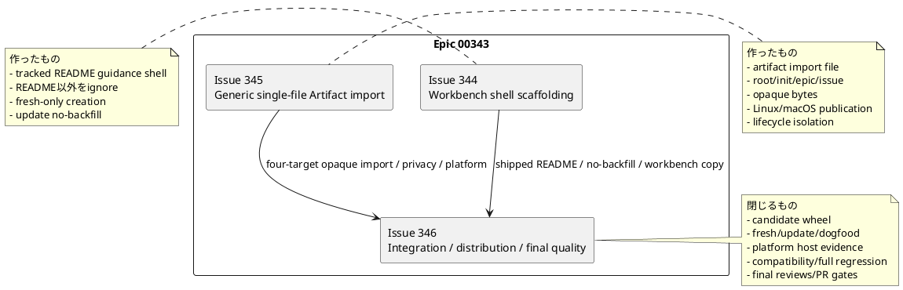
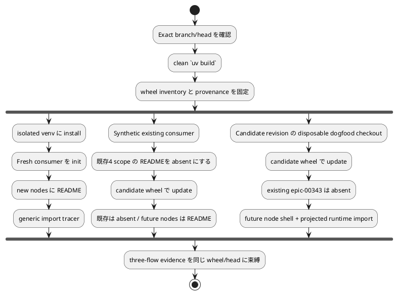
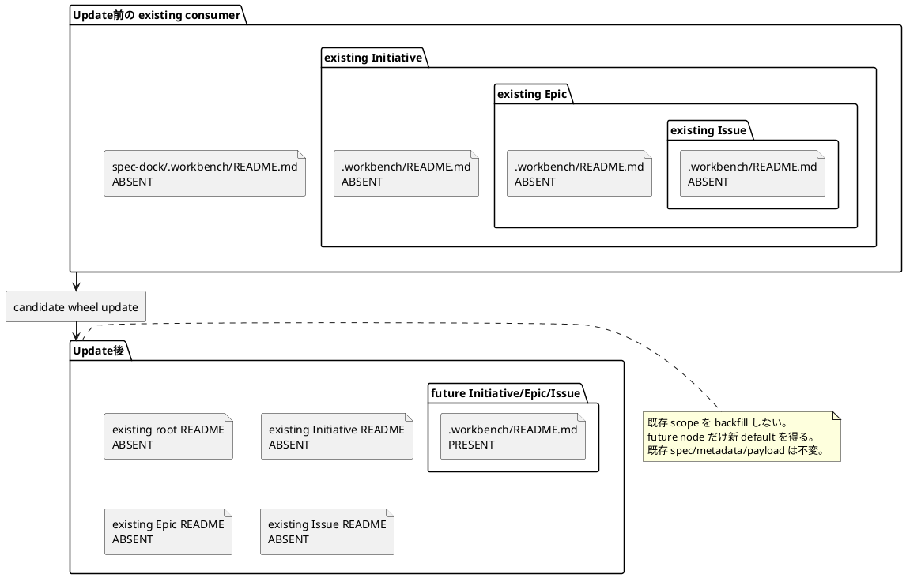
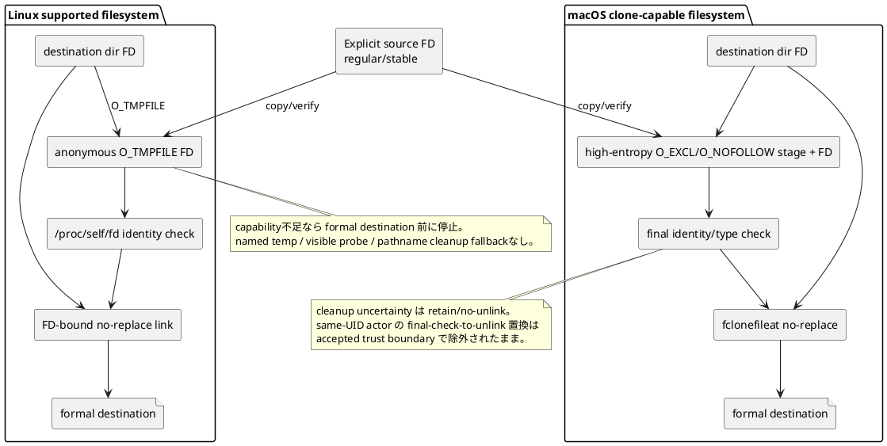
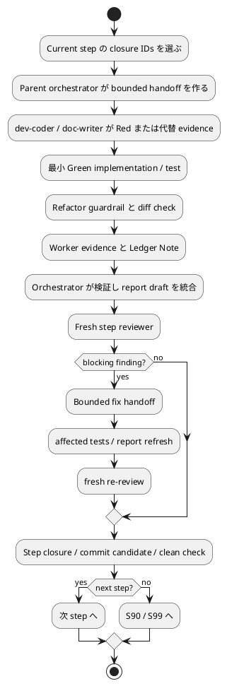
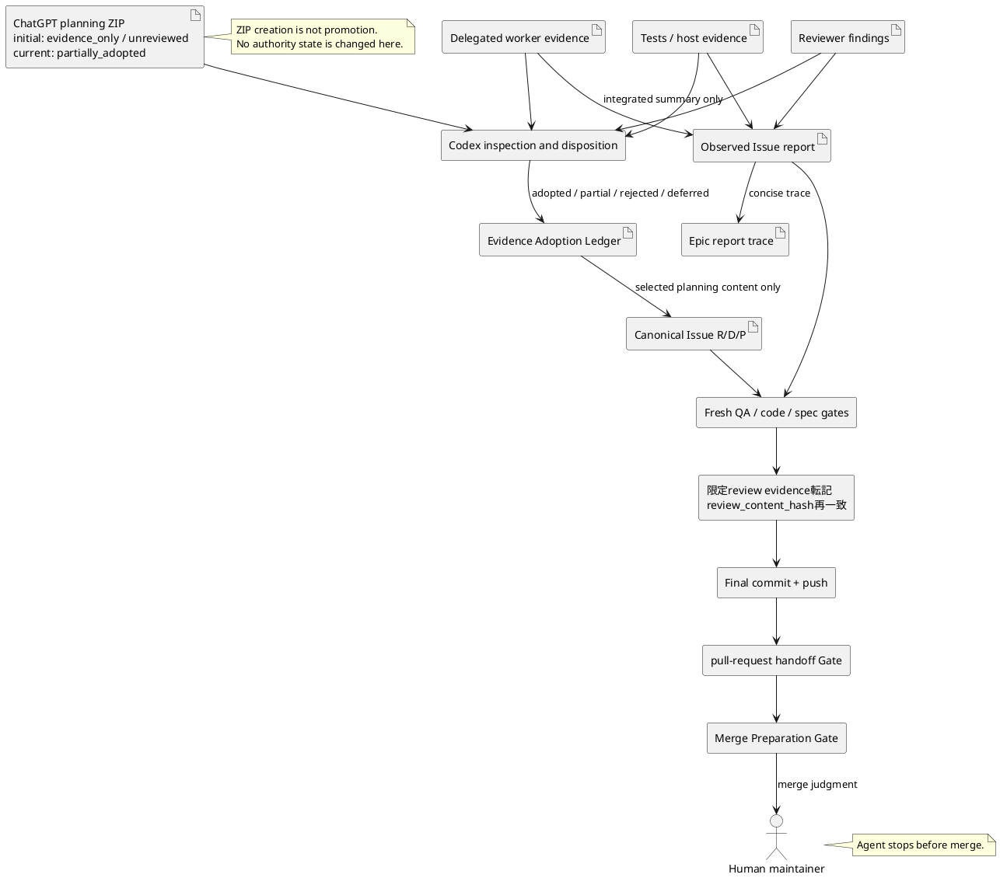
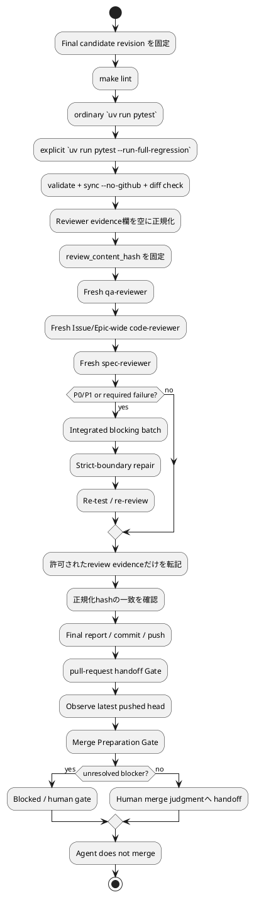

# 今日から参加する人のための Issue 346 オンボーディング

## 0. 最初に知っておくこと

この文書は、Issue 346 を初めて読むメンバー向けの説明資料です。実装の正本や作業開始許可ではなく、canonical な `requirement.md`、`design.md`、`plan.md` を平易に読み解く補助資料です。実装開始可否は正本、fresh review、runtime guidanceで確認します。

Issue 346 の仕事を一文で言うと、次の通りです。

> **Issue 344 の Workbench shell と Issue 345 の generic file import が、source code 上だけでなく実際に配布する wheel、既存 repository の update、SpecDock 自身の dogfood、Linux/macOS、全回帰、最終レビューまで一緒に正しく動くことを証明する。**

新しい大機能を作る Issue ではありません。すでに作った二つの capability を、利用者が受け取る形で統合し、安全境界と互換性を最終確認する Issue です。

## 1. なぜこの Issue が必要なのか

開発中の code が unit test を通っていても、利用者が install する package に必要 file が入っていなければ機能しません。fresh repository では動いても、既存 repository を update した時に意図せず tracked file を大量追加すれば、既存利用者の作業 tree を汚します。Linux の unit test が通っても、実 filesystem の `O_TMPFILE` や `/proc/self/fd` の条件を満たしていなければ publication は安全に完了しません。macOS で clone が成功しても、cleanup の trust boundary を実際より強く説明してはいけません。

また、generic import が binary file を正しくコピーできても、その後の `validate` や `sync` が中身を UTF-8 として読もうとすれば、利用者は後から壊れます。新 command が動いても、既存の `artifact import chatgpt-output`、`new artifact`、`workbench copy` が壊れれば regression です。

Issue 346 は、このような「局所実装は正しいが、配布・更新・統合・最終 delivery で壊れる」リスクを閉じます。

## 2. Epic と三つの Issue の責任分担

親 Epic は `epic-00343-workbench-shell-and-explicit-file-artifact-import` です。三つの Issue は縦に依存しています。

- **Title**: Epic 00343 と3つのIssueの責任分担
- **Question answered**: Issue 344/345が何を届け、Issue 346が何を閉じるか。
- **Scope**: Workbench shell、generic import、統合配布と最終品質。
- **Excluded details**: 各Issue内部のclass/function実装。
- **Update trigger**: EpicのIssue分割またはownershipが変わるとき。



### Issue 344 が届けたもの

Issue 344 は、root、Initiative、Epic、Issue の template に `.workbench/README.md` を追加しました。この README は Workbench の目的と安全な使い方を説明する guidance shell です。`.gitignore` は README だけを追跡できるようにし、それ以外の Workbench file は ignore します。

重要なのは **future-only** です。新しく init した repository や新しく作った node には README が入りますが、既存 repository の update は既存 node に README を遡及追加しません。これが no-backfill です。

### Issue 345 が届けたもの

Issue 345 は `artifact import file` を追加しました。利用者が明示した一つの regular file を、root、Initiative、Epic、Issue の `artifacts/` へ opaque bytes のまま複製します。

- file を text として解釈しません。
- frontmatter や ADR かどうかを判定しません。
- external source は public output で basename だけを見せます。
- generic result は absolute path、本文、SHA-256、byte count を公開しません。
- Linux と macOS では、accepted ADR に従った別々の no-replace publication path を使います。
- generic file は validate/sync/discovery/deps/context の semantic input になりません。

### Issue 346 が閉じるもの

Issue 346 は 344/345 を再設計しません。配布する candidate wheel を作り、その wheel を使って次を確かめます。

1. fresh consumer が shell と import を一緒に使える。
2. existing consumer update が backfill しない。
3. update 後の future node は shell を受け取る。
4. SpecDock 自身の dogfood でも既存 `epic-00343` を backfill しない。
5. root/Initiative/Epic/Issue、external/cross-filesystem、opaque lifecycle、Linux/macOS、legacy compatibility が通る。
6. ordinary tests と explicit full regression を別々に実行する。
7. docs/report/review/commit/push/PR gates を通し、人間の merge 前で止まる。

## 3. 用語を平易に理解する

### Workbench

SpecDock の root または node の中にある一時作業場所です。設計メモ、AI 出力、比較用 file などを置けます。ただし canonical な仕様ではなく、worktree-local で、いつ消えてもよい領域です。

### tracked README guidance shell

`.workbench/README.md` のことです。Workbench の用途、安全境界、保存したい file を Artifact にする方法を説明します。Workbench 内で Git に追跡可能なのはこの README だけです。

### ignored Workbench contents

README 以外の `.workbench/` 内容です。Git の通常追跡から外れます。しかし ignore は security boundary ではないため、secret を置いてよいという意味ではありません。

### generic Artifact import

`artifact import file` です。選んだ一 file の bytes を target scope の `artifacts/` に保存します。generic なので file の意味を解釈しません。

### candidate wheel

Python package の配布候補です。Issue 346 では source checkout から直接動かすのではなく、各検証cycle開始時に記録したcandidate revisionからbuildしたwheelをisolated environmentにinstallして試します。

### fresh consumer

candidate wheel の `spec-dock init` で新規作成した repository です。新機能の default が正しく入るかを見るために使います。

### existing consumer

update 前から SpecDock workspace を持つ repository です。本 Issue では historical revision を必須にせず、README が存在しない valid state を synthetic に作ります。

### dogfood

SpecDock の provider repository 自身を、SpecDock の consumer として使うことです。`src/spec_dock/` が provider source、`spec-dock/` が local consumer projection です。

### no-backfill

update が、既存 node に新しい tracked README を勝手に追加しないことです。既存 repository を静かに保ち、future node だけに新 default を適用します。

### opaque file

中身を解釈せず bytes として扱う file です。binary、ZIP、invalid UTF-8、NUL を含む file も対象です。

### evidence-only

「検討・レビューの材料」という意味です。evidence を作っただけでは canonical document、採用済み仕様、実行許可にはなりません。

### canonical document

repository で source of truth として扱われる requirement/design/plan/report などです。candidate や delegated output は、Codex の採否判断と reviewer gate を経ない限り canonical になりません。

### reviewer gate

implementation worker と別の reviewer が、fresh な source/diff/evidence を確認して次へ進めるか判断する仕組みです。reviewer が利用できない、skip した、古い head を見た、という状態は pass ではありません。

## 4. 三つの consumer flow

Issue 346 は同じ candidate wheel を fresh、update、dogfood の三経路へ流します。

- **Title**: 同一candidate wheelを通す3つのconsumer flow
- **Question answered**: fresh、existing update、dogfoodで何を別々に検証するか。
- **Scope**: wheel buildから3 flowのevidence結合まで。
- **Excluded details**: 個別test node、platform syscall。
- **Update trigger**: consumer flow、candidate revision、必須evidenceが変わるとき。



### Fresh flow で見ること

- wheel に README assets が含まれる。
- source checkout ではなく installed package から CLI が動く。
- root/Initiative/Epic/Issue に README がある。
- ignored Workbench file を generic Artifact にできる。

### Update flow で見ること

- update 前の repository が valid である。
- root/Initiative/Epic/Issue の README がすべて absent である。
- update 後も absent のままである。
- existing specs、metadata、ignored payload が変わらない。
- update 後に作る future Initiative/Epic/Issue には README がある。

### Dogfood flow で見ること

- actual provider source から projected files が更新される。
- existing `epic-00343` に README を backfill しない。
- disposable checkout で future node を作る。
- future Workbench file を projected runtime で import する。
- real canonical worktree を experiment で汚さない。

## 5. No-backfill を具体例で理解する

Update は「新 template を既存の全 node に流し込む」処理ではありません。managed runtime/docs は更新しますが、既存 node の tracked Workbench README は future-only default のままです。

- **Title**: Existing consumer updateのno-backfill
- **Question answered**: update前後の既存nodeとfuture nodeでREADME状態がどう違うか。
- **Scope**: root/Initiative/Epic/IssueのREADME presence。
- **Excluded details**: managed docs/runtimeの個別ファイル差分。
- **Update trigger**: no-backfillまたはfuture-only作成規則が変わるとき。



Synthetic fixture は、current tooling で valid hierarchy を作った後に README だけを除去して作れます。README がない状態は valid だからです。historical revision は任意です。使う場合は、feature が本当に存在しない exact SHA と方法を report に残します。

## 6. External source privacy

External source を import するとき、利用者はその一 file を読むことだけを許可しています。parent directory の列挙や sibling read は許可されません。

Public text/JSON と tracked provenance で許されるのは、原則として basename、target、destination relative path、commit/publication/cleanup 状態などです。次は出してはいけません。

- absolute path
- parent path
- body または excerpt
- SHA-256
- byte count
- body から推定した MIME、encoding、content ID

Test は harmless sentinel を使い、stdout、stderr、JSON、tracked changed text を negative scan します。byte equality は test 内で検証しますが、external source の digest/count 値を report に貼りません。

ここで注意する点があります。candidate wheel の digest は配布物 identity なので記録できます。禁止されるのは imported external user file の content-derived value です。

## 7. Opaque lifecycle

Generic Artifact は file name family だけで generic と認識し、body を開きません。たとえ filename が `.md` で、本文が ADR/frontmatter のように見えても同じです。

Issue 346 では次の payload を使います。

- binary bytes
- ZIP signature/body
- invalid UTF-8
- NUL-bearing bytes

それらを import した後に次を実行します。

- validate
- sync --no-github
- discovery / ADR / authoring lookup
- dependency compilation
- context generation

Reader spy を置き、generic path を `read_text`、`read_bytes`、`open` したら test を失敗させます。baseline と import 後の index/tree/deps/dashboard/context を、known timestamp だけ normalize して比較します。semantic data を広く mask して false Green を作らないことが重要です。

## 8. Linux と macOS の publication boundary

Linux と macOS は同じ実装ではありません。共通しているのは「destination を上書きしない」「source を変えない」「commit 前に fail closed」「held descriptor を中心に identity を守る」という contract です。

- **Title**: Linux/macOSのpublication boundary
- **Question answered**: 各platformがどのprimitiveでformal destinationをcommitするか。
- **Scope**: supported Linux anonymous stagingとmacOS clone-capable staging。
- **Excluded details**: syscall wrapperの内部実装とunsupported platform追加。
- **Update trigger**: accepted ADR、publication primitive、cleanup trust boundaryが変わるとき。



### Linux で必ず守ること

- destination side の anonymous `O_TMPFILE`。
- opened object が regular file。
- `/proc/self/fd/<fd>` と held descriptor の identity 一致。
- directory durability preflight。
- linkabilityはpreflightやvisible probeで推測せず、held anonymous FDからheld destination directory FDへの最初のactual no-replace formal commitで確定。
- capability が足りなければ `publication_unsupported` 相当で formal destination 前に停止。
- named temp、visible probe、pathname cleanup fallback を作らない。

### macOS で必ず守ること

- destination directory 内の high-entropy named stage。
- `O_EXCL`、`O_NOFOLLOW`、held FD。
- parent/source/stage stability と final identity/type check。
- clone-capable volume で `fclonefileat` no-replace。
- cleanup identity が不確実なら unlink しない。
- same UID の敵対 actor が final check と unlink の間で置換するケースを防げると主張しない。

Actual host evidence が必要です。Linux unit test が通ったから macOS success と推測したり、OS が Linux だから filesystem capability があると推測したりしません。

## 9. 互換性で守る既存 command

### `artifact import chatgpt-output`

これは generic import と似ていますが、既存の別 contract です。Workbench-only source policy、blank storage identity、legacy filename/result、digest/count fields などを維持します。generic privacy contract を無理に適用してはいけません。

### `new artifact`

Typed/blank Artifact を作る既存 command です。filename grammar、rules link、shared collision slots、既存 file non-migration を維持します。

### `workbench copy`

Node-scoped の manual one-shot copy です。root Workbench へ広げたり、automatic sync に変えたりしません。

Issue 346 では existing focused suites を source of truth として再実行し、integration convenience のため期待値を書き換えません。

## 10. requirement / design / plan の読み方

### 先に `requirement.md`

読む目的は「何が observable success か」を知ることです。

特に確認する箇所:

- `I346-RQ-*`: 必須 behavior。
- `I346-CON-*`: 変更してはいけない boundary。
- `I346-AC-*`: test/review で観測する acceptance。
- `I346-EC-*`: failure/edge case。
- `I346-EVD-*`: report に必要な evidence。

### 次に `design.md`

読む目的は「既存 module のどこが責任を持ち、どの test surface を使うか」を知ることです。

特に確認する箇所:

- current state と target state。
- requirement/acceptance mapping。
- consumer fixtures。
- candidate wheel provenance。
- platform lane と privacy/opaque oracle。
- Linux `tree` style change plan。
- repair routing と evidence invalidation。

### 最後に `plan.md`

読む目的は「何をどの順番で、誰に委任し、どう閉じるか」を知ることです。

- `Spec-Locked Closure Index` で削れない期待を確認。
- S01〜S04 が implementation/test behavior slice。
- S90 が docs/report parity。
- S99 が final quality/review/delivery。
- 各 step の allowed/forbidden paths、test card、Green command、amendment trigger を守る。
- 実測結果は `report.md` に書く。

## 11. 実装 step と review/commit の順序

各 step は「worker が修正して終わり」ではありません。bounded implementation、verification、report、fresh review、必要なら fix/re-review、commit candidate までが一つの closure unit です。

- **Title**: 1 implementation stepのclosure lifecycle
- **Question answered**: worker実装からreview・commit candidateまでをどう閉じるか。
- **Scope**: S01〜S04/S90の共通実行順。
- **Excluded details**: 各step固有のtest caseとallowed path。
- **Update trigger**: SpecDock issue workflowのstep gate順序が変わるとき。



### S01

Candidate revision から wheel を build し、inventory と fresh installed tracer を閉じます。

### S02

Synthetic existing consumer を update し、no-backfill と future-only shell を閉じます。

### S03

Four-target、external/cross-filesystem、privacy、Linux/macOS publication を閉じます。

### S04

Opaque lifecycle、legacy compatibility、integrated dogfood を閉じます。

### S90

Docs impact、provider-to-dogfood parity、Issue/Epic report、EAL を解決します。

### S99

Lint、ordinary tests、explicit full regression、validate、sync、fresh QA/code/spec review、commit/push、PR gates を閉じ、人間の merge 前で止めます。

## 12. Evidence から 正本への審査済み反映 と delivery まで

ChatGPT output、worker output、test output、reviewer finding はすべて最初は evidence です。自動的に canonical にはなりません。

- **Title**: Evidenceからcanonical docsとdeliveryへの流れ
- **Question answered**: 外部/委任evidenceがどの審査を経て正本やreportへ反映されるか。
- **Scope**: EAL、canonical R/D/P、report、final review、PR handoff。
- **Excluded details**: ChatGPT session内部、raw transcript、merge実行。
- **Update trigger**: evidence adoptionまたはdelivery gate contractが変わるとき。



EAL の disposition は Codex が決めます。

- `adopted`: claim を採用。
- `partially_adopted`: 一部だけ採用。
- `rejected`: 採用しない。
- `deferred`: 今回は採用せず、理由と revisit 条件を残す。

Candidate が自分自身を `adopted` にしてはいけません。

## 13. Final review と delivery gate

Final quality は三つの review 役割を独立に使います。

- `qa-reviewer`: acceptance と evidence が本当に E2E を証明するか。
- `code-reviewer`: package/update/runtime/platform/lifecycle/compatibility と diff scope。
- `spec-reviewer`: parent Epic、accepted ADR、Issue docs/report の整合。

三者reviewの前に、reviewer evidence欄を空に正規化したfinal contentから`review_content_hash`を固定します。pass後に転記できるのはreview role/status/task ID/findings count/scope/timeと機械的gate stateだけで、転記後もhashが一致しなければ再reviewです。その後final commit/pushを行い、pull-request handoff GateでPR URL、base、head、latest SHA、issue linkage、draft/ready decisionを記録します。Merge Preparation Gateではrequired checks、reviews、conflicts、review threads、blocker history、latest headを確認します。

- **Title**: Final quality reviewとhuman merge handoff
- **Question answered**: local qualityから三者review、final commit、PR gateへどう進むか。
- **Scope**: S99のquality/review/delivery順序。
- **Excluded details**: GitHub UI操作とhuman merge判断内容。
- **Update trigger**: required reviewer、final commit evidence、PR/merge gateが変わるとき。



P2/P3 だけを理由に branch を変えることはしません。P0/P1、required CI failure、visible conflict などが branch mutation を必要とする場合だけ、workflow の consultation/disposition/repair/re-observe sequence を使います。

## 14. 今日参加した実装者が次にすること

この説明資料や元のChatGPT ZIPを直接実装指示として使わず、次の順でcanonical docsとruntime gateを確認します。

1. **Codex の採用結果を確認する。** canonical `requirement.md`、`design.md`、`plan.md` に何が採用されたかを見る。
2. **exact source を再確認する。** repository、branch、HEAD、dirty state を確認し、plan の source revision と違えば stale として止める。
3. **Issue 344/345 と accepted ADR を読む。** 特に no-backfill、external privacy、Linux anonymous staging、macOS cleanup boundary。
4. **runtime guidance と readiness gate を確認する。** `guidance issue-execution`、report EAL、fresh spec review、dependencies。
5. **S01 だけを handoff する。** いきなり S02〜S04 や docs を並行実装しない。
6. **worker output を検証する。** changed paths、test sensitivity、wheel origin、unresolved risk、Ledger Note。
7. **report に observed evidence を統合し、fresh reviewer を通す。** step closure 前に次 step を始めない。
8. **production defect がなければ test/evidence-only で閉じる。** 何も壊れていないのに新 abstraction を作らない。
9. **spec/ADR gap を見つけたら止める。** Issue-local workaround で隠さず Epic planning repair へ戻す。
10. **S99 でも merge しない。** PR preparation が終わったら人間へ渡す。

## 15. よくある間違い

### 「current source で test が通るから wheel も大丈夫」

誤りです。package data omission、build pruning、console entrypoint、source checkout leakage は wheel-installed E2E でしか見つからないことがあります。

### 「update で README を足した方が親切」

本 Epic では誤りです。no-backfill が contract です。既存利用者の tracked tree を静かに保ちます。

### 「external source の hash を report に残すと再現性が高い」

Generic external source では privacy contract 違反です。byte equality は test 内で確認し、report には content-free result だけを残します。candidate wheel digest は別の distribution identity です。

### 「Linux なので O_TMPFILE は使える」

誤りです。filesystem、mount、procfs、directory durability を capability として確認します。使えなければ fail closed です。

### 「macOS cleanup test が通ったので race は完全に安全」

誤りです。accepted ADR は same-UID final-check-to-unlink replacement を除外しています。その範囲を超える assurance はしません。

### 「binary file は import 時に保存できたので終わり」

不十分です。validate/sync/discovery/deps/context が後で body を開かないことまで確認します。

### 「ordinary pytest が成功したので full regression も成功」

誤りです。ordinary lane は full-regression tests を policy skip します。`--run-full-regression` を明示した別 command が必要です。

### 「reviewer が unavailable だから skip して進む」

誤りです。required reviewer unavailable は pass ではなく blocker/human gate です。

### 「PR が merge-prepared なら agent が mergeしてよい」

誤りです。本 workflow は human-only merge です。

## 16. 実装中に判断が必要になったら

判断を三段階に分けます。

1. **Plan 内の local choice**: 既存 helper のどれを使うか、test fixture name など。bounded worker が提案し、orchestrator が統合できます。
2. **Material Issue-local decision**: test strategy や repair scope に影響する。worker は `Ledger Note`、orchestrator は report decision ledger、必要なら plan amendment/fresh review。
3. **Parent/ADR/ownership decision**: no-backfill、platform primitive、privacy boundary、Issue 分担を変える。Issue execution を止め、Epic planning repair/ADR/clarification へ戻します。

Worker output は decision そのものではありません。Codex orchestrator が source docs、diff、tests、reviewer evidence と照合して disposition します。

## 17. 完了の見方

Issue 346 の成功は、一つの test の pass ではありません。次が同じ final head に結び付いている必要があります。

- candidate wheel receipt と inventory。
- fresh/update/dogfood matrix。
- target/privacy/opaque/platform/compatibility evidence。
- ordinary/full regression。
- validate/sync/docs/provider parity。
- Issue/Epic report と EAL/decision ledger。
- fresh QA/code/spec reviews。
- final commit/push。
- pull-request handoff Gate と Merge Preparation Gate。
- human merge 前停止。

一つでも required closure が unavailable、stale、failed、unreviewed blocker のままなら、状態は complete ではなく blocked または human gate です。

## 18. 参考になる最小 command set

Canonical plan adoption 後、実際の exact node/paths に合わせて使う command の骨格は次です。

```bash
# Build and tests
uv build
make lint
uv run pytest
uv run pytest --run-full-regression

# SpecDock local evidence
./spec-dock/scripts/spec-dock validate
./spec-dock/scripts/spec-dock sync --no-github
./spec-dock/scripts/spec-dock deps check iss-00346

# Diff hygiene
git diff --check
git status --short
```

`-m full_regression` だけでは full body の実行許可になりません。actual integration test nodes、host capability receipt、PR preparation command は canonical plan と current workflow guidance に従います。

## 19. 最後の要点

- Issue 346 は **新 feature** ではなく **distributed integration and final quality**。
- 一つの exact candidate wheel を fresh/update/dogfood 全 flow に使う。
- Existing scope は no-backfill。Future node は shell を得る。
- External generic import は basename-only、content-free public/provenance。
- Opaque file は lifecycle で body-open しない。
- Linux は anonymous `O_TMPFILE` + FD no-replace、fallback なし。
- macOS は clone-capable success + accepted cleanup boundary、過剰主張なし。
- Legacy commands、fast/full lanes、docs/reports/reviewsを全部守る。
- Candidate evidence は自動採用されない。
- Agent は merge しない。人間へ判断材料を渡して止まる。
