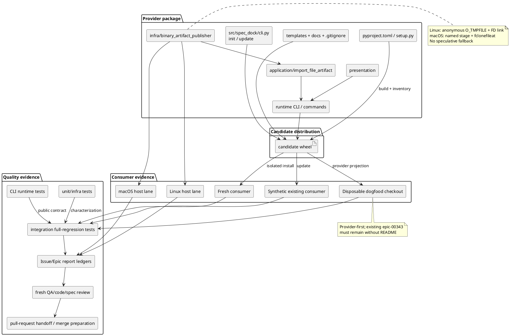

# iss-00346 Integration, Distribution, and Final Quality — Issue 設計書（Standard）

## 0. 設計の位置づけ

本書は review 済みの `requirement.md` にある Issue-local requirements を、既存 provider/build/update/runtime/test/workflow surface に割り当てる canonical design である。親 Epic と accepted ADR `20260728t100038z-adr`、`20260730t085831z-adr`、`20260730t102747z-adr` を変更せず、Issue 344/345 が実装した capability を candidate wheel 経由で統合検証する。

設計の中心は production abstraction の追加ではなく、次の **distribution evidence harness** である。

1. 各検証 cycle の開始時に記録した candidate revision から candidate wheel を build・inspect する。
2. wheel-installed fresh consumer を作る。
3. README-absent synthetic existing consumer を update する。
4. candidate revision の disposable dogfood checkout を update する。
5. generic import の target/privacy/opaque/platform/compatibility matrix を同じ wheel/runtime で通す。
6. ordinary/full regression、docs/report/reviewer/delivery evidence を final head に束縛する。

既存 contract に defect が見つかった場合だけ、既存 provider layer の最小変更を許す。新しい product layer や framework は設計しない。

## 1. 調査済み current state

### 1.1 Source identity と Issue state

- Repository: `chemitaro/spec-dock`
- Branch: `iss-00346-integration-distribution-and-final-quality`
- Planning baseline HEAD: `2217889c31e1a8a83732c446264dec00dde77be6`。これは ChatGPT planning の参照点であり、candidate build 対象を固定しない。
- Target Issue `.meta.json` は `iss-00344` と `iss-00345` に直接依存する。
- target Issue の `requirement.md`、`design.md`、`plan.md` は planning scaffold の状態であり、completed clarification artifact が Issue-local synthesis を提供する。
- planning baseline の dogfood tree では `epic-00343/.workbench/README.md` が存在しなかった。この観測は no-backfill test fixture の設計根拠であり、実行時は review 済み requirement に従う synthetic existing-consumer fixture を標準とする。

### 1.2 Issue 344 が提供した capability

- root/Initiative/Epic/Issue template に `.workbench/README.md` がある。
- `.gitignore` は README だけを追跡可能にし、それ以外の `.workbench` 内容を ignore する。
- fresh install/new node は README を受け取る。
- update は既存 node に README を backfill しない。
- `workbench copy` は既存 node-scoped contract を維持する。
- candidate-wheel E2E、integrated dogfood、full regression、Epic final delivery は Issue 346 に defer された。

### 1.3 Issue 345 が提供した capability

- `artifact import file` は root/Initiative/Epic/Issue へ arbitrary regular file の opaque bytes を複製する。
- external source は basename-only の public representation を持つ。
- generic result は digest/count を public に出さず、`canonical=false` である。
- Linux explicit import は anonymous `O_TMPFILE`、held FD、`/proc/self/fd`、FD-bound no-replace link commit を使う。
- macOS は destination-side named stage と `fclonefileat` no-replace commit を使い、accepted cleanup trust boundary を持つ。
- generic body は validate/sync/discovery/deps/context/ADR/authoring の default semantic input から除外される。
- legacy `chatgpt-output`、typed/blank Artifact との compatibility が局所テストされている。
- candidate wheel、existing update、integrated dogfood、actual final platform/full regression/Epic-wide review は Issue 346 に defer された。

### 1.4 Package/build/update implementation

- `pyproject.toml` は package data と fast/full pytest marker を定義する。
- `setup.py` は template README の distributable allowlist と build/sdist pruning を持つ。
- `src/spec_dock/cli.py` の installer/update は managed dirs を provider から copy し、fresh root にだけ root Workbench README を置く。existing initiatives tree は update の backfill 対象ではない。
- provider source of truth は `src/spec_dock/`、dogfood projection は `spec-dock/` である。

### 1.5 Existing test surfaces

- `tests/unit/infra/test_init_update.py`: installer/scaffold/package/update contract。
- `tests/cli_runtime/test_artifact_import_file.py`: target matrix、opaque bytes、external privacy、collision/exhaustion。
- `tests/unit/infra/test_binary_artifact_publisher.py`: source guard、opaque copy、fault/platform/publication boundary。
- `tests/cli_runtime/test_artifact_import_chatgpt_output.py`: legacy import contract。
- `tests/cli_runtime/test_artifact_import_s04.py` と周辺 unit tests: lifecycle/legacy compatibility。
- `tests/cli_runtime/test_workbench.py`: `workbench copy` contract。
- `tests/integration/` は external boundary 用 package と discovery smoke を持つが、Candidate 3 専用 wheel-installed E2E はまだない。
- ordinary `uv run pytest` は fast lane、`uv run pytest --run-full-regression` は explicit full lane である。

## 2. Target state

Issue 346 の target state は、次の一貫した evidence graph である。

- 一つの検証 cycle につき、一つの candidate revision から一つの candidate wheel を build する。
- wheel inventory と installed module origin を検査し、source checkout shortcut を排除する。
- 同じ wheel を fresh/update/dogfood fixture に使用する。
- すべての fixture で Workbench shell と generic import の統合を観測する。
- no-backfill、future-only shell、privacy、opaque lifecycle、platform primitive、compatibility を closure ID で追跡する。
- hermetic evidence と actual host evidence を混同しない。
- 最終 candidate revision に lint/fast/full/validate/sync/docs/review evidence を束縛する。
- Issue report と Epic report に content-free trace を残し、PR preparation は human merge 前で停止する。

## 3. 設計責務

| Design ID | 責務 | 主な既存 surface |
|---|---|---|
| `DES-346-001` | planning baseline と candidate revision の分離、clean candidate build、wheel provenance、inventory | Git metadata、`pyproject.toml`、`setup.py`、build tooling |
| `DES-346-002` | wheel-installed fresh consumer と source-checkout independence | installer CLI、templates、runtime、new node commands、integration harness |
| `DES-346-003` | synthetic existing consumer update、no-backfill、future-only shell | `src/spec_dock/cli.py`、installer tests、node creation harness |
| `DES-346-004` | disposable dogfood projection と provider/consumer parity | `spec-dock update .` equivalent、provider assets、dogfood checkout |
| `DES-346-005` | four-target import、external/cross-FS privacy、opaque lifecycle | application/import、publisher、presentation、validate/sync/discovery/deps/context |
| `DES-346-006` | Linux/macOS capability-specific publication evidence | `binary_artifact_publisher.py`、infra tests、actual host lanes |
| `DES-346-007` | legacy compatibility と regression lane | existing chatgpt-output/new artifact/workbench tests、pytest lane policy |
| `DES-346-008` | docs/report/EAL/reviewer/delivery evidence | provider docs、Issue/Epic reports、workflow contracts、PR preparation |
| `DES-346-009` | failure classification、rollback、content-free observability | fixture harness、report ledgers、changed-path/diff controls |

## 4. Requirement → design mapping

| Requirement ID | Design responsibility | Design response |
|---|---|---|
| `I346-RQ-001` | `DES-346-001` | build 前後の repo/branch/HEAD/clean state を receipt 化し、wheel と test result に source revision を付ける。 |
| `I346-RQ-002` | `DES-346-001` | clean `uv build` 後、wheel ZIP inventory を allowlist/denylist で検査する。 |
| `I346-RQ-003` | `DES-346-002` | isolated venv に wheel を install し、module origin と CLI path を venv 内に固定して fresh flow を通す。 |
| `I346-RQ-004` | `DES-346-003` | valid fixture の README absent matrix と immutable snapshot を update 前後で比較する。 |
| `I346-RQ-005` | `DES-346-003` | update 後に作る Initiative/Epic/Issue の README を provider template と byte comparison する。 |
| `I346-RQ-006` | `DES-346-004` | candidate revision の disposable checkout で provider-to-dogfood update、epic no-backfill、future node/import を通す。 |
| `I346-RQ-007` | `DES-346-005` | wheel-installed runtime から4 target の shared matrix を実行する。 |
| `I346-RQ-008` | `DES-346-005`, `DES-346-006` | source path form と actual cross-device availability を分けて検証する。 |
| `I346-RQ-009` | `DES-346-005`, `DES-346-009` | text/JSON/provenance allowlist と harmless sentinel negative scan を導入する。 |
| `I346-RQ-010` | `DES-346-005` | body-open spy、invalid bytes、before/after projection comparison を existing lifecycle surface に追加する。 |
| `I346-RQ-011` | `DES-346-006` | Linux supported/unsupported lane を実 primitive と fault injection の両方で閉じる。 |
| `I346-RQ-012` | `DES-346-006` | macOS clone-capable host success と cleanup uncertainty matrix を accepted ADR の範囲で閉じる。 |
| `I346-RQ-013` | `DES-346-007` | existing focused tests を変更せず再実行し、必要時だけ characterization を補う。 |
| `I346-RQ-014` | `DES-346-007`, `DES-346-008` | lint/fast/full/validate/sync/docs/report を独立 evidence rows にする。 |
| `I346-RQ-015` | `DES-346-008`, `DES-346-009` | fresh reviewers、strict repair boundary、commit/push/PR gates/human stop を final sequence に固定する。 |

### 4.1 非機能要件 mapping

| NFR | Design response |
|---|---|
| `I346-NFR-001` | provenance schema と command/result manifest を test harness/report に持たせる。 |
| `I346-NFR-002` | `tmp_path`/temporary directory/disposable checkout を使用し、source/canonical repo への mutation を diff guard で検出する。 |
| `I346-NFR-003` | preflight failure は formal destination 前に止め、success fallback を作らない。 |
| `I346-NFR-004` | `hermetic`, `host_linux`, `host_macos`, `manual`, `review` の evidence class を分離する。 |
| `I346-NFR-005` | existing installer/runtime/harness を再利用し、new production abstraction は repair 必要時だけに限定する。 |
| `I346-NFR-006` | raw payload を保存せず、phase/state/capability/result boolean と path manifest を記録する。 |
| `I346-NFR-007` | full integration nodes を `full_regression` policy に従わせ、ordinary lane の速度政策を維持する。 |

## 5. Acceptance → design mapping

| Acceptance ID | Primary design | Test/evidence shape |
|---|---|---|
| `I346-AC-001` | `DES-346-001` | planning baseline/candidate revision の分離記録 + candidate HEAD preflight + post-build recheck |
| `I346-AC-002` | `DES-346-001` | wheel ZIP inventory allow/deny assertions |
| `I346-AC-003` | `DES-346-002` | isolated wheel install + fresh init/node/import E2E |
| `I346-AC-004` | `DES-346-003` | README-absent matrix + update before/after snapshot |
| `I346-AC-005` | `DES-346-003` | future node matrix + template byte equality |
| `I346-AC-006` | `DES-346-004` | disposable exact checkout + pre/post epic absence + integrated import |
| `I346-AC-007` | `DES-346-005` | 4 target matrix + bytes/source/no-overwrite/result checks |
| `I346-AC-008` | `DES-346-005`, `DES-346-006` | path-form/cross-device matrix + output/provenance sentinel scan |
| `I346-AC-009` | `DES-346-005` | opaque fixture matrix + body-open spy + lifecycle equivalence |
| `I346-AC-010` | `DES-346-006` | actual Linux supported FS, O_TMPFILE/link commit, visible-entry observer |
| `I346-AC-011` | `DES-346-006` | Linux capability injection/actual unsupported, zero formal/visible entries |
| `I346-AC-012` | `DES-346-006` | actual macOS clone success + cleanup uncertainty/no-unlink matrix |
| `I346-AC-013` | `DES-346-007` | existing focused legacy suites |
| `I346-AC-014` | `DES-346-007` | lint + ordinary pytest with policy skip summary |
| `I346-AC-015` | `DES-346-007` | explicit full pytest bound to final candidate revision |
| `I346-AC-016` | `DES-346-004`, `DES-346-008` | docs/source-projection manifest + Issue/Epic report trace |
| `I346-AC-017` | `DES-346-008` | independent fresh reviewer records for exact final head/diff |
| `I346-AC-018` | `DES-346-008` | commit/push receipt + pull-request handoff/Merge Preparation records + human stop |
| `I346-AC-019` | `DES-346-009` | changed-path allowlist + decision ledger + amendment/escalation check |

## 6. 依存関係分析

### 6.1 Behavioral dependency

```text
Issue 344 shell contract
  - shipped README assets
  - gitignore tracking rule
  - fresh-only creation
  - update no-backfill
  - workbench copy compatibility
              \
               +--> Issue 346 distribution/integration evidence
              /
Issue 345 generic import contract
  - four targets
  - opaque bytes
  - privacy
  - Linux/macOS publication
  - lifecycle isolation
  - legacy compatibility
```

Issue 346 は upstream contract を consumer として利用する。upstream の requirement/design/ADR を変える必要が生じた時点で dependency direction が破れるため、Issue-local implementation を止める。

### 6.2 Evidence dependency

```text
exact HEAD
  -> clean wheel build
  -> wheel inventory
  -> isolated install
  -> fresh tracer
  -> existing update
  -> platform/privacy matrix
  -> opaque/compatibility/dogfood
  -> docs/report
  -> lint + fast + full + validate + sync
  -> fresh reviewers
  -> final commit/push
  -> pull-request handoff Gate
  -> Merge Preparation Gate
  -> human merge decision
```

後段 evidence は前段の exact wheel/head に依存する。production または test repair で head が変わった場合、少なくとも wheel build 以降の affected evidence を再取得する。

### 6.3 Module Dependency Diagram

- **Title**: Candidate distribution と consumer/platform evidence の依存方向
- **Question answered**: どの provider surface が candidate wheel を構成し、その同一wheelからどのclosure evidenceが生まれるか。
- **Scope**: Issue 346が観測するbuild、fresh/update/dogfood、platform、quality/delivery evidence。
- **Excluded details**: Issue 344/345内部のclass/function呼び出し、CI job実装、GitHub API詳細。
- **Update trigger**: owner surface、candidate distribution経路、required evidence class、review/delivery順序のいずれかが変わるとき。



## 7. Architecture / responsibility boundary

### 7.1 Build and inventory boundary

`DES-346-001` は build system を変更するのではなく、current build contract を外側から検査する。

- build input: exact clean checkout。
- build command: `uv build`。
- output selection: current run で生成された wheel を一意に選ぶ。
- provenance: repository、branch、head、package version、wheel filename、wheel digest、build command、build timestamp。
- inventory allowlist: template subtree の `README.md` と `root|initiative|epic|issue/.workbench/README.md` の5件。
- inventory denylist: stale wrapper-era paths、`current/`、`completed/`、non-allowlisted nested README、cache/bytecode、nested archive。
- installed origin: isolated Python から `spec_dock.__file__` と console entrypoint を確認し、source checkout 内 path でないことを assert する。tracked report には host absolute path を書かず、`origin_is_isolated_environment=true` のような判定だけを残す。

build defect が見つかった場合だけ `pyproject.toml`、`setup.py`、package-data surface を repair-only で変更する。

### 7.2 Fresh consumer boundary

Fresh fixture は candidate wheel の public consumer として次を行う。

1. empty temporary repository に wheel-installed `spec-dock init`。
2. root tracked README、gitignore rules、managed dirs を検査。
3. Initiative → Epic → Issue を public runtime command/harness で作成。
4. 各 node の README と provider template の bytes を比較。
5. ignored Workbench payload を作り、generic import で target `artifacts/` に保存。
6. `validate` と `sync --no-github` を実行。
7. source bytes/source existence/result privacy/`canonical=false` を検査。

テスト helper は existing `CliRuntimeHarness` と installer helpers を優先する。source tree の runtime module を直接 import して fresh success を作ってはならない。

### 7.3 Synthetic existing consumer boundary

Historical checkout は default では使わない。synthetic fixture は次の recipe で valid pre-feature state を作り、**実際のmanaged asset更新とno-backfillを同じflowで観測する**。

1. candidate wheel または current fixture helper で valid root/Initiative/Epic/Issue hierarchy を作る。
2. root と3 node の `.workbench/README.md` を明示的に除去する。
3. README のない `.workbench/` directory または ignored payload sentinel を残してもよい。
4. managed asset fixtureとして `spec-dock/docs/guide.md` のみを、test repository内で管理する既知のpre-candidate valid bytesへ置換する。このfixture bytesとSHA-256はtest sourceに固定し、private pathやhistorical repository SHAには依存させない。
5. update 前に current runtime validation と graph loading が成功し、fixture `guide.md` がcandidate provider版と異なることを確認する。この前提を満たさないfixtureは失敗とする。
6. canonical docs、`.meta.json`、deps output、ignored payload、`guide.md`を含むmanaged asset manifestの snapshot を取得する。
7. candidate-wheel-installed `spec-dock update` を実行する。
8. existing 4 scope の README が absent のままであることを確認する。
9. canonical/metadata/payload snapshotが不変で、`guide.md`がcandidate wheel内provider assetとbyte-identicalへ更新され、managed manifestの差分がexpected managed pathsだけであることを確認する。
10. update 後に future Initiative/Epic/Issue を作り、README shell が入ることを確認する。

Historical revision を選ぶ場合は fixture recipe を置換してよいが、feature absence の concrete evidence と exact SHA/method が report obligation になる。

### 7.4 Dogfood projection boundary

Canonical working tree を直接 experiment area にしない。candidate revision の disposable clone/worktree を作り、同じ candidate wheel で update する。

- update 前に `epic-00343/.workbench/README.md` が absent であることを assert する。
- provider assets と projected managed files の source-to-projection map を作る。
- wheel-installed top-level CLI で disposable checkout を update する。
- update 後も既存 epic README が absent であることを assert する。
- disposable checkout 内に future node を作り、README shell を確認する。
- future node の ignored Workbench に harmless opaque file を置き、projected runtime の `artifact import file` で保存する。
- validate/sync/compatibility smoke を実行する。
- expected test artifacts を除き、provider checkout に残す production diff は docs/repair scope に限定する。

この flow が「Workbench shell と generic import を一緒に使った dogfood」であり、単なる provider/dogfood byte comparison だけでは closure としない。

## 8. Candidate wheel provenance design

### 8.1 Receipt schema

`report.md` へ次の content-free fields を記録する。

```json
{
  "repository": "chemitaro/spec-dock",
  "branch": "iss-00346-integration-distribution-and-final-quality",
  "source_revision": "<40-hex>",
  "working_tree_clean_before_build": true,
  "build_command": "uv build",
  "wheel_filename": "<basename-only>",
  "wheel_sha256": "<distribution digest>",
  "package_version": "<version>",
  "inventory_result": "pass|fail",
  "installed_origin_is_isolated": true
}
```

Distribution digest は imported user file の privacy restriction とは別であり、candidate identity のため記録する。external source body/digest/count は記録しない。

### 8.2 Inventory algorithm

- wheel は ZIP として filename list だけを読む。
- paths は POSIX relative path に正規化する。
- absolute、`..`、symlink-like metadata、executable-like unexpected entry を拒否する。
- template subtree の README set を exact comparison する。
- all entries に deny-pattern scan を行う。
- required runtime/docs paths の存在を確認する。
- inventory result は deterministic sorted list/diff とする。

## 9. Import, privacy, and opaque lifecycle design

### 9.1 Target/source matrix

| Dimension | Values |
|---|---|
| target | root / Initiative / Epic / Issue |
| source location | repo-relative / absolute external / nested-CWD relative external / actual cross-filesystem external |
| payload | binary / ZIP signature + opaque bytes / invalid UTF-8 / NUL-bearing |
| output | text / JSON |
| destination state | empty / name collision / slot exhaustion where focused coverage exists |
| lifecycle operation | validate / sync --no-github / discovery / deps / context |

全組合せの Cartesian product は不要である。pairwise ではなく risk-based allocation を行う。

- 4 target は minimum opaque success matrix。
- external/cross-FS は少なくとも root と node target で検証する。
- payload 4種は target 間に分散し、追加で body-open spy fixture に全種を集約する。
- text/JSON privacy は external path/body sentinel で両方検査する。
- collision/exhaustion は existing focused tests を再利用する。

### 9.2 Privacy oracle

各 external test は harmless sentinel を作る。

- parent directory sentinel
- basename sentinel
- body sentinel
- digest/count key sentinel (`sha256`, `byte_count` という field name を含む negative scan)

Allowlist は command-specific public fields のみとする。generic import では basename、target identity、destination relative path、committed/publication/cleanup/warning/retry/canonical 等を許可する。scan対象は test harness がcaptureした stdout/stderr、parsed JSON result、およびgeneric import自身が作成・変更したpublic provenance fileが存在する場合のそのrepo-relative pathだけに限定する。generic destination body、canonical planning/report、candidate wheel receipt、distribution digestはscan対象外である。import以外のtracked text差分が出た場合はprivacy scanへ混ぜず、fixture scope違反として別途失敗させる。対象surfaceで次を検査する。

- absolute/parent path sentinel がない。
- body sentinel がない。
- `sha256` / `byte_count` field がない。
- test 内部で計算した digest または decimal byte count representation がない。
- source body から生成した MIME/encoding/content ID がない。

Artifact body file 自体は scan 対象の tracked provenance ではない。保存先 bytes は test 内部で equality を確認する。

### 9.3 Opaque lifecycle oracle

- generic filename family を body open 前に識別する。
- `Path.open`, `read_text`, `read_bytes` または consumer-specific reader に spy を置き、generic path の body access を失敗させる。
- validate、sync、ADR/authoring discovery、deps compilation、context generation を実行する。
- baseline と generic addition 後の generated output を normalize して比較する。
- timestamp、temporary path、execution time 等の nondeterministic field だけを明示 normalize し、semantic output をマスクしない。
- invalid UTF-8/NUL/ZIP content が decode error を起こさないことを確認する。

## 10. Platform test lane design

### 10.1 Evidence classes

| Class | 目的 | 完了に使える範囲 |
|---|---|---|
| hermetic automated | fault injection、identity race、privacy、cleanup branch、no-visible-name observer | code path と failure semantics |
| actual Linux host | actual filesystem `O_TMPFILE`/procfs/link commit/cross-device behavior | `I346-AC-010` と host-dependent portion of `AC-011` |
| actual macOS host | actual `fclonefileat`/clone-capable volume/cross-device source | `I346-AC-012` |
| manual inspection | wheel listing、provider/projection diff、PR data | automated assertion を補う content-free record |
| review evidence | spec/code/QA/Epic-wide judgment | final gate only |

Hermetic success を actual host success の代わりにしない。host unavailable は skip reason であり acceptance success ではない。

Actual platform laneはprivate host pathやuser identityを保存せず、次の共通receipt schemaを`report.md`のPlatform Capability Evidenceへ記録する。

```json
{
  "candidate_revision": "<40-hex>",
  "platform": "linux|macos",
  "os_release": "<public version>",
  "kernel_release": "<public version or not_applicable>",
  "python_version": "<major.minor.patch>",
  "execution_kind": "host|container",
  "container_image_digest": "<sha256:... or not_applicable>",
  "command": "<repo-relative reproducible command>",
  "test_nodes": ["<pytest node id or named probe id>"],
  "result_evidence_ref": "<report row or external receipt id>",
  "destination_filesystem_type": "<public fs type>",
  "source_destination_same_device": true,
  "required_capabilities": {"name": true},
  "ordinary_user": true,
  "result": "pass|fail|unavailable"
}
```

Linux container利用時はmutable tagだけでなくresolved image digestを必須とする。macOSはvolume名やabsolute pathを保存せずfilesystem typeとclone capabilityだけを残す。`command` はcheckout/temporary absolute pathを含まないrepo-relative form、`test_nodes`はpytest node IDまたはversion管理されたnamed probe ID、`result_evidence_ref`は同じreport内のresult rowかexternal receipt IDとする。receiptは同じcandidate revisionのwheel receiptへ参照を張り、revision変更時はstaleになる。

### 10.2 Linux supported-filesystem lane

Precondition collector は以下を content-free に記録する。

- `sys.platform` Linux 判定。
- destination filesystem device identity の匿名化した equality/difference boolean。
- `O_TMPFILE` available/openable booleanとanonymous inode regularity。linkabilityはpreflightで推測またはvisible probeせず、最初のactual formal no-replace commit結果で確定する。
- `/proc/self/fd` identity verification boolean。
- destination directory fsync boolean。

Test observer は destination directory entry events を監視する。formal destination commit 前に `.spec-dock-import-*`、probe name、その他 unexpected visible stage が一度でも現れたら失敗する。success 時は held anonymous FD から最初のactual no-replace formal commitが成功し、その結果をlinkability evidenceとして記録し、source/destination bytesが一致する。

Capability-insufficient tests は `O_TMPFILE` missing/open failure、non-regular object、procfs identity mismatch/unavailable、directory durability failure、link unsupported を cover し、formal destination/visible staging/cleanup pathname call が0であることを assert する。

### 10.3 macOS clone-capable lane

- destination directory に high-entropy `O_EXCL|O_NOFOLLOW` stage を作る。
- source と stage bytes/metadata stability を held FD で検証する。
- destination parent identity を再確認する。
- `fclonefileat` で no-replace formal commit する。
- actual cross-filesystem source が可能なら source device と destination device が異なることを boolean evidence で記録する。
- cleanup matrix は missing/replaced/unexpected type/stat/fstat/open uncertainty で unlink を呼ばないことを hermetic に固定する。
- success cleanup は final identity/type check を通った owned stage に限る。
- report wording は accepted same-UID final-check-to-unlink exclusion を明示し、それを解消したと表現しない。

## 11. Compatibility design

Compatibility は new integration harness で legacy command の behavior を再実装せず、既存 tests を source of truth として実行する。

| Contract | Primary tests | Guarded behavior |
|---|---|---|
| `artifact import chatgpt-output` | `tests/cli_runtime/test_artifact_import_chatgpt_output.py`、command/presentation unit tests | Workbench-only source、blank identity、legacy digest/count result、byte preservation |
| `new artifact` | existing new-artifact/typed/blank focused suites discovered during S04 inspect | typed/blank naming、rules link、shared slots、no migration |
| `workbench copy` | `tests/cli_runtime/test_workbench.py`、presentation tests | node-scoped manual copy、existing source-wins/merge/output contract |
| generic import | `tests/cli_runtime/test_artifact_import_file.py`、publisher/application/domain tests | privacy、opaque bytes、no-overwrite、canonical=false |

既存 expectation を integration test convenience のために変更しない。failure が cross-feature interaction から生じる場合だけ最小 repair を行う。

## 12. Linux `tree` style directory/file change plan

凡例:

- `[新規見込み]`: Candidate 3 の evidence harness として追加する可能性が高い。
- `[変更見込み]`: closure を直接担う test/docs/report の追加・更新が見込まれる。
- `[検査のみ]`: behavior source of truth として読むが、通常は変更しない。
- `[repair-only]`: test が defect を示した場合だけ最小変更を許す。
- `[実行証跡]`: implementation 時に observed evidence を記録する canonical target。candidate ZIP は変更しない。

```text
.
├── pyproject.toml                                      [検査のみ / repair-only]
├── setup.py                                            [検査のみ / repair-only]
├── src/
│   └── spec_dock/
│       ├── cli.py                                      [検査のみ / repair-only: build/update defect only]
│       └── assets/
│           └── spec_dock/
│               ├── .gitignore                         [検査のみ / repair-only]
│               ├── templates/
│               │   ├── README.md                      [検査のみ]
│               │   ├── root/.workbench/README.md      [検査のみ / repair-only]
│               │   ├── initiative/.workbench/README.md[検査のみ / repair-only]
│               │   ├── epic/.workbench/README.md      [検査のみ / repair-only]
│               │   └── issue/.workbench/README.md     [検査のみ / repair-only]
│               ├── docs/
│               │   ├── README.md                      [変更見込み: S90 impact に応じる]
│               │   ├── guide.md                       [変更見込み: S90 impact に応じる]
│               │   ├── reference_naming.md            [変更見込み: S90 impact に応じる]
│               │   └── rules/root/artifacts.md        [変更見込み: S90 parity に応じる]
│               └── scripts/spec_dock_runtime/
│                   ├── cli/                            [検査のみ / repair-only]
│                   ├── commands/                       [検査のみ / repair-only]
│                   ├── application/
│                   │   └── import_file_artifact.py     [検査のみ / repair-only]
│                   ├── domain/                         [検査のみ / repair-only]
│                   ├── infra/
│                   │   └── binary_artifact_publisher.py[検査のみ / repair-only]
│                   └── presentation/                   [検査のみ / repair-only]
├── tests/
│   ├── unit/
│   │   ├── test_provider_test_lanes.py                 [検査のみ / 変更見込み if new lane nodes need policy assertion]
│   │   └── infra/
│   │       ├── test_init_update.py                     [変更見込み: wheel inventory/update no-backfill]
│   │       └── test_binary_artifact_publisher.py       [変更見込み only for missing platform closure]
│   ├── cli_runtime/
│   │   ├── test_artifact_import_file.py                [変更見込み: distributed target/privacy/opaque gaps only]
│   │   ├── test_artifact_import_chatgpt_output.py      [検査のみ]
│   │   ├── test_artifact_import_s04.py                 [検査のみ / missing lifecycle matrix only]
│   │   └── test_workbench.py                           [検査のみ]
│   └── integration/
│       ├── test_discovery.py                           [検査のみ]
│       └── test_epic_00343_distribution.py             [新規見込み: wheel/fresh/update/dogfood/platform E2E]
├── spec-dock/
│   ├── docs/                                           [変更見込み: provider update projection only]
│   ├── scripts/spec_dock_runtime/                      [変更見込み: provider update projection only]
│   └── initiatives/init-local-00002-prototype-feature-expansion/
│       └── epics/epic-00343-workbench-shell-and-explicit-file-artifact-import/
│           ├── report.md                               [実行証跡: Epic final trace]
│           └── issues/
│               └── iss-00346-integration-distribution-and-final-quality/
│                   ├── requirement.md                  [採用時のみ Codex が更新]
│                   ├── design.md                       [採用時のみ Codex が更新]
│                   ├── plan.md                         [採用時のみ Codex が更新]
│                   └── report.md                       [実行証跡: all observed evidence]
└── .github/workflows/                                  [検査のみ; policy change は scope 外]
```

`test_epic_00343_distribution.py` は concrete proposed filename であり、実装開始時の inspect-first で repository naming convention と collision を確認する。既存 equivalent file が見つかれば新規作成せず、その file を owner surface にする。

## 13. Test strategy

### 13.1 Hermetic automated evidence

- wheel inventory parser unit/integration assertion。
- isolated venv/subprocess wheel install fixture。
- fresh and synthetic existing consumer in temporary directories。
- README absent/present matrix と template byte comparison。
- provider update mutation snapshot。
- target/source/privacy/opaque matrix。
- body-open spy と generated output equivalence。
- Linux/macOS fault injection、race、cleanup state、no-overwrite。
- legacy focused suites。
- lane policy test。

### 13.2 Host/platform evidence

- actual Linux supported FS lane。
- Linux capability-insufficient actual lane if available; otherwise hermetic negative evidence + supported lane mandatory。
- actual macOS clone-capable lane。
- actual source/destination cross-device lane on each available platform。
- host capability missing は report に `unavailable` として記録し、required platform closure を成功扱いしない。

### 13.3 Manual evidence

- candidate wheel sorted inventory review。
- provider-to-dogfood changed-path manifest review。
- `git diff --check` と clean-state review。
- Issue/Epic report cross-reference review。
- PR URL/base/head/check/review/conflict/thread observation。

### 13.4 Review evidence

- Step S01〜S04: implementation/test diff に fresh `code-reviewer`。
- S90 docs-only: `spec-reviewer` を中心に docs/code parity review。test code が変われば `code-reviewer` も必要。
- S99: independent fresh `qa-reviewer`、Issue/Epic-wide `code-reviewer`、`spec-reviewer`。
- reviewer unavailable/denied/skipped は gate success にしない。

### 13.5 Command set

Planned base commands:

```bash
uv build
make lint
uv run pytest
uv run pytest --run-full-regression
./spec-dock/scripts/spec-dock validate
./spec-dock/scripts/spec-dock sync --no-github
git diff --check
```

Focused commands は `plan.md` の step に置く。full integration file は default lane で policy skip され、S01〜S04 の focused evidence と S99 full run では `--run-full-regression` を明示する。

## 14. Failure handling and repair routing

### 14.1 Defect classification

| Class | Route |
|---|---|
| test/harness bug | test-only bounded repair。product behavior を変えない。 |
| package inventory defect | build/package-data surface の最小 repair。fresh wheel から evidence 再取得。 |
| update no-backfill defect | installer/update の最小 repair。Issue 344 contract を変えない。 |
| import integration/privacy defect | existing application/infra/presentation layer の最小 repair。Issue 345 ADR を変えない。 |
| platform contract defect | accepted ADR 内で最小 repair。primitive/fallback policy 変更が必要なら Epic planning repair。 |
| lifecycle/compatibility defect | generic filter or interaction point の最小 repair。legacy public contract を再定義しない。 |
| requirement/design/ADR/ownership gap | implementation stop → Epic planning repair/clarification → fresh review。 |
| unrelated regression | separate blocker/follow-up classification。Issue 346 へ opportunistic feature/refactor として吸収しない。 |

### 14.2 Evidence invalidation

- production/package repair: wheel build 以降を再実行。
- test-only repair: affected fixture/test evidence と final full suite を再実行。
- docs-only repair: docs parity/review と final diff/validate/sync を再実行。
- reviewer開始前にimplementation/test/docsと、reviewer evidence欄を空に正規化したreport ledgerを閉じ、sorted repo-relative path + bytesから`review_content_hash`を計算してcandidate content/diffをfreezeする。三者final reviewはこのhashを対象にし、review後に正規化対象外の内容を変更した場合は、変更classに対応するreviewとevidenceを再実行する。
- passed review後にreportへ追記できるのは、各reviewerの外部出力を解釈せず転記する `reviewer role`、`task/session id`、`review_status`、`findings count`、`review scope`、`observed_at` と、それらから機械的に決まるgate stateだけである。この限定的なreview-evidence transcriptionはreview対象contentの意味を変えないため循環re-reviewを要求しない。findingの要約・risk判断・仕様解釈・その他ledger変更を加える場合はfreezeを破ったものとしてfresh reviewへ戻す。
- review-evidence transcription後に同じ正規化で`review_content_hash`を再計算し、review時と一致することを確認する。そのdiffを変更せずfinal report ledgerとdelivery evidence boundaryを閉じるfinal commitを作る。final commit hashとpost-commit clean checkは自己参照を避け、`workflow_issue.md`に従い最終応答、PR、Issue comment等のexternal delivery evidenceに記録する。hash一致かつcommit/pushだけでreview済みcontentが変わらない場合、spec/code/QA reviewを循環再実行しない。
- PR observationがreview済みfinal commit以外のlatest headを示した場合はstaleとして停止し、内容差分に応じたreviewを再実行する。

## 15. Rollback design

- fixture filesystem は temporary root 単位で破棄する。
- disposable dogfood checkout は candidate revision から再作成できるよう receipt を残す。
- production repair は behavior slice ごとの commit candidate にし、unrelated diff を含めない。
- provider projection は provider update command で再生成し、dogfood-only hand edit を rollback source にしない。
- failed import の formal destination 不在を assert し、test cleanup は directory-wide fixture disposal を使う。production algorithm に unsafe cleanup を追加しない。
- postcommit warning の Artifact は success object として扱い、automatic retry/delete により duplicate/loss を作らない。

## 16. Observability and evidence recording

Target Issue `report.md` に少なくとも次の ledger を用いる。

- Source Revision / Candidate Wheel Receipt
- Spec Interpretation / Decision Ledger
- Evidence Adoption Ledger
- Step Contract Closure
- Test Contract Closure
- Fresh / Existing / Dogfood Consumer Matrix
- Platform Capability Evidence
- Privacy / Opaque Lifecycle Matrix
- Compatibility Regression Evidence
- Delegated Worker Evidence
- Reviewer Gate Status
- Docs Impact / Provider Projection Evidence
- Commit / Push Evidence
- pull-request handoff Gate
- Merge Preparation Gate
- Residual Risks / Human Handoff

Parent Epic `report.md` は Issue-local raw detail を複製せず、Candidate 1/2 dependency、Issue 346 closure summary、platform/full-regression/review/delivery status、Issue report path を trace する。

## 17. Documentation parity

S90 で inspect-first を行う。

- public docs が fresh-only shell/no-backfill、generic import、external privacy、opaque lifecycle、Linux/macOS boundary を正しく説明しているか。
- help/output token と docs が一致するか。
- provider docs と dogfood projection が update flow 後に対応するか。
- accepted macOS exclusion を過剰に安全と表現していないか。
- Linux に named-temp/visible probe fallback があるかのような文言がないか。
- ordinary fast lane と explicit full regression の違いが明確か。

既に十分なら S90 は approved-no-op candidate evidence とし、説明目的だけの churn を作らない。不足がある場合は `doc-writer` が provider docs を変更し、Codex が projection/diff を統合する。

## 18. Delivery boundary

Final sequence は次の通りである。

1. S01〜S04 と S90 の step closure。
2. S99 local gate: lint、focused、ordinary、full、validate、sync、diff/clean。
3. reviewer evidence欄を空に正規化したIssue report/Epic reportのfinal draftを含むcandidate content/diffから`review_content_hash`を計算してfreezeする。
4. frozen contentに対するfresh QA/code/spec review と blocker repair/re-review。
5. passed review後、許可されたreview-evidence fieldsだけを外部review出力から機械転記し、正規化後`review_content_hash`一致を確認する。その他の変更またはhash不一致があればstep 3へ戻る。
6. transcription後のdiffを変更せずfinal report ledgerを閉じ、final commit と push、remote head confirmationを行う。final commit SHAとpost-commit clean checkはexternal delivery evidenceへ記録する。
7. pull-request handoff Gate: PR URL、base resolution、draft/ready decision、head branch/SHA、issue linkage、reuse/create decision。
8. Merge Preparation Gate: latest monitored head、required/non-required checks、blocking/non-blocking reviews、conflict、review thread limitation、blockers、final human decision input。
9. agent は merge を実行せず、人間へ引き渡す。

本書は上記 sequence を設計する。実装開始可否は `plan.md`、`report.md` のreview/gate証跡、および `spec-dock guidance issue-execution` の結果で判定する。
