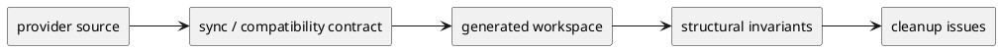

# init-local-00003 Architecture Maintenance and Hardening — 設計（HOW / Guardrails）

## アーキテクチャ上の狙い
- feature expansion と切り離された形で architecture maintenance を扱う。
- sync / compatibility / invariant / state boundary を、明文化できる guardrail として固定する。
- 大改修ではなく、構造破綻へつながる gap を優先順つきで閉じる。

## 現状と目指す姿
- As-Is:
  - layered architecture と fail-safe posture の方向性自体は妥当である。
  - しかし、sync contract、compatibility boundary、architecture invariant、state source-of-truth cleanup は未閉鎖である。
- To-Be:
  - feature work が依存すべき architecture guardrail が定義されている。
  - 重大な cleanup は architecture initiative 内の epic / issue として管理される。
  - source-of-truth と sync path の ambiguity が減る。

### UML（high-level context / target-state）

## 対象境界 / 依存
- in scope:
  - sync contract
  - compatibility boundary
  - architecture invariant
  - active-state source-of-truth cleanup
  - create lock layer cleanup
  - unresolved safety ownership
- external dependency:
  - current runtime baseline
  - feature initiative の優先順位
- boundary policy:
  - feature value の議論は feature initiative に置く。
  - architecture initiative は gap closure と hardening に徹する。

## ガードレール
- 互換性:
  - cleanup により既存 baseline を壊さない。
- セキュリティ:
  - fail-safe / fail-closed を崩さない。
- データ境界:
  - source-of-truth は一箇所へ寄せる。
- 品質条件:
  - architecture issue は As-Is / To-Be / gap / risk で説明できること。

## ロールアウト原則
- rollout strategy:
  - 先に docs/gov を閉じ、その後に実装 cleanup を切る。
- rollback principle:
  - 全面 redesign には広げず、局所的 gap closure に留める。
- feature flag principle:
  - architecture initiative 自体は feature flag ではなく governance と cleanup の受け皿である。

## 観測性 / NFR 原則
- observability:
  - drift、compatibility break、source-of-truth divergence が観測できること。
- performance / reliability:
  - cleanup の結果で validate/sync/doctor の説明可能性が上がること。
- audit / compliance:
  - `どの問題を architecture risk とみなしているか` が docs 上で説明できること。

## 主要リスク
- R-001:
  - governance だけ定義して code cleanup が遅れると、問題が先送りされる。
- R-002:
  - code cleanup を急ぎすぎると、feature initiative との整合が崩れる。

## 関連 ADR
- `discussions/001-disc-architecture-gap-review.md`:
  - architecture gap review

## 未確定事項
- Q-001:
  - 質問:
    - sync / compatibility contract を discussion のまま運用するか、ADR 化するか。
  - 選択肢:
    - A:
      - まず discussion で運用する
    - B:
      - すぐ ADR 化する
  - 推奨案:
    - A
  - 影響範囲:
    - 初期ドキュメントの粒度
