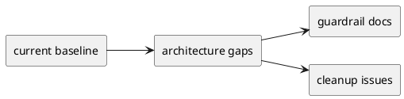

# 001-disc Architecture Gap Review

## 目的
- architecture initiative で扱う gap を短く一覧化する。
- feature initiative に先行して閉じるべき guardrail を明確にする。

## 結論
- 致命的な architecture failure は見えない。
- ただし、次の gap は architecture initiative で扱う価値がある。
  - provider/generated sync contract
  - shipped runtime compatibility boundary
  - structural invariant
  - active-state source-of-truth cleanup
  - create lock layer cleanup

## As-Is / To-Be
- As-Is:
  - structure 自体は妥当だが、運用 contract と cleanup 対象が未閉鎖
- To-Be:
  - feature initiative が依存できる architecture guardrail が明示されている

### PlantUML

## 優先順位
- P1:
  - sync / compatibility
  - active-state source-of-truth
- P2:
  - structural invariant
  - create lock layer cleanup

## 推奨
- docs/gov を先に閉じ、その後に cleanup issue を切る。
