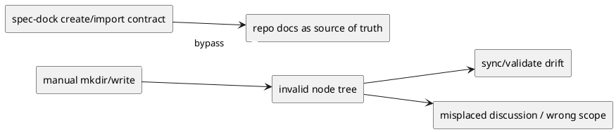
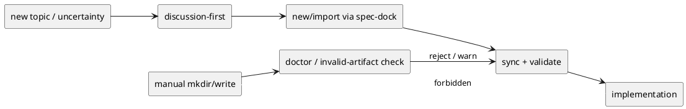

# 20260402t062520z-disc Invalid artifact creation prevention and governance

## 議題
- `spec-dock` 管理下で、正規 create/import を通らない手動ディレクトリ/ファイル生成をどう防ぐかを整理する。
- invalid artifact を運用ルールだけで止めるか、runtime/product guard まで含めて対処するかを決める。
- architecture initiative の governance として、discussion-first / command-only をどこまで強制するかを定める。

## 背景
- 今回、`epic-00042` 相当の論点に対して、Git 未追跡で `.meta.json` や spec docs を欠く空ディレクトリ群が存在した。
- runtime の create 実装は template scaffold と `.meta.json` 書き込みを必ず行うため、空ディレクトリだけの状態は正規 create の結果と整合しない。
- `validate` も `.meta.json` 欠落を required artifact missing として fail させるため、runtime はこの状態を正式 artifact と認めていない。
- この種の invalid artifact は、議論の場所を誤らせるだけでなく、generated state、review、依存解決、active flow 全体を壊す。
- したがってこれは feature issue ではなく、architecture-level governance の課題として扱うべきである。

### 問題構造

## 今回の事実
- 事実-001:
  - invalid tree は Git 未追跡だった。
- 事実-002:
  - epic / issue node に必要な `.meta.json`、`requirement.md`、`design.md`、`plan.md`、`report.md` が欠落していた。
- 事実-003:
  - cleanup 前の `validate` は required artifact missing で fail した。
- 事実-004:
  - invalid tree を削除し `sync` / `validate` を実行すると整合が回復した。
- 事実-005:
  - 正規 `new epic` では `.meta.json` と scaffold が揃った node を再作成できた。

## 選択肢
- Option A: 運用ルールだけで対処する
  - Pros:
    - 実装変更が不要。
    - すぐ導入できる。
  - Cons:
    - agent や人が rule を破った時に技術的抑止が弱い。
    - 再発時の検知が遅れる。
- Option B: 運用ルール + validation gate を導入する
  - Pros:
    - 日常運用に組み込みやすい。
    - PR 前や step close 前に invalid artifact を露出できる。
  - Cons:
    - create 直後の逸脱はまだ起こりうる。
- Option C: 運用ルール + validation gate + runtime/product guard を導入する
  - Pros:
    - 再発防止と早期検知を両方取りやすい。
    - architecture governance として一貫する。
  - Cons:
    - 実装コストが増える。
    - どこまで guard するかの設計が必要。

## 推奨案
- Option C を推奨する。
- 対応を 3 層に分ける。
  - Layer-1 運用ルール
    - `spec-dock/initiatives/**` 配下の手動 mkdir / 手動 file create を禁止する。
    - node 作成は必ず `new` / `import` を使う。
  - Layer-2 process gate
    - create/import 後の `sync` / `validate` を必須化する。
    - epic-level 論点は issue 作成前に discussion で固定する。
  - Layer-3 product guard
    - `doctor` または dedicated check で、untracked node-like directory や `.meta.json` 欠落 node directory を明示検出する。
    - host adapter / skill に command-only hard rule を埋め込む。

### 再発防止フロー

## product guard の候補
- Guard-001:
  - `doctor` に invalid artifact detection を追加する。
- Guard-002:
  - `validate` のエラーメッセージを、より「手動生成の可能性」を指摘する形に寄せる。
- Guard-003:
  - host adapter / repository skill に「path を直接作らない」hard rule を同梱する。
- Guard-004:
  - `sync` 時に node-like untracked directory を optional warning として拾うか検討する。

## governance 方針
- architecture initiative 側で明文化すべきなのは以下である。
  - repo docs が正本
  - node 増設は command-only
  - epic 横断の論点は discussion-first
  - invalid artifact は architecture issue として扱う
- これを initiative discussion / epic design / host adapter guidance にそれぞれ反映する。

## 未決事項
- invalid artifact detection を `doctor` に置くか、`validate` にさらに寄せるか。
- untracked directory 検知を warning にするか hard error にするか。
- adapter/skill への hard rule 埋め込みを product contract に含めるか、運用ルール扱いに留めるか。

## 次アクション
- この discussion を architecture initiative の governance 候補として保持する。
- 採用する場合、initiative / epic docs に command-only と discussion-first を反映する。
- その後、runtime 側で invalid artifact detection を追加するかを別 issue へ分解する。
