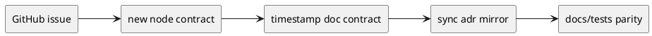
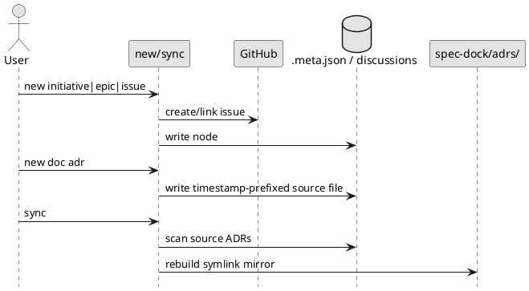

# epic-00033 GitHub backed identity and ADR mirror workflow — 設計（HOW）

## 全体像
- target boundary:
  - node identity contract
  - discussion / ADR filename contract
  - sync-generated ADR mirror contract
- impacted area:
  - runtime create flow
  - sync / validate
  - docs / tests / dogfooding mirror
- rollout posture:
  - rebuildable workspace 前提
  - no forced backward compatibility

### UML（推奨: module / context）

## 契約
### Data boundary
- SoR:
  - initiative / epic / issue linkage は GitHub issue
  - discussion / ADR 原本は各 scope の `discussions/`
- generated view:
  - `spec-dock/adrs/` symlink mirror
- excluded artifacts:
  - ADR index / manifest は持たない
- consistency model:
  - create:
    - node は GitHub linkage を先に確保してから作成する
  - doc:
    - discussion / ADR は timestamp-prefix filename で生成する
  - sync:
    - `adrs/` を一度クリアして symlink mirror を再生成する
  - validate:
    - new contract を前提に命名・mirror・migration boundary を検査する

## データモデル
- model / table changes:
  - `.meta.json` の GitHub linkage を mandatory 扱いにする
- invariants:
  - local-only node は新規作成されない
  - discussion / ADR は sequential filename を新規生成しない
  - `spec-dock/adrs/` は原本ではない

## 主要フロー
- Flow-A node create:
  1. `new initiative|epic|issue` が GitHub issue を作成または link する
  2. `.meta.json` に repo-scoped linkage を保存する
  3. local-only path は存在しない
- Flow-B doc create:
  1. `new doc` が current UTC ベースで timestamp-prefix filename を生成する
  2. scope `discussions/` に原本を書き込む
- Flow-C sync:
  1. ADR 原本を filename pattern で走査する
  2. `spec-dock/adrs/` をクリアする
  3. symlink mirror を再生成する

### UML（任意: sequence / flow）

## 失敗設計
- failure mode:
  - GitHub unavailable
  - non-symlink environment
  - stale legacy docs/tests expectations
  - old workspace assumptions bleeding into new contract
- retry:
  - create は GitHub precondition failure で fail-fast
  - sync は mirror 生成だけ warning skip 可能
- idempotency:
  - sync は mirror 全再生成で idempotent

## 移行戦略
- migration strategy:
  - old workspace は rebuild 前提とし、自動互換処理を持ち込まない
  - docs / tests / dogfooding mirror を新 contract に揃える
  - legacy boundary は issue 単位で guard する
- rollback:
  - issue 単位で戻す
  - initiative として local-only contract は復活させない

## 観測性 / セキュリティ
- observability:
  - create / doc / sync / validate tests
  - mirror filesystem assertions
- role / auth:
  - GitHub auth 前提
- audit / pii:
  - 対象外

## テスト戦略
- Unit:
  - GitHub mandatory arg resolution
  - timestamp naming generation
  - mirror rebuild helper
- Integration:
  - create flow end-to-end
  - new doc end-to-end
  - sync mirror end-to-end
- E2E:
  - docs parity
  - dogfooding rebuild boundary
- E-AC mapping:
  - E-AC-001 -> create contract tests
  - E-AC-002 -> new doc naming tests
  - E-AC-003 -> sync mirror tests
  - E-AC-004 -> migration boundary docs/tests
  - E-AC-005 -> docs parity + final spec review

## 関連 ADR
- `discussions/002-adr-github-mandatory-node-linkage.md`
- `discussions/001-adr-adr-symlink-mirror-without-index.md`

## 未確定事項
- なし:
  - key architecture decisions は ADR で固定済み
