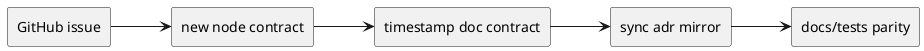
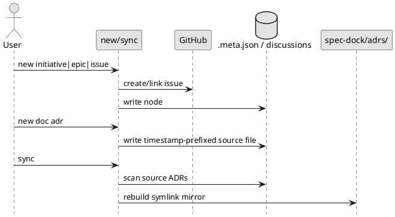

# epic-00033 GitHub backed identity and ADR mirror workflow — 設計（HOW）

## 全体像
- target boundary:
  - node identity contract
  - discussion / ADR filename contract
  - sync-generated ADR mirror contract
- impacted area:
  - runtime create flow
  - sync / validate
  - docs / tests / dogfooding mirror
- rollout posture:
  - rebuildable workspace 前提
  - no forced backward compatibility

### UML（推奨: module / context）

## 契約
### Data boundary
- SoR:
  - initiative / epic / issue linkage は GitHub issue（single repo scope）
  - canonical repo scope は consumer repo の Git remote `origin` が指す GitHub repository を唯一の正本として解決する
  - canonical repo scope resolver contract:
    - `origin` remote 不在は fail-fast（create/validate 即時失敗）
    - `origin` fetch URL / push URL が両方ある場合は双方を GitHub `owner/repo` に正規化し、一致しなければ fail-fast（fetch-push mismatch）
    - GitHub remote に正規化できない URL は fail-fast（non-GitHub remote）
    - SSH / HTTPS は同一 `owner/repo` canonical form へ正規化して比較
    - `owner` / `repo` 比較は lowercase basis で実施し、`.meta.json` の `repo_owner` / `repo_name` は lowercase canonical form で保持（少なくとも比較は lowercase basis）
  - `configured repo scope` のような追加設定値が存在する場合は `origin` 解決結果と一致必須とし、不一致は fail-fast validation / create reject とする
  - 空 workspace の初回 node 作成時から canonical repo scope に束縛される
  - `.meta.json` は `github.issue_number` / `repo_owner` / `repo_name` を同一 repo scope で保持し、cross-repo linkage は許容しない
  - discussion / ADR 原本は各 scope の `discussions/`
- generated view:
  - `spec-dock/adrs/` symlink mirror
- excluded artifacts:
  - ADR index / manifest は持たない
- consistency model:
  - create:
    - node は GitHub linkage を先に確保してから作成する
    - linkage repo scope が既存 node 群と一致しない入力は reject する
  - doc:
    - discussion / ADR は以下 basename grammar の timestamp-prefix filename で生成する
    - `<ts>-<kind>-<slug>.md`
    - `ts = yyyymmddthhmmssz`（UTC、`t` / `z` lowercase 固定）
    - 同秒衝突時のみ `yyyymmddthhmmssz-<nn>-<kind>-<slug>.md`（`nn` は 2 桁）を許可
    - `kind in {adr, disc}`
  - sync:
    - `adrs/` を一度クリアして symlink mirror を再生成する
    - mirror 対象は各 scope の `discussions/` 配下で basename が timestamp ADR grammar に一致し、`new doc adr` front matter contract を満たす ADR 原本に限定する
    - symlink 非対応環境では `adrs/` を空の generated directory として残すか再作成し、warning を出して成功扱いとする
  - validate:
    - new contract を前提に命名・mirror・migration boundary を検査する

## データモデル
- model / table changes:
  - `.meta.json` の GitHub linkage を mandatory 扱いにする
- invariants:
  - local-only node は新規作成されない
  - `.meta.json` の `repo_owner` / `repo_name` は canonical repo scope と常に一致する
  - canonical repo scope と一致しない existing issue / target は reject される
  - discussion / ADR は sequential filename を新規生成しない
  - pre-contract legacy ADR（`001-adr...` / `002-adr...`）は grandfathered planning artifacts として保持し、自動 rename 対象にしない
  - pre-contract legacy ADR は mirror source としては扱わない
  - `spec-dock/adrs/` は原本ではない
  - sync 後に stale symlink は残らない（非 symlink 環境では空 mirror directory のみが残る）
  - single GitHub repo scope invariant を満たさない cross-repo linkage は受理しない

## 主要フロー
- Flow-A node create:
  1. `origin` remote の存在を確認し、不在なら fail-fast（`origin missing`）で終了する
  2. `origin` fetch URL / push URL を収集し、GitHub `owner/repo` canonical form へ正規化する（SSH/HTTPS 差分は吸収、比較は lowercase basis）
  3. URL が GitHub `owner/repo` へ正規化できない場合は fail-fast（`non-GitHub remote`）で終了する
  4. fetch/push が両方ある場合は正規化結果の一致を検証し、不一致なら fail-fast（`fetch-push mismatch`）で終了する
  5. `configured repo scope` のような追加設定値が存在する場合は `origin` 正規化 scope との一致を検証し、不一致は fail-fast validation / create reject とする
  6. `new initiative|epic|issue` が GitHub issue を作成または link し、空 workspace の初回 node から canonical repo scope に束縛する
  7. `.meta.json` に `github.issue_number` / `repo_owner` / `repo_name` を保存し、`repo_owner` / `repo_name` は lowercase canonical basis で一致させる
  8. repo scope が一致しない cross-repo linkage（別 repo の existing issue / target）入力は reject（`cross-repo target reject`）する
  9. local-only path は存在しない
- Flow-B doc create:
  1. `new doc` が current UTC ベースで `<ts>-<kind>-<slug>.md` を生成する（`ts = yyyymmddthhmmssz`, `kind in {adr, disc}`）
  2. 同秒衝突時のみ `-<nn>-`（2桁）suffix を付与した basename を採用する
  3. scope `discussions/` に原本を書き込む
  4. `001-adr...` / `002-adr...` は legacy grandfathered artifact として保持し、自動 rename しない
- Flow-C sync:
  1. ADR 原本を各 scope の `discussions/` 配下で走査し、timestamp ADR basename grammar と `new doc adr` front matter contract を満たすものだけを mirror source として採用する
  2. `spec-dock/adrs/` をクリアする
  3. symlink 対応環境では symlink mirror を再生成する
  4. symlink 非対応環境では `spec-dock/adrs/` を空の generated directory として残すか再作成し、warning を出して成功扱いにする
  5. legacy ADR は mirror 用には無視し、rename / delete 済み ADR を指す stale link を残さない

### UML（任意: sequence / flow）

## 失敗設計
- failure mode:
  - GitHub unavailable
  - origin missing
  - non-GitHub remote
  - fetch-push mismatch
  - cross-repo target reject
  - non-symlink environment
  - stale legacy docs/tests expectations
  - old workspace assumptions bleeding into new contract
- retry:
  - create は GitHub precondition failure で fail-fast
  - sync は clear を先行実施し、symlink 非対応時は空 mirror directory 再作成 + warning で成功扱い
- idempotency:
  - sync は clear-then-rebuild（または空 mirror 再作成）で idempotent

## 移行戦略
- migration strategy:
  - old workspace は rebuild 前提とし、自動互換処理を持ち込まない
  - E-AC-004 evidence contract は clause-by-clause で固定する
    - clause-1: 強制的 backward compatibility を維持しない方針を named docs diff で明示
    - clause-2: `spec-dock update` in-place 自動移行非保証を named docs diff で明示し、update/validate contract tests で auto-migrate path 非保証を確認
    - clause-3: migration boundary tests で legacy mismatch 時の fail-fast / warning と既存 checked-in data 非書き換えを確認
  - docs / tests / dogfooding mirror を新 contract に揃える
  - legacy boundary は issue 単位で guard する
- rollback:
  - issue 単位で戻す
  - initiative として local-only contract は復活させない
  - partial rollback で dual-mode を再導入せず、必要なら tranche 単位または epic 単位で contract 一貫状態へ戻す

## 観測性 / セキュリティ
- observability:
  - create / doc / sync / validate tests
  - mirror filesystem assertions
- role / auth:
  - GitHub auth 前提
- audit / pii:
  - 対象外

## テスト戦略
- Unit:
  - GitHub mandatory arg resolution
  - timestamp naming generation
  - mirror rebuild helper
- Integration:
  - create flow end-to-end
  - new doc end-to-end
  - sync mirror end-to-end
- E2E:
  - docs parity
  - dogfooding rebuild boundary
- E-AC mapping:
  - E-AC-001 -> `origin` 基準 canonical repo scope resolver tests（origin missing / non-GitHub remote / fetch-push mismatch）+ configured scope mismatch reject tests + cross-repo target reject tests + create contract tests
  - E-AC-002 -> new doc naming tests
  - E-AC-003 -> sync mirror tests
  - E-AC-004 -> migration boundary clause-by-clause evidence（docs + validate contract tests + migration boundary tests）
  - E-AC-005 -> docs parity + final spec review

## 関連 ADR
- `discussions/002-adr-github-mandatory-node-linkage.md`
- `discussions/001-adr-adr-symlink-mirror-without-index.md`
- 上記 `001-adr...` / `002-adr...` は pre-contract legacy ADR として grandfathered 扱い（自動 rename 対象外）

## 未確定事項
- なし:
  - key architecture decisions は ADR で固定済み
