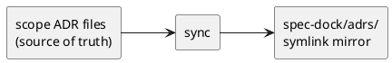
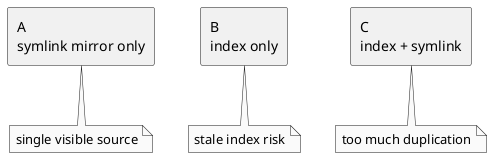
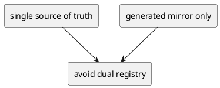
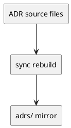
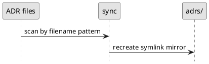

# 001-adr Adr Symlink Mirror Without Index

## 結論（Decision）
- ADR の唯一の source of truth は、各 initiative / epic / issue 配下の ADR 実体ファイルとする。
- `spec-dock` top-level に `adrs/` ディレクトリを設け、`sync` が ADR 原本への symlink mirror を毎回再生成する。
- `index.md` や `manifest.json` のような別管理インデックスは、現時点では採用しない。
- `adrs/` は generated view であり、手編集禁止とする。
- `sync` は `adrs/` を一度クリアしてから再構築する。

## 背景（Context）
- ADR を top-level で時系列に一覧したい要件がある。
- 一方で、index / manifest を別に持つと「正本が 2 つある」ように見えやすく、rename / delete 後の stale 情報が残る懸念がある。
- ユーザー判断として、唯一の正しい情報は各 scope に配置される ADR 実体であり、そこから派生する mirror 以外は持たない方が安全とされた。
- discussion / adr filename は、今後 timestamp-prefix に移行して時系列ソートしやすくする方針である。

### UML（任意）

## 選択肢（Options considered）
- Option A:
  - 概要:
    - `sync` で `adrs/` symlink mirror のみを生成する。
  - Pros:
    - 正本が 1 つで明確。
    - stale index という第二の壊れ方を作らない。
    - 実装が単純。
    - top-level 一覧 UX を得られる。
  - Cons:
    - machine-readable な集約契約は持たない。
    - symlink 非対応環境では mirror を skip する必要がある。
  - 棄却理由（棄却する場合）:
    - 採用。
- Option B:
  - 概要:
    - index / manifest のみを生成する。
  - Pros:
    - 機械処理に向く。
    - symlink 非対応環境でも安定。
  - Cons:
    - 二重管理に見えやすい。
    - stale index の懸念が残る。
    - top-level file browser UX が弱い。
  - 棄却理由（棄却する場合）:
    - ユーザーの二重管理懸念と合わないため棄却。
- Option C:
  - 概要:
    - index / manifest と symlink mirror を両方持つ。
  - Pros:
    - UX と機械処理の両立。
  - Cons:
    - 最も複雑で、二重管理懸念が strongest になる。
  - 棄却理由（棄却する場合）:
    - 現段階では過剰であり棄却。

### UML（任意）

## 判断理由（Rationale）
- 今回の目的は、ADR の source of truth を増やさずに top-level 一覧性を得ること。
- symlink mirror だけであれば、mirror は純粋な派生物であり、壊れても `sync` の再実行で復旧できる。
- index / manifest は generated artifact であっても、人間には「もう一つの台帳」に見えやすい。
- rename / delete 後の stale 情報を心理的にも実務的にも避けるため、集約は symlink mirror のみに留めるのが適切と判断した。

### UML（任意）

## 影響（Consequences）
- Positive（良い点）:
  - 正本が 1 つで明確。
  - `sync` 全再生成で rename / delete に追従しやすい。
  - top-level `adrs/` で一覧 UX を得られる。
- Negative / Debt（悪い点 / 将来負債）:
  - 高度な検索や export のための machine-readable contract は後回しになる。
  - symlink 非対応環境では mirror を作れない。
- 影響範囲（コード/テスト/運用/データ）:
  - `new doc adr`
  - `sync`
  - `validate`
  - `reference_naming.md`
  - `reference_sync.md`
- 移行/ロールバック:
  - discussion / adr filename を timestamp-prefix へ移行後、`sync` で `adrs/` 再生成を追加する。
  - 将来必要になれば manifest 導入を再検討できる。
- Follow-ups（追加の Epic/Issue/ADR）:
  - timestamp-based naming policy の実装
  - symlink 非対応環境の warning policy

### UML（任意）

## 参考（References）
- 関連仕様（requirement/design/plan/report）:
  - `requirement.md`
  - `design.md`
  - `plan.md`
  - `report.md`
- PR/実装:
  - 未実装
- 外部資料:
  - なし

### UML（任意）

