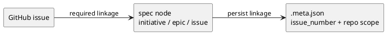
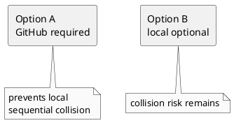
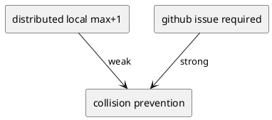
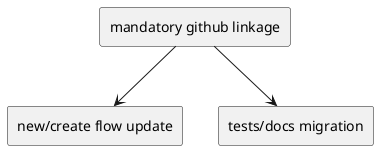
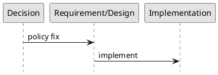

# 20260327t093000z-adr GitHub Mandatory Node Linkage

## 結論（Decision）
- `initiative` / `epic` / `issue` はすべて GitHub issue との連携を必須にする。
- GitHub issue に紐づかない node は作成しない。
- `local-only` / `local draft` / local fallback は廃止する。
- node 作成は GitHub issue を先に確保または既存 issue に link してからローカル node を生成する。
- internal の sequential local id に依存した採番はやめ、GitHub linkage を前提に衝突を防ぐ。

## 背景（Context）
- 現行の `initiative` / `epic` は local-only が default、`issue` は GitHub create が default で、採番方針が統一されていない。
- local-only node の ID は checkout 内の local graph を見た `max + 1` で決まり、複数 worktree / 複数 clone / 複数ユーザーで衝突する。
- create lock は checkout ローカルなので、分散環境での衝突予防にはならない。
- ユーザー判断として、GitHub に紐づかない initiative / epic / issue は存在させない方針が確定した。

### UML（任意）

## 選択肢（Options considered）
- Option A:
  - 概要:
    - initiative / epic / issue をすべて GitHub issue 必須にする。
  - Pros:
    - 分散環境での local sequential collision を根本的に減らせる。
    - すべての node が外部 tracker と一意に結びつく。
    - workflow が単純になる。
  - Cons:
    - GitHub 可用性と認証に依存する。
    - offline 作成はできなくなる。
  - 棄却理由（棄却する場合）:
    - 採用。
- Option B:
  - 概要:
    - local-only を残しつつ GitHub 連携を任意にする。
  - Pros:
    - offline 耐性がある。
    - 試作や一時作業の自由度が高い。
  - Cons:
    - local 採番衝突が残る。
    - node identity policy が二重になる。
  - 棄却理由（棄却する場合）:
    - collision 問題を解消できないため棄却。

### UML（任意）

## 判断理由（Rationale）
- 問題の本質は、分散環境で local sequential numbering を採っていることによる衝突である。
- node を必ず GitHub issue に紐づけることで、採番源を checkout ローカル状態から外へ出せる。
- ユーザーの運用方針としても、ドラフトを含めて GitHub issue を取得することが許容されている。
- このため、local-only を残すよりも GitHub mandatory に統一する方が、仕様・UX・運用のすべてで一貫する。

### UML（任意）

## 影響（Consequences）
- Positive（良い点）:
  - initiative / epic / issue の identity policy が一本化される。
  - local-only collision が解消される。
  - docs / sync / active / import の前提が揃う。
- Negative / Debt（悪い点 / 将来負債）:
  - GitHub 依存が強くなる。
  - 既存 local-only flow と tests の更新が必要になる。
- 影響範囲（コード/テスト/運用/データ）:
  - `commands/new.py`
  - `application/create_node.py`
  - `reference_github.md`
  - `reference_naming.md`
  - `tests/cli_runtime/test_new.py` ほか関連 tests
- 移行/ロールバック:
  - 移行では initiative / epic の default を GitHub mandatory に切り替える。
  - local-only path は段階的に削除する。
  - ロールバックは local-only 復活を意味し、今回の方針とは逆行するため想定しない。
- Follow-ups（追加の Epic/Issue/ADR）:
  - discussion / adr naming policy の ADR
  - single repo / cross-repo linkage policy の明確化

### UML（任意）

## 参考（References）
- 関連仕様（requirement/design/plan/report）:
  - `requirement.md`
  - `design.md`
  - `plan.md`
  - `report.md`
- PR/実装:
  - 未実装
- 外部資料:
  - なし

### UML（任意）

