# iss-00014 Unify Discussion Artifact Storage — 設計（どう実現するか）

> このテンプレートは最小 scaffold です。プロジェクトの目的、作業内容、人間の理解しやすさ、エージェントの実行可能性に合わせて、項目は追加・削除・統合・並べ替えてよい。

## 親図（Diagram）参照
- Epic 図:
  - ...
- Initiative 図:
  - ...
- 再利用する決定:
  - ...

## 目的・制約
- 目的:
  - ...
- 必須 / 禁止:
  - ...
- 非交渉制約:
  - ...
- 前提:
  - ...

## 既存実装 / 規約の理解
- 参照した実装 / docs:
  - ...
- 現状理解:
  - ...
- 採用するパターン:
  - ...
- 採用しないもの:
  - ...
- 影響範囲:
  - ...

## 採用方針 / トレードオフ
- 論点:
  - ...
- 選択肢:
  - ...
- 決定:
  - ...

## 依存関係分析
- module 依存:
  - ...
- class 依存（必要時）:
  - ...
- function 依存（必要時）:
  - ...
- file 依存:
  - ...
- 上流 / 前提:
  - ...
- 下流 / 依存先:
  - ...
- 実装起点:
  - 依存の少ないもの / 先に固定すべき interface / 先に通すべき test を書く
- 順序への影響:
  - plan では upstream / prerequisite から順に step を組む

## モジュール依存図（Module Dependency Diagram）
- タイトル:
  - ...
- 答える問い:
  - どの module / class / file / function の依存方向を固定し、どこから実装を始めるか
- 範囲:
  - ...
- 含めない詳細:
  - 網羅的な call graph / 全 method / 全 import は描かない
- 更新条件:
  - 依存方向、責務境界、実装起点、変更対象 module が変わるとき
- 図:
  - 下の `plantuml` block を更新する

### 図表（UML / 原則: モジュール依存 / パッケージ依存差分）

```plantuml
@startuml
top to bottom direction
' show module / class / file / function dependencies that affect implementation order
' do not copy Initiative/Epic diagrams

rectangle "対象module-a" as A
rectangle "対象module-b" as B
A --> B : depends_on
@enduml
```


## ローカル図の差分（Local Diagram Delta / 必要時）
- 変更する境界 / 責務 / 相互作用:
  - N/A: 理由

## インターフェース契約
- API / function / protocol / data boundary:
  - ...

## シーケンス差分（Sequence Delta / 必要時）
- 変更する相互作用:
  - N/A: 理由
- retry / transaction / external API / queue:
  - ...
- UML:
  - N/A: 理由

## ドメインモデル差分（Domain Model Delta / 必要時）
- 親 model 参照:
  - ...
- aggregate / entity / value object 変更:
  - N/A: 理由
- domain event / policy / specification 変更:
  - ...
- 不変条件の変更:
  - ...
- UML:
  - N/A: 理由

## クラス / インターフェース詳細設計（必要時）
- Class / Interface:
  - ...
- 責務:
  - ...
- 連携:
  - ...
- UML:
  - N/A: 理由

## ディレクトリ / ファイル変更計画
```text
.
|-- src/
|   |-- package/
|   |   |-- new_module.py        # 追加: 目的; 依存: ...
|   |   |-- existing_module.py   # 変更: 目的; 依存: ...
|   |   `-- renamed_module.py    # 移動/rename 元: src/package/old_module.py; 目的
|   `-- tests/
|       `-- test_new_module.py   # 追加/変更: 目的; 依存: src/package/new_module.py
|-- docs/
|   `-- reference.md             # 読取のみ: 目的
`-- legacy/
    `-- obsolete_file.py         # 削除: 目的; 依存: 代替準備完了
```

## 要件 → 設計マッピング
- AC-001 -> ...
- EC-001 -> ...
- constraint -> ...

## テスト戦略
- 単体:
  - ...
- 統合:
  - ...
- E2E / manual:
  - ...
- migration / rollback / feature flag if needed:
  - ...

## 要件 / 例外 -> 検証マッピング
- AC-001 -> ...
- EC-001 -> ...
- constraint -> ...

## リスク / 移行 / ロールバック（必要時）
- ...

## 未確定事項
- Q-001:
  - 質問:
  - 選択肢:
    - A:
      - ...
    - B:
      - ...
  - 推奨案:
    - ...
  - 影響範囲:
    - ...
