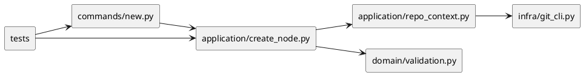
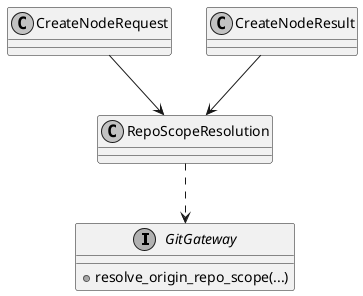

# iss-00034 GitHub Mandatory Node Creation Contract — 設計（HOW）

## 目的・制約
- 目的:
  - `initiative / epic / issue` の create contract を GitHub mandatory に統一し、`local_only` 経路を node 作成から排除する。
  - canonical repo scope を fail-closed に解決し、`.meta.json` の GitHub linkage を same-repo basis で一意に扱えるようにする。
- MUST / MUST NOT:
  - MUST:
    - `new initiative` / `new epic` / `new issue` の実効 create mode を GitHub create / link_existing に揃える。
    - `origin` remote から current GitHub `owner/repo` を一意解決し、`.meta.json.github.issue_number` / `.meta.json.github.repo_owner` / `.meta.json.github.repo_name` を lowercase canonical basis で保存する。
    - `origin` missing / non-GitHub remote / fetch-push mismatch / configured scope mismatch / cross-repo target を fail-fast にする。
  - MUST NOT:
    - initiative / epic / issue の local-only node を新規作成しない。
    - repo scope 未確定のまま create を成功させない。
- 非交渉制約:
  - `src/spec_dock/assets/spec_dock/...` を source of truth とし、checked-in mirror 側へ直接ロジック変更を入れない。
  - current repo scope 比較は lowercase canonical `owner/repo` basis で行う。
  - old workspace の自動移行は実装しない。失敗は明示的な contract error にする。
- 前提:
  - issue requirement は reviewer に渡せる粒度で固定済みである。
  - `spec-dock` runtime は `commands/new.py` -> `application/create_node.py` -> `repo_context.py` / `domain/validation.py` の流れで create contract を構成している。

## 既存実装 / 規約の理解
- 参照した実装 / docs:
  - `src/spec_dock/assets/spec_dock/scripts/spec_dock_runtime/commands/new.py`
  - `src/spec_dock/assets/spec_dock/scripts/spec_dock_runtime/application/create_node.py`
  - `src/spec_dock/assets/spec_dock/scripts/spec_dock_runtime/application/repo_context.py`
  - `src/spec_dock/assets/spec_dock/scripts/spec_dock_runtime/application/ports.py`
  - `src/spec_dock/assets/spec_dock/scripts/spec_dock_runtime/domain/validation.py`
  - `tests/cli_runtime/test_new.py`
  - `tests/cli_runtime/test_runtime_new_s08.py`
- 現状理解:
  - `commands/new.py` は `new issue` だけを default GitHub create、`new initiative` / `new epic` は default `local_only` としている。
  - `application/create_node.py::_resolve_github_mode()` は `kind == "issue"` のみ `create` default、他は `local_only` default である。
  - `repo_context.py` は `origin_github_repo_slug()` の単一戻り値だけを使って current repo scope を解決しており、fetch/push mismatch や non-GitHub origin の失敗理由を区別していない。
  - `domain/validation.py` は github linkage uniqueness は持つが、initiative / epic / issue の GitHub mandatory 自体は検証していない。
  - 既存テストには `--no-github` 前提の create ケースが広く残っている一方、repo scope persistence や runtime create failure の下地となるテスト群も存在する。
- 採用するパターン:
  - command layer は薄く保ち、実契約の切り替えは `application/create_node.py` と `repo_context.py` に寄せる。
  - validation は `domain/validation.py` で fail-fast に集約し、CLI テストは `tests/cli_runtime/test_new.py` と `tests/cli_runtime/test_runtime_new_s08.py` で end-to-end に押さえる。
  - 既存 CLI option を即削除せず、実行時に明確な contract error を返す fail-closed 戦略を採る。
- 採用しないもの:
  - parser option の全面削除だけで契約変更を表現すること。
  - current repo scope を optional / best-effort のまま扱うこと。
  - cross-repo を暫定許容して後続 issue で締めること。
- 影響範囲:
  - runtime create parser / orchestration
  - git remote scope resolution
  - validation error surface
  - CLI / application tests
  - create contract の最小 docs 差分

## 採用方針 / トレードオフ
- 論点:
  - `--no-github` を parser から消すか、明示エラーとして残すか。
  - canonical repo scope を「単一 slug」ではなく「origin fetch/push の検査結果」としてどこまで持つか。
  - first node binding を create 時に確定させるか、validation 時に後追いで確定させるか。
- 選択肢:
  - Option A:
    - `--no-github` を parser から削除し、argparse error にする。
  - Option B:
    - parser 互換は残しつつ、initiative / epic / issue では contract error として fail-fast にする。
  - Option C:
    - local_only 経路を hidden で残し、後続 issue で閉じる。
- 決定:
  - Option B を採用する。
  - 理由:
    - old workflow を成功させないという requirement を満たしつつ、利用者へ「何が禁止されたか」を明示できる。
    - create core の切り替えとテスト置換を段階的に進めやすい。
    - docs parity の全面更新は後続 issue に残しつつ、この issue 内で最小 boundary docs diff を出せる。

## インターフェース契約
- API / function / protocol / data boundary:
  - CLI contract:
    - `new initiative` / `new epic` / `new issue` は GitHub create を default とする。
    - `--github-issue` は link_existing として維持する。
    - `--no-github` は initiative / epic / issue に対して contract error とする。
  - application contract:
    - `_resolve_github_mode()` は initiative / epic / issue すべてで `create` default に寄せる。
    - `create_node_core()` は create 前に canonical repo scope を解決し、未解決なら GitHub issue 作成前または local write 前に fail-fast する。
  - repo scope contract:
    - Git gateway は `origin` の fetch/push を検査し、正規化済み canonical `owner/repo` と failure reason を返せる必要がある。
    - SSH / HTTPS は同一 `owner/repo` へ正規化して比較する。
    - configured repo scope がある場合は canonical scope と一致必須。
  - persistence contract:
    - `.meta.json.github.issue_number` / `.meta.json.github.repo_owner` / `.meta.json.github.repo_name` は lowercase canonical basis で保持する。
  - validation contract:
    - initiative / epic / issue に unscoped local-only node が存在する場合は validation error にする。
    - legacy mismatch は `new` では contract error、`validate` では validation error として non-zero を返す。
    - `import ... --allow-foreign-url` 由来 node と sync-generated output はこの issue では対象外とし、validation hardening の直接適用範囲に含めない。

### UML（推奨: module / dependency）

## クラス / インターフェース詳細設計（必要時）
- Class / Interface:
  - `GitGateway`
- responsibility:
  - `origin` から canonical repo scope を解決するのに必要な remote 情報を返す。
- collaboration:
  - `repo_context.py` が正規化・比較・error mapping を行い、`create_node.py` と `validation.py` がその結果を使う。

- Class / Interface:
  - `CreateNodeRequest` / `create_node_core()`
- responsibility:
  - create mode 決定、GitHub issue 作成前 precheck、plan 生成前 canonical scope binding を扱う。
- collaboration:
  - `commands/new.py` から request を受け、`repo_context.py` の canonical scope resolver と `domain/validation.py` の uniqueness contract を利用する。

### UML（任意: class / interface）

## 変更計画
- Add:
  - `repo_context.py` に canonical repo scope resolution helper と failure reason mapping を追加する。
  - create / validation テストを追加する。
- Modify:
  - `commands/new.py` の initiative / epic default GitHub behavior と error messaging。
  - `application/create_node.py` の mode resolution、precheck、repo scope binding、local_only rejection。
  - `application/ports.py` / `infra/git_cli.py` の origin remote resolution 契約。
  - `domain/validation.py` の GitHub mandatory validation。
- Delete:
  - initiative / epic / issue における successful local_only create behavior。
- Move/Rename:
  - なし。
- Read only:
  - `spec-dock/` checked-in dogfooding data（この issue では実装 source of truth にしない）
  - import / sync の主処理

## 要件 → 設計マッピング
- AC-001 -> CLI default GitHub mode + `.meta.json.github.issue_number` / `.meta.json.github.repo_owner` / `.meta.json.github.repo_name` persistence
- AC-002 -> fail-closed `origin` resolver + first node binding + configured/cross-repo reject
- AC-003 -> boundary docs diff + validation / migration tests の先行ガード
- EC-001 -> `origin` missing failure path
- EC-002 -> fetch/push mismatch / non-GitHub origin reject
- EC-003 -> cross-repo target reject
- constraint -> `local_only` create path no longer succeeds for initiative / epic / issue

## テスト戦略
- Unit:
  - repo scope 正規化（SSH / HTTPS / lowercase basis）
  - `_resolve_github_mode()` の default / reject behavior
  - validation の GitHub mandatory error
- Integration:
  - `new initiative` / `new epic` / `new issue` の create contract
  - `new issue --github-issue <same-repo issue>` の same-repo success
  - `new initiative|epic|issue --no-github` の explicit reject
  - `.meta.json.github.issue_number` / `.meta.json.github.repo_owner` / `.meta.json.github.repo_name` persistence
  - `origin` missing / non-GitHub / fetch-push mismatch / configured mismatch / cross-repo reject
- E2E / manual:
  - dogfooding repo 上で `active issue` の create contract を再確認する必要はあるが、本 issue では CLI / application tests を主証拠にする。
- migration / rollback / feature flag if needed:
  - feature flag は導入しない。
  - rollback は issue 単位で戻すが、GitHub mandatory contract を partially dual-mode にしない。

## 要件 / 例外 -> verification mapping
- AC-001 -> `tests/cli_runtime/test_new.py` と `tests/cli_runtime/test_runtime_new_s08.py` の create success / meta persistence
- AC-002 -> resolver reject tests（origin missing / non-GitHub / fetch-push mismatch / configured mismatch / cross-repo）
- AC-003 -> boundary docs diff + `new` contract error / `validate` validation error tests
- EC-001 -> origin missing test
- EC-002 -> canonical resolver reject tests
- EC-003 -> cross-repo reject tests
- constraint -> `--no-github` rejection tests for initiative / epic / issue

## リスク / 移行 / ロールバック（必要時）
- 主リスク:
  - 既存 `--no-github` テストが広く存在するため、テストの置換と期待値更新が大きい。
  - `origin_github_repo_slug()` の現行 port では fetch/push mismatch を検出できず、port 変更が必要になる。
- 移行:
  - old workflow は success ではなく explicit failure に変える。
  - docs parity の全面更新は `iss-00038` に残し、本 issue では boundary/canonical scope の最小 docs diff に留める。
- ロールバック:
  - issue 単位で差分を戻す。`local_only` と GitHub mandatory の dual-mode 共存状態には戻さない。

## 未確定事項
- なし:
  - 実装開始に必要な設計論点はこの issue 範囲で固定する
