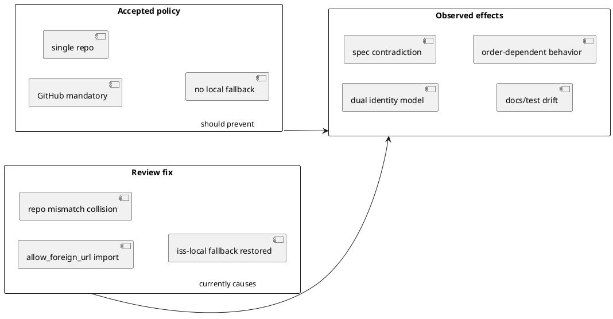
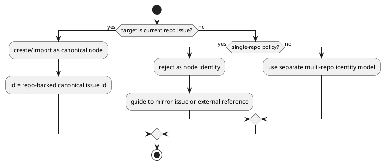

# 002-disc Foreign issue import identity conflict analysis

## 議題 (必須)
- `import ... --allow-foreign-url` と `iss-local-*` fallback 復元が、accepted ADR / epic / issue spec と整合しているかを分析する。
- 問題の本質、あるべき状態、修正選択肢、推奨方針、段階的な修正計画を整理する。
- 第三者観点を踏まえ、実装是正のベストプラクティスを固定する。

## 背景 (必須)
- 既存の accepted ADR と epic / issue spec では、`initiative / epic / issue` の identity は GitHub mandatory、single GitHub repo 前提、`local-only` / local fallback 廃止として整理されている。
- ところが `iss-00034` の review fix で、`import ... --allow-foreign-url` の回帰を直すために `iss-local-*` fallback が復元された。
- その結果、`iss-local-*` が「GitHub に紐づかない local issue」ではなく、「foreign GitHub issue の退避先」としても使われる状態になった。
- これは、ID 体系・repo scope invariant・user-facing docs・テスト期待値を同時に曖昧にする。

## 事実確認
- accepted ADR は `local-only` / local fallback 廃止を明言している。
  - [002-adr-github-mandatory-node-linkage.md](/srv/mount/spec-dock/spec-dock/initiatives/init-local-00003-architecture-maintenance-and-hardening/epics/epic-00033-github-backed-identity-and-adr-mirror-workflow/discussions/002-adr-github-mandatory-node-linkage.md)
- active epic requirement は `local-only fallback を残さない`、`cross-repo linkage を扱わない`、`single GitHub repo 前提` を固定している。
  - [requirement.md](/srv/mount/spec-dock/spec-dock/active/epic/requirement.md)
- active issue requirement でも `local-only fallback` を残さず、`cross-repo linkage` を許可しないと書かれている。
  - [requirement.md](/srv/mount/spec-dock/spec-dock/active/issue/requirement.md)
- 初版の active issue docs には AC-003 の境界として、`import ... --allow-foreign-url` 由来 node を新規 reject 対象に含めない exemption が残っていた。
  - [requirement.md](/srv/mount/spec-dock/spec-dock/active/issue/requirement.md)
  - [design.md](/srv/mount/spec-dock/spec-dock/active/issue/design.md)
  - [plan.md](/srv/mount/spec-dock/spec-dock/active/issue/plan.md)
- 問題分析時点の実装では、import 経路から foreign repo 許容 seam が create planning へ渡り、repo mismatch collision のとき `iss-local-*` に退避する構成が存在した。
  - [create_node.py](/srv/mount/spec-dock/src/spec_dock/assets/spec_dock/scripts/spec_dock_runtime/application/create_node.py)
  - [import_node.py](/srv/mount/spec-dock/src/spec_dock/assets/spec_dock/scripts/spec_dock_runtime/application/import_node.py)
- テストも foreign import success 時の `iss-local-*` を期待する。
  - [test_import.py](/srv/mount/spec-dock/tests/cli_runtime/test_import.py)
  - [test_runtime_import_s10.py](/srv/mount/spec-dock/tests/cli_runtime/test_runtime_import_s10.py)
  - [test_init_update.py](/srv/mount/spec-dock/tests/test_init_update.py)
- user-facing docs にはまだ `cross-repo import は --allow-foreign-url で許可` と読める記述が残っている。
  - [reference_github.md](/srv/mount/spec-dock/src/spec_dock/assets/spec_dock/docs/reference_github.md)
  - [workflow_issue.md](/srv/mount/spec-dock/spec-dock/docs/workflow_issue.md)

## 問題の構造

- 問題の本質は、`create/new` の canonical identity contract と、`import foreign URL` の例外契約が、同じ `initiative / epic / issue` node model の中で衝突していること。
- `iss-local-*` を foreign fallback に使うと、1 つの system 内に少なくとも 2 つの identity rule が共存する。
- `iss-<github-number>` は current repo の canonical identity。
- `iss-local-*` は foreign issue の退避 identity。
- これは「補助 ID」ではなく「別の canonical 風 ID」なので、active/deps/status/sync/doctor/docs すべてに波及する。

## 何が問題なのか
- 仕様逆行:
  - accepted ADR と epic requirement は `local fallback` 廃止を前提にしているため、`iss-local-*` 復元は局所的な巻き戻しになる。
- モデル衝突:
  - `iss-local-*` が「local draft」でも「GitHub-backed current repo node」でもなく、「foreign GitHub issue の fallback」になると語義が壊れる。
- 順序依存:
  - foreign issue を先に import した場合と current repo issue を先に作成した場合で、最終 ID の割り当て結果が変わりうる。
- docs/test drift:
  - spec は strict、実装は exception、docs は一部 legacy のまま、tests は fallback 成功を固定している。
- 将来負債:
  - もし multi-repo first-class support をやるなら、本来必要なのは `iss-local-*` ではなく repo-scoped identity か external reference model である。

## あるべき状態
- `initiative / epic / issue` の canonical identity は 1 つだけである。
- canonical key は current repo の GitHub issue linkage で決まり、local fallback は存在しない。
- single GitHub repo 前提では、foreign issue URL は current repo node identity に変換しない。
- foreign issue を扱う必要があるなら、core node identity に混ぜず、別モデルで扱う。
- strict reject
- external reference
- current repo mirror issue

## 選択肢 (必須)
- Option A:
  - Pros:
    - 現状維持。`--allow-foreign-url` を許し、collision 時だけ `iss-local-*` fallback を維持する。
    - 直近の回帰を少ないコード変更で回避しやすい。
  - Cons:
    - accepted ADR / epic / issue spec に反する。
    - dual identity を固定し、将来の active/deps/status/sync 判定が複雑化する。
    - `iss-local-*` の意味が壊れる。
- Option B:
  - Pros:
    - foreign issue を first-class に扱う。repo-scoped identity か external-issue kind を導入する。
    - multi-repo を本当にやるなら理屈は通る。
  - Cons:
    - single GitHub repo assumption を覆す。
    - `ids.py`、active/deps/status/sync/validate/docs/移行まで広がり、`iss-00034` の範囲を超える。
- Option C:
  - Pros:
    - foreign issue URL は node import として reject し、current repo mirror issue か external reference に寄せる。
    - single repo / GitHub mandatory / no local fallback と最も整合する。
    - canonical identity を 1 本に保てる。
    - 実装面の blast radius がもっとも小さい。
  - Cons:
    - `--allow-foreign-url` の既存期待値を破る。
    - 既存の foreign import テストと docs を修正する必要がある。

## 第三者分析の要約
- consultant:
  - 現行前提では Option C が最も筋が通る。
  - `iss-local-*` fallback は tactical には楽でも、設計逆行であり負債を増やす。
- researcher:
  - canonical identity system の best practice は「canonical key を 1 つに固定し、自動 fallback ID を持ち込まない」。
  - foreign を扱うなら別オブジェクト種別に分離するのが堅牢。
- repo analyst:
  - いまの不整合は実装、tests、report、docs にまたがって固定され始めている。
  - 放置すると「spec は strict、実装は exception」のねじれが拡大する。

## 推奨案 (必須)
- Option C を推奨する。
- `initiative / epic / issue` node としては foreign issue URL を reject する。
- 必要な案内は次のどちらかに寄せる。
- current repo に mirror issue を作成して、それを import / link する。
- 外部参照として discussion / note / future external-ref model で扱う。
- 理由:
- accepted ADR、epic requirement、issue requirement の主張と最も整合する。
- `iss-local-*` を完全廃止するという意思決定を守れる。
- canonical identity を `current repo + GitHub issue` の 1 本に保てる。
- 実装修正の blast radius が Option B より小さい。

## 推奨修正計画
- Phase 1: contract correction
  - `import ... --allow-foreign-url` を `initiative / epic / issue` node import では reject に変える。
  - error message に「single-repo / GitHub-backed identity のため foreign issue URL は node identity にできない」を含める。
- Phase 2: implementation cleanup
  - [create_node.py](/srv/mount/spec-dock/src/spec_dock/assets/spec_dock/scripts/spec_dock_runtime/application/create_node.py) に残る repo-unknown / mixed-scope fail-open 条件を strict reject に寄せる。
  - [import_node.py](/srv/mount/spec-dock/src/spec_dock/assets/spec_dock/scripts/spec_dock_runtime/application/import_node.py) の foreign bypass を strict reject に寄せる。
  - [import_cmd.py](/srv/mount/spec-dock/src/spec_dock/assets/spec_dock/scripts/spec_dock_runtime/commands/import_cmd.py) の `--allow-foreign-url` は削除するか、reject-only deprecation に変える。
- Phase 3: test correction
  - [test_import.py](/srv/mount/spec-dock/tests/cli_runtime/test_import.py)
  - [test_runtime_import_s10.py](/srv/mount/spec-dock/tests/cli_runtime/test_runtime_import_s10.py)
  - [test_init_update.py](/srv/mount/spec-dock/tests/test_init_update.py)
  - foreign import success / `iss-local-*` fallback 期待値を reject 期待値へ置換する。
- Phase 4: docs correction
  - [reference_github.md](/srv/mount/spec-dock/src/spec_dock/assets/spec_dock/docs/reference_github.md)
  - [workflow_issue.md](/srv/mount/spec-dock/spec-dock/docs/workflow_issue.md)
  - [report.md](/srv/mount/spec-dock/spec-dock/active/issue/report.md)
  - [001-disc-implementation-review-cycle-for-iss-00034.md](/srv/mount/spec-dock/spec-dock/initiatives/init-local-00003-architecture-maintenance-and-hardening/epics/epic-00033-github-backed-identity-and-adr-mirror-workflow/issues/iss-00034-github-mandatory-node-creation-contract/discussions/001-disc-implementation-review-cycle-for-iss-00034.md)
  - 例外契約ではなく、問題分析と是正に読み替える。
- Phase 5: future extensibility
  - もし本当に foreign issue を first-class に扱いたくなった場合は、別 ADR / epic で repo-scoped identity か external reference model を設計する。

## ベストプラクティス提案
- canonical identity system に自動 fallback ID を混ぜない。
- policy conflict をテスト互換で埋めず、上位 contract に合わせて例外機能を切る。
- single-repo 前提で foreign issue を扱う必要があるときは、core node ではなく reference model に分離する。
- `report.md` の review-fix ログは「何を直したか」だけでなく、「その fix が後で否定された理由」も残す。

## 未決事項 (任意)
- `--allow-foreign-url` を完全削除するか、明示的な reject/deprecation flag として一時的に残すか。
- foreign issue の将来ユースケースを external reference として扱う専用モデルを設けるか。

## 次アクション (必須)
- `iss-00034` の active issue docs は、この discussion の推奨案に合わせて再整理済みである。
- `iss-local-*` fallback を削除する修正 issue / fix patch を作成する。
- related docs と tests を strict reject モデルに揃える。
