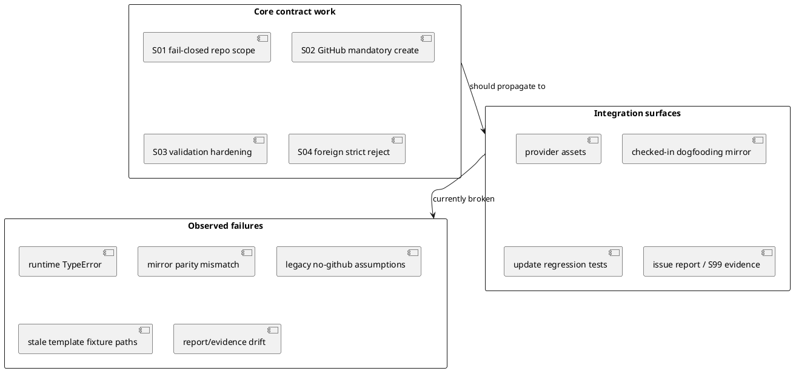

# 003-disc Review findings analysis for implementation gaps

## 議題
- `iss-00034` 実装レビューで出た指摘を、単発の不具合一覧ではなく、原因・影響・優先順位・修正順序まで含めて分析する。
- どれが release blocker で、どれが追随修正かを切り分ける。
- 実装担当者へ差し戻す際の、最小で安全な是正順序を固定する。

## 背景
- `iss-00034` は `single GitHub repo` / `GitHub mandatory` / `no local fallback` を create / validate / import に反映する issue である。
- 実装担当者は `S01-S04` を進め、branch は clean で commit 済みになっている。
- ただし review では `pass` にならず、dogfooding parity と update regression で重大な破綻が見つかった。

## 確認した証跡
- 実行コマンド:
```bash
python -m unittest \
  tests.cli_runtime.test_import \
  tests.cli_runtime.test_runtime_import_s10 \
  tests.test_init_update \
  tests.cli_runtime.test_new \
  tests.cli_runtime.test_runtime_new_s08 \
  tests.cli_runtime.test_validate \
  tests.cli_runtime.test_runtime_validate_s02 \
  tests.domain_runtime.test_runtime_domain_s03 \
  tests.presentation_runtime.test_runtime_sync_s07

./spec-dock/scripts/spec-dock validate
```
- 観測結果:
  - targeted contract suite は概ね green
  - broadened suite は `292 tests` 中 `31 failures / 2 errors`
  - `./spec-dock/scripts/spec-dock validate` は `ok (validate) nodes=8`
- 第三者レビュー:
  - `qa_reviewer` verdict: `fail`
  - main review conclusion: `fail`

## 事実整理
- checked-in dogfooding runtime は provider asset と一致していない。
  - [import_node.py](/srv/mount/spec-dock/spec-dock/scripts/spec_dock_runtime/application/import_node.py:299)
  - [validation.py](/srv/mount/spec-dock/spec-dock/scripts/spec_dock_runtime/domain/validation.py:175)
- `tests.test_init_update` には旧 `local-only` 契約前提が残っている。
  - [test_init_update.py](/srv/mount/spec-dock/tests/test_init_update.py:5347)
- update fixture の一部は、既に存在しない legacy template path を前提にしている。
  - [test_init_update.py](/srv/mount/spec-dock/tests/test_init_update.py:511)
  - [test_init_update.py](/srv/mount/spec-dock/tests/test_init_update.py:585)
- issue report は S04/S99 完了を記録しているが、現実の broadened suite failure と整合していない。
  - [report.md](/srv/mount/spec-dock/spec-dock/active/issue/report.md:179)
  - [report.md](/srv/mount/spec-dock/spec-dock/active/issue/report.md:217)
  - [report.md](/srv/mount/spec-dock/spec-dock/active/issue/report.md:231)

## 問題の構造



- 本質は「core contract 実装は進んでいるが、consumer-side mirror / update regression / issue report への伝播が完了していない」こと。
- つまり、runtime の中心部だけ見ると前進しているが、dogfooding repo 全体としては incomplete である。

## 指摘事項の分析

### 1. Blocker: checked-in dogfooding runtime mirror が内部不整合
- 症状:
  - checked-in runtime の `import_node.py` は新しい validation 呼び出しを前提にしているが、checked-in `validation.py` は古い signature のままで `TypeError` になる。
- なぜ起きたか:
  - provider 側の変更を dogfooding mirror 全体へ同期し切れていない。
  - 一部ファイルだけ同期し、同一 API を共有する隣接ファイルが置き去りになった可能性が高い。
- 影響:
  - dogfooding runtime parity が壊れ、subprocess/import parity test が失敗する。
  - 「provider asset は正しいが checked-in workspace は壊れている」状態なので、実利用検証としては不合格。
- 判定:
  - release blocker

### 2. High: update regression suite が旧 `local-only` 契約に取り残されている
- 症状:
  - `_create_minimal_local_tree()` が `--no-github` と `*-local-*` を前提に node を作ろうとして失敗する。
- なぜ起きたか:
  - `S02` の GitHub mandatory 契約変更に対して、update/context-pack recovery 系 helper の移行が未完了。
  - targeted suite は更新されたが、broader update suite の fixture strategy が旧仕様のまま残った。
- 影響:
  - update / active recovery / context-pack regeneration の回帰が大量に赤になる。
  - 実装自体の問題と、テスト fixture の古さが混ざって見えにくくなる。
- 判定:
  - high priority

### 3. High: legacy template path fixture が即時エラーを起こす
- 症状:
  - `tests/test_init_update.py` の fixture write が、現行 scaffold に存在しない path へ書こうとして `FileNotFoundError` になる。
- なぜ起きたか:
  - layout 変更後も fixture path の保守が追随していない。
  - 振る舞い検証に入る前にセットアップ段階で落ちるため、回帰の意味が薄れている。
- 影響:
  - そのテスト群は現状の品質信号として信頼しにくい。
  - 失敗が「仕様違反」なのか「fixture 老朽化」なのかを切り分けにくくする。
- 判定:
  - high priority

### 4. Medium: report / S99 evidence が現実より先行している
- 症状:
  - report は S04/S99 完了と mirror 再同期を記録しているが、実際には parity 破綻と broadened suite failures が残る。
- なぜ起きたか:
  - targeted suite を主証跡として採用した一方で、broadened suite と checked-in parity の failure を「unrelated baseline」と見なしすぎた。
  - しかし今回の failure には `iss-00034` 自身が引き起こした mirror 不整合と旧契約 fixture が含まれている。
- 影響:
  - review / re-review の判断材料として report が信用しづらくなる。
  - 実装担当者への handoff でも、何が残課題かがぼやける。
- 判定:
  - medium priority

## 何が完了していて、何が未完了か
- 完了寄り:
  - `S01` fail-closed repo scope
  - `S02` GitHub mandatory create
  - `S03` validation hardening
  - `S04` の中心ロジックである foreign issue strict reject
- 未完了:
  - checked-in dogfooding runtime mirror の整合回復
  - update regression fixture / helper の GitHub mandatory 契約への追随
  - legacy template path fixture の現行 scaffold への置換
  - report / S99 evidence の現実整合

## 根本原因の分類
- Category A: 実装伝播不足
  - provider asset を直したが checked-in mirror を完全同期していない
- Category B: テスト資産の仕様追随漏れ
  - `--no-github` / local ID 前提 helper が残存
- Category C: 検証証跡の premature close
  - targeted suite が通った時点で S99 を閉じたが、broader regression の意味付けが甘かった

## 推奨是正順序
- Phase 1:
  - checked-in dogfooding runtime mirror を provider asset と完全同期する
  - parity test を最優先で green にする
- Phase 2:
  - `tests/test_init_update.py` の `_create_minimal_local_tree()` と local-only 前提 helper を GitHub mandatory 契約へ更新する
  - `init-local-* / epic-local-* / iss-local-*` 前提を除去する
- Phase 3:
  - legacy template path fixture を現行 scaffold path に置換する
  - setup failure を behavior failure へ戻す
- Phase 4:
  - broadened suite を再実行し、残る failure を `iss-00034` 由来 / unrelated に再分類する
  - その結果に合わせて [report.md](/srv/mount/spec-dock/spec-dock/active/issue/report.md) の S04/S99 証跡を修正する

## ベストプラクティス提案
- contract 変更を close する前に、provider asset だけでなく checked-in dogfooding mirror parity まで確認する。
- targeted suite が green でも、broader regression が多数赤い場合は「本当に unrelated か」を一度分解する。
- report の `done` 判定は、最小 acceptance suite と parity suite の両方を見たうえで閉じる。

## 結論
- 今回の review finding は、「strict reject の方向性が誤っている」のではなく、「その変更が repo 全体へ伝播し切っていない」ことを示している。
- したがって方針を戻す必要はなく、mirror parity、update fixture、report evidence の 3 点を是正すれば、`iss-00034` は収束可能である。
- 現時点の verdict は `fail` だが、これは contract 自体の誤りではなく integration completion 不足による失敗である。

## 次アクション
- 実装担当者へは、S04 corrective follow-up として次の 4 点を差し戻す。
- checked-in mirror 全同期
- `tests/test_init_update.py` の GitHub mandatory 追随
- legacy template fixture path 更新
- `report.md` の S04/S99 証跡修正
