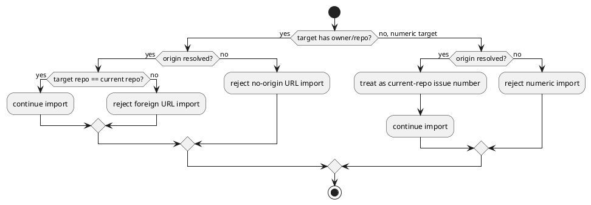

# 005-disc Numeric import no-origin fail-closed fix analysis

## 議題
- `import issue 123` のような numeric import が、`origin` 未解決時に fail-closed せず成功してしまう残課題を分析する。
- 何が問題か、どう直すべきか、最小かつ安全な修正範囲はどこかを整理する。
- 修正契約を fixed point として残し、dev_coder と reviewer の共通基準にする。

## 背景
- `iss-00034` では `single GitHub repo` / `GitHub-backed identity` / `no local fallback` を create / validate / import に通すことが目的である。
- URL ベースの foreign import strict reject と dogfooding parity/update regressions は修復が進んだ。
- しかし、numeric import は URL ではないため repo identity を持たず、`origin` が解決できない場合の fail-closed が閉じ切れていない。

## 事実確認
- numeric import では `target_repo_owner` / `target_repo_name` が `None` になりうる。
  - [import_node.py](/srv/mount/spec-dock/src/spec_dock/assets/spec_dock/scripts/spec_dock_runtime/application/import_node.py#L117)
- URL repository identity check は `owner/repo` が無い場合に早期 return する。
  - [import_node.py](/srv/mount/spec-dock/src/spec_dock/assets/spec_dock/scripts/spec_dock_runtime/application/import_node.py#L143)
- そのまま `current_repo_slug=None` でも create request が組まれ、`.meta.json.github.repo_owner` / `.meta.json.github.repo_name` 未設定の書き込み経路が残る。
  - [create_node.py](/srv/mount/spec-dock/src/spec_dock/assets/spec_dock/scripts/spec_dock_runtime/application/create_node.py#L867)
  - [create_node.py](/srv/mount/spec-dock/src/spec_dock/assets/spec_dock/scripts/spec_dock_runtime/application/create_node.py#L890)
- 既存テストは URL import の no-origin reject は持つが、numeric target + no-origin の reject / no-write は直接押さえていない。
  - [test_import.py](/srv/mount/spec-dock/tests/cli_runtime/test_import.py#L510)
  - [test_import.py](/srv/mount/spec-dock/tests/cli_runtime/test_import.py#L977)

## 問題の構造

```plantuml
@startuml
skinparam monochrome true
left to right direction

rectangle "Input" as input {
  [import issue 123]
}

rectangle "Current flow" as flow {
  [target repo owner/name = None]
  [URL identity guard returns early]
  [current_repo_slug may be None]
  [create request continues]
}

rectangle "Broken outcome" as broken {
  [unscoped github linkage written]
  [validate later fails]
}

input --> flow --> broken
@enduml
```

- 問題の本質は、「URL import は strict だが、numeric import は current repo scope を自明視してしまっている」こと。
- single-repo contract では、numeric import であっても current repo は `origin` から確定できなければならない。
- つまり numeric import は URL より弱い経路であってはならない。

## 何が問題なのか
- fail-open:
  - `origin` が解決できないのに import が先へ進み、後から `validate` で壊れた state が見つかる。
- 契約違反:
  - accepted policy は `GitHub-backed identity` と `fail-closed` であり、unscoped linkage 新規作成を許していない。
- 診断遅延:
  - import 成功後に validate で落ちるため、ユーザーには「作れたのに壊れている」ように見える。

## あるべき状態
- `initiative / epic / issue` の import は、URL target でも numeric target でも current repo scope を解決できなければ fail-fast する。
- fail-fast は GitHub read / create lock / local scaffold / meta write より前に起こる。
- same-repo numeric import は、`origin` が解決できる場合にのみ許可される。



## 修正案の選択肢
- Option A:
  - numeric import に限り `origin` 未解決でも許す
  - 問題:
    - single-repo contract と fail-closed に反する
- Option B:
  - numeric import も `origin` 必須にする
  - 利点:
    - URL import と同じ強度で contract を守れる
    - `.meta.json` unscoped write を防げる
- Option C:
  - numeric import 自体を廃止し URL only にする
  - 問題:
    - UX 変更が大きく、今回の scope を超えやすい

## 推奨案
- Option B を採用する。
- 理由:
  - 既存 UX を大きく壊さず、最小修正で fail-closed を達成できる。
  - URL import と numeric import の強度差を解消できる。
  - multi-repo など別問題へスコープが広がらない。

## ベストプラクティス提案
- node import の current repo identity は target 表現に依存させず、必ず `origin` 解決を通す。
- `origin` が無い場合の numeric import は「曖昧だから通す」ではなく「曖昧だから拒否する」を採る。
- guard は GitHub read / lock / write より前に置き、no-write/no-side-effect を保証する。

## 推奨修正範囲
- 実装:
  - [import_node.py](/srv/mount/spec-dock/src/spec_dock/assets/spec_dock/scripts/spec_dock_runtime/application/import_node.py)
    - numeric target かつ `current_repo_slug is None` を explicit reject にする
    - guard は preflight validate 後、GitHub read 前に置く
    - `issue_view_minimal()` へは `repo_slug = _target_repo_slug(req) or current_repo_slug` を渡して deterministic にする
  - checked-in mirror:
    - [import_node.py](/srv/mount/spec-dock/spec-dock/scripts/spec_dock_runtime/application/import_node.py)
- テスト:
  - [test_import.py](/srv/mount/spec-dock/tests/cli_runtime/test_import.py)
    - numeric target + no-origin -> non-zero + no-write
  - [test_runtime_import_s10.py](/srv/mount/spec-dock/tests/cli_runtime/test_runtime_import_s10.py)
    - app-layer で GH read / lock / write 前に reject されること
- docs/report:
  - [reference_github.md](/srv/mount/spec-dock/src/spec_dock/assets/spec_dock/docs/reference_github.md)
  - [reference_github.md](/srv/mount/spec-dock/spec-dock/docs/reference_github.md)
  - [report.md](/srv/mount/spec-dock/spec-dock/active/issue/report.md)

## リスクと境界
- provider と checked-in mirror の drift を再発させないこと。
- error message の wording は既存テストと doc が拾うので、過度にぶらさないこと。
- 今回は strict fail-closed hardening のみ扱い、multi-repo / external-reference へ広げないこと。

## 実施順序
1. discussion で contract を固定する
2. dev_coder が provider + checked-in mirror + tests を同時修正する
3. targeted import tests を回す
4. broader suite / validate を回す
5. code review / QA review / spec review を回し、必要なら差し戻す
6. `report.md` を最新証跡へ更新する

## 次アクション
- `numeric import + no-origin` の explicit reject を実装する
- numeric target 向け no-write regression を追加する
- review verdict が `pass` になるまで修正と再レビューを繰り返す
