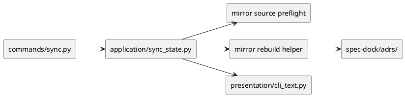

# iss-00035 Sync ADR Symlink Mirror — 設計（HOW）

## 目的・制約
- 目的:
  - `sync` 実行時に `spec-dock/adrs/` を top-level browse 用の generated symlink mirror として再生成する。
  - mirror source の採用基準、collision preflight、non-symlink fallback を deterministic にし、filesystem 終状態を検証可能にする。
- MUST / MUST NOT:
  - MUST:
    - mirror source は `discussions/` 配下で timestamp ADR basename と ADR front matter contract を満たす原本だけに限定する。
    - mirror layout は flat な `spec-dock/adrs/<basename>` とする。
    - basename collision は clear 前に検出し、`spec-dock/adrs/` を変更せず failure にする。
    - symlink 非対応環境では空 directory を残すか再作成し、warning success とする。
  - MUST NOT:
    - index / manifest を追加しない。
    - legacy ADR を mirror source に含めない。
    - collision を silent overwrite / last-write-wins で処理しない。
- 非交渉制約:
  - provider-side source of truth は `src/spec_dock/assets/spec_dock/...` の runtime 実装。
  - clear-then-rebuild 成功時の stale cleanup を最優先する。
  - collision failure では partial rebuild や empty-dir 破壊を残さない。
- 前提:
  - `iss-00036` の `new doc adr` / validate contract が先行済みである。
  - 親 epic は legacy ADR を naming 上 grandfathered としつつ、mirror source からは除外する方針へ整合済みである。

## 既存実装 / 規約の理解
- 参照した実装 / docs:
  - `src/spec_dock/assets/spec_dock/scripts/spec_dock_runtime/commands/sync.py`
  - `src/spec_dock/assets/spec_dock/scripts/spec_dock_runtime/application/sync_state.py`
  - `src/spec_dock/assets/spec_dock/scripts/spec_dock_runtime/infra/artifact_writer.py`
  - `src/spec_dock/assets/spec_dock/scripts/spec_dock_runtime/application/contracts.py`
  - `src/spec_dock/assets/spec_dock/scripts/spec_dock_runtime/application/create_node.py`
  - `src/spec_dock/assets/spec_dock/scripts/spec_dock_runtime/domain/validation.py`
  - `src/spec_dock/assets/spec_dock/scripts/spec_dock_runtime/presentation/cli_text.py`
  - `tests/cli_runtime/test_sync.py`
  - `tests/presentation_runtime/test_runtime_sync_s07.py`
- 現状理解:
  - 現行 `sync` は `.agent/index*.json` / `tree*.json` / `deps-issues.*` / `dashboard.md` を `ArtifactBundle` 経由で書くだけで、`adrs/` は writer 契約に存在しない。
  - `iss-00036` で ADR basename / `doc_id` / validate は timestamp contract に更新済みで、mirror はその contract を再利用するのが最短である。
  - `sync` の failure contract は `artifact_failure` を通じて CLI に出るため、mirror collision も同系統の failure として扱える。
- 採用するパターン:
  - `sync_state.py` に mirror source の preflight と mirror rebuild を追加し、既存 `sync` orchestration に乗せる。
  - `artifact_writer.py` とは別に、mirror 専用 helper を `sync_state.py` もしくは近接 helper として追加し、artifact write 完了後の generated filesystem 更新として扱う。
  - `active_store.py` の symlink / cleanup 実装から相対 symlink と best-effort cleanup のパターンを参考にする。
- 採用しないもの:
  - `adrs/` を `ArtifactBundle` の text artifact と同列に押し込むこと。
  - scope ごとの subdirectory mirror。
  - hidden provenance file や manifest による mirror source 判定。
- 影響範囲:
  - `application/sync_state.py`
  - `application/contracts.py`
  - `infra/artifact_writer.py` または mirror helper 追加先
  - `presentation/cli_text.py`
  - `tests/cli_runtime/test_sync.py`
  - `tests/presentation_runtime/test_runtime_sync_s07.py`

## 採用方針 / トレードオフ
- 論点:
  - mirror source を basename だけで判定するか、front matter まで見るか。
  - mirror layout を flat にするか、scope を保った階層にするか。
  - collision を rename で吸収するか、fail-fast にするか。
- 選択肢:
  - Option A:
    - basename-only / flat / overwrite
  - Option B:
    - path + basename + front matter / flat / fail-fast
  - Option C:
    - path + basename + front matter / per-scope tree / no collision
- 決定:
  - Option B を採用する。
  - 理由:
    - basename-only だと手動作成ファイルを誤採用しうる。
    - per-scope tree は top-level browse UX を弱め、要件より複雑になる。
    - fail-fast は data loss を避け、collision を可視化できる。

## インターフェース契約
- API / function / protocol / data boundary:
  - source selection contract:
    - scan root は `spec-dock/initiatives/**/discussions/*.md` とし、initiative / epic / issue の全 scope を横断して source 候補を列挙する
    - basename は `iss-00036` の timestamp ADR grammar に一致する
    - front matter は少なくとも `種別: ADR`、`ID: "<doc_id>"`、`親: ["<scope_id>"]` を満たす
    - containing scope path から解決した scope id と front matter `親[0]` は一致必須とし、不一致 source は除外する
  - mirror layout contract:
    - output path は flat な `spec-dock/adrs/<basename>`
    - symlink target は repo-root relative で原本を指す
  - collision contract:
    - 採用済み source 群から mirror path を計算した時点で basename collision を preflight する
    - collision があれば clear 前に failure を返し、既存 `spec-dock/adrs/` は不変
  - rebuild contract:
    - preflight 成功後にだけ `spec-dock/adrs/` を削除 / 再作成し、全 symlink を張り直す
  - non-symlink contract:
    - success-with-warning へ劣化してよいのは、mirror rebuild 開始前の capability preflight が「この環境では symlink unsupported」と分類した場合だけである
    - 上記 classifier は platform / runtime capability 不足を示す failure に限定し、一般的な path 不正、権限不整合、partial rebuild 中の write failure は含めない
    - symlink unsupported と分類された場合は `spec-dock/adrs/` を空 directory として残し、warning を返して `sync` は成功扱い
  - CLI contract:
    - success 時は既存 sync success 行を維持しつつ warning を伝える
    - collision failure 時は non-zero / artifact failure 相当の CLI evidence を返す
    - non-unsupported な symlink / write failure は hard failure として CLI に出る

### UML（推奨: module / dependency）

## クラス / インターフェース詳細設計（必要時）
- Class / Interface:
  - mirror source descriptor（新設 helper dataclass 想定）
- responsibility:
  - source path、basename、mirror path、relative target を保持する。
- collaboration:
  - preflight collector が生成し、rebuild helper が消費する。

- Class / Interface:
  - mirror preflight helper
- responsibility:
  - source scan、front matter 検証、collision 検出、warning/failure の分類を行う。
- collaboration:
  - `sync_state.sync()` から呼ばれ、成功時のみ rebuild helper に進む。

## 変更計画
- Add:
  - mirror source scan / front matter parse helper
  - basename collision preflight
  - `spec-dock/adrs/` rebuild helper
  - collision / non-symlink / stale cleanup tests
- Modify:
  - `sync_state.py` の orchestration
  - `application/contracts.py` の sync result contract（必要なら mirror failure reason を表現）
  - `presentation/cli_text.py` の failure / warning text
  - sync tests
- Delete:
  - なし
- Move/Rename:
  - なし
- Read only:
  - `create_node.py`
  - `domain/validation.py`

## 要件 → 設計マッピング
- AC-001 -> source preflight + flat mirror rebuild
- AC-001 -> source preflight + flat mirror rebuild + multi-scope discovery
- AC-002 -> clear-then-rebuild 成功時の stale cleanup
- AC-003 -> symlink unsupported warning success
- EC-001 -> legacy ADR ignore path
- EC-002 -> malformed front matter source exclusion
- EC-005 -> scope path / parent mismatch exclusion
- EC-006 -> symlink failure classifier
- EC-004 -> basename collision preflight failure + prior state preservation
- constraint -> no manifest / no overwrite / no legacy rescue

## テスト戦略
- Unit:
  - source selection helper が path + basename + front matter contract を判定する
  - source selection helper が containing scope id と front matter `親` の一致を判定する
  - collision preflight が basename collision を検出する
  - symlink failure classifier が unsupported と hard failure を分ける
- Integration:
  - `tests/cli_runtime/test_sync.py` で `sync` 実行後の `spec-dock/adrs/` symlink 群を検証する
  - initiative / epic / issue の複数 scope から source が集約されることを検証する
  - rename / delete 後の stale cleanup を検証する
  - collision failure 時に `adrs/` の事前状態が保存されることを検証する
  - scope mismatch source が mirror されないことを検証する
- E2E / manual:
  - 必要なら local dogfooding workspace で `sync` 後の `spec-dock/adrs/` を目視確認する
- migration / rollback / feature flag if needed:
  - feature flag は持たない
  - rollback は issue 単位で mirror helper を戻す

## 要件 / 例外 -> verification mapping
- AC-001 -> flat `spec-dock/adrs/<basename>` symlink assertions
- AC-002 -> stale symlink 不残存 assertions
- AC-003 -> warning + exit=0 assertions
- AC-003 -> unsupported-only warning success assertions
- EC-001 -> legacy ADR non-inclusion assertions
- EC-002 -> malformed front matter non-inclusion assertions
- EC-005 -> path/parent mismatch non-inclusion assertions
- EC-006 -> unsupported classifier success / unrelated symlink failure hard-fail assertions
- EC-004 -> non-zero / failure evidence + prior `adrs/` state preservation assertions
- constraint -> no index/manifest/no overwrite assertions

## リスク / 移行 / ロールバック
- リスク:
  - front matter parser を厳格にしすぎると既存 generated ADR を取りこぼす
  - collision failure を artifact failure に寄せる際、既存 sync failure contract と整合が要る
- 移行:
  - legacy ADR は naming 上 grandfathered のまま残るが、mirror source には含めない
  - docs parity 更新は後続 issue で扱う
- ロールバック:
  - mirror helper と sync orchestration を issue 単位で戻す
  - legacy mirror 互換は導入しない

## 未確定事項
- なし:
  - issue requirement で必要な mirror contract は固定済み
