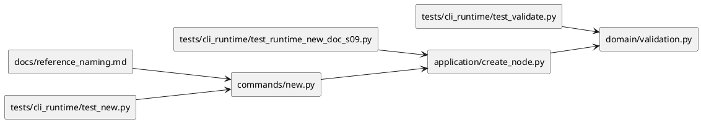
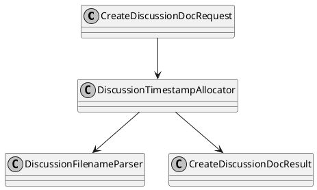

# iss-00036 Timestamp Based Discussion and ADR Naming — 設計（HOW）

## 目的・制約
- 目的:
  - `discussions/` 配下の discussion doc family（`adr / disc / research / note`）を shared sequential naming から timestamp-prefix naming へ置き換える。
  - `new doc` / validate / `doctor` / 後続 issue の ADR scan が同じ filename grammar と collision domain を共有できるようにする。
  - pre-contract sequential docs を grandfathered artifact として保持しつつ、新規生成 contract を deterministic にする。
- MUST / MUST NOT:
  - MUST:
    - 新規生成 basename を `<ts>-<kind>-<slug>.md` に統一する。
    - `ts` は UTC `yyyymmddthhmmssz`、`kind` は `adr|disc|research|note`、同一 scope / 同一秒では discussion doc family 全体で `-<nn>-` を管理する。
    - 生成先は全 type で各 scope の `discussions/` を維持する。
    - validate / `doctor` は timestamp grammar を基準に新規 contract の malformed / duplicate naming を同じ分類境界で扱う。
    - create lock 後に malformed / duplicate discussion filename が観測される corruption / race regression でも、silent fallback せず explicit failure / remediation を返す。
  - MUST NOT:
    - 新規生成で `NNN-type-slug.md` を使わない。
    - `adr / disc` と `research / note` を別 naming family に分断しない。
    - grandfathered sequential docs を自動 rename しない。
- 非交渉制約:
  - `src/spec_dock/assets/spec_dock/...` を source of truth とし、provider 側実装を先に変更する。
  - 原本配置は全 type で `discussions/` に固定し、ADR 集約のために `adr` だけ別の原本パスを持たせない。
  - timestamp は UTC 秒精度で固定し、ミリ秒やローカルタイムへ拡張しない。
  - `t` / `z` は lowercase 固定とする。
- 前提:
  - `iss-00034` の GitHub mandatory node creation contract は先行済みである。
  - epic/initiative で single repo / ADR mirror only / rebuildable workspace 方針は固定済みである。
  - `research / note` も discussion doc family に含めて timestamp-prefix naming へ統一する、という利用者判断が確定している。

## 既存実装 / 規約の理解
- 参照した実装 / docs:
  - `src/spec_dock/assets/spec_dock/scripts/spec_dock_runtime/commands/new.py`
  - `src/spec_dock/assets/spec_dock/scripts/spec_dock_runtime/application/contracts.py`
  - `src/spec_dock/assets/spec_dock/scripts/spec_dock_runtime/application/create_node.py`
  - `src/spec_dock/assets/spec_dock/scripts/spec_dock_runtime/application/doctor.py`
  - `src/spec_dock/assets/spec_dock/scripts/spec_dock_runtime/domain/validation.py`
  - `src/spec_dock/assets/spec_dock/docs/reference_naming.md`
  - `tests/cli_runtime/test_new.py`
  - `tests/cli_runtime/test_runtime_doctor_s04.py`
  - `tests/cli_runtime/test_runtime_new_doc_s09.py`
  - `tests/cli_runtime/test_validate.py`
- 現状理解:
  - 現在の `new doc` CLI surface は `adr / disc / research / note` の 4 type を正式サポートしている。
  - `application/create_node.py` は `_DISCUSSION_DOC_FILENAME_RE` と `_next_discussion_doc_seq()` により `NNN-type-slug.md` の shared sequence を採番している。
  - `domain/validation.py` も同じ sequential regex を使って duplicate sequence を検出している。
  - docs / tests も `001-adr...`, `002-disc...`, `003-research...`, `004-note...` を同一 family の expected behavior としている。
  - active issue requirement と epic requirement は timestamp-prefix grammar を要求しており、現実装と契約がずれている。
  - 採用するパターン:
    - `new doc` / validate で同一の filename grammar / contract を維持し、separate implementation でも drift しないよう tests と parity review で固定する。
    - shared sequence 採番を timestamp allocation helper へ置き換え、same-second collision は same scope / same `ts` の family domain で suffix allocator が吸収し、その suffix 選択は既存 create lock による create critical section 内で行う。
    - grandfathered sequential docs は「既存 artifact としては許容するが、新規生成 source には使わない」fail-closed / no-migrate パターンを採る。
    - malformed / duplicate discussion filename は validate の検出結果を `doctor` の remediation guidance に写像し、create-side post-lock guard と同じ contract で扱う。
- 採用しないもの:
  - `adr` だけ timestamp、他 type は連番、の split contract。
  - 既存 sequential docs の一括 rename / 自動移行。
  - 原本 path を `adrs/` などへ分岐させること。
  - DB/manifest のような別 index 追加。
- 影響範囲:
  - runtime new-doc create path
  - validation
  - doctor guidance mapping
  - naming reference docs / workflow docs / rules docs
  - runtime tests / update parity tests
  - checked-in dogfooding docs mirror

## 採用方針 / トレードオフ
- 論点:
  - timestamp contract を `adr / disc` のみに限定するか、discussion doc family 全体へ広げるか。
  - grandfathered sequential docs を validate で即エラーにするか、legacy として読み飛ばすか。
  - same-second collision を失敗にするか、suffix で吸収するか。
- 選択肢:
  - Option A:
    - `adr / disc` のみ timestamp 化し、`research / note` は旧連番のまま維持する。
  - Option B:
    - `adr / disc / research / note` の 4 type 全体を timestamp-prefix naming に統一する。
  - Option C:
    - same-second collision は fail-fast とし、利用者に再試行させる。
- 決定:
  - Option B を採用する。
  - same-second collision の扱いは suffix 吸収を採用し、Option C は採らない。
  - grandfathered sequential docs は validate 上の legacy artifact として許容し、新規 timestamp contract の collision source には含めない。
  - 理由:
    - shipped product の現行 abstraction は 4 type を同一 family として公開しており、split contract は product complexity を上げる。
    - timestamp-prefix は merge collision 回避と時系列整列を同時に満たす。
    - same-second collision を fail-fast にすると、timestamp contract 導入後も並列作業の friction が残る。

## インターフェース契約
- API / function / protocol / data boundary:
  - CLI contract:
    - `new doc <type>` の type surface は `adr|disc|research|note` のまま維持する。
    - explicit sequence override は追加しない。
  - filename contract:
    - standard basename:
      - `<ts>-<kind>-<slug>.md`
    - collision basename:
      - `<ts>-<nn>-<kind>-<slug>.md`
    - filename stem:
      - standard: `<ts>-<kind>-<slug>`
      - collision: `<ts>-<nn>-<kind>-<slug>`
    - `ts = yyyymmddthhmmssz`
    - `nn = 01..99`
    - `kind in {adr, disc, research, note}`
  - allocation contract:
    - `ts` は `ports.clock.today()` ではなく現在 UTC datetime を source とする helper で生成する。
    - collision domain は「同一 scope / 同一 `ts` の discussion doc family 全体」とする。
    - allocation は既存の同一 scope create lock / create critical section の内側で行い、truly parallel な invocation も suffix 選択前に直列化する。
    - その domain の 1 件目だけ standard basename を採用し、2 件目以降は kind / slug に関係なく未使用の最小 `nn` を採用する。
    - `01..99` が使い切られた場合は explicit failure にする。
    - logical doc identity (`doc_id`) は standard form では `<ts>-<kind>`、collision form では `<ts>-<nn>-<kind>` として扱い、suffix の有無を曖昧化しない。
    - filename stem は basename から `.md` を除いた値であり、slug を保持する。
    - basename identity は `standard form` なら `(ts, kind, slug)`、`collision form` なら `(ts, nn, kind, slug)` として扱う。
    - `doc_id` は filename stem と別物の slugless identity とし、standard form では `<ts>-<kind>`、collision form では `<ts>-<nn>-<kind>` を採る。
    - template placeholder (`<ADR_ID>`, `<DISC_ID>`, `<RESEARCH_ID>`, `<NOTE_ID>`) へは新 `doc_id` をそのまま埋め込む。
  - validation contract:
    - timestamp grammar に一致する files は新 contract 対象として validate する。
    - grandfathered sequential files (`NNN-type-slug.md`) は legacy として存在を許容するが、新 contract の duplicate error source にしない。
    - discussion doc filename candidate は `*.md` かつ basename 先頭が timestamp-like token、legacy sequential token、または `adr|disc|research|note` token を含むものとして判定し、その intent を持つ malformed filename は explicit error にする。
    - 具体的には、timestamp shape/case 不正、malformed suffix、`<ts>-<kind>` / `<ts>-<nn>-<kind>` までは discussion contract を狙っているが slug/区切りが壊れている filename は malformed とみなす。
    - unrelated nonconforming files (`rules.md` など、discussion doc candidate に当たらないもの) は従来どおり scan 対象外とする。
    - 同一 scope / 同一 `ts` では suffix なし file は最大 1 件までとし、追加 file は unique な `nn` を持たなければならない。
    - standard form と collision form を含めて、同一 basename identity または同一 `doc_id` slot を複数 file が占有する状態は duplicate として reject する。
  - doctor contract:
    - `doctor` は validation と同じ discussion filename classifier を前提に、malformed / duplicate discussion filename を user-facing remediation message へ写像する。
    - remediation は grandfathered legacy、malformed timestamp-intent、duplicate timestamp slot / suffix slot、unrelated file ignore の境界を validate とずらさない。
  - post-lock corruption guard contract:
    - create lock 取得後の rescan で malformed / duplicate discussion filename が見つかった場合、allocator はその file を silent に飛ばして suffix を進めず、corruption / race regression として explicit failure にする。
    - この guard は validate / `doctor` が説明する malformed / duplicate contract と同じ naming boundary を使い、create だけ fail-open にならないようにする。
  - scope/storage contract:
    - `adr / disc / research / note` の原本はすべて対象 node の `discussions/` に書き込む。
    - 後続 issue の top-level ADR mirror は `adr` files を `discussions/` から探索する前提に留め、本 issue で mirror 挙動は変更しない。

### UML（推奨: module / dependency）

## クラス / インターフェース詳細設計（必要時）
- Class / Interface:
  - `CreateDiscussionDocRequest`
- responsibility:
  - doc type / scope / title / slug を受け取り、discussion doc create use-case の入力境界を固定する。
- collaboration:
  - `commands/new.py` から組み立てられ、`create_node.py::plan_discussion_doc()` へ渡される。

- Class / Interface:
  - discussion filename allocator helper（新設）
- responsibility:
  - UTC timestamp basename の生成、same scope / same `ts` domain に対する same-second collision suffix の割当、create lock 内での deterministic suffix 選択、overflow/failure message を担当する。
- collaboration:
  - `plan_discussion_doc()` が使用し、`validation.py` と同じ filename grammar / slot contract に従う。

- Class / Interface:
  - discussion filename validation logic（validation 側）
- responsibility:
  - standard timestamp form / collision suffix form / legacy sequential form / malformed discussion candidate / unrelated file の判別と、filename stem / `doc_id` の分離を提供する。
  - malformed / duplicate discussion filename finding を `doctor` remediation と create-side corruption guard が共有できる粒度で安定化する。
- collaboration:
  - `create_node.py` の allocator、`doctor.py` の remediation mapping と grammar-aligned に保ち、共通 parser の有無ではなく contract parity と regression tests で drift を防ぐ。

- Class / Interface:
  - discussion filename doctor guidance mapping
- responsibility:
  - validation finding を user-facing remediation message に変換し、malformed / duplicate discussion filename の修復導線を CLI 上で提示する。
- collaboration:
  - `application/doctor.py` が使用し、`validation.py` の classifier と `create_node.py` の post-lock corruption guard が返す failure reason に整合する。

### UML（任意: class / interface）

## 変更計画
- Add:
  - discussion timestamp allocator helper
  - same-second suffix allocation logic
  - timestamp grammar validation helpers / tests
  - doctor guidance mapping for malformed / duplicate discussion filenames
- Modify:
  - `commands/new.py` の help / contract wording（連番前提の説明除去）
  - `application/create_node.py` の regex / plan / create result generation
  - `application/doctor.py` の remediation guidance
  - `domain/validation.py` の discussion filename scan logic
  - `docs/reference_naming.md` と関連 workflow/rules docs
  - `tests/cli_runtime/test_new.py`
  - `tests/cli_runtime/test_runtime_doctor_s04.py`
  - `tests/cli_runtime/test_runtime_new_doc_s09.py`
  - `tests/cli_runtime/test_validate.py`
  - 必要に応じて `tests/test_init_update.py` の update parity evidence
- Delete:
  - new contract 上の shared sequential allocation / duplicate-sequence-only 前提
- Move/Rename:
  - なし
- Read only:
  - `spec-dock/adrs/` mirror behavior本体
  - legacy pre-contract discussion files（自動 rename しない）

## 要件 → 設計マッピング
- AC-001 -> timestamp allocator + 4 type 共通 grammar + `discussions/` write path
- AC-002 -> same-second suffix allocator (`01..99`)
- AC-003 -> legacy sequential grandfathering + validate/doctor remediation boundary + post-lock corruption guard
- AC-004 -> `discussions/` as SoR + ADR-only mirror scan assumptionの明文化
- EC-001 -> slug normalization / kebab-case validation
- EC-002 -> legacy/nonconforming file classification
- EC-003 -> cross-type same-second collision tests
- EC-004 -> suffix exhaustion explicit failure
- constraint -> UTC lowercase timestamp, no sequential fallback, no auto-migration

## テスト戦略
- Unit:
  - timestamp formatter
  - same-second suffix allocator（cross-type shared domain / create lock 下の deterministic selection）
  - filename parser（timestamp standard / timestamp collision / legacy sequential / malformed candidate / unrelated nonconforming）
  - suffix exhaustion failure
- Integration:
  - `new doc adr|disc|research|note` が timestamp-prefix basename を生成する
  - same scope / same `ts` の 2 件目以降で `-01-`, `-02-` が付き、parallel create は create lock により直列化されたうえで同じ rule に従う
  - suffix exhaustion で explicit failure になる
  - legacy sequential file があっても新規 timestamp allocation は連番へ引きずられない
  - `discussions/` 以外へ書かれない
  - validate が timestamp duplicate / malformed timestamp-intent filename を検出し、unrelated file は無視する
  - `doctor` が malformed / duplicate discussion filename に validate-aligned remediation を返す
  - create lock 後に malformed / duplicate discussion filename が混入した corruption path を explicit failure として止める
- E2E / manual:
  - provider docs と dogfooding docs の naming reference parity
  - `active issue` 上で generated basename / filename stem / `doc_id` の対応を目視確認
- migration / rollback / feature flag if needed:
  - feature flag は導入しない。
  - rollback は issue 単位で戻すが、`adr/disc` だけ timestamp のような split interim state は残さない。

## 要件 / 例外 -> verification mapping
- AC-001 -> `tests/cli_runtime/test_new.py`, `tests/cli_runtime/test_runtime_new_doc_s09.py`
- AC-002 -> same-second collision regression tests（CLI/application）
- AC-003 -> `tests/cli_runtime/test_validate.py` + legacy grandfathering tests
- AC-003 -> `tests/cli_runtime/test_validate.py`, `tests/cli_runtime/test_runtime_doctor_s04.py`, post-lock corruption regressions
- AC-004 -> docs/spec diff + path assertions
- EC-001 -> invalid slug tests
- EC-002 -> legacy/nonconforming classification tests
- EC-003 -> cross-type same-second collision tests
- EC-004 -> suffix exhaustion tests
- constraint -> docs parity + update parity checks

## リスク / 移行 / ロールバック（必要時）
- 主リスク:
  - docs / tests / validation が現状すべて連番前提なので、変更面が比較的広い。
  - grandfathered sequential files の扱いを曖昧にすると validate と sync scan の将来契約が再度ずれる。
  - same-second collision tests は clock seam が弱いと flaky になりうる。
  - malformed candidate の判定規則が曖昧だと validate 実装差異が出やすい。
  - `doctor` の remediation wording や post-lock corruption guard が validation とずれると、user-facing diagnosis と create-side failure reason が乖離する。
- 移行:
  - pre-contract sequential docs は既存 artifact として残す。
  - 新規作成だけ timestamp-prefix contract へ切り替える。
  - ADR mirror scan の本実装は `iss-00035` で扱い、本 issue では scan 前提の grammar / filename contract を揃えるところまでに留める。
- ロールバック:
  - issue 単位で差分を戻す。
  - 4 type の naming contract を途中で split した状態へは戻さない。

## 未確定事項
- なし:
  - issue 実装に必要な naming boundary は確定済み
