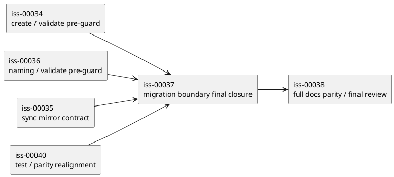
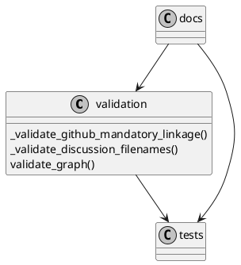

# iss-00037 Migration Guardrails and Validation Hardening — 設計（HOW）

## 目的・制約
- 目的:
  - epic-00033 の migration boundary 3 条項を、reviewer が clause-by-clause で再判定できる evidence contract へ束ねる。
  - `iss-00034` / `iss-00036` / `iss-00035` / `iss-00040` で既に入っている contract を前提に、docs / validate / migration tests の抜け漏れだけを閉じる。
- MUST / MUST NOT:
  - MUST:
    - clause-1 / clause-2 / clause-3 を、それぞれ docs / validate / tests / command evidence に対応づける。
    - 既存 issue の成果を引用可能な形で整理し、`iss-00037` 自体は final closure owner としての責務に集中する。
    - true runtime defect が見つかった場合は、migration boundary hardening と defect fix を混ぜずに stop / escalate する。
  - MUST NOT:
    - old workspace 自動移行 tooling を追加しない。
    - `iss-00038` の full docs parity、`iss-00040` の stale-contract cluster realignment を再度抱え込まない。
    - clause evidence を narrative だけで済ませない。
- 非交渉制約:
  - provider-side source of truth は `src/spec_dock/assets/spec_dock/...` にある。
  - minimal boundary docs diff までを `iss-00037` の docs impact とし、full parity refresh は `iss-00038` に残す。
  - validation / warning / fail-fast の境界を曖昧にしない。
- 前提:
  - `iss-00034` は GitHub mandatory create / validate preflight 境界を実装済み。
  - `iss-00036` は timestamp naming と legacy grandfathering を validate に反映済み。
  - `iss-00035` は ADR mirror contract を実装済み。
  - `iss-00040` は stale tests / dogfooding parity drift の cluster を current contract に再整列済み。

## 既存実装 / 規約の理解
- 参照した実装 / docs:
  - `spec-dock/active/epic/requirement.md`
  - `spec-dock/active/epic/design.md`
  - `spec-dock/active/epic/plan.md`
  - `spec-dock/initiatives/init-local-00003-architecture-maintenance-and-hardening/epics/epic-00033-github-backed-identity-and-adr-mirror-workflow/issues/iss-00034-github-mandatory-node-creation-contract/report.md`
  - `spec-dock/initiatives/init-local-00003-architecture-maintenance-and-hardening/epics/epic-00033-github-backed-identity-and-adr-mirror-workflow/issues/iss-00035-sync-adr-symlink-mirror/report.md`
  - `spec-dock/initiatives/init-local-00003-architecture-maintenance-and-hardening/epics/epic-00033-github-backed-identity-and-adr-mirror-workflow/issues/iss-00036-timestamp-based-discussion-and-adr-naming/report.md`
  - `spec-dock/initiatives/init-local-00003-architecture-maintenance-and-hardening/epics/epic-00033-github-backed-identity-and-adr-mirror-workflow/issues/iss-00040-sync-fail-closed-hardening-and-test-realignment/report.md`
  - `spec-dock/docs/workflow_issue.md`
  - `spec-dock/docs/reference_github.md`
  - `spec-dock/docs/reference_naming.md`
  - `src/spec_dock/assets/spec_dock/docs/reference_github.md`
  - `src/spec_dock/assets/spec_dock/docs/reference_naming.md`
  - `src/spec_dock/assets/spec_dock/scripts/spec_dock_runtime/domain/validation.py`
  - `tests/cli_runtime/test_validate.py`
- 現状理解:
  - clause-1:
    - local-only create 非サポートと legacy sequential grandfathering は docs / validation にすでに入っている。
    - ただし reviewer が「migration boundary の clause-1 evidence」として追う導線はまだ `iss-00037` 側に束ねられていない。
  - clause-2:
    - `iss-00034` で old workspace 自動移行非保証と fail-fast create / validate 境界が入っている。
    - 一方で `spec-dock update` を含む user-facing wording と validate evidence を migration boundary の観点で横断整理した owner は未確立である。
  - clause-3:
    - validate は local-only / legacy unscoped / malformed discussion filename を non-zero で reject し、sync も malformed partial scope を preflight で止める。
    - ただし reviewer が「無断破壊を目的にしない」を warning / fail-fast / no-write の観測点として再確認しやすい mapping が不足している。
  - `iss-00040` で stale tests と dogfooding parity drift は current contract へ揃っており、本 issue はそれを再実装する必要はない。
- 採用するパターン:
  - implementation owner ではなく integration owner として、既存 contract を clause evidence へ再配置する。
  - docs / validation / tests / command evidence を 1 つの verification matrix へマッピングする。
  - gap があれば minimal diff で補い、既存 issue の ownership を壊さない。
- 採用しないもの:
  - migration 専用の新 runtime mode や feature flag の追加。
  - old workspace を mutate して self-heal させる remediation。
  - `iss-00038` や `iss-00040` の close-out scope をこの issue に吸収すること。
- 影響範囲:
  - active issue docs
  - minimal boundary docs diff が必要な場合の reference docs
  - validate / sync preflight regression tests
  - report / review evidence 整理

## 採用方針 / トレードオフ
- 論点:
  - migration boundary の「最終 closure」を、新規 runtime 実装で閉じるか、既存実装の evidence mapping で閉じるか。
  - clause-2 / clause-3 の user-facing wording を docs 中心で閉じるか、tests 中心で閉じるか。
- 選択肢:
  - Option A:
    - migration boundary 専用の runtime command / state marker を追加して証跡化する。
  - Option B:
    - 既存 create / validate / sync / docs を正本とし、必要最小差分で evidence mapping を完成させる。
- 決定:
  - Option B を採る。
  - 理由:
    - epic requirement は old workspace 自動移行を非目標としており、新機能追加より境界の明文化が優先である。
    - 現在の repo には既に clause ごとの部分実装が存在し、`iss-00037` の責務はそれらを reviewable contract に束ねることだからである。

## インターフェース契約
- API / function / protocol / data boundary:
  - docs contract:
    - clause-1:
      - forced backward compatibility を維持しないこと
      - legacy sequential docs は grandfathered だが新規採番・自動 rename はしないこと
    - clause-2:
      - `spec-dock update` による in-place 自動移行を保証しないこと
      - old workspace は rebuildable であり、current contract 不一致は fail-fast / reject しうること
    - clause-3:
      - checked-in data の無断書き換えを目的とせず、legacy mismatch は warning / error / reject で観測させること
  - validation contract:
    - `domain/validation.py` は mandatory GitHub linkage、repo scope pairing、discussion filename grammar を non-zero validation error として返す。
    - `sync` preflight は malformed partial scope 等を force でも hard-stop し、曖昧な repair path を取らない。
  - evidence contract:
    - clause-1 は naming / create / validation docs + validate regressions
    - clause-2 は GitHub mandatory docs + create/validate reject regressions + `update` 非保証の docs wording
    - clause-3 は validate / sync preflight / no-write or no-auto-repair regressions
  - ownership contract:
    - `iss-00037` は final closure owner であり、full docs parity finalization は `iss-00038`、stale-contract cluster realignment は `iss-00040` が持つ。

### UML（推奨: module / dependency）

## クラス / インターフェース詳細設計（必要時）
- Class / Interface:
  - `domain.validation._validate_github_mandatory_linkage`
- responsibility:
  - initiative / epic / issue の GitHub mandatory linkage と repo scope pairing を fail-fast にする。
- collaboration:
  - create / validate / sync preflight で共通に参照され、clause-2 / clause-3 の objective evidence になる。

- Class / Interface:
  - `domain.validation._validate_discussion_filenames`
- responsibility:
  - timestamp naming / legacy grandfathering / malformed candidate reject を一貫して扱う。
- collaboration:
  - clause-1 evidence の validate 側の正本になる。

### UML（任意: class / interface）

## 変更計画
- Add:
  - clause-by-clause verification mapping
  - 必要なら migration boundary 専用の targeted regression
- Modify:
  - `spec-dock/active/issue/requirement.md`
  - `spec-dock/active/issue/design.md`
  - `spec-dock/active/issue/plan.md`
  - minimal boundary docs diff が必要な場合の reference docs
  - `tests/cli_runtime/test_validate.py`
  - 必要に応じて `tests/cli_runtime/test_sync.py` / related validate-preflight regressions
- Delete:
  - なし
- Move/Rename:
  - なし
- Read only:
  - `iss-00034` / `iss-00035` / `iss-00036` / `iss-00040` の close evidence
  - `iss-00038` の ownership boundary

## 要件 → 設計マッピング
- AC-001 -> clause-1 を naming / validate / boundary docs に結びつける verification matrix
- AC-002 -> clause-2 を GitHub mandatory docs / create+validate reject evidence / update 非保証 wording に結びつける
- AC-003 -> clause-3 を validate / sync preflight / no-auto-repair evidence に結びつける
- AC-004 -> issue close 時に clause-1/2/3 の owner と evidence set を reportable にする
- EC-001 -> docs / tests / validate の scope outside ambiguity を残さない
- EC-002 -> maintainer が `update` に自動移行を期待しても docs/tests で非保証を確認できる
- constraint -> defect fix と migration boundary hardening を混ぜない stop / escalate rule

## テスト戦略
- Unit:
  - 新規 unit を増やすより、既存 validation / sync preflight regressions の意味を migration boundary 観点で整列させる。
- Integration:
  - 必要に応じて `python -m unittest tests.cli_runtime.test_new tests.cli_runtime.test_runtime_new_s08 -v`
  - `python -m unittest tests.cli_runtime.test_validate -v`
  - 必要に応じて `python -m unittest tests.cli_runtime.test_sync -v`
- E2E / manual:
  - `./spec-dock/scripts/spec-dock validate`
  - docs diff review（provider + dogfooding の minimal boundary docs）
- migration / rollback / feature flag if needed:
  - feature flag は導入しない。
  - rollback は issue 単位で戻すが、旧 contract 互換モードは作らない。

## 要件 / 例外 -> verification mapping
- AC-001 -> legacy sequential grandfathering / malformed discussion candidate reject / docs wording
- AC-002 -> local-only reject / legacy unscoped linkage reject / `origin` fail-closed wording / `update` 非保証の docs wording
- AC-003 -> sync preflight hard-stop / no-write-no-auto-repair expectations / validate non-zero evidence
- AC-004 -> issue report と final review で clause ownership と evidence set を参照可能にする
- EC-001 -> minimal docs diff と review notes で `iss-00038` / `iss-00040` との責務分離を明記
- EC-002 -> reference docs と validate command evidence
- constraint -> stop / escalate rule を plan に固定

## リスク / 移行 / ロールバック（必要時）
- risk:
  - evidence mapping だけで閉じるつもりが、実際には未実装 gap を見落とす可能性がある。
  - `iss-00038` / `iss-00040` との ownership boundary が曖昧だと、close evidence が重複する。
  - `update` wording が散在すると clause-2 の非保証が reviewer に伝わりにくい。
- migration:
  - old workspace を mutate して救済するのではなく、non-support boundary を docs / validate / tests で観測可能にする。
- rollback:
  - docs/tests の issue diff を戻す。
  - partial rollback で self-healing path を混入させない。

## 未確定事項
- なし:
  - current scope は final closure owner としての evidence hardening に限定する
