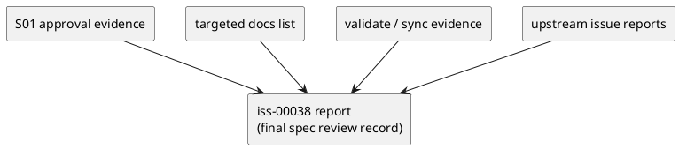

# iss-00038 Docs Dogfooding Parity and Final Regression Gate — 設計（HOW）

## 目的・制約
- 目的:
  - `iss-00038` を「docs parity + final spec review record」の close-out issue として再固定する。
  - current repo state 上で、docs drift の有無、`validate` / `sync` の成立、upstream evidence の参照可能性をまとめて確認できる execution contract を作る。
  - epic `E-RQ-005` / `E-AC-005 docs/spec-review slice` と 1:1 に対応する close-out path を固定する。
  - epic-level branch diff review で要求される status reconciliation、dependency graph alignment、commit-backed audit trail を追加 corrective scope として取り込む。
  - latest fresh review で露出した S09 fresh final rereview record 欠落、`epic-00033/report.md` の `#33` OPEN/CLOSED authority ambiguity、`iss-00040/report.md` の provisional upstream evidence ambiguity を narrow corrective scope として扱う。
- MUST / MUST NOT:
  - MUST:
    - provider-side と dogfooding 側の targeted docs list を同時に扱う。
    - `iss-00040` の final regression evidence を参照し、`iss-00038` 自身では再実行 ownership を持たないことを明記する。
    - final spec review record を reviewer が traceable に辿れる形式で残す。
    - S01 の spec review pass は、観測コマンドまたは観測 artifact と reviewer verdict を `report.md` に残してから S02 へ進める execution contract とする。
    - final close-out 後の `report.md` は、front matter 状態値とコミット記録が最終状態に正規化された監査可能な artifact とする。
    - epic close を宣言する場合は、issue report / epic report / generated state / deps graph の authority reconciliation を伴うことを execution contract に含める。
    - S09 execution evidence と fresh final rereview closure を別 artifact として扱い、S10 upstream evidence normalization と S11 fresh final rereview closure を close-out 必須経路として固定し、後者は normalized upstream evidence を参照した committed record にする。
    - `epic-00033/report.md` と `iss-00040/report.md` を触る場合は report-artifact normalization のみとし、implementation/test rerun は scope 外に固定する。
    - `iss-00040/report.md` を触る場合は authoritative citation layer / front matter / final summary note だけを正規化対象とし、historical session-log の `コミット: なし` entry が時点事実なら rewrite しない。
  - MUST NOT:
    - runtime / test realignment を再度設計対象に戻さない。
    - docs parity が no-op の場合でも、6 ファイル個別の current-contract verification evidence を省略しない。
    - targeted docs list 外で見つかった stale old-contract assumption を、その場で S02 の修正対象へ拡張しない。
    - report に「未コミット」や `draft | approved` のような暫定表記を最終状態のまま残さない。
    - branch diff review を committed delta 前提で行うのに、working-tree-only evidence を最終 corrective artifact に残さない。
- 非交渉制約:
  - final verdict は `pass`。
  - `validate` / `sync` は exit=0。
  - issue 間 ownership conflict を再発させない。
- 前提:
  - `iss-00040` report に stale-contract / final regression / parity recovery の evidence がある。
  - targeted docs list は現時点で provider/dogfooding 間の内容差分がない。

## 既存実装 / 規約の理解
- 参照した実装 / docs:
  - `spec-dock/active/epic/requirement.md`
  - `spec-dock/active/epic/design.md`
  - `spec-dock/active/epic/plan.md`
  - `spec-dock/active/epic/report.md`
  - `spec-dock/initiatives/init-local-00003-architecture-maintenance-and-hardening/epics/epic-00033-github-backed-identity-and-adr-mirror-workflow/issues/iss-00040-sync-fail-closed-hardening-and-test-realignment/requirement.md`
  - `spec-dock/initiatives/init-local-00003-architecture-maintenance-and-hardening/epics/epic-00033-github-backed-identity-and-adr-mirror-workflow/issues/iss-00040-sync-fail-closed-hardening-and-test-realignment/design.md`
  - `spec-dock/initiatives/init-local-00003-architecture-maintenance-and-hardening/epics/epic-00033-github-backed-identity-and-adr-mirror-workflow/issues/iss-00040-sync-fail-closed-hardening-and-test-realignment/plan.md`
  - `spec-dock/initiatives/init-local-00003-architecture-maintenance-and-hardening/epics/epic-00033-github-backed-identity-and-adr-mirror-workflow/issues/iss-00040-sync-fail-closed-hardening-and-test-realignment/report.md`
  - `src/spec_dock/assets/spec_dock/docs/reference_github.md`
  - `src/spec_dock/assets/spec_dock/docs/reference_naming.md`
  - `src/spec_dock/assets/spec_dock/docs/reference_sync.md`
  - `spec-dock/docs/reference_github.md`
  - `spec-dock/docs/reference_naming.md`
  - `spec-dock/docs/reference_sync.md`
  - `spec-dock/dashboard.md`
  - `spec-dock/.agent/index-all.json`
  - `spec-dock/.agent/index.json`
  - `spec-dock/initiatives/init-local-00003-architecture-maintenance-and-hardening/epics/epic-00033-github-backed-identity-and-adr-mirror-workflow/issues/iss-00038-docs-dogfooding-parity-and-final-regression-gate/discussions/20260330t174500z-disc-s09-final-rereview-record-closure-analysis.md`
  - `spec-dock/initiatives/init-local-00003-architecture-maintenance-and-hardening/epics/epic-00033-github-backed-identity-and-adr-mirror-workflow/issues/iss-00038-docs-dogfooding-parity-and-final-regression-gate/discussions/20260330t174600z-disc-epic-report-33-open-closed-authority-mismatch-analysis.md`
  - `spec-dock/initiatives/init-local-00003-architecture-maintenance-and-hardening/epics/epic-00033-github-backed-identity-and-adr-mirror-workflow/issues/iss-00038-docs-dogfooding-parity-and-final-regression-gate/discussions/20260330t174700z-disc-upstream-evidence-normalization-for-iss-00040-report-analysis.md`
- 現状理解:
  - epic report と generated state の両方で、残件は `iss-00038` のみと観測できる。
  - epic plan はすでに `iss-00038` の残責務を docs close-out と final spec review record のみに狭めている。
  - targeted docs list は current contract を反映済みで、少なくとも現時点の provider/dogfooding 間には内容差分がない。
  - ただし docs parity no-op だけでは close-out 不十分であり、6 ファイル個別に old local-only / sequential / index assumption 不在を示す current-contract verification evidence が必要である。
  - `iss-00040` が担当した regression/parity 系 suite は current snapshot でも pass しており、`iss-00038` が再実行 ownership を持たない前提を裏づけている。
  - S07 の generated deps/status verification では `spec-dock/.agent/index-all.json` が authority であり、prerequisite edge の証拠は top-level `deps.issue_edges` で読む。per-node `nodes.<id>.deps` は readiness projection なので closed issue の prerequisite edge を保持しない場合があり、`spec-dock/dashboard.md` が `todo_total: 0` を返す局面で active-only projection の `spec-dock/.agent/index.json` / `spec-dock/.agent/deps-issues.json` が空でも contract violation ではない。
  - 一部 upstream issue report には過去の reviewer コメントが残っていても、close status の正本は generated state と epic report にある。
  - したがって、この issue の主要設計論点は「どの evidence を最終 close-out 記録として束ねるか」であり、runtime behavior をどう変えるかではない。
  - acceptance review の結果、close-out record 自体の整合性も verification 対象であると分かったため、report artifact の最終正規化を design scope に含める。
  - epic-level review の結果、status authority と deps graph も close-out artifact の一部であり、issue report だけ整っていても epic completion は主張できないことが分かった。
  - latest fresh review の結果、S09 execution evidence はあるが reviewer / verdict / commit-backed final rereview record が欠けており、epic report の `#33` state と `iss-00040/report.md` の provisional marker が rereview input を曖昧にしている。
- 採用するパターン:
  - docs verification first:
    - targeted docs list を current contract 観点で 6 ファイル個別にレビューし、parity 結果と old assumption 不在確認を evidence 化した上で、必要時のみ両側更新する。
  - baseline approval first:
    - S01 では issue docs diff と non-overlap 根拠を観測し、その承認記録が `report.md` に残るまで S02 へ進まない。
  - command evidence:
    - `validate` / `sync` を current state の close-out check として扱う。
  - final review record aggregation:
    - upstream issue reports と current issue evidence を report ベースで束ねる。
  - final artifact normalization:
    - final spec review pass 後に、`report.md` front matter と S04 コミット記録を確定状態へ揃える。
  - dependency graph alignment:
    - `iss-00040` を evidence prerequisite として `iss-00038/deps.json` と generated deps graph に追加し、ownership 再取得ではないことを保つ。
  - status reconciliation:
    - `approved` と lifecycle `closed` を区別し、GitHub issue state -> generated state -> epic report -> issue report の authority order が揃ってから epic completion を宣言する。
  - commit-backed audit trail:
    - branch-diff review に使う corrective doc update は actual commit から追跡できる状態にし、既存 S06 chronology は append-only で保持する。
  - upstream evidence normalization:
    - fresh final rereview 前に、`epic-00033/report.md` の `#33` authority note と `iss-00040/report.md` の provisional marker を最小差分で正規化する。
    - `iss-00040/report.md` では authoritative citation layer / front matter / final summary note だけを整え、historical session-log chronology と time-scoped `コミット: なし` facts は保持する。
  - final committed rereview closure:
    - S09 execution evidence の後に、normalized upstream evidence を参照する fresh final rereview record を committed history に残し、normalized artifact set に対する epic-level rereview を再度 `pass` させて close judgement を確定する。
- 採用しないもの:
  - `iss-00040` の regression evidence を `iss-00038` で再取得すること。
  - full suite rerun を `iss-00038` の close 条件として再導入すること。
  - provider docs だけを直して dogfooding 側を同期しないこと。
  - generated state / GitHub が open のまま、epic report だけを先に close 相当に書き換えること。
- 影響範囲:
  - `spec-dock/active/issue/requirement.md`
  - `spec-dock/active/issue/design.md`
  - `spec-dock/active/issue/plan.md`
  - `spec-dock/initiatives/init-local-00003-architecture-maintenance-and-hardening/epics/epic-00033-github-backed-identity-and-adr-mirror-workflow/issues/iss-00038-docs-dogfooding-parity-and-final-regression-gate/discussions/20260330t174500z-disc-s09-final-rereview-record-closure-analysis.md`
  - `spec-dock/initiatives/init-local-00003-architecture-maintenance-and-hardening/epics/epic-00033-github-backed-identity-and-adr-mirror-workflow/issues/iss-00038-docs-dogfooding-parity-and-final-regression-gate/discussions/20260330t174600z-disc-epic-report-33-open-closed-authority-mismatch-analysis.md`
  - `spec-dock/initiatives/init-local-00003-architecture-maintenance-and-hardening/epics/epic-00033-github-backed-identity-and-adr-mirror-workflow/issues/iss-00038-docs-dogfooding-parity-and-final-regression-gate/discussions/20260330t174700z-disc-upstream-evidence-normalization-for-iss-00040-report-analysis.md`
  - 実行時は `spec-dock/active/issue/report.md`
  - 実行時に必要なら `spec-dock/active/epic/report.md`
  - 実行時に必要なら `iss-00040/report.md`
  - 必要時のみ targeted docs list 6 ファイル

## 採用方針 / トレードオフ
- 論点:
  - docs parity が no-op のときに、issue の価値を docs 修正ではなく review record aggregation に寄せてよいか。
  - final spec review record を新規 discussion に分けるか、issue report に集約するか。
- 選択肢:
  - Option A:
    - final review 専用の新規 discussion doc を作り、evidence index を別ファイル化する。
  - Option B:
    - issue report を final spec review record の正本とし、requirement/design/plan ではその必要項目と execution path を固定する。
- 決定:
  - Option B を採る。
  - 理由:
    - issue workflow 上、close-out evidence と reviewer verdict を report に残す流れと整合する。
    - docs parity が no-op だった場合でも、report に 6 ファイル個別の current-contract verification evidence と step approval 記録を集約できる。
    - `iss-00040` を含む upstream report 参照関係を 1 か所にまとめやすい。

## インターフェース契約
- API / function / protocol / data boundary:
  - baseline approval boundary:
    - input:
      - `spec-dock/active/issue/requirement.md`
      - `spec-dock/active/issue/design.md`
      - `spec-dock/active/issue/plan.md`
      - `iss-00040` report / epic report の non-overlap 根拠
    - output:
      - S01 承認記録（観測コマンドまたは観測 artifact、reviewer、verdict、参照根拠）
  - docs boundary:
    - input:
      - targeted docs list 6 ファイル
    - output:
      - docs diff または no-op parity evidence
      - 6 ファイル個別の current-contract verification evidence
  - command boundary:
    - input:
      - current repo state
    - output:
      - `validate` / `sync` の exit=0 evidence
      - generated state review (`dashboard.md`, `spec-dock/.agent/index-all.json`, active-only projection は存在時のみ補助利用)
  - review boundary:
    - input:
      - `iss-00034` / `iss-00035` / `iss-00036` / `iss-00037` / `iss-00040` / `iss-00038` の issue-level evidence
    - output:
      - final spec review record（verdict / referenced evidence / non-overlap check）
    - source of truth:
      - close status は `spec-dock/.agent/index-all.json` と `spec-dock/active/epic/report.md` を優先する
  - dependency boundary:
    - input:
      - `iss-00038/deps.json`
      - `spec-dock/active/epic/plan.md`
      - `spec-dock/.agent/index-all.json`
      - `spec-dock/.agent/deps-issues.json`（`todo_total: 0` なら空でもよい）
    - output:
      - narrative spec と authoritative generated deps/status view が一致した prerequisite definition
  - report integrity boundary:
    - input:
      - `report.md` front matter
      - S04 close-out 記録
      - actual git history
    - output:
      - final artifact normalization evidence（状態値と commit 記録の整合）
  - status reconciliation boundary:
    - input:
      - GitHub issue state
      - `iss-00038/report.md`
      - `epic-00033/report.md`
      - `spec-dock/.agent/index-all.json`
      - active-only projection（存在する場合）
      - `spec-dock/dashboard.md`
      - `sync --github` 後の issue status
    - output:
      - epic completion を主張できる単一の close-status conclusion
      - S10 後に normalized artifact set で再検証された epic-level rereview verdict
  - escalation boundary:
    - trigger:
      - S02 で targeted docs list 外に stale old-contract assumption を発見する
    - behavior:
      - その場で修正対象を拡張せず、S02 を blocker として停止する
      - `report.md` に発見 path / assumption / scope外である理由 / reviewer への escalation を記録する
    - owner:
      - reviewer judgment または follow-up issue

### UML（推奨: module / dependency）

## クラス / インターフェース詳細設計（必要時）
- Class / Interface:
  - 該当なし
- responsibility:
  - この issue は code surface 追加ではなく docs/evidence aggregation を扱う
- collaboration:
  - epic report と upstream issue reports を参照し、current issue report へ集約する

## 変更計画
- Add:
  - なし
- Modify:
  - `spec-dock/active/issue/requirement.md`
  - `spec-dock/active/issue/design.md`
  - `spec-dock/active/issue/plan.md`
  - 実行時は `spec-dock/active/issue/report.md`
  - `spec-dock/initiatives/.../iss-00038/deps.json`
  - `spec-dock/active/epic/report.md`
  - 必要時のみ targeted docs list 6 ファイル
- Delete:
  - なし
- Move/Rename:
  - なし
- Read only:
  - `epic-00033` requirement / design / plan / report
  - `iss-00040` requirement / design / plan / report
  - `.agent` generated state

## 要件 → 設計マッピング
- AC-001 -> targeted docs list review + parity evidence + 6 ファイル個別 verification evidence で閉じる
  - 補足:
    - parity の有無に関わらず、6 ファイル個別の current-contract verification evidence を必須とする
- AC-002 -> `validate` / `sync` 実行結果と `index-all.json` 正本の generated state review で閉じる
- AC-003 -> report を final spec review record の正本として evidence を集約する
- AC-003 -> report を final spec review record の正本として evidence を集約し、最終状態へ正規化する
- AC-003 -> S09 execution evidence 後に、normalized upstream evidence を参照する fresh final committed rereview closure を要求する
- AC-004 -> branch diff review 上で epic report / deps graph / issue report / generated state の authority reconciliation を確認する
- AC-004 -> `epic-00033/report.md` の `#33` authority note も含めて close-status conclusion を単一化する
- EC-001 -> docs no-op の場合も parity evidence を必須化する
  - 補足:
    - parity evidence 単独では閉じず、6 ファイル個別レビューを report に残す
- EC-002 -> generated state drift を close blocker として扱い、`todo_total: 0` 時の active-only projection 空状態は drift から除外する
- EC-003 -> upstream evidence 欠落時は close-out を停止し reviewer judgment に渡す
- EC-004 -> report artifact の暫定表記が残る場合は close blocker として扱う
- EC-005 -> issue/epic/generated state の close-status mismatch を close blocker として扱う
- EC-006 -> deps graph と narrative prerequisite の mismatch を close blocker として扱い、authoritative generated deps evidence は `index-all.json` の top-level `deps.issue_edges` を優先し、per-node `nodes.<id>.deps` は readiness projection として扱う
- EC-007 -> S09 execution evidence だけで close claim を完了扱いにせず、fresh final rereview record を必須にする
- EC-008 -> upstream report の provisional / conflicting status marker は artifact normalization で閉じ、implementation/test rerun へ拡張しない
- constraint -> `iss-00040` 非重複を設計上で明文化する
- constraint -> targeted docs list 外の stale assumption 発見時は stop/escalate する

## テスト戦略
- Unit:
  - 新規 unit test は持たない
- Integration:
  - `./spec-dock/scripts/spec-dock validate`
  - `./spec-dock/scripts/spec-dock sync`
- E2E / manual:
  - S01 承認観測（issue docs diff と report 上の approval log）
  - targeted docs list の diff / parity review
  - 6 ファイル個別の current-contract verification review
  - `spec-dock/.agent/index-all.json` を正本とした generated state 確認
  - `spec-dock/dashboard.md` と active-only projection の確認（`todo_total: 0` 時の空状態を許容）
  - final spec review record のレビュー
  - `epic-00033/report.md` の `#33` authority note 正規化確認
  - `iss-00040/report.md` の upstream evidence normalization が report-artifact only に留まっていることの確認
  - fresh final rereview record の committed closure 確認
  - `report.md` front matter と S04 コミット記録の最終整合確認
  - `iss-00038/deps.json` と authoritative generated deps/status view の一致確認
  - GitHub issue state / `sync --github` / generated state / `epic-00033/report.md` の close-status reconciliation 確認
- migration / rollback / feature flag if needed:
  - feature flag なし
  - rollback は docs/report 差分を issue 単位で戻す

## 要件 / 例外 -> verification mapping
- AC-001 -> targeted docs diff または no-op parity evidence
  - + 6 ファイル個別の current-contract verification evidence
- AC-002 -> `validate` / `sync` 実行結果 + `index-all.json` 正本の generated state check
- AC-003 -> report 上の final spec review record
- AC-003 -> report 上の final spec review record + front matter / commit record normalization
- AC-003 -> report 上の fresh final rereview record + normalized upstream evidence reference
- AC-004 -> epic report / generated state / deps graph / issue report の branch diff reconciliation
- AC-004 -> epic report 内の `#33` authority note が単一結論へ正規化されていること
- EC-001 -> docs no-op でも parity evidence を report に残す
  - + current-contract verification evidence を report に残す
- EC-002 -> generated state mismatch がないことを確認し、`todo_total: 0` 時の active-only projection 空状態を mismatch と誤判定しない
- EC-003 -> upstream evidence 欠落があれば review blocker として記録する
- EC-004 -> report artifact の暫定表記が残っていないことを確認する
- EC-005 -> authority mismatch があれば epic close blocker として記録する
- EC-006 -> dependency mismatch があれば deps alignment を要求し、authoritative generated deps evidence は `index-all.json` を参照する
- EC-007 -> S09 execution evidence only のままなら final rereview blocker として記録する
- EC-008 -> upstream report ambiguity が残るなら artifact normalization 後に再 review する
- constraint -> non-overlap check を final review record に含める
- constraint -> scope外 stale assumption は blocker + escalation record にする

## リスク / 移行 / ロールバック（必要時）
- risk:
  - docs parity が no-op だと、issue の完了条件が曖昧に見えやすい。
  - `iss-00040` の evidence 参照を誤ると ownership 競合が再発する。
  - `validate` / `sync` は成功しても generated state review を省くと close-out の客観性が弱まる。
  - targeted docs list 外の stale assumption を見つけた際に ad hoc 修正へ流れると、`iss-00040` との境界や issue scope が再び曖昧になる。
  - issue report が `approved/pass` でも epic report / generated state / GitHub が open のままだと、epic close readiness を誤判定しやすい。
  - corrective doc update が commit-backed でないと、branch diff review の監査性が失われる。
  - upstream report normalization を implementation reopen と誤読すると、完了済み issue の ownership conflict が再発する。
- migration:
  - scope の再定義が主であり、user-visible runtime migration はない。
- rollback:
  - issue docs と close-out evidence の差分を戻せばよい。

## 未確定事項
- なし:
  - report を final spec review record の正本にする方針で閉じる
