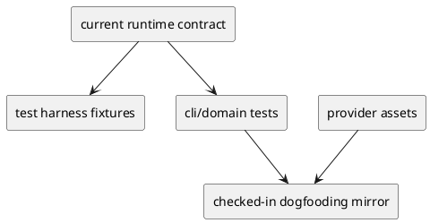

# iss-00040 Sync Fail Closed Hardening And Test Realignment — 設計（HOW）

## 目的・制約
- 目的:
  - stale-contract cluster を、runtime contract を変更せずに test / checked-in artifact 側の追随で解消する。
  - `active` / `deps` / `sync` / `wrappers` / `domain` / dogfooding parity の修正面を実行可能な単位へ分解する。
- MUST / MUST NOT:
  - MUST:
    - current-contract tests と legacy-compat tests の fixture 戦略を分離する。
    - helper 再利用を優先し、repo 初期化や linked hierarchy 作成の重複を増やさない。
    - targeted rerun と full regression evidence を両方残す。
  - MUST NOT:
    - GitHub mandatory / canonical repo scope / fail-closed contract を test convenience のために変更しない。
    - assertions を曖昧化して behavior regression を見えなくしない。
- 非交渉制約:
  - epic-00033 と矛盾しないこと。
  - provider-side source of truth は `src/spec_dock/assets/spec_dock/...` にあること。
  - checked-in dogfooding mirror は provider asset に一致させること。
- 前提:
  - `tests/cli_runtime/test_new.py` に current-contract fixture の参照実装がある。
  - `tests/cli_runtime/harness.py` には `_init_origin_repo()` と `_create_same_repo_linked_hierarchy()` がある。

## 既存実装 / 規約の理解
- 参照した実装 / docs:
  - `src/spec_dock/assets/spec_dock/scripts/spec_dock_runtime/commands/new.py`
  - `src/spec_dock/assets/spec_dock/scripts/spec_dock_runtime/application/create_node.py`
  - `src/spec_dock/assets/spec_dock/scripts/spec_dock_runtime/application/repo_context.py`
  - `src/spec_dock/assets/spec_dock/scripts/spec_dock_runtime/application/set_active.py`
  - `src/spec_dock/assets/spec_dock/scripts/spec_dock_runtime/application/check_deps.py`
  - `src/spec_dock/assets/spec_dock/scripts/spec_dock_runtime/application/sync_state.py`
  - `tests/cli_runtime/harness.py`
  - `tests/cli_runtime/test_new.py`
  - `tests/cli_runtime/test_active.py`
  - `tests/cli_runtime/test_deps.py`
  - `tests/cli_runtime/test_runtime_deps_s04.py`
  - `tests/cli_runtime/test_sync.py`
  - `tests/cli_runtime/test_wrappers.py`
  - `tests/domain_runtime/test_runtime_domain_s01.py`
  - `tests/test_init_update.py`
  - `spec-dock/docs/workflow_issue.md`
- 現状理解:
  - `new` command は local-only create を reject し、GitHub linkage と current repo scope を前提にしている。
  - `set_active()` と `check_deps()` は graph / target resolution / status context で動いており、fixture が現行契約に沿えば production code を変えずに green へ寄せられる公算が高い。
  - `sync_state` は fail-closed validation を維持しつつ、legacy checked-in data read path を一部保持している。
  - `test_new.py` は current-contract fixture パターンをすでに持つが、`test_active.py` / `test_deps.py` / `test_sync.py` は未追随箇所が残る。
  - wrapper tests は docs 本文の command examples を直接 assertion しているため、docs が先に更新された場合に stale expectation が残りやすい。
  - parity test は provider asset と checked-in consumer mirror の drift を検知している。
- 採用するパターン:
  - current-contract fixture:
    - `_init_origin_repo()` または `_create_same_repo_linked_hierarchy()` を利用し、GitHub-linked hierarchy を作る。
  - foreign overlap / ambiguity fixture:
    - `.meta.json` を明示編集して foreign repo metadata を持つ node を作る。
  - legacy-compat fixture:
    - unsupported CLI path を使わず、既存 helper で legacy/local-only artifacts を明示生成する。
  - parity recovery:
    - provider asset を正本に checked-in dogfooding mirror を refresh する。
- 採用しないもの:
  - runtime 側で `--no-github` success path を戻す変更
  - repo scope resolver の fail-fast を無効化する変更
  - legacy-compat coverage の一律削除
- 影響範囲:
  - `tests/cli_runtime/test_active.py`
  - `tests/cli_runtime/test_deps.py`
  - `tests/cli_runtime/test_runtime_deps_s04.py`（final regression で同一 stale-contract cluster と判明した fail-closed / scoped linkage 未追随のみ）
  - `tests/cli_runtime/test_sync.py`
  - `tests/cli_runtime/test_wrappers.py`
  - `tests/domain_runtime/test_runtime_domain_s01.py`
  - `tests/test_init_update.py`
  - 必要に応じて `tests/cli_runtime/harness.py`
  - checked-in dogfooding runtime mirror files

## 採用方針 / トレードオフ
- 論点:
  - stale fixture を current-contract fixture へ揃えるだけで十分か、legacy-compat fixture を別に設計するか。
  - parity drift を expectation 側で吸収するか、checked-in mirror を refresh するか。
- 選択肢:
  - Option A:
    - normal path / legacy path を区別せず、全 failing tests を機械的に GitHub-backed fixture へ置換する。
  - Option B:
    - normal path tests は current-contract fixture に揃え、legacy-compat tests は explicit legacy fixture として保持する。
- 決定:
  - Option B を採る。
  - 理由:
    - epic-00033 の現行 contract と legacy read-path coverage を両立できる。
    - `without_github` と `local_only` の意味を切り分けられる。
    - parity drift も source-of-truth 準拠で閉じやすい。

## インターフェース契約
- API / function / protocol / data boundary:
  - production CLI / application contract:
    - 変更対象外
  - test harness boundary:
    - repo 初期化
    - current-contract linked hierarchy 作成
    - explicit legacy artifact 作成
  - docs contract:
    - wrapper tests は `spec-dock/docs/*.md` の current text を正本として検証する
  - parity contract:
    - `spec-dock/scripts/spec_dock_runtime/...` は `src/spec_dock/assets/spec_dock/...` と一致する

### UML（推奨: module / dependency）

## クラス / インターフェース詳細設計（必要時）
- Class / Interface:
  - `CliRuntimeHarness`
- responsibility:
  - repo 初期化、runtime 実行、fixture 書き込みの共有化
- collaboration:
  - `test_active.py` / `test_deps.py` / `test_sync.py` が helper を再利用し、必要な箇所だけ explicit legacy fixture を組み立てる

## 変更計画
- Add:
  - 必要なら stale-contract cluster 用の薄い helper
- Modify:
  - stale fixture を持つ CLI runtime tests
  - full regression で同 cluster と確認された `tests/cli_runtime/test_runtime_deps_s04.py` の stale expectation
  - wrapper docs expectation
  - domain validation expectation
  - checked-in dogfooding runtime mirror files
- Delete:
  - なし
- Move/Rename:
  - なし
- Read only:
  - production runtime code（原則）
  - active initiative / epic docs

## 要件 → 設計マッピング
- AC-001 -> current-contract fixture へ統一し、`active` / `deps` / `sync` の intended assertions まで到達させる
- AC-002 -> current docs / current fail-closed ordering へ expectation を更新する
- AC-003 -> provider asset を正本に checked-in mirror parity を回復する
- AC-004 -> targeted rerun と full-suite rerun で cluster closure を確認する
- EC-001 -> step ごとの rerun で secondary mismatch を露出し、full regression で見つかった `tests/cli_runtime/test_runtime_deps_s04.py` を含む same-cluster stale expectation だけを scope 内へ取り込む
- EC-002 -> explicit legacy fixture で compat coverage を保持する
- EC-003 -> parity recovery を product behavior change なしで完了する
- constraint -> runtime contract は read-only unless true defect is proven

## テスト戦略
- Unit:
  - 原則として新規 unit test 追加より、既存 failing tests の realignment を優先する。
- Integration:
  - `python -m unittest tests.cli_runtime.test_active tests.cli_runtime.test_deps tests.cli_runtime.test_sync -v`
  - `python -m unittest tests.cli_runtime.test_wrappers tests.domain_runtime.test_runtime_domain_s01 -v`
- E2E / manual:
  - `python -m unittest discover -v`
  - `diff -q` または equivalent parity evidence
- migration / rollback / feature flag if needed:
  - feature flag なし
  - rollback は test / mirror changes を issue 単位で戻す

## 要件 / 例外 -> verification mapping
- AC-001 -> targeted CLI runtime reruns
- AC-002 -> targeted wrapper/domain reruns
- AC-003 -> targeted parity rerun + file comparison
- AC-004 -> full-suite rerun + remaining failure triage
- EC-001 -> incremental rerun evidence in report
- EC-002 -> legacy-compat targeted tests remain meaningful
- EC-003 -> parity diff disappears without runtime contract change
- constraint -> review で production code diff を確認する

## リスク / 移行 / ロールバック（必要時）
- risk:
  - helper を使わず局所修正すると、repo 初期化と linked hierarchy 前提が各所で再び分岐する。
  - fixture 更新後に、前段 failure に隠れていた secondary assertion mismatch が顕在化する可能性がある。
  - mirror refresh で checked-in consumer workspace 側に想定以上の差分が出る可能性がある。
- migration:
  - 旧 test assumption を新 contract 前提へ移すだけで、user-visible migration はない。
- rollback:
  - test / mirror diff を issue 単位で戻す。

## 未確定事項
- なし:
  - helper 方針は「既存 helper 再利用を原則とし、重複が顕著な場合のみ薄い helper を追加する」で確定した
