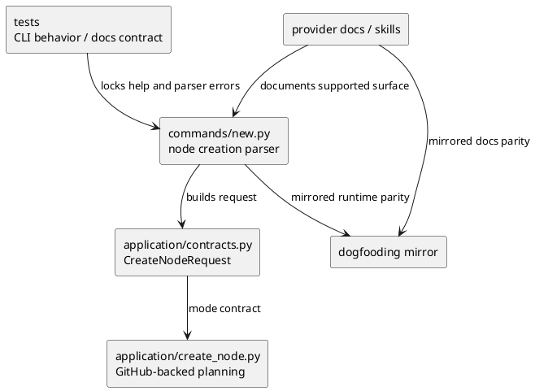
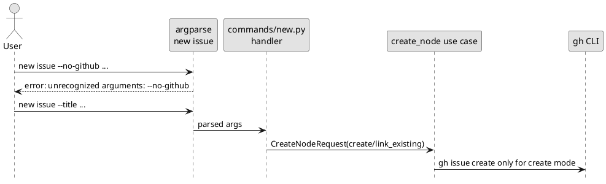

# iss-00141 Remove Local Only Node Creation Option Surface — 設計（どう実現するか）

## 親図（Diagram）参照
- Epic 図:
  - `spec-dock/active/epic/design.md` の Flow-A node create が親設計であり、node は GitHub issue を先に確保または既存 issue に link してから生成する。
- Initiative 図:
  - `spec-dock/active/initiative/design.md` は local-only contract を復活させない architecture hardening guardrail を定義している。
- 再利用する決定:
  - `spec-dock/active/epic/discussions/20260327t093000z-adr-github-mandatory-node-linkage.md` の accepted decision を再利用する。新 ADR は作成しない。

## 目的・制約
- 目的:
  - `new initiative` / `new epic` / `new issue` の `--no-github` option を parser / help / docs / tests / internal request contract から削除する。
  - dedicated contract error として残すのではなく、node creation では argparse の unsupported option として扱う。
  - internal の `no_github` / `local_only` plumbing を整理し、GitHub-backed create / link-existing だけを node creation の正規経路にする。
- 必須:
  - `--create-github-issue` と `--github-issue <n>` は維持する。
  - provider runtime と checked-in dogfooding runtime mirror を同じ contract にする。
  - docs / installed skills / tests から node creation `--no-github` compatibility wording を削除する。
- 禁止:
  - hidden compatibility option として `--no-github` を残さない。
  - `local_only` mode を application contract に残さない。
  - `sync` / `deps check` / `active set` の cache/local `--no-github` を削除しない。
- 前提:
  - `requirement.md` は fresh `spec-reviewer` pass 済みで、Option A parser-level removal が採用済み。

## 既存実装 / 規約の理解
- 参照した実装 / docs:
  - `src/spec_dock/assets/spec_dock/scripts/spec_dock_runtime/commands/new.py`
  - `src/spec_dock/assets/spec_dock/scripts/spec_dock_runtime/application/contracts.py`
  - `src/spec_dock/assets/spec_dock/scripts/spec_dock_runtime/application/create_node.py`
  - checked-in mirror under `spec-dock/scripts/spec_dock_runtime/`
  - `tests/cli_runtime/test_new.py`
  - `tests/cli_runtime/test_wrappers.py`
  - provider docs under `src/spec_dock/assets/spec_dock/docs/`
  - dogfooding docs under `spec-dock/docs/`
  - `README.md`
- 現状理解:
  - `commands/new.py` は `--no-github` を mutually exclusive GitHub group に登録し、`New*Args.no_github` から handler-level dedicated error を返している。
  - `CreateNodeRequest.github_mode` は `"create" | "link_existing" | "local_only" | None` を許している。
  - `create_node.py` の `_resolve_github_mode()` は `"local_only"` を reject するが、`plan_node_creation()` には local id allocation branch が残っている。
  - `spec_dock_runtime/app.py` は current layered runtime への bootstrap/dispatch entrypoint だが、module docstring に `new initiative` / `new epic` の local-only default と `new issue` の `--no-github` opt-out という stale wording が残っている。
  - docs / tests は `--no-github` を compatibility option として説明または期待している。
- 採用するパターン:
  - command parser で未登録 option を argparse error にする既存 parser behavior を使う。
  - provider-side asset を先に変更し、checked-in dogfooding mirror を同じ差分へ揃える。
  - tests は behavior regression と docs/scaffold contract の両方を押さえる。
- 採用しないもの:
  - `--no-github` を隠し option として残す設計。
  - dedicated guidance error の維持。
  - local-only legacy data の migration / cleanup。
- 影響範囲:
  - Runtime CLI, application create-node contract, runtime entrypoint docstring, tests, shipped docs, installed skills, dogfooding mirror.

## 採用方針 / トレードオフ
- 論点:
  - `--no-github` explicit invocation へ親切な dedicated error を返すか、option surface を完全に消すか。
- 選択肢:
  - A: parser-level removal。
  - B: help/docs から隠し、handler-level error は残す。
  - C: 現状維持。
- 決定:
  - A を採用する。
  - 理由は、issue の目的が option surface 自体の削除であり、accepted ADR の GitHub mandatory linkage と最も整合するため。
- tradeoff:
  - dedicated guidance は消えるが、future maintainer が local-only compatibility path を誤読する risk を減らせる。
  - `--no-github` は state/cache command には残るため、docs と tests では command context を明確に分ける。

## 依存関係分析
- module 依存:
  - `commands/new.py` は CLI option を `CreateNodeRequest` に変換する。
  - `application/contracts.py` は `CreateNodeRequest.github_mode` の型境界を持つ。
  - `application/create_node.py` は mode 解決、preflight、node id 決定、scaffold planning を担う。
  - docs/tests は runtime contract を外から固定する。
- function 依存:
  - `_add_new_*_arguments()` -> `_new_*_args()` -> `_run_new_*()` -> `UseCases.create_*()` -> `CreateNodeRequest`.
  - `plan_node_creation()` -> `_resolve_github_mode()` -> GitHub-backed id planning.
- file 依存:
  - provider runtime の変更後、checked-in mirror の同一箇所を揃える。
  - `app.py` は primary implementation logic ではないが installed runtime entrypoint の readable surface なので、provider/mirror 双方で stale node creation wording を修正する。
  - docs 変更後、`tests/cli_runtime/test_wrappers.py` と `tests/test_init_update.py` の scaffold expectation を揃える。
- 上流 / 前提:
  - `requirement.md` の AC-001 から AC-005。
  - accepted ADR の GitHub mandatory linkage。
- 下流 / 依存先:
  - 実装計画は tests -> runtime contract -> docs/mirror -> final gates の順で組む。
- 実装起点:
  - 先に failing tests / expectation を固定し、その後 `commands/new.py` と `CreateNodeRequest` contract を狭める。
- 順序への影響:
  - `commands/new.py` だけを変えると internal `local_only` branch が残るため、application contract cleanup を同じ runtime step に含める。
  - docs は runtime contract が固まった後に更新する。

## モジュール依存図（Module Dependency Diagram）
- タイトル:
  - Node creation `--no-github` removal dependency.
- 答える問い:
  - どの境界から `--no-github` / `local_only` を削り、どの検証がそれを固定するか。
- 範囲:
  - node creation CLI, application request contract, create-node planning, docs/tests parity.
- 含めない詳細:
  - GitHub CLI create internals、sync/deps/active cache-local mode、import behavior。
- 更新条件:
  - `CreateNodeRequest.github_mode` contract または node creation CLI option set が変わるとき。



## ローカル図の差分（Local Diagram Delta）
- 変更する境界 / 責務 / 相互作用:
  - `new` command の GitHub option group から `--no-github` を除外する。
  - application request contract から `local_only` mode を除外する。
  - `plan_node_creation()` は GitHub-backed node id planning のみを扱う。

## インターフェース契約
- CLI:
  - `new initiative|epic|issue --help` は `--create-github-issue` と `--github-issue` を表示し、`--no-github` を表示しない。
  - `new initiative|epic|issue --no-github ...` は exit code `2` の parser-level unsupported / unrecognized option error になる。
  - `new ... --create-github-issue --no-github ...` も mutually exclusive error ではなく unsupported / unrecognized option error になる。
- Application:
  - `CreateNodeRequest.github_mode` は `"create" | "link_existing" | None` のみを受ける。
  - `None` は既存 default-create semantics として残す。
  - `requested_node_id` と GitHub-backed node creation の併用不可は維持する。
  - `github_issue_number` は `link_existing` では必須、`create` では GitHub issue create 後に計画へ渡る既存 flow を維持する。
- Data boundary:
  - `.meta.json` の GitHub linkage persistence は変更しない。
  - local-only existing data の validate/read behavior はこの issue では変更しない。

## シーケンス差分（Sequence Delta）
- 変更する相互作用:
  - `--no-github` 指定時は argparse で停止し、handler / use-case / GitHub CLI / filesystem mutation へ到達しない。
- retry / transaction / external API / queue:
  - GitHub issue create の retry / failure behavior は変更しない。
- UML:



## ドメインモデル差分（Domain Model Delta）
- 親 model 参照:
  - Epic requirement の E-RQ-001: `new initiative` / `new epic` / `new issue` は GitHub issue mandatory。
- aggregate / entity / value object 変更:
  - N/A: persisted node model は変更しない。
- domain event / policy / specification 変更:
  - application-layer request policy から node creation `local_only` mode を削除する。
- 不変条件の変更:
  - 新規 node creation は GitHub-backed create / link-existing のみ。
- UML:
  - N/A: persisted domain object の構造変更ではないため。

## クラス / インターフェース詳細設計
- `NewInitiativeArgs` / `NewEpicArgs` / `NewIssueArgs`:
  - `no_github` field を削除する。
- `_add_new_initiative_arguments()` / `_add_new_epic_arguments()` / `_add_new_issue_arguments()`:
  - `--no-github` argument registration を削除する。
- `_new_initiative_args()` / `_new_epic_args()` / `_new_issue_args()`:
  - `no_github=getattr(...)` plumbing を削除する。
- `_run_new_initiative()` / `_run_new_epic()` / `_run_new_issue()`:
  - `typed.no_github` branch を削除する。
  - `use_github = True` が informational stderr のためだけに残る場合は単純化する。
- `_command_error()` / `_github_mandatory_error()`:
  - node creation `--no-github` 専用になっている場合は削除する。
- `CreateNodeRequest`:
  - `github_mode` literal から `"local_only"` を削除する。
- `_resolve_github_mode()` / `_validate_pre_github_create_inputs()` / `plan_node_creation()`:
  - mode type を `"create" | "link_existing"` に狭める。
  - local-only branch と `Cannot combine '--no-github' with '--github-issue'.` wording を削除する。

## ディレクトリ / ファイル変更計画
```text
.
|-- src/spec_dock/assets/spec_dock/
|   |-- scripts/spec_dock_runtime/
|   |   |-- commands/new.py                 # 変更: node creation --no-github parser/args/handler 削除
|   |   |-- application/contracts.py         # 変更: CreateNodeRequest.github_mode から local_only を削除
|   |   |-- application/create_node.py       # 変更: local_only resolver/planning branch 削除
|   |   `-- app.py                           # 変更: entrypoint docstring の stale local-only / --no-github wording 修正
|   |-- docs/
|   |   |-- reference_github.md              # 変更: node creation compatibility wording 削除
|   |   |-- github.md                        # 変更: --no-github rejected path 説明を削除
|   |   |-- workflow-tree.md                 # 変更: node creation compatibility wording 削除
|   |   `-- README.md                       # 変更: compatibility wording の文脈整理
|   `-- scripts/README.md                  # 変更: node creation compatibility wording 削除
|-- src/spec_dock/assets/install_root/.agents/skills/
|   `-- spec-dock-issue-execution/SKILL.md # 変更なし想定: cache/local verification wording は維持
|-- spec-dock/scripts/spec_dock_runtime/   # 変更: provider runtime mirror と同内容（app.py 含む）
|-- spec-dock/docs/                        # 変更: provider docs mirror と同内容
|-- README.md                              # 変更: node create/import compatibility note を整理
|-- tests/cli_runtime/
|   |-- test_new.py                        # 変更: help absence / parser-level unsupported / internal contract expectation
|   `-- test_wrappers.py                   # 変更: scaffold docs expectations
`-- tests/test_init_update.py              # 必要に応じて shipped docs / scaffold expectation 更新
```

## 要件 → 設計マッピング
- AC-001:
  - `commands/new.py` の parser registration 削除と CLI help tests で閉じる。
- AC-002:
  - parser-level unsupported option tests で閉じる。handler-level dedicated error は削除する。
- AC-003:
  - `commands/new.py` / `contracts.py` / `create_node.py` の internal plumbing cleanup と source/assertion tests で閉じる。
- AC-004:
  - provider docs / dogfooding docs / README / installed skill expectations の更新と docs tests で閉じる。
- AC-005:
  - provider runtime/docs と checked-in dogfooding runtime/docs の parity inspection / affected tests で閉じる。
- EC-001:
  - `--create-github-issue --no-github` は mutual exclusion ではなく unsupported option として test する。
- EC-002:
  - `sync` / `deps` / `active` の existing tests と help/docs inspection で保護する。
- EC-003:
  - targeted `rg -- "--no-github|local-only"` を command context で分類し、node creation compatibility wording の不在を確認する。

## テスト戦略
- 単体 / CLI behavior:
  - `tests/cli_runtime/test_new.py` に help output absence と parser-level unsupported option を追加または既存 test を更新する。
  - fake `gh` が呼ばれないことを explicit `--no-github` parser failure で確認する。
  - mutual exclusion test から `--no-github` 組み合わせ期待を削除し、unsupported option expectation へ移す。
- 構造 / contract:
  - `commands/new.py` / `contracts.py` / `create_node.py` に node creation `no_github` / `local_only` plumbing が残らないことを test または inspection evidence で確認する。
- Docs / scaffold:
  - `tests/cli_runtime/test_wrappers.py` と必要な `tests/test_init_update.py` expectation を更新する。
  - node creation compatibility wording は削除し、cache/local state `--no-github` wording は維持する。
- 統合:
  - `python -m unittest tests.cli_runtime.test_new tests.cli_runtime.test_wrappers -v`
  - docs/install asset 変更に応じて `python -m unittest tests.test_init_update -v` または該当 test を実行する。
  - 最終的に `./spec-dock/scripts/spec-dock validate` を実行する。
- migration / rollback / feature flag:
  - migration なし。
  - rollback は issue diff の revert。local-only contract は復活させない。

## 要件 / 例外 -> 検証マッピング
- AC-001 -> `test_new_help_does_not_expose_no_github_for_node_creation`（新規または更新）
- AC-002 -> `test_new_no_github_is_unrecognized_for_initiative_epic_and_issue`（更新）
- AC-003 -> source inspection / structural assertion for `commands/new.py`, `contracts.py`, `create_node.py`
- AC-004 -> `test_scaffold_docs_point_to_runtime_commands_and_rules_docs` updates plus targeted docs search
- AC-005 -> provider/mirror diff inspection and affected parity tests
- EC-001 -> parser unsupported option test for `--create-github-issue --no-github`
- EC-002 -> existing `sync` / `deps` / `active` tests remain in scope as regression guard, not implementation target
- EC-003 -> targeted search with allowed-hit classification

## リスク / 移行 / ロールバック
- リスク:
  - `--no-github` string は supported state/cache commands に残るため、単純な zero-hit search を検証にすると false failure になる。
  - legacy local-only read-path fixtures / validation tests を誤って削ると、既存データ診断の coverage を落とす。
  - provider asset と dogfooding mirror の片方だけを更新すると parity drift が残る。
- 移行:
  - 既存 local-only node data はこの issue では変更しない。
  - CLI 利用者は existing GitHub issue へ link する場合 `--github-issue <n>` を使う。
- ロールバック:
  - issue 単位で差分を戻す。local-only node creation contract の復活は rollback 方針に含めない。

## 未確定事項
- なし:
  - requirement phase で Option A と internal logic cleanup scope は回答済み。
