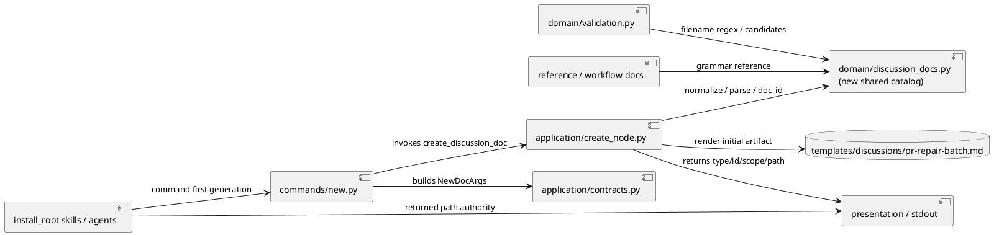
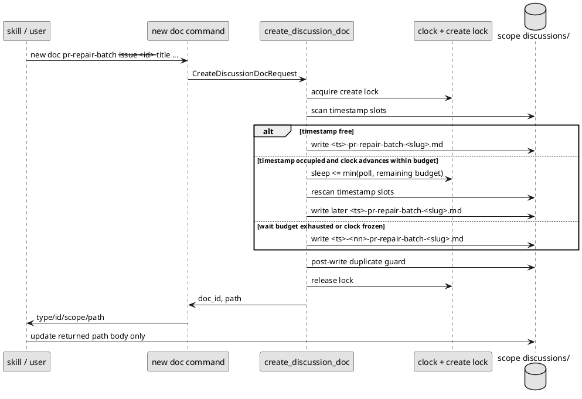

# iss-00188 Prevent duplicate discussion timestamp slots when creating multiple artifacts — 設計

## 目的・制約
- 目的:
  - `pr-repair-batch` を first-class creatable discussion doc type として追加する。
  - Discussion artifact filename/path/doc_id allocation を runtime-owned に集約し、shipped skills / workflows / role configs から manual timestamp filename generation を排除する。
  - Existing timestamp grammar を維持しながら、同秒 collision では wait/retry を suffix fallback より先に行う。
- 必須 / 禁止:
  - `new doc` の interface shape は維持する。
  - `--template-file` / `--body-file` / explicit basename / explicit doc_id override は追加しない。
  - `pr-repair-unit` は追加しない。
  - Existing artifacts の rename / repair はしない。
- 非交渉制約:
  - `yyyymmddthhmmssz` timestamp grammar と `01..99` suffix fallback を維持する。
  - `note` は retired creation type のままにし、validation grandfathering のみ残す。
  - ADR mirror 対象は引き続き `adr` のみ。

## 既存実装 / 規約の理解
- 参照した実装 / docs:
  - `src/spec_dock/assets/spec_dock/scripts/spec_dock_runtime/commands/new.py`
  - `src/spec_dock/assets/spec_dock/scripts/spec_dock_runtime/application/create_node.py`
  - `src/spec_dock/assets/spec_dock/scripts/spec_dock_runtime/domain/validation.py`
  - `src/spec_dock/assets/spec_dock/templates/discussions/`
  - `src/spec_dock/assets/install_root/.agents/skills/github-pr-merge-preparer/SKILL.md`
  - `src/spec_dock/assets/install_root/.codex/AGENTS.md`
  - `src/spec_dock/assets/install_root/.codex/agents/system-architect.toml`
  - `src/spec_dock/assets/install_root/.codex/agents/implementation-planner.toml`
  - `spec-dock/docs/reference_naming.md`
  - accepted ADRs `20260617t003044z-adr` and `20260617t003048z-adr`
- 現状理解:
  - `commands/new.py` が `new doc` の parser / help を持つ。
  - `create_node.py` が creatable doc type catalog、filename regex、template resolution、allocation、render/write、post-write guard を持つ。
  - `validation.py` が timestamp filename regex、legacy filename regex、malformed candidate detection、duplicate standard/suffix/doc_id detection を持つ。
  - `github-pr-merge-preparer` は skill-local `templates/pr-repair-batch.md` を持つが、target filename guidance が runtime allocator を迂回するよう読める。
- 採用するパターン:
  - Provider source under `src/spec_dock/assets/...` を正とし、dogfooding copy は parity verification / sync target として扱う。
  - Runtime command creates initial artifact from shipped template, then workflow updates returned path body.
- 採用しないもの:
  - Sub-second timestamp grammar.
  - Body/template command options.
  - PR repair unit doc type.
  - Existing artifact migration.

## 採用方針 / トレードオフ
- 論点 1: doc type catalog の重複
  - 決定:
    - `pr-repair-batch` 追加時に create/validate の doc type list と regex drift を減らすため、small shared helper module を導入する。
  - 理由:
    - Hyphenated doc type は `stem.split("-")` 前提を壊しやすく、list / regex / candidate matching を分散させると regression risk が高い。
- 論点 2: wait-before-suffix
  - 決定:
    - create lock 内で timestamp slot が occupied の場合、bounded wait/retry で次の timestamp slot を試し、失敗時だけ suffix fallback に落とす。
    - Default wait budget は 1.1 秒、poll interval は 0.05 秒とする。
    - `SPEC_DOCK_DISCUSSION_TIMESTAMP_WAIT_SECONDS` と `SPEC_DOCK_DISCUSSION_TIMESTAMP_POLL_SECONDS` で上書き可能にする。invalid / zero / negative values は fail-fast する。
    - 実装は allocator helper に `now_iso_provider` と `sleep_fn` を注入できる形にし、runtime では existing `ports.clock.now_iso()` または system clock と `time.sleep` を使う。Tests は fake clock / no-op sleep を渡して deterministic にする。
  - 理由:
    - Suffix は safety fallback として残しつつ、通常の連続生成では suffix-less chronological filenames を優先できる。
    - Worst-case latency を 1 秒台に固定し、frozen clock tests を suffix fallback へ deterministic に落とせる。
- 論点 3: PR repair batch body
  - 決定:
    - `new doc pr-repair-batch` は provider discussion template を初期 render する。Skill は returned path を更新するが、front matter identity fields を変更しない。
  - 理由:
    - User が body/template input option を不要と判断済みで、root cause は filename/path allocation の手作業であるため。
- 論点 4: docs guidance
  - 決定:
    - Reference docs may describe grammar. Generation procedure docs / skills / role configs must say command-first / returned-path-first.
  - 理由:
    - Grammar reference と manual filename generation instruction を分離しないと、agent が `<ts>-...` を再実装する。

## 依存関係分析
- module 依存:
  - `commands/new.py` -> application contracts / use case
  - `create_node.py` -> shared discussion doc catalog / template rendering / validation duplicate guard
  - `validation.py` -> shared discussion doc catalog
  - templates/docs/skills -> runtime command contract
- 上流 / 前提:
  - Requirement reviewer pass.
  - Accepted ADRs for runtime-owned artifact creation and wait-before-suffix.
- 下流 / 依存先:
  - Implementation plan step order.
  - Runtime tests and shipped asset tests.
- 実装起点:
  - Shared doc type catalog/parser helper is prerequisite for safe hyphenated type support.
  - Runtime `pr-repair-batch` creation must precede skill guidance migration because guidance needs a real command.
  - Wait-before-suffix can be implemented after shared catalog because it touches allocation independent of doc type addition.
- 順序への影響:
  - Step order should be catalog/parser -> `pr-repair-batch` creation/template -> wait allocator -> shipped guidance/docs -> final validation.

## モジュール依存図（Module Dependency Diagram）


## インターフェース契約
- CLI:
  - Existing shape remains:
    - `./spec-dock/scripts/spec-dock new doc <doc_type> --issue|--epic|--initiative <id> --title "..." [--slug ...]`
  - New accepted doc type:
    - `pr-repair-batch`
  - No new options:
    - no `--template-file`
    - no `--body-file`
    - no explicit basename/doc_id override
- Filename / doc_id:
  - Standard:
    - `<ts>-pr-repair-batch-<slug>.md`
    - `doc_id=<ts>-pr-repair-batch`
  - Suffix fallback:
    - `<ts>-<nn>-pr-repair-batch-<slug>.md`
    - `doc_id=<ts>-<nn>-pr-repair-batch`
- Template:
  - Provider template path:
    - `src/spec_dock/assets/spec_dock/templates/discussions/pr-repair-batch.md`
  - Initial front matter must use the generated doc_id and title placeholders.
  - PR observation / batch metadata sections can be copied or adapted from the existing skill-local `pr-repair-batch.md` template.
- Workflow guidance:
  - Skills run `new doc pr-repair-batch ...`, parse/use returned `path`, then update that path.
  - Skills must preserve generated front matter identity fields.
- Wait / retry configuration:
  - Environment variables:
    - `SPEC_DOCK_DISCUSSION_TIMESTAMP_WAIT_SECONDS` default `1.1`, minimum exclusive `0`.
    - `SPEC_DOCK_DISCUSSION_TIMESTAMP_POLL_SECONDS` default `0.05`, minimum `0.001`.
  - `WAIT_SECONDS=0` is invalid and must fail fast; deterministic tests avoid real waiting through injected fake clock / no-op sleep rather than a zero wait budget.
  - Runtime should cap each sleep to the remaining wait budget and should re-read timestamp after every sleep.
  - The wait loop ends when a free standard timestamp slot is found, when wait budget is exhausted, or when malformed / duplicate preflight guard fails.

## シーケンス差分


## ドメインモデル差分
- Add shared discussion document catalog concept:
  - creatable types:
    - `adr`, `disc`, `research`, `interview`, `scratch`, `pr-repair-batch`, `draft-requirement`, `draft-design`, `draft-plan`
  - retired creation type:
    - `note`
  - legacy sequential validation types:
    - existing legacy set remains grandfathered; do not introduce legacy `pr-repair-batch`.
- Add parser helpers:
  - timestamp filename fullmatch for current timestamp grammar.
  - legacy filename fullmatch for grandfathered types.
  - doc type candidate detection that supports hyphenated doc types.
  - doc_id derivation from matched filename.
- Add allocation helper:
  - Inputs:
    - discussions directory, doc type, slug, initial timestamp provider, `now_iso_provider`, `sleep_fn`, wait seconds, poll seconds.
  - Behavior:
    - If current timestamp standard slot is free, return suffix-less path/doc_id.
    - If occupied, wait/retry until a later timestamp standard slot is free or budget is exhausted.
    - If budget is exhausted or clock does not advance, call existing suffix allocation for the last observed timestamp.
  - Testability:
    - Unit/application tests use fake clock sequences and no-op sleep to exercise success and fallback paths without real one-second sleeps.

## ディレクトリ / ファイル変更計画
```text
src/spec_dock/assets/spec_dock/scripts/spec_dock_runtime/
|-- commands/
|   `-- new.py                         # Update help/catalog surface if needed
|-- application/
|   |-- create_node.py                 # Use shared catalog; add wait-before-suffix allocation
|   `-- contracts.py                   # Inspect only; update only if type contract needs docs/comments
|-- domain/
|   |-- discussion_docs.py             # Add: shared discussion doc type/catalog/parser helpers
|   `-- validation.py                  # Use shared catalog/parser for malformed/duplicate validation
`-- presentation/
    `-- ...                            # Inspect only; update only if stdout rendering has hard-coded assumptions

src/spec_dock/assets/spec_dock/
|-- templates/
|   `-- discussions/
|       `-- pr-repair-batch.md         # Add provider discussion template
`-- docs/
    |-- reference_naming.md            # Update current catalog and command-first guidance boundary
    |-- workflow_issue.md              # Update current catalog if surfaced
    |-- workflow_adr.md                # Keep ADR examples; update only if catalog reference needs clarity
    `-- workflow_spec_authoring.md     # Clarify grammar reference vs generator command if needed

src/spec_dock/assets/install_root/
|-- .agents/
|   `-- skills/
|       |-- github-pr-merge-preparer/
|       |   |-- SKILL.md               # Use new doc pr-repair-batch and returned path
|       |   `-- templates/pr-repair-batch.md # De-duplicate or align with provider template
|       `-- spec-dock-hub/SKILL.md     # Remove manual filename wording
`-- .codex/
    |-- AGENTS.md                      # Command-first / returned-path-first delegated artifact guidance
    `-- agents/
        |-- system-architect.toml      # Remove "Use filenames" manual generation instruction
        `-- implementation-planner.toml

tests/
|-- cli_runtime/
|   |-- test_new.py                    # CLI creation/help/interface/no body option
|   |-- test_runtime_new_doc_s09.py    # application wait/fallback/template behavior
|   `-- test_validate.py               # valid/malformed/duplicate pr-repair-batch
`-- unit/
    `-- infra/test_init_update.py      # provider asset/template/guidance regression
```

Dogfooding parity rule:
- Provider assets under `src/spec_dock/assets/...` are the source of truth.
- Implementation must produce evidence that root dogfooding copies are not stale for AC-003. Acceptable evidence is one of:
  - run the repo-local update/sync path that refreshes `.agents/`, `.codex/`, and `spec-dock/` from provider assets, then inspect resulting root copies; or
  - if update/sync is not part of the step, perform direct parity inspection comparing provider install-root files against `.agents/` / `.codex/` root copies and record the no-drift result in `report.md`.
- Required dogfooding parity surfaces:
  - `.agents/skills/github-pr-merge-preparer/SKILL.md`
  - `.agents/skills/spec-dock-hub/SKILL.md`
  - `.codex/AGENTS.md`
  - `.codex/agents/system-architect.toml`
  - `.codex/agents/implementation-planner.toml`

## 要件 → 設計マッピング
- AC-001 -> `pr-repair-batch` catalog, provider template, runtime creation, stdout/path contract.
- AC-002 -> `commands/new.py` parser shape preserved; no body/template/basename/doc_id options.
- AC-003 -> provider install-root skills/agents/docs command-first returned-path-first guidance.
- AC-004 -> allocation algorithm wait/retry before suffix fallback.
- AC-005 -> shared parser/catalog, validation malformed/duplicate behavior for hyphenated doc type.
- EC-001 -> bounded wait budget and frozen-clock suffix fallback.
- EC-002 -> existing suffix exhaustion behavior retained.
- EC-003 -> skill guidance preserves generated front matter identity.
- EC-004 -> repair unit remains `disc` or future follow-up, not #188 doc type.

## テスト戦略
- Unit / application:
  - `create_discussion_doc` creates valid `pr-repair-batch` file and doc_id.
  - `create_discussion_doc` waits/retries before suffix when timestamp occupied and clock advances.
  - Frozen clock / bounded wait exhaustion falls back to suffix.
  - Wait budget and poll interval are deterministic under injected fake clock / sleep function; no test should sleep for the real default budget.
  - Suffix exhaustion remains fail-closed.
- CLI runtime:
  - `new doc pr-repair-batch` succeeds and stdout includes `type`, slugless `id`, `scope`, `path`.
  - Help exposes `pr-repair-batch` in `new doc` doc type list but does not expose per-type subcommands.
  - Unknown doc type behavior remains unchanged.
  - `new doc` help does not expose `--template-file`, `--body-file`, `--id`, or `--seq`.
- Validation:
  - Valid `pr-repair-batch` timestamp filenames pass.
  - Missing slug / malformed suffix / manual doc-type-prefixed candidates fail closed.
  - Duplicate standard/suffix/doc_id involving `pr-repair-batch` fail consistently.
- Asset / docs:
  - Provider scaffold includes `templates/discussions/pr-repair-batch.md`.
  - Installed `github-pr-merge-preparer` guidance uses `new doc pr-repair-batch` and returned path.
  - In-scope agent role configs no longer tell agents to handcraft timestamped filenames.
  - Dogfooding root copies under `.agents/` and `.codex/` are refreshed or parity-inspected and match provider guidance for AC-003.
  - Grammar reference docs still describe filename contract without implying manual generation.

## リスク / 移行 / ロールバック
- Risks:
  - Hyphenated doc type breaks naive split-based parsing.
  - Create/validate catalog drift if helper is not centralized.
  - Provider template and skill-local PR repair template may drift if both remain authoritative.
  - Wait-first allocator can add up to the configured wait budget per occupied timestamp before suffix fallback.
- Migration:
  - No existing file migration.
  - Existing timestamp/suffix/legacy files remain valid under current grandfathering rules.
  - Dogfooding copy should be refreshed or parity-updated after provider assets change.
- Rollback:
  - Remove `pr-repair-batch` from creatable catalog/template/docs/guidance.
  - Revert wait-before-suffix to suffix-first if necessary.
  - Do not rename generated artifacts as rollback.

## 未確定事項
- なし。
