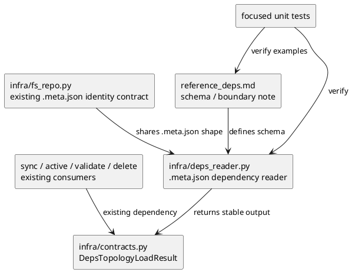
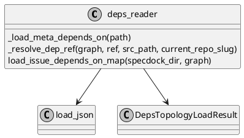

# iss-00060 Meta json dependency schema and reader alignment — 設計（HOW）

## 目的・制約
- 目的:
  - dependency metadata の canonical schema を `.meta.json` に固定し、`infra/deps_reader.py` の read path をその SoT へ移す。
  - 後続 issue が mutation/write path と downstream parity を安全に積めるよう、T1 で read boundary と evidence boundary を先に閉じる。
- MUST / MUST NOT:
  - MUST:
    - `.meta.json` で node 単位の `depends_on` schema を定義する。
    - `infra/deps_reader.py` は `.meta.json` だけを source にし、`DepsTopologyLoadResult` の surface を維持する。
    - docs と unit tests で schema / read contract / hard cutover boundary note を観測可能にする。
    - provider-side dependency docs 更新を mandatory とし、`src/spec_dock/assets/spec_dock/docs/reference_deps.md` を正本更新対象、`spec-dock/docs/reference_deps.md` を secondary verification とする。
  - MUST NOT:
    - `deps add/remove`、delete scrub、`sync` / `active` / `validate` parity をこの issue に含めない。
    - `deps.json` dual-read、feature flag、auto-migration fallback を導入しない。
    - `iss-00062` owner の dogfooding checked-in data manual fix と dogfooding `validate` / `sync` evidence gathering を前倒しで抱え込まない。
- 非交渉制約:
  - current downstream consumer は `DepsTopologyLoadResult.issue_depends_on_map` を前提にしているため、T1 で public return shape を変えない。
  - `.meta.json` 追加 field は既存 metadata schema_version と並列に置き、node identity contract を壊さない。
  - rollback は issue diff revert を前提とし、互換モードは持たない。
- 前提:
  - `infra/fs_repo.py` は `.meta.json` を identity source としてロード・ライトしている。
  - `infra/deps_reader.py` は現在 `deps.json` の shorthand 解決ロジックを持つ。
  - epic plan 上、T1 は schema / reader、T2 は mutation、T3 は downstream parity + cutover readiness、T4 は final closure である。

## 既存実装 / 規約の理解
- 参照した実装 / docs:
  - `src/spec_dock/assets/spec_dock/scripts/spec_dock_runtime/infra/deps_reader.py`
  - `src/spec_dock/assets/spec_dock/scripts/spec_dock_runtime/infra/fs_repo.py`
  - `src/spec_dock/assets/spec_dock/scripts/spec_dock_runtime/infra/contracts.py`
  - `src/spec_dock/assets/spec_dock/docs/reference_deps.md`
  - `spec-dock/docs/reference_deps.md`
  - `tests/cli_runtime/test_deps.py`
  - `tests/cli_runtime/test_sync.py`
  - `tests/cli_runtime/test_active.py`
  - `tests/test_init_update.py`
  - `epic-00059` requirement / design / plan
- 現状理解:
  - `deps_reader.py` は `src_node.path / "deps.json"` を読み、`_resolve_dep_ref` で shorthand を canonical node id に解決したあと、initiative / epic shorthand を issue-level edge へ compile している。
  - `load_issue_depends_on_map()` の output は `DepsTopologyLoadResult(issue_depends_on_map, warnings)` で、`sync` / `active set` / `deps check` / delete validation がこの shape に依存している。
  - `.meta.json` は `fs_repo.load_node_records()` で identity / GitHub linkage を読むが、dependency field はまだ持っていない。
  - provider-side 正本の `src/spec_dock/assets/spec_dock/docs/reference_deps.md` と dogfooding copy の `spec-dock/docs/reference_deps.md`、および多くの test fixture が `deps.json` path と schema を直接前提にしている。
- 採用するパターン:
  - existing shorthand grammar と compile semantics は再利用し、storage location だけを `.meta.json` へ寄せる。
  - T1 では return shape を維持し、reader internals と docs/test の正本だけを切り替える。
  - hard cutover は docs/spec note で明示し、manual fix / parity / dogfooding `validate` / `sync` evidence gathering は `iss-00062` に切り出す。
- 採用しないもの:
  - graph-level dependency object を別 file / 別 artifact に持つこと。
  - dependency を `StoredMetaRecord` の常設 field として今すぐ配線し、全 node load path を同時に広げること。
  - cycle detection responsibility を reader 層へ追加し、既存 downstream evaluator の責務を崩すこと。
- 影響範囲:
  - 直接変更:
    - `src/spec_dock/assets/spec_dock/scripts/spec_dock_runtime/infra/deps_reader.py`
    - `src/spec_dock/assets/spec_dock/docs/reference_deps.md`
    - dependency schema / reader の focused tests
  - 間接影響:
    - `sync` / `active set` / `deps check` / delete validation が読む topology source
    - 後続 `infra/fs_repo.py` write helper 設計
    - `spec-dock/docs/reference_deps.md` の dogfooding verification copy
  - Read only / contract anchor:
    - `infra/fs_repo.py`
    - `infra/contracts.py`

## 採用方針 / トレードオフ
- 論点:
  - `.meta.json` に dependency を top-level field として置くか、nested object にまとめるか。
  - reader alignment のために `StoredMetaRecord` を拡張するか、`deps_reader.py` が `.meta.json` を直接読むか。
- 選択肢:
  - Option A:
    - `.meta.json` top-level に `depends_on` を追加し、`deps_reader.py` が node directory の `.meta.json` を直接読む。
  - Option B:
    - `.meta.json` に `dependencies: { depends_on: [...] }` の nested object を追加し、`StoredMetaRecord` / graph seed へ dependency field を通す。
- 決定:
  - Option A を採る。
  - 理由:
    - 現行 `deps.json` contract の key 名と raw value grammar をそのまま持ち込めるため、storage migration の差分が最小である。
    - T1 の責務は reader alignment であり、identity graph load まで一気に広げると blast radius が大きくなる。
    - top-level `depends_on` は将来の writer 実装でも atomic `.meta.json` rewrite と相性がよい。

## 依存関係分析
- upstream / prerequisite:
  - `infra/fs_repo.py` が `.meta.json` を正しく読む / 書く既存 contract
  - `infra/contracts.py` の `DepsTopologyLoadResult`
  - `deps_reader.py` 内の `_resolve_dep_ref()` / `_issue_ids_for_dep_node()` / descendant/self guard
- downstream / dependent:
  - `application/sync_state.py`
  - `application/set_active.py`
  - `application/validate_tree.py`
  - `application/delete_node.py`
  - `tests/cli_runtime/test_sync.py`
  - `tests/cli_runtime/test_active.py`
  - `tests/cli_runtime/test_deps.py`
- 実装起点:
  - 依存の少ない起点は schema docs と `deps_reader.py` の low-level meta loader である。
  - downstream flow の変更は避け、`load_issue_depends_on_map()` の return shape を守ったまま source file を差し替える。
  - test も low-level schema / reader unit から始め、広い integration parity は T3 に残す。
- sequencing implications:
  - 先に schema と boundary note を固定し、その後に low-level reader helper を実装する。
  - compile semantics を保つ unit tests を通してから、docs refresh と downstream smoke assertions を行う。

### UML（必須: module / dependency）


## インターフェース契約
- API / function / protocol / data boundary:
  - `.meta.json` dependency schema:
    - node 直下 `.meta.json` に optional top-level field `depends_on` を追加する。
    - field absence は `[]` と同義。
    - value は list のみ許可し、各要素は current contract と同じ raw ref grammar に限定する。
    - schema 例:
      ```json
      {
        "schema_version": 1,
        "type": "issue",
        "id": "iss-00100",
        "title": "Example issue",
        "slug": "example-issue",
        "parent_id": "epic-00059",
        "initiative_id": "init-local-00003",
        "epic_id": "epic-00059",
        "depends_on": [
          "iss-00123",
          "epic-00061",
          456,
          "owner/repo#789",
          "https://github.com/owner/repo/issues/790"
        ]
      }
      ```
  - reader contract:
    - `load_issue_depends_on_map(specdock_dir, graph)` は `src_node.path / ".meta.json"` を読む。
    - `depends_on` missing の場合は `[]` を採用する。
    - shorthand 解決、initiative/epic -> issue compile、dedupe、deterministic sort、descendant/self reject、`deps_ref_expanded_to_empty` warning は current semantics を維持する。
    - bool / object / invalid string / unresolved ref は fail-closed error にする。
    - return type は `DepsTopologyLoadResult(issue_depends_on_map=dict[str, list[str]], warnings=list[str])` のまま維持する。
  - hard cutover boundary note:
    - T1 では `.meta.json` read contract を確定する。
    - legacy `deps.json` checked-in data manual fix、dogfooding `validate` / `sync` evidence、cutover judgment は `iss-00062` owner の責務であり、T1 completion gate には入れない。
    - `src/spec_dock/assets/spec_dock/docs/reference_deps.md` を正本更新対象とし、`spec-dock/docs/reference_deps.md` は secondary verification とする。
    - no dual-read / no auto-migration / rollback-by-revert を issue docs と reference docs へ残す。

## クラス / インターフェース詳細設計（必要時）
- Class / Interface:
  - `infra.deps_reader._load_meta_depends_on(path: Path) -> list[Any]`
- responsibility:
  - `.meta.json` の object validation と `depends_on` field 取り出しを行う。
- collaboration:
  - `load_json()` を用いて meta payload を取得し、`_resolve_dep_ref()` に渡す raw refs を返す。

- Class / Interface:
  - `infra.deps_reader.load_issue_depends_on_map(specdock_dir: Path, graph: SpecGraph) -> DepsTopologyLoadResult`
- responsibility:
  - `.meta.json` source から canonical direct issue dependency map を compile し、downstream consumer に既存 shape で返す。
- collaboration:
  - `_resolve_current_repo_slug()`、`_resolve_dep_ref()`、`_issue_ids_for_dep_node()` と連携する。

### UML（任意: class / interface）


## 変更計画
- Add:
  - `.meta.json` dependency schema definition
  - `deps_reader.py` の meta-based loader helper
  - hard cutover boundary note
  - reader-focused unit tests
- Modify:
  - `src/spec_dock/assets/spec_dock/scripts/spec_dock_runtime/infra/deps_reader.py`
  - `src/spec_dock/assets/spec_dock/docs/reference_deps.md`
  - 既存 dependency tests のうち schema/read source を直接前提にする箇所
- Delete:
  - なし
- Move/Rename:
  - なし
- Read only:
  - `src/spec_dock/assets/spec_dock/scripts/spec_dock_runtime/infra/fs_repo.py`
  - `src/spec_dock/assets/spec_dock/scripts/spec_dock_runtime/infra/contracts.py`
  - `application/{sync_state,set_active,validate_tree,delete_node}.py`
  - `spec-dock/docs/reference_deps.md`（secondary verification）

## 要件 → 設計マッピング
- AC-001 -> top-level `depends_on` schema、default `[]`、current shorthand grammar 維持
- AC-002 -> `.meta.json` source への reader 差し替え、`DepsTopologyLoadResult` shape 維持、compile semantics 維持
- AC-003 -> hard cutover boundary note と T1/T3 owner split
- EC-001 -> `depends_on` missing は `[]`
- EC-002 -> invalid type / unsupported value の fail-closed validation
- EC-003 -> `deps_ref_expanded_to_empty` warning 維持
- EC-004 -> legacy `deps.json` を fallback 根拠にしない boundary note
- constraint -> no dual-read / no auto-migration / rollback-by-revert

## テスト戦略
- Unit:
  - `.meta.json` に `depends_on` が無いときに `[]` を返す test
  - valid shorthand refs を current contract どおり解決できる test
  - invalid `depends_on` type / element type / unresolved ref を fail-closed する test
  - `deps_ref_expanded_to_empty` warning を維持する test
  - issue/epic/initiative shorthand の compile と dedupe/sort を維持する test
- Integration:
  - T1 では広範囲 integration refresh を主目的にしないが、downstream surface regression を確認する最小 smoke assertion は保持する。
  - `tests/cli_runtime/test_deps.py` を主置き場にし、必要最小限で `test_sync.py` / `test_active.py` の source path assumption を整える。
- E2E / manual:
  - T1 issue 実装時点では dogfooding `validate` / `sync` success を completion gate に置かず、必要なら secondary verification として扱う。
  - dogfooding checked-in data manual fix の本格実施と cutover evidence packaging は `iss-00062` owner が持つ。
- migration / rollback / feature flag if needed:
  - feature flag は導入しない。
  - rollback は T1 diff revert で扱う。
  - revert 時も temporary dual-read path を持ち込まない。

## 要件 / 例外 -> verification mapping
- AC-001 -> schema docs + `.meta.json` focused tests
- AC-002 -> `deps_reader.py` unit tests + minimal downstream smoke assertions
- AC-003 -> issue docs / provider-side `reference_deps.md` / dogfooding secondary verification の boundary note
- EC-001 -> missing `depends_on` default test
- EC-002 -> invalid schema / invalid ref tests
- EC-003 -> empty expansion warning test
- EC-004 -> boundary note wording review
- constraint -> code review で no dual-read / no feature flag を確認

## リスク / 移行 / ロールバック（必要時）
- risk:
  - source file 変更だけで downstream semantics も変えたように見えると、T2/T3 の責務分離が曖昧になる。
  - provider-side `reference_deps.md` と dogfooding copy、issue spec の wording がずれると、reviewer が T1/T3 owner split を誤読する。
  - current test suite に `deps.json` path assumption が多いため、unit-focused で閉じず無制限に integration 修正へ広がる危険がある。
- migration:
  - T1 は storage/read boundary の固定のみを担う。
  - dogfooding checked-in data の manual migration と dogfooding validate/sync evidence は `iss-00062` が primary owner である。
- rollback:
  - `.meta.json` schema / reader / docs / tests の差分を issue 単位で戻す。
  - rollback のための compatibility layer は追加しない。

## 未確定事項
- なし:
  - field 名、helper 配置、owner split、rollback 方針は本 issue で固定する
