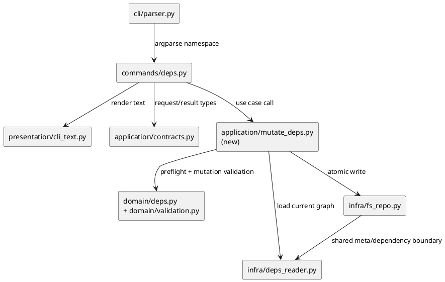
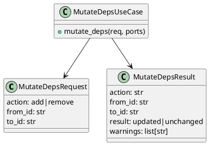

# iss-00061 Dependency mutation command contract — 設計（HOW）

## 目的・制約
- 目的:
  - `deps` subtree に mutation command を追加し、dependency write path を command contract として正式化する。
  - validation order と CLI response/error contract を固定し、healthy graph 時のみ duplicate add を no-op success にする。
- MUST / MUST NOT:
  - MUST current graph validation を mutation target node kind 判定、edge existence 判定、mutation decision より先に実行する。
  - MUST remove not-found を error に固定する。
  - MUST mutation target を issue node -> issue node に限定し、non-issue node input を `unsupported_node_kind` error に固定する。
  - MUST `.meta.json` を唯一の write path に使う。
  - MUST NOT `deps.json` fallback や silent repair を追加しない。
- 非交渉制約:
  - duplicate add は current graph validation 成功時のみ `result=unchanged`。
  - current graph invalid は `edge_not_found` / `unsupported_node_kind` より先に返す。
  - failure 時は no-write を保証する。
- 前提:
  - `.meta.json` schema / reader は `iss-00060` で整列済み。
  - 実装正本は provider-side shipped runtime（`src/spec_dock/assets/spec_dock/...`）であり、dogfooding runtime copy は verification 対象ではあっても mutation contract の直接実装先ではない。

## 既存実装 / 規約の理解
- 参照した実装 / docs:
  - `src/spec_dock/assets/spec_dock/scripts/spec_dock_runtime/cli/parser.py`
  - `src/spec_dock/assets/spec_dock/scripts/spec_dock_runtime/commands/deps.py`
  - `src/spec_dock/assets/spec_dock/scripts/spec_dock_runtime/commands/contracts.py`
  - `src/spec_dock/assets/spec_dock/scripts/spec_dock_runtime/application/contracts.py`
  - `src/spec_dock/assets/spec_dock/scripts/spec_dock_runtime/application/check_deps.py`
  - `src/spec_dock/assets/spec_dock/scripts/spec_dock_runtime/domain/deps.py`
  - `src/spec_dock/assets/spec_dock/scripts/spec_dock_runtime/domain/validation.py`
  - `src/spec_dock/assets/spec_dock/scripts/spec_dock_runtime/infra/deps_reader.py`
  - `src/spec_dock/assets/spec_dock/scripts/spec_dock_runtime/infra/fs_repo.py`
  - `src/spec_dock/assets/spec_dock/scripts/spec_dock_runtime/presentation/cli_text.py`
  - `tests/cli_runtime/test_deps.py`
  - `tests/cli_runtime/test_runtime_deps_s04.py`
- 現状理解:
  - parser/registry は `deps check` のみを `deps` subtree に束ねている。
  - command 実行結果は `CommandOutcome(exit_code, CliText)` に正規化され、success は stdout、domain/validation failure は stderr へ出す既存流儀がある。
  - `iss-00060` により `infra/deps_reader.py` は `.meta.json` only へ整列済みで、`deps` / `sync` / `active` の read-side regression も同契約へ追従済みである。
  - dependency graph の評価・cycle 検証は `domain/deps.py` と `domain/validation.py` に既存資産がある。
  - `infra/fs_repo.py` の公開 write API は現在 `write_meta(dest_dir, record)` が中心で、dependency mutation 専用 helper は未整備である。
  - `tests/cli_runtime/test_deps.py` には `test_deps_commands_do_not_mutate_meta_json` があり、mutation command 導入前 baseline として no-write が固定されている。
- 採用するパターン:
  - `deps` command は既存 `commands/deps.py` に subcommand を追加し、typed args -> application request -> `CommandOutcome` の流れを維持する。
  - validation は application で graph load / current graph preflight を行い、その後に issue node kind 判定と requested mutation の妥当性を判定する。
  - write は `infra/fs_repo.py` へ寄せ、atomic file update を共通化する。
- 採用しないもの:
  - `deps add/remove` を `app.py` の monolith helper に直書きすること。
  - mutation 成功/失敗を warning で曖昧化すること。
  - graph 破損時に duplicate-edge no-op へフォールバックすること。
- 影響範囲:
  - CLI parser / registry / command handler / application request-result / domain validation helper / fs write adapter / CLI renderer / integration tests。

## 採用方針 / トレードオフ
- 論点:
  - duplicate add を idempotent no-op にするか、常に error にするか。
  - current graph validation を requested mutation 判定の前後どちらに置くか。
  - mutation 対象 node kind を issue のみに絞るか、epic/initiative まで広げるか。
  - mutation write を delete 専用ロジックに寄せるか、repo adapter に抽象化するか。
- 選択肢:
  - A:
    - duplicate add を常に error にし、判定を単純化する。
  - B:
    - healthy graph 時のみ duplicate add を `unchanged` success にし、graph corruption を先に止める。
- 決定:
  - B を採用する。
  - 理由は epic contract が `result=unchanged` success/no-op を要求している一方、破損 graph では fail-closed を優先するため。
  - mutation 対象 node kind は issue に限定する。理由は current dependency mutation scope が issue 間 edge の command contract 固定にあり、非 issue node の write semantics は本 issue で拡張しないため。
  - write path は `infra/fs_repo.py` に集約し、delete/sync/validate との SoT 境界を揃える。

## 依存関係分析
- upstream / prerequisite:
  - `iss-00060` の `.meta.json` schema / reader contract
  - `iss-00060/report.md` に記録された close-ready evidence と `S99 verdict: final diff review pass`
  - `application/contracts.py` / `commands/contracts.py` の既存 request-result パターン
  - `domain/deps.py` / `domain/validation.py` の graph validation 資産
- downstream / dependent:
  - `deps check` の read parity
  - `iss-00062` で扱う delete/sync/active/validate parity と validate evidence / hard cutover judgment
  - provider-side operator docs / command reference（`src/spec_dock/assets/spec_dock/docs/reference_deps.md`）
  - dogfooding docs copy（`spec-dock/docs/reference_deps.md`）の secondary verification
- 実装起点:
  - 依存の少ない起点は application/domain の mutation contract 定義と integration test fixture。
  - その後に parser/handler と presentation、最後に fs write adapter を閉じる。
- sequencing implications:
  - plan では contract と failing integration test を先に固定し、write path は validation order が固まった後に接続する。

### UML（必須: module / dependency）

## インターフェース契約
- CLI surface:
  - `./spec-dock/scripts/spec-dock deps add --from <node-id> --to <node-id>`
  - `./spec-dock/scripts/spec-dock deps remove --from <node-id> --to <node-id>`
- args contract:
  - `--from` / `--to` は必須。
  - `--from` / `--to` は existing issue node id のみを受け付け、existing non-issue node id は `unsupported_node_kind` error にする。
  - node selector は mutation issue では node id のみを扱い、GitHub number/URL 解決は入れない。
  - node kind 判定は current graph preflight 成功後、duplicate 判定や remove existence 判定より前に行う。
  - parse error は argparse 標準 exit code `2`。
- application contract:
  - `application/contracts.py` に `MutateDepsRequest` と `MutateDepsResult` を追加する。
  - `MutateDepsRequest` は `action=add|remove`, `from_id`, `to_id` を持つ。
  - `MutateDepsResult` は少なくとも `action`, `from_id`, `to_id`, `result=updated|unchanged`, `warnings` を持つ。
  - mutation 起因の error は generic `RuntimeError` fallback に流さず、command handler が `stderr` / non-zero の typed failure として正規化する。
  - error taxonomy には少なくとも `preflight_*`, `unsupported_node_kind`, `edge_not_found` を含める。
- presentation contract:
  - success stdout:
    - `spec-dock: ok (deps add) from=<from-id> to=<to-id> result=updated`
    - `spec-dock: ok (deps add) from=<from-id> to=<to-id> result=unchanged`
    - `spec-dock: ok (deps remove) from=<from-id> to=<to-id> result=updated`
  - error stderr:
    - `spec-dock: error (deps add|deps remove) from=<from-id> to=<to-id> code=<error-code>`
    - detail 行は `- <message>` 形式。
  - exit code:
    - `0`: success / no-op success
    - `1`: current graph invalid、node/edge not found、invalid dependency request、write failure
    - `2`: parse error
- data boundary:
  - write/read とも `.meta.json` dependency field を対象にする。
  - duplicate add success 時は write しないか、同値 write に収束させるが、永続状態は非重複のままにする。
  - atomic write は same-directory temp file + `os.replace` 相当の不可分置換で定義し、failure 時も元の `.meta.json` を保全する。

## クラス / インターフェース詳細設計（必要時）
- Class / Interface:
  - `MutateDepsRequest` / `MutateDepsResult`
  - `mutate_deps(req, ports)` use case
  - `fs_repo` 側の dependency write helper
- responsibility:
  - command:
    - args 解析、request 生成、exit code と text render 決定
  - application:
    - graph load、current graph preflight、issue node kind 判定、domain validation 呼び出し、write orchestration
  - domain:
    - requested mutation の検査と duplicate-edge 判定
  - infra:
    - `.meta.json` update の atomic write
- collaboration:
  - application が唯一の mutation orchestration owner になり、command/presentation と infra の間で validation order を固定する。

### UML（任意: class / interface）

## 変更計画
- Add:
  - `src/spec_dock/assets/spec_dock/scripts/spec_dock_runtime/application/mutate_deps.py`
  - mutation result/request dataclass
  - deps mutation integration tests
- Modify:
  - `src/spec_dock/assets/spec_dock/scripts/spec_dock_runtime/cli/parser.py`
  - `src/spec_dock/assets/spec_dock/scripts/spec_dock_runtime/commands/deps.py`
  - `src/spec_dock/assets/spec_dock/scripts/spec_dock_runtime/application/contracts.py`
  - `src/spec_dock/assets/spec_dock/scripts/spec_dock_runtime/domain/deps.py`
  - `src/spec_dock/assets/spec_dock/scripts/spec_dock_runtime/domain/validation.py`
  - `src/spec_dock/assets/spec_dock/scripts/spec_dock_runtime/infra/fs_repo.py`
  - `src/spec_dock/assets/spec_dock/scripts/spec_dock_runtime/presentation/cli_text.py`
  - `src/spec_dock/assets/spec_dock/scripts/spec_dock_runtime/cli/bootstrap.py`
  - `src/spec_dock/assets/spec_dock/docs/reference_deps.md`
  - `spec-dock/docs/reference_deps.md`
  - `tests/cli_runtime/test_deps.py`
  - `tests/cli_runtime/test_runtime_deps_s04.py`
- Delete:
  - なし。
- Move/Rename:
  - なし。
- Read only:
  - `infra/deps_reader.py`
  - `application/check_deps.py`
  - `application/set_active.py`
  - `application/sync_state.py`
  - `application/validate_tree.py`

## 要件 → 設計マッピング
- AC-001 -> add command parser、application mutation flow、atomic write、success renderer。
- AC-002 -> current graph preflight -> duplicate-edge 判定順序、`result=unchanged` renderer、non-dup persistence。
- AC-003 -> remove mutation flow、edge existence check、success renderer。
- AC-004 -> error code taxonomy、stderr renderer、no-write guarantee。
- EC-001 -> application preflight が requested mutation より先に graph invalid を返す。
- EC-002 -> current graph preflight 後の domain/application の edge existence error。
- EC-003 -> issue node kind validation helper と `unsupported_node_kind` renderer。
- EC-004 -> unresolved/self/cycle validation helper。
- EC-005 -> argparse contract。
- constraint -> `.meta.json` only、atomic write、no fallback。

## テスト戦略
- Unit:
  - domain helper で duplicate-edge 判定、remove existence 判定、requested mutation validation を固定する。
  - preflight helper が current graph invalid を先に返し、issue node kind 判定より優先する順序を固定する。
- Integration:
  - `tests/cli_runtime/test_deps.py`:
    - `deps add` updated success
    - healthy duplicate add -> `result=unchanged`
    - `deps remove` updated success
    - broken current graph + remove absent edge -> preflight error
    - remove not-found -> error
    - non-issue `from` / `to` -> `unsupported_node_kind`
    - unresolved/self/cycle -> error
    - current graph invalid -> duplicate add より先に error
  - `tests/cli_runtime/test_runtime_deps_s04.py`:
    - command wrapper / exit code / stdout-stderr separation / registry wiring
- E2E / manual:
  - local dogfooding repo で `deps add/remove` 実行後に mutation command contract と `deps check` を確認する。
  - downstream parity / `validate` evidence は `iss-00062` の owner scope に委譲する。
- migration / rollback / feature flag if needed:
  - feature flag は導入しない。
  - rollback は T2 差分 revert。write path は `.meta.json` のみなので dual-write cleanup は不要。
- write failure verification:
  - `infra/fs_repo.py` の dependency mutation helper に failure injection 可能な test seam を用意し、write/replace failure でも partial write が残らないことを確認する。

## 要件 / 例外 -> verification mapping
- AC-001 -> integration test で exit `0`、stdout `result=updated`、`.meta.json` 更新を確認。
- AC-002 -> integration test で exit `0`、stdout `result=unchanged`、storage non-dup を確認。
- AC-003 -> integration test で exit `0`、edge 削除を確認。
- AC-004 -> integration test で exit `1` または `2`、stderr と no-write を確認。
- EC-006 -> write failure injection test で error code と original `.meta.json` 保全を確認。
- EC-001 -> broken current graph fixture で preflight error を確認。
- EC-002 -> healthy graph + edge absent fixture で `edge_not_found` を確認。
- EC-003 -> non-issue node fixture で `unsupported_node_kind` を確認。
- EC-004 -> unresolved/self/cycle fixture で error を確認。
- EC-005 -> parser test で required flag missing を確認。
- constraint -> no `deps.json` fallback、atomic/no partial write を test comment と fixture で固定。

## リスク / 移行 / ロールバック（必要時）
- リスク:
  - current graph invalid 判定と requested mutation invalid 判定の優先順が崩れると、duplicate add semantics が壊れる。
  - write helper が delete 専用ロジックと二重化すると downstream parity で差異が出る。
- 移行:
  - T2 では mutation path のみ導入し、delete/sync/active/validate parity と repo-wide `validate` evidence は `iss-00062` に委譲する。
- ロールバック:
  - command contract の不具合時は T2 差分を revert し、手編集救済や fallback reader は追加しない。

## 未確定事項
- 現時点ではなし。
