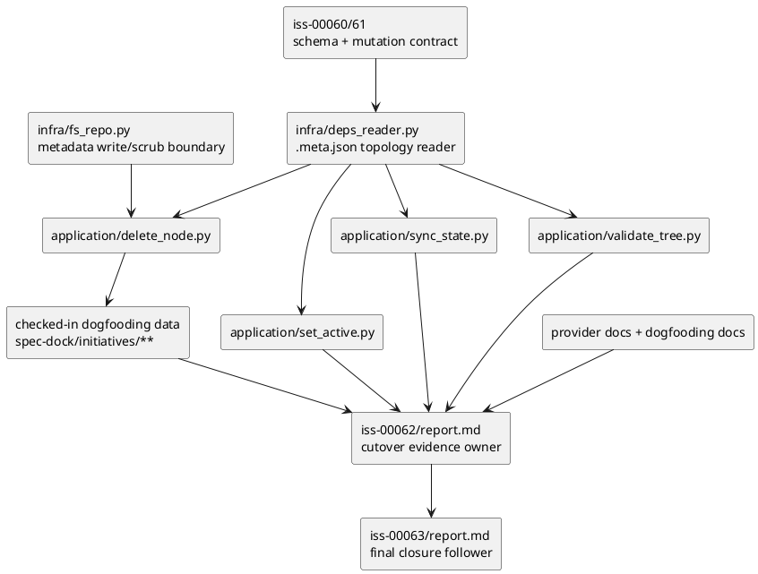

# iss-00062 Downstream parity and cutover readiness — 設計（HOW）

## 目的・制約
- 目的:
  - downstream command 群の dependency 解釈を `.meta.json` SoT に一本化し、T3 integration で cutover readiness と hard cutover judgment を閉じる。
  - delete scrub、active/sync/validate parity、docs/manual fix/evidence/report schema を、実装可能な slice に分解する。
- MUST / MUST NOT:
  - MUST:
    - `.meta.json` を唯一の dependency SoT として downstream read path を揃える。
    - delete 時の dependency scrub を fail-closed contract として固定する。
    - docs 更新、manual fix、`validate` / `sync` evidence を judgment 前に完了させる。
    - `iss-00062/report.md` に cutover evidence の fixed key を残せるようにする。
  - MUST NOT:
    - `deps.json` fallback read や dual-read を downstream parity のために残さない。
    - T4 (`iss-00063`) に judgment fixation を持ち越さない。
    - manual fix を runtime auto-migration に置き換えない。
- 非交渉制約:
  - provider-side source of truth は `src/spec_dock/assets/spec_dock/...` にある。
  - hard cutover judgment は T3 で fixed にする。
  - cutover evidence の正本は issue-level `report.md` に置く。
- 前提:
  - `iss-00060` と `iss-00061` が `.meta.json` schema / reader / mutation contract を提供済みである。
  - checked-in dogfooding data 配下には legacy `deps.json` が残っており、manual fix 対象になる。

## 既存実装 / 規約の理解
- 参照した実装 / docs:
  - `src/spec_dock/assets/spec_dock/scripts/spec_dock_runtime/application/delete_node.py`
  - `src/spec_dock/assets/spec_dock/scripts/spec_dock_runtime/application/set_active.py`
  - `src/spec_dock/assets/spec_dock/scripts/spec_dock_runtime/application/sync_state.py`
  - `src/spec_dock/assets/spec_dock/scripts/spec_dock_runtime/application/validate_tree.py`
  - `src/spec_dock/assets/spec_dock/scripts/spec_dock_runtime/infra/deps_reader.py`
  - `src/spec_dock/assets/spec_dock/scripts/spec_dock_runtime/infra/fs_repo.py`
  - `src/spec_dock/assets/spec_dock/docs/reference_deps.md`
  - `src/spec_dock/assets/spec_dock/docs/reference_sync.md`
  - `src/spec_dock/assets/spec_dock/docs/workflow_issue.md`
  - `spec-dock/docs/reference_deps.md`
  - `spec-dock/docs/reference_sync.md`
  - `spec-dock/docs/workflow_issue.md`
  - `tests/cli_runtime/test_delete.py`
  - `tests/cli_runtime/test_active.py`
  - `tests/cli_runtime/test_sync.py`
  - `tests/cli_runtime/test_validate.py`
  - `tests/cli_runtime/test_runtime_delete_s13.py`
  - `tests/cli_runtime/test_runtime_active_s06.py`
  - `tests/cli_runtime/test_runtime_deps_s04.py`
  - `tests/cli_runtime/test_runtime_validate_s02.py`
  - `tests/test_init_update.py`
- 現状理解:
  - downstream command は application layer から `deps_topology_reader.load_issue_depends_on_map()` に依存しているため、SoT 統一の起点は `infra/deps_reader.py` になる。
  - `infra/deps_reader.py` は現時点で `deps.json` を直接読む契約を持っており、cutover 後に downstream parity を揃えるにはこの境界の更新が必要である。
  - `delete_node.py` は dependency source を scrub する責務を持つため、SoT 変更後に stale edge を残さない contract を最初に固定する必要がある。
  - `set_active.py`、`sync_state.py`、`validate_tree.py` は同じ topology reader を使っていても、テストと docs が旧 SoT を残していると parity が崩れる。
  - docs と checked-in dogfooding data には `deps.json` 前提が残っているため、T3 では runtime 変更だけでなく operator-facing contract と repo data の manual fix が必要である。
  - cutover/manual-fix 案内の docs 正本は provider-side の `reference_deps.md` / `reference_sync.md` / `workflow_issue.md` に置き、dogfooding 側は同名 mirror を更新対象にそろえると既存の reference/workflow 分割と矛盾しない。
  - 採用するパターン:
  - dependency topology は infra reader で集中解決し、application 側は共通 topology を消費する。
  - provider docs を先に更新し、その後 dogfooding mirror と checked-in data を追従させる。
  - cutover evidence は `report.md` の session log に fixed key を残す。
- 採用しないもの:
  - command ごとの個別 dependency 解釈
  - cutover judgment を epic `report.md` だけに集約する形
  - runtime fallback による legacy `deps.json` 自動救済
- 影響範囲:
  - `application/delete_node.py`
  - `application/set_active.py`
  - `application/sync_state.py`
  - `application/validate_tree.py`
  - `infra/deps_reader.py`
  - `infra/fs_repo.py`
  - downstream parity tests
  - provider docs / dogfooding docs mirror
  - checked-in dogfooding data (`spec-dock/initiatives/**`)
  - `iss-00062/report.md` に残す evidence shape

## 採用方針 / トレードオフ
- 論点:
  - downstream command ごとに SoT 変換を持つか、topology reader で統一するか。
  - cutover evidence を epic report に集約するか、T3 issue report を primary owner にするか。
- 選択肢:
  - Option A:
    - downstream use case ごとに `.meta.json` を直接解釈し、必要に応じて legacy file を無視する。
  - Option B:
    - `infra/deps_reader.py` を `.meta.json` SoT の単一 reader にし、delete / active / sync / validate はその topology を共有する。
  - Option C:
    - cutover evidence を epic `report.md` に集約し、issue report は補助証跡にする。
  - Option D:
    - `iss-00062/report.md` を hard cutover judgment の primary evidence とし、`iss-00063/report.md` は final closure でそれを参照する。
- 決定:
  - topology read は Option B を採る。
  - evidence owner は Option D を採る。
  - 理由:
    - topology reader を共有しないと downstream parity を test で固定しにくい。
    - T3/T4 owner split を issue report まで落とさないと judgment responsibility が曖昧になる。

## 依存関係分析
- upstream / prerequisite:
  - `iss-00060`:
    - `.meta.json` dependency schema と reader boundary
  - `iss-00061`:
    - `deps add/remove` mutation contract
  - `infra/deps_reader.py`:
    - downstream application が共有する topology source
  - checked-in dogfooding data:
    - T3 cutover evidence の前提入力
- downstream / dependent:
  - `application/delete_node.py`:
    - scrub contract を提供し、削除後の topology 整合を先に作る
  - `application/set_active.py`
  - `application/sync_state.py`
  - `application/validate_tree.py`
  - docs / report contract
  - `iss-00063`:
    - T3 judgment fixed を受けて final closure を行う
- 実装起点:
  - 先に delete scrub と topology read boundary を固定し、保存後 graph が壊れないことを保証する。
  - 次に active/sync/validate parity をそろえ、最後に docs/manual fix/evidence を束ねて judgment を固定する。
- sequencing implications:
  - plan は `delete scrub -> active/sync/validate parity -> docs/report contract -> manual fix + validate/sync evidence` の順に組む。

### UML（必須: module / dependency）

## インターフェース契約
- dependency read boundary:
  - `deps_topology_reader.load_issue_depends_on_map(specdock_dir, graph)` は `.meta.json` だけを SoT として `issue_depends_on_map` を返す。
  - checked-in `deps.json` が残っている状態は supported normal path にしない。manual fix 前提から外れた repo は boundary failure または explicit remediation message の対象とする。
- delete scrub contract:
  - node 削除前に inbound dependency を列挙し、`.meta.json` 上の参照を scrub したうえで保存する。
  - scrub 後は同じ topology reader で validate し、dangling dependency が残る場合は fail-closed にする。
- downstream parity contract:
  - `set_active.py`、`sync_state.py`、`validate_tree.py` は同じ `issue_depends_on_map` を使う。
  - readiness / blockers / edge rendering / validation error は同じ graph snapshot から導かれる。
  - AC-001 の post-delete downstream 検証では、delete 完了後の同一 snapshot に対して `validate` / `sync` / `active set` の targeted regression を実行し、削除済み node id が blockers、issue edges、validation error、active-set readiness 判定に再出現しないことを固定する。
- docs placement contract:
  - provider-side docs 正本は `src/spec_dock/assets/spec_dock/docs/reference_deps.md`、`src/spec_dock/assets/spec_dock/docs/reference_sync.md`、`src/spec_dock/assets/spec_dock/docs/workflow_issue.md` の 3 点とする。
  - dogfooding docs mirror の更新対象は `spec-dock/docs/reference_deps.md`、`spec-dock/docs/reference_sync.md`、`spec-dock/docs/workflow_issue.md` の 3 点に限定し、README / guide はリンク整合が崩れない限り対象外とする。
  - checked-in dogfooding data の manual-fix 手順は `reference_deps.md` に置き、`reference_sync.md` には `validate` / `sync` による cutover verification と evidence 採取手順を置く。
  - T3/T4 owner split と issue report evidence contract は `workflow_issue.md` に置き、`iss-00062/report.md` を primary evidence、`iss-00063/report.md` を follow-up consumer として案内する。
- cutover evidence contract:
  - hard cutover judgment の primary owner は `iss-00062`。
  - `iss-00062/report.md` には、少なくとも次の fixed key を残せるようにする。
    - `cutover_entry.docs_update.paths`
    - `cutover_entry.docs_update.pass`
    - `cutover_entry.manual_fix.paths`
    - `cutover_entry.manual_fix.pass`
    - `cutover_entry.boundary_tests`
    - `cutover_entry.validate.command`
    - `cutover_entry.validate.exit_code`
    - `cutover_entry.validate.pass`
    - `cutover_entry.sync.command`
    - `cutover_entry.sync.exit_code`
    - `cutover_entry.sync.pass`
    - `cutover_entry.targeted_regression_summary.scope`
    - `cutover_entry.targeted_regression_summary.results`
    - `cutover_entry.targeted_regression_summary.pass`
    - `cutover_entry.entry_conditions_pass`
    - `cutover_judgment.owner_issue_id`
    - `cutover_judgment.owner_role`
    - `cutover_judgment.verdict`
    - `cutover_judgment.fixed_at`
    - `cutover_judgment.follow_up_issue_id`
    - `cutover_judgment.notes`
  - `iss-00063/report.md` は `cutover_judgment.follow_up_issue_id=iss-00063` を参照し、T3 judgment を上書きしない。

## クラス / インターフェース詳細設計
- 新規 class 導入:
  - なし
- responsibility:
  - 既存 use case / port / infra boundary の責務分割を維持する。
- collaboration:
  - topology read は `infra/deps_reader.py`
  - scrub/write は `infra/fs_repo.py` と `application/delete_node.py`
  - downstream parity は `application/{set_active,sync_state,validate_tree}.py`
  - evidence owner は `iss-00062/report.md`

## 変更計画
- Add:
  - cutover boundary test
  - report fixed-key contract を記述する evidence block
- Modify:
  - `src/spec_dock/assets/spec_dock/scripts/spec_dock_runtime/application/delete_node.py`
  - `src/spec_dock/assets/spec_dock/scripts/spec_dock_runtime/application/set_active.py`
  - `src/spec_dock/assets/spec_dock/scripts/spec_dock_runtime/application/sync_state.py`
  - `src/spec_dock/assets/spec_dock/scripts/spec_dock_runtime/application/validate_tree.py`
  - `src/spec_dock/assets/spec_dock/scripts/spec_dock_runtime/infra/deps_reader.py`
  - `src/spec_dock/assets/spec_dock/scripts/spec_dock_runtime/infra/fs_repo.py`
  - downstream parity tests
  - provider docs / dogfooding docs mirror
  - checked-in dogfooding data の `.meta.json`
- Delete:
  - checked-in dogfooding data 配下で legacy dependency source として残る `spec-dock/initiatives/**/deps.json`
- Move/Rename:
  - なし
- Read only:
  - epic-00059 上位 docs
  - `iss-00063` spec（参照のみ）

## 要件 → 設計マッピング
- AC-001 -> delete scrub contract + post-delete `validate` / `sync` / `active set` non-observation regression
- AC-002 -> shared topology reader による active/sync/validate parity
- AC-003 -> docs/manual fix/evidence bundle + T3 judgment fixation
- AC-004 -> `iss-00062/report.md` fixed key contract + `iss-00063` follow-up ownership
- EC-001 -> multi-inbound scrub or fail-closed detection
- EC-002 -> legacy file 残存時の boundary failure
- EC-003 -> evidence incomplete なら judgment fixed に進めない gate
- EC-004 -> parity mismatch 発見時の stop-and-record policy
- constraint -> provider-side SoT / no fallback / T3 owner fixed

## テスト戦略
- Unit:
  - delete scrub と topology read の境界を、個別 use case / infra test で固定する。
- Integration:
  - `tests/cli_runtime/test_delete.py`
  - `tests/cli_runtime/test_runtime_delete_s13.py`
  - `tests/cli_runtime/test_active.py`
  - `tests/cli_runtime/test_sync.py`
  - `tests/cli_runtime/test_validate.py`
  - `tests/cli_runtime/test_runtime_active_s06.py`
  - `tests/cli_runtime/test_runtime_deps_s04.py`
  - `tests/cli_runtime/test_runtime_validate_s02.py`
  - `tests/test_init_update.py` の relevant parity / asset update coverage
- E2E / manual:
  - `./spec-dock/scripts/spec-dock validate`
  - `./spec-dock/scripts/spec-dock sync`
  - `find spec-dock/initiatives -name 'deps.json' | sort`
- migration / rollback / feature flag if needed:
  - feature flag なし
  - rollback は T3 issue 差分の revert で扱い、fallback reader は導入しない

## 要件 / 例外 -> verification mapping
- AC-001 -> delete runtime tests + post-delete `validate` / `sync` / `active set` targeted regression + CLI evidence
- AC-002 -> active/sync/validate targeted runtime tests + CLI evidence
- AC-003 -> docs diff + manual-fix diff + `validate` / `sync` evidence + report record
- AC-004 -> issue spec review + report fixed-key presence review
- EC-001 -> multi-inbound delete scenario test
- EC-002 -> cutover boundary test + manual-fix precondition check
- EC-003 -> report review
- EC-004 -> parity mismatch reproducer and report entry
- constraint -> final diff review で fallback / dual-read 不導入を確認

## リスク / 移行 / ロールバック
- risk:
  - checked-in dogfooding data の manual fix scope が広く、取りこぼすと `validate` / `sync` evidence が不成立になる。
  - downstream parity を command ごとに直すと、reader contract が再び分岐する。
  - docs だけ先に更新すると、dogfooding data と runtime が追いつく前に運用誤認を生む。
- migration:
  - runtime fallback なしで hard cutover するため、manual fix と docs 更新が migration 本体になる。
- rollback:
  - T3 diff を issue 単位で戻す。`.meta.json` SoT の設計自体は巻き戻さない。

## 未確定事項
- なし:
  - entry 条件、owner split、judgment timing は epic で固定済み
