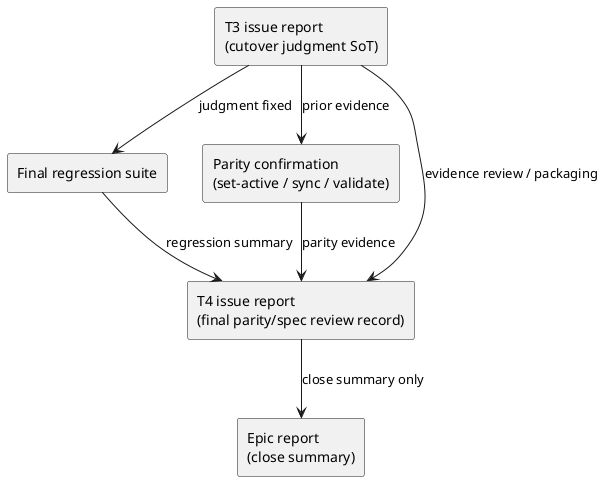

# iss-00063 Final regression parity and cutover closure — 設計（HOW）

## 目的・制約
- 目的:
  - T4 closure issue を、再実装ではなく final evidence aggregation / review / report close-out の execution contract として固定する。
  - `E-AC-005` の final parity / spec review / epic close summary を reviewer が一本道で追える設計にする。
- MUST / MUST NOT:
  - MUST:
    - T3 cutover judgment fixed を入力として扱う。
    - final regression suite、parity confirmation、T3 evidence bundle review、T4 issue `report.md`、epic `report.md` の 5 deliverable を設計上の主要出口にする。
    - final regression suite の正本、review-only inherited item、rerun-required item、pass 条件、記録先を fixed contract として設計に落とす。
    - `same dependency graph` の canonical graph 表現、command ごとの観測値、mismatch 条件を fixed contract として設計に落とす。
    - evidence 欠落時の blocker path を明記する。
    - `iss-00062/report.md` 完了状態（frontmatter `状態: "approved"` + 本文 evidence complete） を T4 close-out execution の開始前提として明記し、本文 evidence と frontmatter/status が不整合な場合の blocker path を明記する。
  - MUST NOT:
    - T3 evidence の primary ownership を奪わない。
    - source code / runtime contract 変更を plan に含めない。
    - T3 entry 条件の再実施を close 条件にしない。
- 非交渉制約:
  - T4 issue `report.md` が `E-AC-005` final closure の正本。
  - epic `report.md` は close summary のみを保持し、詳細 evidence index にはしない。
  - epic `report.md` を更新できるのは S04 close reporting step のみとし、S02/S03/S90 は issue `report.md` だけを更新対象にする。
  - `workflow_issue.md` に従い、required command / review / report update が pass しない限り complete にしない。
- 前提:
  - `iss-00062/report.md` が hard cutover judgment の正本として存在し、template / placeholder ではなく本文 evidence を持っている。
  - T4 では docs/report 更新と command evidence 取得のみを扱う。

## 既存実装 / 規約の理解
- 参照した実装 / docs:
  - epic `requirement.md`
  - epic `design.md`
  - epic `plan.md`
  - `iss-00062/report.md`
  - `spec-dock/docs/workflow_issue.md`
  - `spec-dock/docs/phase_plan_issue.md`
- 現状理解:
  - epic plan は `iss-00063` を T4 closure owner と定義し、deliverable を final regression suite、parity confirmation、T3 evidence bundle review / packaging、T4 issue `report.md`、epic `report.md` に固定している。
  - T3 issue `report.md` は hard cutover judgment の正本であり、T4 はその entry 条件を再充足するのではなく、最終回帰・parity・spec review をもって epic close 可能性を判断する。
  - current repo では `iss-00062/report.md` に cutover judgment と focused suite の実測記録が残っている一方、frontmatter/status はなお `draft` のため、T4 では metadata/status 整合確認を prerequisite に含め、未解消の間は blocker として停止する必要がある。
  - issue workflow 上、close-out evidence と reviewer verdict は `report.md` に残す必要がある。
- 採用するパターン:
  - report-centered closure pattern:
    - 実行コマンド、review verdict、evidence index、close summary への転記先を `report.md` 起点で設計する。
  - append-only evidence review:
    - T3 report は rewrite せず、T4 report 側で review 結果と参照先を追加する。
  - fail-closed closure:
    - evidence 欠落、command failure、report 不整合があれば epic close を止める。
- 採用しないもの:
  - T3 report の代替として T4 report を使うこと。
  - final close のために新しい runtime fallback や補修コードを導入すること。
  - epic `report.md` を詳細 evidence の正本にすること。
- 影響範囲:
  - `spec-dock/initiatives/init-local-00003-architecture-maintenance-and-hardening/epics/epic-00059-dependency-metadata-unification-and-command-mutation/issues/iss-00063-final-regression-parity-and-cutover-closure/requirement.md`
  - `spec-dock/initiatives/init-local-00003-architecture-maintenance-and-hardening/epics/epic-00059-dependency-metadata-unification-and-command-mutation/issues/iss-00063-final-regression-parity-and-cutover-closure/design.md`
  - `spec-dock/initiatives/init-local-00003-architecture-maintenance-and-hardening/epics/epic-00059-dependency-metadata-unification-and-command-mutation/issues/iss-00063-final-regression-parity-and-cutover-closure/plan.md`
  - 実行時は `spec-dock/initiatives/init-local-00003-architecture-maintenance-and-hardening/epics/epic-00059-dependency-metadata-unification-and-command-mutation/issues/iss-00063-final-regression-parity-and-cutover-closure/report.md`
  - 実行時は `spec-dock/initiatives/init-local-00003-architecture-maintenance-and-hardening/epics/epic-00059-dependency-metadata-unification-and-command-mutation/report.md`
  - read only:
    - `spec-dock/initiatives/init-local-00003-architecture-maintenance-and-hardening/epics/epic-00059-dependency-metadata-unification-and-command-mutation/issues/iss-00062-downstream-parity-and-cutover-readiness/report.md`
    - epic `requirement.md` / `design.md` / `plan.md`

## 採用方針 / トレードオフ
- 論点:
  - T4 close evidence を epic `report.md` に集約するか、issue `report.md` を正本にするか。
  - final regression / parity confirmation で drift が見つかった場合に、T4 で補修まで扱うか、closure stop に徹するか。
- 選択肢:
  - Option A:
    - epic `report.md` を detailed evidence index にし、issue `report.md` は補助記録に留める。
  - Option B:
    - issue `report.md` を detailed evidence / review の正本とし、epic `report.md` は close summary へ限定する。
- 決定:
  - Option B を採る。
  - 理由:
    - epic requirement/design/plan の owner 設計に一致する。
    - issue workflow の report-centered evidence contract と整合する。
    - T3/T4 ownership を最小差分で保てる。

## 依存関係分析
- upstream / prerequisite:
  - `iss-00062/report.md` の hard cutover judgment evidence
  - epic `requirement.md` / `design.md` / `plan.md`
  - current repo state に対する `set-active` / `sync` / `validate`
- downstream / dependent:
  - `iss-00063/report.md` final parity/spec review record
  - epic `report.md` close summary
  - epic final close review verdict
- 実装起点:
  - 先に T3/T4 ownership と required evidence surface を固定し、その後に regression / parity / review / report の順で close path を組む。
- sequencing implications:
  - plan では S01 で issue docs を固定し、`iss-00062/report.md` の本文 evidence と frontmatter/status が 完了状態（frontmatter `状態: "approved"` + 本文 evidence complete） として整合することを確認してから S02 で command / regression evidence、S03 で T3 bundle review / packaging、S04 で close record / close summary、最後に docs refresh と final diff review を置く。
  - S02/S03/S90 は epic `report.md` を更新しない。epic `report.md` の更新は S04 close reporting にのみ属する。

### UML（必須: module / dependency）

## インターフェース契約
- baseline boundary:
  - input:
    - epic `requirement.md` / `design.md` / `plan.md`
    - `iss-00062/report.md`
    - `iss-00063` issue docs
  - output:
    - T4 closure scope、ownership、deliverable が固定された issue spec
- regression boundary:
  - input:
    - T3 judgment fixed 後の repo state
    - fixed final regression suite
  - output:
    - final regression summary
    - pass / fail / blocked verdict
- final regression suite contract:
  - source of truth:
    - 本 issue `requirement.md` AC-001 / TERM-002 を suite 正本とし、実行時 evidence の正本は T4 issue `report.md` に置く。
  - review-only inherited item:
    - `python -m unittest tests.cli_runtime.test_delete tests.cli_runtime.test_runtime_delete_s13 tests.cli_runtime.test_active tests.cli_runtime.test_sync tests.cli_runtime.test_validate -v`
    - `python -m unittest tests.cli_runtime.test_active tests.cli_runtime.test_sync tests.cli_runtime.test_validate tests.cli_runtime.test_runtime_active_s06 tests.cli_runtime.test_runtime_deps_s04 tests.cli_runtime.test_runtime_validate_s02 -v`
    - `python -m unittest tests.test_init_update.TestInitUpdate.test_init_creates_expected_structure tests.test_init_update.TestInitUpdate.test_init_does_not_seed_legacy_node_deps_json_templates tests.test_init_update.TestInitUpdate.test_checked_in_dogfooding_mirror_templates_match_provider_assets tests.test_init_update.TestInitUpdate.test_reference_sync_doc_matches_bundled_asset tests.test_init_update.TestInitUpdate.test_reference_deps_doc_matches_bundled_asset tests.test_init_update.TestInitUpdate.test_workflow_issue_doc_matches_bundled_asset tests.test_init_update.TestInitUpdate.test_checked_in_dogfooding_runtime_subprocess_numeric_deps_overlap_parity tests.test_init_update.TestInitUpdate.test_checked_in_dogfooding_runtime_subprocess_scoped_deps_ref_parity tests.test_init_update.TestInitUpdate.test_checked_in_dogfooding_runtime_subprocess_numeric_deps_ref_foreign_only_fail_closed_parity -v`
    - `python -m unittest -v tests.test_init_update.TestInitUpdate.test_checked_in_dogfooding_runtime_mirror_match_provider_assets tests.test_init_update.TestInitUpdate.test_checked_in_dogfooding_initiatives_do_not_ship_legacy_deps_json tests.test_init_update.TestInitUpdate.test_checked_in_dogfooding_runtime_subprocess_validate_and_sync_on_cutover_snapshot tests.test_init_update.TestInitUpdate.test_checked_in_dogfooding_runtime_subprocess_deps_mutation_on_cutover_snapshot tests.test_init_update.TestInitUpdate.test_init_creates_expected_structure tests.test_init_update.TestInitUpdate.test_init_does_not_seed_legacy_node_deps_json_templates tests.test_init_update.TestInitUpdate.test_checked_in_dogfooding_mirror_templates_match_provider_assets`
  - rerun-required item:
    - `./spec-dock/scripts/spec-dock sync`
    - `./spec-dock/scripts/spec-dock validate`
    - `./spec-dock/scripts/spec-dock active set <target-id>`。`<target-id>` は `iss-00062/report.md` で active parity 観測対象として固定済みの id を参照する。
  - substitution rule:
    - review-only inherited item は、`iss-00062/report.md` に command line、exit code、pass verdict、対象 test 名が揃っている場合だけ T4 の evidence review で代替できる。step gate の rerun-required test には含めない。
    - `python -m unittest tests.cli_runtime.test_runtime_active_s06 tests.cli_runtime.test_runtime_deps_s04 -v` は `iss-00062/report.md` S02 の flaky-check subset であり、fixed inherited suite には含めない。T4 では supplemental evidence としてのみ参照できる。
    - rerun-required item は T4 で再実行し、review だけで代替してはならない。
  - pass rule:
    - review-only inherited item が全件 traceable で、rerun-required item が全件 pass し、いずれも T4 issue `report.md` に verdict を残した場合だけ suite `pass` とする。
- parity boundary:
  - input:
    - `set-active` / `sync` / `validate` 実行結果
  - output:
    - downstream command が同一 dependency graph を扱うことの confirmation
    - mismatch 時の blocker record
- same dependency graph contract:
  - canonical graph:
    - `.meta.json` SoT から導く正規化 `issue_depends_on_map` を `issue_id -> depends_on_id` の sorted unique tuple 集合として扱う。
  - observed values:
    - `active set <target-id>`:
      - `target_id`
      - `ready` / `blocked` verdict
      - `blocker_ids` sorted list
    - `sync`:
      - rendered edge tuple 集合
      - artifact / stdout が示す dependency error の有無
    - `validate`:
      - exit code
      - validation error edge の有無
      - pass / fail verdict
  - mismatch condition:
    - tuple 集合の欠落/追加/重複。
    - `active set` の `blocker_ids` が同一 graph snapshot から導かれる依存集合と一致しない。
    - `sync` / `validate` のどちらかが、他 command が観測していない edge または error を示す。
    - 同一 repo snapshot で採った観測として説明できない。
- evidence review boundary:
  - input:
    - `iss-00062/report.md`
    - T3 evidence references
  - output:
    - T3 evidence bundle review result
    - packaged evidence index in T4 issue `report.md`
- close reporting boundary:
  - input:
    - regression summary
    - parity summary
    - T3 evidence review result
    - final spec review verdict
  - output:
    - T4 issue `report.md` final parity/spec review record
    - epic `report.md` close summary
  - step ownership:
    - epic `report.md` を更新できるのは S04 のみ。
    - S02/S03/S90 は issue `report.md` の evidence と wording だけを扱い、epic `report.md` を先行更新しない。
- escalation boundary:
  - trigger:
    - evidence 欠落
    - required command failure
    - report 間の close claim mismatch
    - `iss-00062/report.md` incomplete、frontmatter/status と本文 evidence の不整合、または active parity 用 `<target-id>` 不明
  - behavior:
    - `report.md` に blocker / next action を残し、epic close を止める
  - owner:
    - reviewer judgement / follow-up issue

## クラス / インターフェース詳細設計（必要時）
- Class / Interface:
  - 該当なし
- responsibility:
  - この issue は code surface 追加ではなく docs / report / evidence aggregation を扱う
- collaboration:
  - T3 report を入力に、T4 report と epic report を close artifact として仕上げる

## 変更計画
- Add:
  - なし
- Modify:
  - `spec-dock/initiatives/init-local-00003-architecture-maintenance-and-hardening/epics/epic-00059-dependency-metadata-unification-and-command-mutation/issues/iss-00063-final-regression-parity-and-cutover-closure/requirement.md`
  - `spec-dock/initiatives/init-local-00003-architecture-maintenance-and-hardening/epics/epic-00059-dependency-metadata-unification-and-command-mutation/issues/iss-00063-final-regression-parity-and-cutover-closure/design.md`
  - `spec-dock/initiatives/init-local-00003-architecture-maintenance-and-hardening/epics/epic-00059-dependency-metadata-unification-and-command-mutation/issues/iss-00063-final-regression-parity-and-cutover-closure/plan.md`
  - 実行時は `spec-dock/initiatives/init-local-00003-architecture-maintenance-and-hardening/epics/epic-00059-dependency-metadata-unification-and-command-mutation/issues/iss-00063-final-regression-parity-and-cutover-closure/report.md`
  - 実行時は S04 のみ `spec-dock/initiatives/init-local-00003-architecture-maintenance-and-hardening/epics/epic-00059-dependency-metadata-unification-and-command-mutation/report.md`
- Delete:
  - なし
- Move/Rename:
  - なし
- Read only:
  - `spec-dock/initiatives/init-local-00003-architecture-maintenance-and-hardening/epics/epic-00059-dependency-metadata-unification-and-command-mutation/issues/iss-00062-downstream-parity-and-cutover-readiness/report.md`
  - epic `requirement.md` / `design.md` / `plan.md`

## 要件 → 設計マッピング
- AC-001 -> regression boundary、S02 final regression summary
- AC-002 -> parity boundary、S02 parity confirmation
- AC-003 -> evidence review boundary、S03 T3 evidence bundle review / packaging
- AC-004 -> close reporting boundary、S04 final parity/spec review record + epic close summary
- EC-001 -> escalation boundary（evidence 欠落時 block）
- EC-002 -> escalation boundary（drift 検出時 close stop）
- EC-003 -> close reporting boundary + final diff review
- EC-004 -> escalation boundary（prerequisite 不成立時 block）
- constraint -> report-centered closure、issue/evidence ownership 固定

## テスト戦略
- Unit:
  - なし。本 issue は source code を変更しない。
- Integration:
  - final regression suite の review-only inherited item traceability 確認
  - `set-active` / `sync` / `validate` の parity confirmation
- E2E / manual:
  - `iss-00062/report.md` の本文 evidence と frontmatter/status が 完了状態（frontmatter `状態: "approved"` + 本文 evidence complete） として整合する prerequisite check
  - T3 issue `report.md` の evidence bundle review
  - T4 issue `report.md` final parity/spec review record 作成
  - S04 での epic `report.md` close summary review
- migration / rollback / feature flag if needed:
  - rollback は report / docs 更新を戻すのみで、T3 judgment record を書き換えない。

## 要件 / 例外 -> verification mapping
- AC-001 -> regression command / test evidence + T4 issue `report.md`
- AC-002 -> canonical graph tuple + `validate` / `sync` / `set-active` summary + T4 parity section
- AC-003 -> T3 issue `report.md` reference list + T4 packaging section
- AC-004 -> T4 final review record + epic close summary
- EC-001 -> blocker / next action 記録
- EC-002 -> mismatch record + close stop
- EC-003 -> report cross-check + final review verdict
- EC-004 -> prerequisite check + blocker record
- constraint -> no source code diff、T3/T4 ownership note

## リスク / 移行 / ロールバック（必要時）
- risk:
  - T3 evidence bundle の参照粒度が不足していると、T4 close record が narrative-only になり reviewer が追えない。
  - final regression / parity confirmation で drift が見つかった場合、epic close summary を先に書くと false close になる。
- mitigation:
  - T3 evidence review を独立 step にし、欠落時は blocker 化する。
  - epic `report.md` は S04 まで更新しない。
  - `iss-00062/report.md` の本文 evidence と frontmatter/status が 完了状態（frontmatter `状態: "approved"` + 本文 evidence complete） として整合しない限り S02 以降へ進まず、T4 は blocker 記録だけを残す。
- rollback:
  - issue docs / report / epic report の差分 revert のみ。runtime contract や T3 judgment には手を触れない。

## 未確定事項
- 現時点ではなし。
