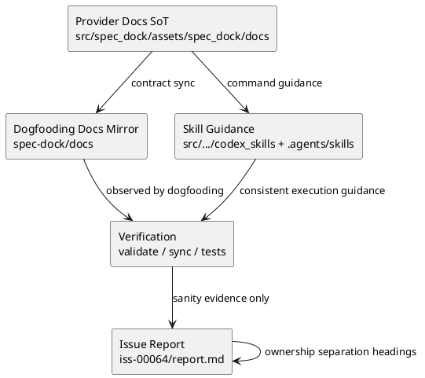

# iss-00064 Update User Facing Docs Help — 設計（HOW）

## 目的・制約
- 目的:
  - 利用者向け docs / guide / workflow / help-adjacent reference / skill を、現行の `.meta.json` only と command-first mutation contract に揃える。
  - README から reference / workflow / skill まで、最初の導線で誤ったコマンドや legacy storage 名を踏ませない。
- MUST / MUST NOT:
  - runtime behavior を変えず、既存実装を説明する docs/help/skill の整合修正に閉じる。
  - `./spec ...` を現行導線として残さない。
  - `.meta.json` only / no dual-read / fail-closed を弱める説明は入れない。
- 非交渉制約:
  - provider-side docs を正本として更新し、dogfooding mirror と skill mirror を同じ契約へ揃える。
  - old doc を残す場合は deprecated / historical であると明示する。
  - runtime 実装領域 `src/spec_dock/assets/spec_dock/scripts/spec_dock_runtime/**` は変更対象外とする。
- 前提:
  - `deps add/remove/check` と `.meta.json` SoT は既に実装済みである。

## epic-00059 との所有境界
- この issue は `epic-00059` の tranche owner を置き換えるものではない。
- `iss-00060` が持つ provider-side dependency docs refresh、`iss-00062` が持つ hard cutover `validate` / `sync` evidence、`iss-00063` が持つ final parity / close review ownership はそのまま維持する。
- `iss-00064` はそれら完了後に見つかった利用者向け docs/help/skill の取りこぼしを閉じる docs-only follow-up issue であり、epic acceptance ownership を再配分しない。
- この issue で再実行する `validate` / `sync` は docs-only follow-up の sanity check と evidence refresh であり、hard cutover judgment や final parity ownership を再定義するものではない。
- `report.md` は次の 2 節を必須とし、ownership 混線を避ける。
  - `## Docs-Only Sanity Checks (iss-00064)`
  - `## Canonical Evidence Owners (read-only references)`

## 既存実装 / 規約の理解
- 参照した実装 / docs:
  - `src/spec_dock/assets/spec_dock/docs/{README.md,guide.md,workflow_issue.md,workflow_epic.md,workflow_initiative.md,workflow_tree.md,workflow_adr.md,reference_deps.md,reference_sync.md,reference_github.md}`
  - `spec-dock/docs/{README.md,guide.md,workflow_issue.md,workflow-issue.md,workflow_epic.md,workflow_initiative.md,workflow-tree.md,workflow_adr.md,workflow-adr.md,reference_deps.md,reference_sync.md,reference_github.md,sync.md,spec-dock-guide-old.md}`
  - `.agents/skills/{spec-driven-tdd-workflow,spec-dock-issue-execution,spec-dock-codex-adapter,spec-dock-copilot-adapter}/SKILL.md`
  - `src/spec_dock/assets/codex_skills/{spec-driven-tdd-workflow,spec-dock-issue-execution,spec-dock-codex-adapter,spec-dock-copilot-adapter}/SKILL.md`
  - `tests/test_init_update.py`
  - `tests/cli_runtime/test_wrappers.py`
- 現状理解:
  - deep reference と CLI help は新 contract に比較的追従している。
  - 入口 docs と old/secondary docs に旧コマンド例や legacy storage 名が残っている。
  - workflow 文書と help-adjacent reference も利用開始面に含まれるため、README/guide だけでは契約を閉じられない。
  - skill 側も required sync/validate は更新されているが、利用者向け command path 表記の再点検が必要である。
  - 既存テストでは asset↔mirror parity と workflow/skill contract の一部を既に検証しており、今回の follow-up はそのテスト面も closed set で扱える。
- 採用するパターン:
  - provider-side source of truth を修正し、対応する mirror docs / skills を同時更新する。
  - old doc は削除ではなく first-line warning + current doc への誘導を優先する。
  - legacy filename に触れる必要がある文書では、legacy/deprecated/historical/no dual-read/manual migration の枠内でのみ説明する。
- 採用しないもの:
  - docs のためだけの CLI help 実装修正。
  - legacy behavior の互換説明。
- 影響範囲:
  - provider-side docs assets
  - dogfooding docs mirror
  - codex skill / local skill mirror
  - docs parity を担保する既存テスト

## 採用方針 / トレードオフ
- 論点:
  - old doc を削除するか、明示的に deprecated 扱いで残すか。
- 選択肢:
  - A: old doc を削除する。
  - B: old doc を残しつつ、historical/deprecated と current entrypoint を明示する。
- 決定:
  - B を採用する。repo 内に old guide が残っていても、誤誘導しない contract に変えるほうが低リスクで、利用者が古い文脈を参照した場合も救済できる。

## 依存関係分析
- upstream / prerequisite:
  - `iss-00060` の provider-side dependency reference docs
  - `iss-00061` / `iss-00062` の command/runtime 実装
  - 現行 CLI help surface
- downstream / dependent:
  - 今後の issue execution や maintainer onboarding
  - skill を使う agent の command invocation guidance
- 実装起点:
  - provider-side README / guide / workflow / reference の command path と contract を先に揃える。
  - 次に dogfooding mirror と old docs を揃える。
  - 最後に skill / test / final verification を行う。
- sequencing implications:
  - 入口 docs と workflow docs を先に固定してから secondary docs と skill を追従させる。
  - review は docs 契約がまとまった単位で回す。

### UML（必須: module / dependency）

## インターフェース契約
- docs contract:
  - 最初の実行例は `./spec-dock/scripts/spec-dock ...` を使う。
  - dependency metadata の canonical storage は `.meta.json` top-level `depends_on` と説明する。
  - dependency mutation は `deps add/remove/check` を主導線として示す。
  - `sync` / `validate` / `deps check` の関係を導線上で説明する。
- legacy wording contract:
  - `deps.json` / `meta.json` は current storage や fallback read/write として説明しない。
  - legacy filename への言及は、次の framing string を伴う文脈に限定する。
    - `legacy`
    - `deprecated`
    - `historical`
    - `no dual-read`
    - `manual migration`
- old-doc contract:
  - old / secondary doc は historical/deprecated であることを先頭で宣言し、current source-of-truth doc にリンクする。
- skill contract:
  - skill 内の command guidance は current command path と workflow docs を参照する。
- report contract:
  - `report.md` には docs-only sanity evidence と canonical owner references を別節で残す。

## 実装対象ファイル集合
- Provider Docs SoT:
  - `src/spec_dock/assets/spec_dock/docs/README.md`
  - `src/spec_dock/assets/spec_dock/docs/guide.md`
  - `src/spec_dock/assets/spec_dock/docs/workflow_issue.md`
  - `src/spec_dock/assets/spec_dock/docs/workflow_epic.md`
  - `src/spec_dock/assets/spec_dock/docs/workflow_initiative.md`
  - `src/spec_dock/assets/spec_dock/docs/workflow_tree.md`
  - `src/spec_dock/assets/spec_dock/docs/workflow_adr.md`
  - `src/spec_dock/assets/spec_dock/docs/reference_deps.md`
  - `src/spec_dock/assets/spec_dock/docs/reference_sync.md`
  - `src/spec_dock/assets/spec_dock/docs/reference_github.md`
- Dogfooding Mirror Docs:
  - `spec-dock/docs/README.md`
  - `spec-dock/docs/guide.md`
  - `spec-dock/docs/workflow_issue.md`
  - `spec-dock/docs/workflow-issue.md`
  - `spec-dock/docs/workflow_epic.md`
  - `spec-dock/docs/workflow_initiative.md`
  - `spec-dock/docs/workflow-tree.md`
  - `spec-dock/docs/workflow_adr.md`
  - `spec-dock/docs/workflow-adr.md`
  - `spec-dock/docs/reference_deps.md`
  - `spec-dock/docs/reference_sync.md`
  - `spec-dock/docs/reference_github.md`
  - `spec-dock/docs/sync.md`
  - `spec-dock/docs/spec-dock-guide-old.md`
- Skills:
  - `src/spec_dock/assets/codex_skills/spec-driven-tdd-workflow/SKILL.md`
  - `src/spec_dock/assets/codex_skills/spec-dock-issue-execution/SKILL.md`
  - `src/spec_dock/assets/codex_skills/spec-dock-codex-adapter/SKILL.md`
  - `src/spec_dock/assets/codex_skills/spec-dock-copilot-adapter/SKILL.md`
  - `.agents/skills/spec-driven-tdd-workflow/SKILL.md`
  - `.agents/skills/spec-dock-issue-execution/SKILL.md`
  - `.agents/skills/spec-dock-codex-adapter/SKILL.md`
  - `.agents/skills/spec-dock-copilot-adapter/SKILL.md`
- Optional Tests:
  - `tests/test_init_update.py`
  - `tests/cli_runtime/test_wrappers.py`
- Issue Docs / Report:
  - `spec-dock/.../iss-00064-update-user-facing-docs-help/requirement.md`
  - `spec-dock/.../iss-00064-update-user-facing-docs-help/design.md`
  - `spec-dock/.../iss-00064-update-user-facing-docs-help/plan.md`
  - `spec-dock/.../iss-00064-update-user-facing-docs-help/report.md`
- Selection Rule:
  - 上記集合以外は原則 read-only とし、追加変更が必要になった場合は requirement/design/plan/report に理由を追記してから扱う。

## 変更計画
- Add:
  - old doc 冒頭の注意書きや current doc への誘導文
  - `report.md` の ownership separation headings
- Modify:
  - 上記 `実装対象ファイル集合` に列挙した docs / skills / issue docs / tests
- Delete:
  - なし
- Move/Rename:
  - なし
- Read only:
  - `src/spec_dock/assets/spec_dock/scripts/spec_dock_runtime/**`
  - `src/spec_dock/cli.py`
  - 上記対象集合以外の runtime / application / domain / infra 実装

## 要件 → 設計マッピング
- AC-001 -> 入口 docs / workflow / skill の command path 統一
- AC-002 -> `.meta.json` / `depends_on` / no dual-read 説明の統一
- AC-003 -> `deps add/remove/check` と `sync` / `validate` 導線の追加
- AC-004 -> old doc の deprecated 化と current doc への誘導
- EC-001 -> old doc の warning banner / link
- EC-002 -> provider-side SoT と mirror の両更新
- EC-003 -> help 出力との照合による docs-only 修正

## テスト戦略
- Unit / contract tests:
  - `tests/test_init_update.py`
    - asset↔mirror parity
    - bundled skill routing contract
    - docs asset presence
  - `tests/cli_runtime/test_wrappers.py`
    - init 後に展開される workflow / reference / template wording contract
- Integration:
  - `./spec-dock/scripts/spec-dock --help`
  - `./spec-dock/scripts/spec-dock deps --help`
  - `./spec-dock/scripts/spec-dock validate`
  - `./spec-dock/scripts/spec-dock sync --github`
- E2E / manual:
  - `実装対象ファイル集合` を横断し、command path・storage 名・mutation 導線が一貫しているかを確認する。
- migration / rollback:
  - rollback は docs / skill / report / test 差分の revert で扱う。runtime compatibility fallback は追加しない。

## 要件 / 例外 -> verification mapping
- AC-001 -> README / guide / workflow 群 / skill 群の command path 照合
- AC-002 -> reference_deps / reference_sync / reference_github / guide / sync の `.meta.json` / `depends_on` / legacy framing 照合
- AC-003 -> README / workflow 群 / reference_deps / skill 群の `deps add/remove/check` / `sync` / `validate` 導線確認
- AC-004 -> `spec-dock/docs/spec-dock-guide-old.md` の warning / cross-link / current path 確認
- EC-001 -> old doc warning 確認
- EC-002 -> provider-side docs と mirror docs の両差分確認
- EC-003 -> help 出力と docs / skills の矛盾がないことを確認

## リスク / 移行 / ロールバック
- リスク:
  - provider-side docs だけ更新して dogfooding mirror や skills が取り残される。
  - old doc の warning が弱く、依然として現行 docs と誤認される。
  - legacy filename の説明が blanket ban になり、必要な historical note まで消してしまう。
- 対応:
  - 対象ファイルを provider/mirror/skill/test/issue-doc の 5 群で固定し、review でもその観点を持つ。
  - old doc の先頭に current doc への具体リンクを置く。
  - legacy mention は allowed framing string を伴う場合だけ許容する。
- ロールバック:
  - docs/skill/report/test 差分を issue 単位で revert する。

## 未確定事項
- なし。
