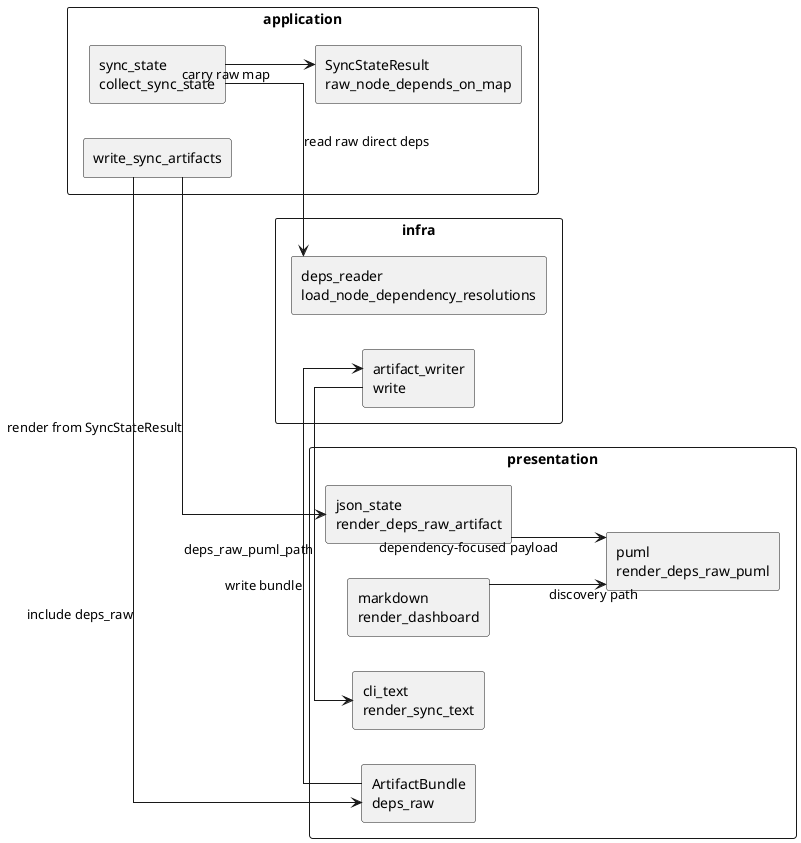
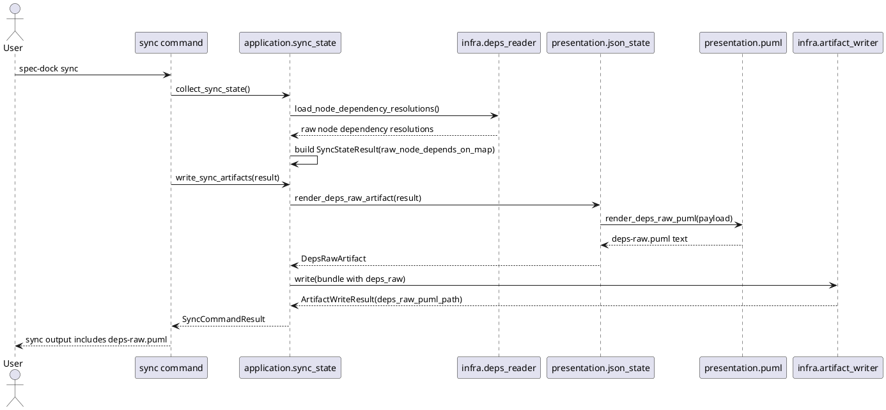

# iss-00192 Generate Raw Dependency View — 設計（どう実現するか）

## 親図（Diagram）参照
- Epic 図:
  - `spec-dock/initiatives/init-local-00003-architecture-maintenance-and-hardening/epics/epic-00059-dependency-metadata-unification-and-command-mutation/design.md`
- Initiative 図:
  - `spec-dock/initiatives/init-local-00003-architecture-maintenance-and-hardening/design.md`
- 再利用する決定:
  - `.meta.json.depends_on` を canonical dependency storage とする。
  - `deps-issues.puml` / `.agent/deps-issues.json` は todo issue-only effective dependency graph のまま維持する。
  - `deps-raw.puml` は generated, human-facing PlantUML artifact であり、mutation source / readiness source / persisted JSON API にはしない。

## 目的・制約
- 目的:
  - `sync` 時に `spec-dock/deps-raw.puml` を生成し、initiative / epic / issue node の `.meta.json.depends_on` に保存された raw direct dependency を階層付きで確認できるようにする。
  - 既存 `deps-issues.puml` が表す issue-level effective dependency とは別に、parent-level / mixed node-kind の direct intent を確認できるようにする。
- 必須:
  - provider-side runtime source under `src/spec_dock/assets/spec_dock/scripts/spec_dock_runtime/` を正本として変更する。
  - dependency-focused subset を描画する。direct dependency participant と、その表示に必要な ancestor initiative / epic package だけを含める。
  - initiative / epic は nested package、issue は package 内 rectangle として描画する。
  - package は白背景・通常境界で、issue state color と dependency edge を主な視覚強調にする。
  - `dashboard.md` と `sync` 完了メッセージに `spec-dock/deps-raw.puml` を表示する。
  - `spec-dock/.gitignore` に generated artifact として追加する。
- 禁止:
  - `deps check`、`deps add/remove`、既存 `deps-issues.puml`、既存 `.agent/deps-issues.json` の意味を変更しない。
  - raw dependency JSON artifact を追加しない。
  - presentation 層で `.meta.json` を再読込しない。
- 非交渉制約:
  - raw direct dependency view は `.meta.json.depends_on` の visualization であり、validation / readiness / mutation の authority ではない。
  - deps preflight failure を許容する `sync --force` では stale graph を残さず、disabled PlantUML を上書きする。
- 前提:
  - valid tree では `infra/deps_reader.py` の `load_node_dependency_resolutions()` が initiative / epic / issue の direct dependency を解決できる。
  - valid tree に direct dependency が 0 件でも `deps-raw.puml` は生成し、no-dependencies note を表示する。

## 既存実装 / 規約の理解
- 参照した実装 / docs:
  - `spec-dock/docs/reference_sync.md`
  - `spec-dock/docs/reference_deps.md`
  - `src/spec_dock/assets/spec_dock/scripts/spec_dock_runtime/application/sync_state.py`
  - `src/spec_dock/assets/spec_dock/scripts/spec_dock_runtime/application/contracts.py`
  - `src/spec_dock/assets/spec_dock/scripts/spec_dock_runtime/infra/deps_reader.py`
  - `src/spec_dock/assets/spec_dock/scripts/spec_dock_runtime/infra/artifact_writer.py`
  - `src/spec_dock/assets/spec_dock/scripts/spec_dock_runtime/presentation/{contracts,json_state,puml,markdown,cli_text}.py`
  - `discussions/20260618t002930z-deps-raw-flat-visual-simulation.puml`
  - `discussions/20260618t004200z-draft-design-deps-raw-renderer.md`
- 現状理解:
  - `collect_sync_state()` は sync state、deps preflight、artifact rendering input を組み立てる。
  - `load_node_dependency_resolutions(specdock_dir, graph)` は `.meta.json.depends_on` の raw direct dependency を node kind を保ったまま解決する。
  - 現状 `collect_sync_state()` は raw direct dependency を validation には使うが、`SyncStateResult` へ保持しない。
  - `render_deps_issues_artifact()` は todo issue-only effective graph を生成する。これは raw direct dependency view の入力に流用しない。
  - `artifact_writer.write()` は root `tree*.puml`、root `deps-issues.puml`、`.agent/*.json`、`dashboard.md` を書き出す。
- 採用するパターン:
  - application contract に raw direct dependency map を追加し、presentation renderer がその contract から PlantUML を生成する。
  - root PlantUML artifact は `ArtifactBundle` と `ArtifactWriteResult` に追加する。
  - disabled deps artifact は既存 `deps-issues` の disabled renderer と同じ考え方で作る。
- 採用しないもの:
  - full tree rendering。
  - hidden anchor node による package endpoint 代替。
  - package color による initiative / epic 強調。
  - edge color / thickness / label suffix による node-kind 別強調。最終採用デザインでは package endpoint / rectangle endpoint / nesting で node-kind を読み分け、edge label は既存 `deps-issues` に合わせて `blocks` に統一する。
- 影響範囲:
  - sync artifact contract、dashboard、CLI output、generated artifact ignore、presentation renderer tests、sync runtime tests。

## 採用方針 / トレードオフ
- 論点:
  - raw direct dependency をどの層で取得し、どの artifact として公開するか。
- 選択肢:
  - A: presentation 層で `.meta.json` を再読込する。
  - B: application 層で raw dependency map を `SyncStateResult` に保持し、presentation 層はそれを描画する。
  - C: `.agent/deps-raw.json` を追加し、PlantUML は JSON から生成する。
- 決定:
  - B を採用する。既存の layered architecture と artifact bundle pattern に合い、raw JSON artifact を増やさずに要件を満たせる。
- 視覚表現の決定:
  - `@startuml`
  - `left to right direction`
  - `skinparam shadowing false`
  - `skinparam linetype ortho`
  - `skinparam packageStyle rectangle`
  - initiative / epic package は白背景・通常境界。
  - issue は state color 付き rectangle。
  - edge は `prerequisite --> dependent : blocks` に統一する。
  - PlantUML source は単独 `.puml` として生成する。
- トレードオフ:
  - node-kind 別に edge label / style を増やすと pattern は明示しやすいが、複雑な図で視覚ノイズが増える。ユーザー確認済みの final mock を優先し、endpoint の形と package nesting で区別する。
  - application contract に field を追加するため fixture 更新が必要になるが、presentation から infra を呼ぶより責務境界が安定する。

## 依存関係分析
- module 依存:
  - `infra.deps_reader` -> raw direct dependency resolution。
  - `application.sync_state` -> `SyncStateResult` assembly and artifact bundle orchestration。
  - `presentation.json_state` -> dependency-focused subset payload construction。
  - `presentation.puml` -> valid / disabled `deps-raw.puml` text rendering。
  - `infra.artifact_writer` -> root `spec-dock/deps-raw.puml` write。
  - `presentation.markdown` / `presentation.cli_text` -> discovery surface。
- file 依存:
  - Contract field 追加後、`ArtifactWriteResult` / `ArtifactBundle` を直接生成する existing tests を更新する必要がある。
  - `.gitignore` は shipped scaffold source `src/spec_dock/assets/spec_dock/.gitignore` を変更する。
- 上流 / 前提:
  - `requirement.md` の AC-001..AC-007 / EC-001..EC-004。
  - requirement fresh `spec-reviewer` pass。
- 下流 / 依存先:
  - `plan.md` は contract 追加、renderer 追加、writer/discovery 追加、tests の順で step を組む。
- 実装起点:
  - まず data contract と raw map population を固定し、その後 renderer と writer/discovery を追加する。
- 順序への影響:
  - contract の変更が下流 tests に波及するため、plan は narrow red/green を step-local に切る。

## モジュール依存図（Module Dependency Diagram）
- タイトル:
  - `deps-raw.puml` artifact generation boundaries
- 答える問い:
  - raw dependency をどの layer からどの layer へ渡し、既存 `deps-issues` の意味をどこで分離するか。
- 範囲:
  - sync state collection、presentation artifact rendering、artifact writing、dashboard / CLI discovery。
- 含めない詳細:
  - 全 class / method call graph。
  - 実際の dependency graph layout。
- 更新条件:
  - raw dependency の source、artifact contract、writer destination、discovery surface が変わるとき。

### 図表（UML / 原則: モジュール依存）


## ローカル図の差分（Local Diagram Delta / 必要時）
- 変更する境界 / 責務 / 相互作用:
  - application 層が raw direct dependency resolution result を `SyncStateResult` へ持ち上げる。
  - presentation 層が raw direct dependency payload と PlantUML text を生成する。
  - infra writer が root `deps-raw.puml` を既存 bundle write に追加する。
- N/A ではない理由:
  - この issue は新 artifact generation boundary を追加するため、責務境界の明示が必要。

## インターフェース契約
- `SyncStateResult.raw_node_depends_on_map: dict[str, list[str]]`
  - key は dependent node id。
  - value は prerequisite node id の sorted list。
  - `.meta.json.depends_on` から解決した direct dependency のみを持つ。
  - readiness 判定や `deps-issues` rendering には使わない。
  - deps preflight failure 時は空 map とし、disabled renderer は `deps_preflight_error` を source にする。
- `DepsRawArtifact`
  - `presentation.contracts` に追加する value object。
  - field は `puml_text: str`。
- `ArtifactBundle.deps_raw: DepsRawArtifact`
  - `deps_issues` と同列の generated artifact として扱う。
- `ArtifactWriteResult.deps_raw_puml_path: str`
  - repo-relative path。期待値は `spec-dock/deps-raw.puml`。
  - `render_sync_text()` の `wrote=` list に含める。
- `render_deps_raw_artifact(result: SyncStateResult) -> DepsRawArtifact`
  - dependency-focused subset payload を作り、`render_deps_raw_puml()` へ渡す。
  - payload は runtime internal であり `.agent/*.json` として書き出さない。
- `render_deps_raw_puml(payload: dict[str, Any]) -> str`
  - valid deps 用 PlantUML を返す。
- `render_deps_raw_disabled_puml(error: str | None) -> str`
  - deps disabled 用 PlantUML を返す。
  - title / note は existing disabled deps style と揃える。

## `deps-raw.puml` payload / rendering contract
- node inclusion:
  - direct dependency edge の dependent と prerequisite を participant として含める。
  - issue participant の ancestor epic / initiative package を含める。
  - epic participant の ancestor initiative package を含める。
  - initiative participant は top-level package として含める。
  - direct dependency に参加しない sibling issue / epic / initiative は含めない。
  - direct participant が done / closed issue でも含める。
  - participant epic / initiative に descendant issue がなくても package endpoint として含める。
- edge inclusion:
  - `raw_node_depends_on_map[dependent]` の各 prerequisite に対して 1 edge を描画する。
  - PlantUML は human-facing `blocks` direction として `prerequisite --> dependent : blocks` を出力する。
  - 同じ edge は deterministic に 1 回だけ描画する。
- state color:
  - active issue: doing color。
  - ready issue: ready color。
  - blocked issue: blocked color。
  - done / closed issue: done color。
  - status 不明または評価不能: unknown color。
  - initiative / epic package は state color を持たない。
- zero dependency:
  - valid tree で edge が 0 件の場合、`@startuml` / skinparam / title / note / `@enduml` を持つ有効な PlantUML を生成する。
  - note には raw direct dependency が存在しないことを示す。
- disabled output:
  - `sync --force` などで deps preflight failure を許容した場合、stale graph ではなく disabled PlantUML を上書きする。
  - note は `deps_preflight_failed`、`deps.valid=false`、`mode=sync --force`、sanitized error を含める。

## シーケンス差分（Sequence Delta）
- 変更する相互作用:
  - `sync` の artifact generation sequence に raw dependency artifact を追加する。
- retry / transaction / external API / queue:
  - 外部 API / queue / transaction はなし。
  - writer は既存どおり sequential write。partial write handling は既存の sync error handling に従う。
- UML:


## ドメインモデル差分（Domain Model Delta）
- aggregate / entity / value object 変更:
  - domain model 自体は変更しない。
  - application/presentation contract として `raw_node_depends_on_map` と `DepsRawArtifact` を追加する。
- domain event / policy / specification 変更:
  - なし。
- 不変条件の変更:
  - dependency validation rule は変更しない。
  - raw direct dependency visualization が readiness source にならないことを維持する。
- UML:
  - N/A: domain entity の追加や永続 schema 変更はない。

## クラス / インターフェース詳細設計
- Class / Interface: `SyncStateResult`
  - 責務: sync 時点の rendered artifact input を application 層から presentation 層へ渡す。
  - 変更: `raw_node_depends_on_map` を追加する。
- Class / Interface: `ArtifactBundle`
  - 責務: writer に渡す generated artifacts をまとめる。
  - 変更: `deps_raw` を追加する。
- Class / Interface: `ArtifactWriteResult`
  - 責務: 書き出した artifact path を CLI / caller へ返す。
  - 変更: `deps_raw_puml_path` を追加する。
- Function: `render_deps_raw_artifact`
  - 責務: `SyncStateResult` から dependency-focused subset payload を作る。
  - 連携: `render_deps_raw_puml` を呼ぶ。
- Function: `render_deps_raw_puml`
  - 責務: raw dependency payload を単独 PlantUML file text に変換する。
  - 連携: existing puml escaping / state styling helpers を必要最小限で再利用または局所抽出する。

## ディレクトリ / ファイル変更計画
```text
src/spec_dock/assets/spec_dock/
|-- .gitignore
|   # 変更: generated deps-raw.puml を ignore 対象に追加
`-- scripts/spec_dock_runtime/
    |-- application/
    |   |-- contracts.py
    |   |   # 変更: SyncStateResult.raw_node_depends_on_map と ArtifactWriteResult.deps_raw_puml_path
    |   `-- sync_state.py
    |       # 変更: raw map population と ArtifactBundle.deps_raw 作成
    |-- infra/
    |   `-- artifact_writer.py
    |       # 変更: spec-dock/deps-raw.puml の書き出し
    `-- presentation/
        |-- contracts.py
        |   # 変更: DepsRawArtifact と ArtifactBundle.deps_raw
        |-- json_state.py
        |   # 変更: render_deps_raw_artifact と subset payload builder
        |-- puml.py
        |   # 変更: valid / disabled deps-raw renderer
        |-- markdown.py
        |   # 変更: dashboard discovery
        `-- cli_text.py
            # 変更: sync wrote output

tests/
|-- unit/presentation/
|   # 追加/変更: deps-raw renderer と dashboard/CLI 表示の contract tests
|-- cli_runtime/
|   # 追加/変更: sync で deps-raw.puml が生成されること、disabled / zero dependency / gitignore
`-- unit/application/ or existing sync tests
    # 追加/変更: raw map population と writer bundle propagation
```

## 要件 → 設計マッピング
- AC-001 -> `ArtifactBundle.deps_raw`、`artifact_writer.write()`、`ArtifactWriteResult.deps_raw_puml_path`、dashboard / CLI discovery。
- AC-002 -> dependency-focused subset builder、issue rectangle rendering、`prerequisite --> dependent : blocks` edge。
- AC-003 -> initiative / epic package endpoint rendering、package nesting、uniform `blocks` edge。
- AC-004 -> mixed package/rectangle endpoint rendering、package nesting、uniform `blocks` edge。
- AC-005 -> `deps-issues` input/output path を変更しない設計、existing regression tests 継続。
- AC-006 -> `render_deps_raw_disabled_puml()` と sync disabled artifact bundle。
- AC-007 -> `src/spec_dock/assets/spec_dock/.gitignore` 更新と ignore test。
- EC-001 -> participant package を descendant issue 展開なしで描画できる subset builder。
- EC-002 -> direct participant と ancestor package だけを含める subset filter。
- EC-003 -> done / closed participant を raw view では除外しない node inclusion rule。
- EC-004 -> zero-dependency valid PlantUML note。
- constraint -> `.meta.json.depends_on` source、no raw JSON artifact、no readiness mutation。

## テスト戦略
- 単体:
  - `render_deps_raw_puml()` が nested package、issue rectangles、uniform `blocks` edges、orthogonal settings を出力する。
  - issue->issue、epic->epic、initiative->initiative、epic->issue、issue->epic の direct dependency を描画できる。
  - nonparticipant sibling を出力しない。
  - done / closed issue participant を raw view に含める。
  - zero-dependency valid PlantUML note を出力する。
  - disabled PlantUML が stale graph ではなく failure note を出力する。
- 統合 / CLI runtime:
  - `./spec-dock/scripts/spec-dock sync` 相当の runtime test で `spec-dock/deps-raw.puml` が生成される。
  - dashboard Observability に `spec-dock/deps-raw.puml` が出る。
  - sync output の `wrote=` list に `spec-dock/deps-raw.puml` が出る。
  - `sync --force` の deps failure case で disabled `deps-raw.puml` が上書きされる。
  - generated artifact ignore contract を確認する。
- regression:
  - existing `deps-issues.puml` / `.agent/deps-issues.json` tests が変わらず通る。
  - `ArtifactWriteResult` / `ArtifactBundle` constructor を使う既存 tests を新 contract に合わせて更新する。
- E2E / manual:
  - 必須ではない。必要なら generated `.puml` の text inspection を manual evidence とする。
- migration / rollback / feature flag:
  - feature flag は不要。additive generated artifact であり rollback は renderer / bundle / writer / discovery / ignore の除去で可能。

## 要件 / 例外 -> 検証マッピング
- AC-001 -> sync runtime test: file existence, dashboard discovery, CLI output。
- AC-002 -> renderer unit test: issue->issue edge and ancestor packages。
- AC-003 -> renderer unit test: epic->epic and initiative->initiative package endpoints。
- AC-004 -> renderer unit test: mixed edge endpoints。
- AC-005 -> existing deps-issues regression tests。
- AC-006 -> sync forced deps failure test and disabled renderer unit test。
- AC-007 -> scaffold ignore test or `git check-ignore` equivalent in temp repo。
- EC-001 -> renderer unit test with empty participant epic package。
- EC-002 -> renderer unit test asserting absent sibling text。
- EC-003 -> renderer unit test asserting done / closed participant inclusion。
- EC-004 -> renderer unit test and sync runtime zero-dependency file existence。

## リスク / 移行 / ロールバック
- リスク:
  - `SyncStateResult` / `ArtifactBundle` / `ArtifactWriteResult` の field 追加で existing tests の fixtures が壊れる。計画で constructor 更新を明示する。
  - PlantUML の package endpoint edge は renderer version により layout が多少変わる。source text contract を tests の主対象にし、rendered image の pixel layout はこの issue の自動検証対象にしない。
  - raw view が readiness source と誤解される可能性がある。dashboard / docs text は "raw direct dependency view" と表現し、`.agent/deps-issues.json` の default dependency view とは分ける。
- 移行:
  - 既存 repos は `spec-dock update` 後の `sync` で新 artifact を得る。
  - data migration は不要。
- ロールバック:
  - contract fields、renderer、bundle writer、dashboard / CLI discovery、ignore entry、tests を戻す。
  - generated `spec-dock/deps-raw.puml` は ignored artifact のため source-of-truth にはならない。

## 未確定事項
- なし。
