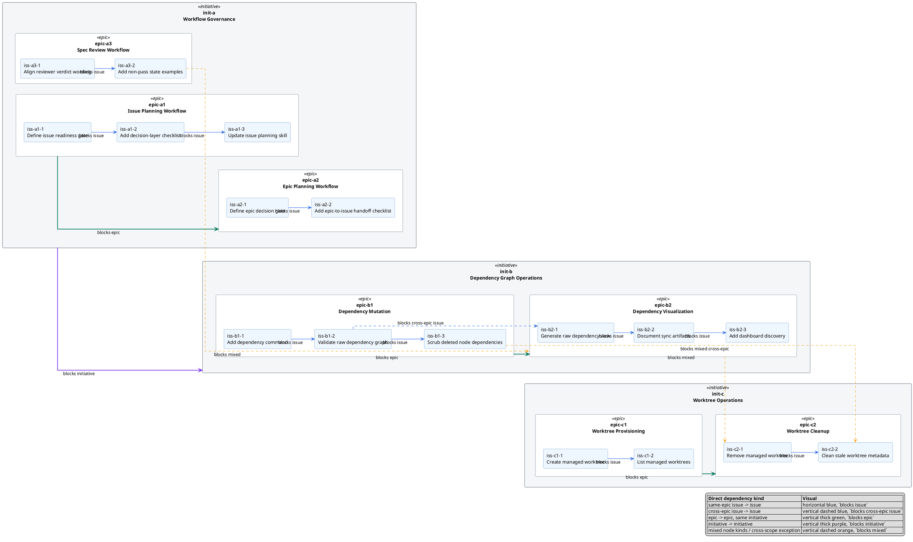

# 20260618t001154z-disc Raw Dependency View Visual Mock

## 位置づけ
- 用途: `deps-raw.puml` の requirement / design を固定する前に、PlantUML の実際の見た目を議論するための visual mock。
- authority: evidence。最終採用された visual decision は `20260618t002930z-deps-raw-flat-visual-simulation.puml` と `report.md` D-002 / EAL-002 に反映済み。
- この artifact は実装対象の最終 renderer ではなく、見た目と読み取り体験を決めるための検討シート。

## 現時点のユーザー判断
- 採用方向:
  - Option 2: package endpoint に直接 dependency edge を引く。
- 却下:
  - Option 1: package 内に dependency endpoint 用 anchor node を置く案。
    - 理由: initiative package の中に initiative node があるように見え、確認しにくい。
  - Option 3: tree context と dependency endpoint を分離する案。
    - 理由: tree と dependency が分離しており、この artifact の目的に合わない。
- 追加要望:
  - よくある依存パターンを中心にした mock scenario に作り直す。
  - 基本パターン:
    - initiative 間の依存。
    - 同じ initiative 内の epic 間の依存。
    - 同じ epic 内の issue 間の依存。
  - 例外パターン:
    - epic が特定 issue に依存する。
    - issue が別 epic に依存する。
    - 必要なら initiative / epic / issue の抽象度をまたぐ mixed dependency も含める。
- 追加判断:
- 同じ epic 内の issue dependency は横方向に表現する。
  - `blocks` direction は prerequisite -> dependent。
  - 左側が着手しやすい prerequisite、右側が依存で後続になる issue として読む。
- epic をまたぐ issue dependency、epic dependency、initiative dependency、mixed dependency は縦方向に表現する。
  - 上側が着手しやすい prerequisite、下側が依存で後続になる node として読む。
- `right` / `down` などの方向指定は使わず、ハイフン数で配置の意図を表現する。
  - same-epic issue dependency は 1 本ハイフン。
  - それ以外の dependency は 2 本ハイフン。

## 対象論点
- initiative / epic は package として nested 表示する。
- issue は package 内の rectangle として表示する。
- direct dependency participant と祖先 package だけを表示する dependency-focused subset を前提にする。
- edge は existing `deps-issues.puml` と同じく human-facing `blocks` direction を基本にする:
  - raw `A depends_on B` は `B --> A : blocks` と読む。
- package-to-package / package-to-node / node-to-package の edge を、anchor node なしで表現する。

## Revised Mock Scenario

より現実的な SpecDock 利用を想定した scenario:

- Initiative A: Workflow Governance
  - Epic A1: Issue Planning Workflow
    - Issue A1-1: Define issue readiness gate
    - Issue A1-2: Add decision-layer checklist
    - Issue A1-3: Update issue planning skill
  - Epic A2: Epic Planning Workflow
    - Issue A2-1: Define epic decision gate
    - Issue A2-2: Add epic-to-issue handoff checklist
  - Epic A3: Spec Review Workflow
    - Issue A3-1: Align reviewer verdict wording
    - Issue A3-2: Add non-pass state examples
- Initiative B: Dependency Graph Operations
  - Epic B1: Dependency Mutation
    - Issue B1-1: Add dependency command
    - Issue B1-2: Validate raw dependency graph
    - Issue B1-3: Scrub deleted node dependencies
  - Epic B2: Dependency Visualization
    - Issue B2-1: Generate raw dependency view
    - Issue B2-2: Document sync artifacts
    - Issue B2-3: Add dashboard discovery
- Initiative C: Worktree Operations
  - Epic C1: Worktree Provisioning
    - Issue C1-1: Create managed worktree
    - Issue C1-2: List managed worktrees
  - Epic C2: Worktree Cleanup
    - Issue C2-1: Remove managed worktree
    - Issue C2-2: Clean stale worktree metadata

Dependency pattern:
- initiative -> initiative:
  - Dependency Graph Operations depends on Workflow Governance.
- same-initiative epic -> epic:
  - Dependency Visualization depends on Dependency Mutation.
  - Worktree Cleanup depends on Worktree Provisioning.
  - Epic Planning Workflow depends on Issue Planning Workflow.
- same-epic issue -> issue:
  - Add decision-layer checklist depends on Define issue readiness gate.
  - Update issue planning skill depends on Add decision-layer checklist.
  - Add epic-to-issue handoff checklist depends on Define epic decision gate.
  - Add non-pass state examples depends on Align reviewer verdict wording.
  - Validate raw dependency graph depends on Add dependency command.
  - Scrub deleted node dependencies depends on Validate raw dependency graph.
  - Document sync artifacts depends on Generate raw dependency view.
  - Generate raw dependency view depends on Validate raw dependency graph.
  - Add dashboard discovery depends on Document sync artifacts.
  - List managed worktrees depends on Create managed worktree.
  - Clean stale worktree metadata depends on Remove managed worktree.
- exception / mixed dependency:
  - Dependency Visualization epic depends on Add non-pass state examples issue.
  - Remove managed worktree issue depends on Dependency Visualization epic.
  - Clean stale worktree metadata issue depends on Scrub deleted node dependencies issue.

## Visual Mock: Option 2 Revised

狙い:
- package endpoint に直接 edge を引く。
- anchor node は置かない。
- よくある依存を太い幹として見せ、例外的な mixed dependency は dashed edge で目立たせる。
- package nesting はそのまま読み、dependency edge は kind label と style で読む。
- `right` / `down` などの方向指定は使わない。
- 同じ epic 内の issue dependency は 1 本ハイフンの edge で表現する。
- epic をまたぐ issue dependency、epic dependency、initiative dependency、mixed dependency は 2 本ハイフンの edge で表現する。
- edge は曲線ではなく、直交線で角張った routing にする。
- hidden layout constraint は使わず、dependency edge そのものをシンプルに描く。

## 読み方
- Blue edge:
  - same-epic issue-level direct dependency。
  - 左側が prerequisite / ready に近い issue、右側が dependent / blocked になり得る issue。
- Purple thick edge:
  - initiative-level direct dependency。
  - 上側が prerequisite / ready に近い initiative、下側が dependent / blocked になり得る initiative。
- Green thick edge:
  - epic-level direct dependency。
  - 上側が prerequisite / ready に近い epic、下側が dependent / blocked になり得る epic。
- Vertical dashed blue edge:
  - issue-level direct dependency だが、epic をまたぐため縦方向にする。
  - same-epic issue dependency とは dashed style と label で区別する。
- Orange dashed edge:
  - mixed node-kind または cross-scope exception。
  - 通常の分解から外れるため、視覚的に目立たせる。

## 評価
- Pros:
  - anchor node がなく、package の中に同名 node が出ない。
  - initiative / epic / issue の階層がそのまま読める。
  - 同じ epic 内で多く発生する issue sequencing を横方向で読める。
  - epic をまたぐ dependency と package-level dependency は縦方向にまとまり、scope をまたぐ依存として読める。
  - 直交線の edge にすることで、複雑な図でも dependency path を追いやすい。
  - 多いケースと例外ケースが edge style / direction / label で区別できる。
  - Existing `deps-issues.puml` の `blocks` 読みを維持できる。
- Cons:
  - package へ直接 edge を引くため、PlantUML layout によっては edge が package 境界や label に近くなる可能性がある。
  - PlantUML の layout engine がハイフン数を完全に厳密な座標制約として扱わない場合、複雑な tree では期待方向から少しずれる可能性がある。
  - package endpoint edge のレンダリングが複雑な tree で安定しない場合、style / grouping 調整が必要になる。

## 推奨反映先
- `requirement.md`:
  - Option 2 を採用し、anchor node を置かない方針を明記する。
  - edge kind の4分類を requirement に反映する。
  - same-epic issue dependency は横、それ以外は縦という direction policy を反映する。
- `design.md`:
  - package alias を edge endpoint とする renderer contract を定義する。
  - issue / epic / initiative / mixed edge style を固定する。
  - same-epic issue edge と cross-scope edge の direction policy を固定する。
  - PlantUML mock を design section に埋め込むか、この disc を design evidence として参照する。
- `plan.md`:
  - same-epic issue dependency、same-initiative epic dependency、initiative dependency、mixed dependency の test fixture を固定する。
  - same-epic issue dependency は 1 本ハイフン、それ以外は 2 本ハイフンの dependency edge になる assertion を含める。
- `report.md` Evidence Adoption Ledger:
  - ユーザーが Option 2 revised mock を採用したら evidence として記録する。

## 次アクション
- この artifact 自体は検討証跡として閉じる。
- 最終採用された visual design は `20260618t002930z-deps-raw-flat-visual-simulation.puml` を参照する。
- canonical reflection は `requirement.md` Q-002、`report.md` D-002 / EAL-002、後続の `design.md` で扱う。
