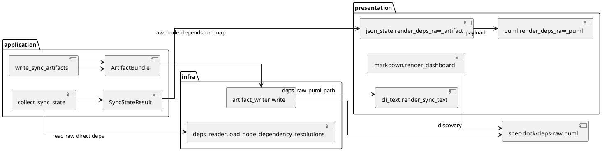

# Draft Design Evidence: deps-raw renderer

This is delegated design evidence for `iss-00192`. It is not canonical design authority. The main orchestrator must verify, adopt, rewrite into canonical `design.md` if appropriate, update `report.md` adoption evidence, and run a fresh `spec-reviewer`.

Source requirement revision used here: `requirement.md` frontmatter `ID: iss-00192`, `状態: draft`, `最終更新: 2026-06-18`. Supporting decision ledger used here: `report.md` D-001, D-002, D-003 and EAL-001, EAL-002, EAL-003 as observed in the issue directory.

## 1. Requirement Coverage

The proposed design covers the accepted requirement scope as follows.

| Requirement / AC | Design coverage |
|---|---|
| Generate `spec-dock/deps-raw.puml` during `sync` | Add a root-level `DepsRawArtifact` to `ArtifactBundle`, write it from `artifact_writer`, and include its path in `ArtifactWriteResult`. |
| Show `.meta.json.depends_on` direct dependency edges | Carry resolved raw node dependencies from `deps_reader.load_node_dependency_resolutions()` into `SyncStateResult`; render those direct node edges, not compiled issue-level effective edges. |
| Dependency-focused subset | Render only direct dependency participants plus ancestor initiative / epic packages required for context. |
| Initiative / epic as nested PlantUML packages, issue as elements | Render initiatives and epics as nested `package`, render issues as colored `rectangle` within their epic package. |
| Human-facing `blocks` direction | Convert raw `dependent depends_on prerequisite` to PlantUML `prerequisite --> dependent : blocks...`. |
| Node-kind pattern distinction | Preserve endpoint kinds through package-vs-rectangle endpoints and add a small edge kind label suffix or style so parent-level and mixed edges are distinguishable without coloring packages. |
| Preserve existing dependency contracts | Leave `deps check`, `deps add/remove`, `.agent/deps-issues.json`, and `deps-issues.puml` semantics unchanged. |
| Dashboard and sync output discovery | Add `spec-dock/deps-raw.puml` to dashboard Observability and `render_sync_text()` wrote list. |
| Generated artifact ignore | Add `spec-dock/deps-raw.puml` to the shipped scaffold ignore contract. |
| Disabled and stale behavior | On deps preflight failure under `sync --force`, write a disabled PlantUML note instead of skipping or leaving stale content. |
| Zero-dependency behavior | Generate a valid PlantUML file containing a no-dependencies note. |

No raw dependency JSON artifact is proposed.

## 2. Existing Context Findings

The current runtime already has the right boundary shape for this change.

- `application/sync_state.py` owns sync collection, deps preflight, artifact bundle construction, and write orchestration.
- `infra/deps_reader.py` already has `load_node_dependency_resolutions(specdock_dir, graph)`, which resolves direct `.meta.json.depends_on` references for initiative / epic / issue nodes without compiling them to issue-only effective dependencies.
- `collect_sync_state()` currently calls `load_node_dependency_resolutions()` only for validation via `validate_raw_node_dependency_graph()`. The raw resolution map is discarded before `SyncStateResult` is returned.
- `presentation/json_state.py` builds `index`, `tree`, and `deps-issues` artifacts from `SyncStateResult`. `deps-issues` intentionally uses todo issue-only effective graph data.
- `presentation/puml.py` has the existing ready-board renderer, disabled deps renderers, and `deps-issues.puml` renderer. It already centralizes aliasing, state colors, `left to right direction`, and `skinparam linetype ortho`.
- `infra/artifact_writer.py` writes root PlantUML artifacts sequentially and returns repo-relative paths through `ArtifactWriteResult`.
- `presentation/markdown.py` and `presentation/cli_text.py` are the current discovery surfaces for dashboard Observability and sync wrote output.

The main design gap is that raw direct dependencies are not part of the sync result contract yet. Re-reading `.meta.json` in the renderer would blur presentation and infra concerns, so the design should extend the application contract instead.

## 3. Design Decisions

1. Add `raw_node_depends_on_map: dict[str, list[str]]` to `SyncStateResult`.
   - Key: dependent node id.
   - Value: sorted prerequisite node ids resolved from `.meta.json.depends_on`.
   - Populated only after deps preflight can safely resolve dependencies.
   - Empty when deps preflight failed; disabled renderer uses `deps_preflight_error` instead.

2. Use `load_node_dependency_resolutions()` as the source for raw direct dependency intent.
   - This keeps `.meta.json.depends_on` as the only storage source.
   - It avoids deriving raw view from `issue_depends_on_map`, because that map is already compiled to issue-level effective dependencies.

3. Keep `deps-raw.puml` as a PlantUML-only root artifact.
   - Do not add `.agent/deps-raw.json`.
   - Do not change `index.json` schema unless needed for existing renderer inputs.

4. Render raw view from `result.graph`, `result.raw_node_depends_on_map`, `result.issue_statuses`, `result.deps_eval_by_id`, and `result.active`.
   - Graph gives structure and node metadata.
   - Raw map gives direct edges.
   - Status/deps evaluation give issue color only; they do not filter nodes.

5. Use dependency-focused subset, not full tree.
   - Full tree is already represented by `tree-all.puml`.
   - Raw dependency view should answer "where are direct dependency intents stored?" rather than duplicate the whole structure.

6. Add a dedicated renderer pair:
   - `render_deps_raw_puml(result_or_payload)` for valid deps.
   - `render_deps_disabled_deps_raw_puml(error=...)` for `sync --force` disabled output.

7. Preserve existing artifact semantics.
   - Existing `deps-issues` payload and renderer should not be modified except for shared helper extraction if the diff remains small.

## 4. Alternatives Considered

| Alternative | Decision | Reason |
|---|---|---|
| Render full canonical tree with all nodes | Rejected | Conflicts with resolved Q-001 dependency-focused subset and duplicates `tree-all.puml`. |
| Build raw view from `.agent/index.json` after rendering index | Rejected | Adds parse/render coupling and makes raw dependency truth indirect. |
| Re-read `.meta.json` inside `presentation/puml.py` | Rejected | Violates layering; presentation should not perform filesystem resolution. |
| Add `.agent/deps-raw.json` | Rejected for this issue | Requirement explicitly scopes out raw dependency JSON artifact. |
| Replace `deps-issues.puml` with raw view | Rejected | Requirement forbids changing issue-level effective dependency view semantics. |
| Put hidden anchor nodes inside packages for package endpoints | Rejected | Superseded visual exploration found this harder to read because packages appeared to contain duplicate endpoint nodes. |
| Color initiative / epic packages by dependency kind | Rejected | Requirement and visual decision prefer white packages, issue state colors, and dependency edges as the main emphasis. |

## 5. Boundary / Contract Model

The boundary model should stay layered.



Contract additions:

- `SyncStateResult.raw_node_depends_on_map`
  - Application-level resolved raw dependencies.
  - Not persisted directly.
  - Does not affect readiness.
- `DepsRawArtifact`
  - Presentation artifact with `puml_text: str`.
- `ArtifactBundle.deps_raw`
  - Write bundle member beside `deps_issues`.
- `ArtifactWriteResult.deps_raw_puml_path`
  - Repo-relative path for CLI output.

## 6. Dependency Analysis

The new renderer depends on existing graph and status data but must not become a readiness source.

- Input dependency: `.meta.json.depends_on` read through `deps_reader`.
- Validation dependency: existing deps preflight and raw graph validation remain the gate.
- Rendering dependency: `puml.py` helper functions for aliasing, escaping, state color mapping, and disabled note formatting can be reused or extracted locally.
- Artifact dependency: `artifact_writer.write()` remains non-atomic. Because it writes sequentially, adding one more file increases partial-write surface; existing `failed_partial_or_stale` handling remains sufficient if the writer includes `deps-raw.puml` in the same bundle write sequence.
- Discovery dependency: CLI output relies on `ArtifactWriteResult`; dashboard is generated before writing but hard-codes repo-relative paths.

No new external dependency is needed.

## 7. Source of Record

The source of record for raw dependency intent is `.meta.json.depends_on` on initiative / epic / issue nodes, resolved by `infra/deps_reader.py`.

The source of record for effective readiness remains the compiled issue-level dependency graph used by `deps check`, `deps-issues.puml`, and `.agent/deps-issues.json`.

`deps-raw.puml` is a generated human-facing visualization. It is not a mutation source, validation authority, readiness input, or persisted graph API.

## 8. Data Flow / Domain Model / Interface Contract

Data flow:

1. `collect_sync_state()` loads node records and builds `SpecGraph`.
2. Existing graph/deps preflight validates metadata and required artifacts.
3. `deps_topology_reader.load_issue_depends_on_map()` builds the existing issue-level effective dependency topology.
4. `deps_topology_reader.load_node_dependency_resolutions()` resolves raw direct dependency references.
5. `collect_sync_state()` converts the resolution list into `raw_node_depends_on_map`.
6. `validate_raw_node_dependency_graph()` continues to validate raw graph rules.
7. `SyncStateResult` carries both `issue_depends_on_map` and `raw_node_depends_on_map`.
8. `render_deps_raw_artifact()` creates `deps-raw.puml`.
9. `ArtifactWriter` writes `spec-dock/deps-raw.puml`.

Suggested in-memory shape:

```python
raw_node_depends_on_map = {
    "iss-00302": ["iss-00301"],
    "epic-00201": ["epic-00202"],
}
```

Suggested presentation payload internal to `json_state.py`:

```python
{
    "schema_version": 1,
    "generated_at": result.generated_at,
    "projection": "raw-direct-dependency-view",
    "source": {"depends_on": ".meta.json.depends_on"},
    "deps": {"valid": True, "error": None},
    "nodes": {...subset node metadata...},
    "edges": [{"from": dependent_id, "to": prerequisite_id}],
    "edge_direction": "depends_on (dependent -> prerequisite); PlantUML blocks renders prerequisite -> dependent",
}
```

This payload can remain local to renderer code and should not be written as JSON in this issue.

## 9. File / Module Change Plan

Provider-side implementation targets for main orchestrator adoption:

| File | Planned change |
|---|---|
| `src/spec_dock/assets/spec_dock/scripts/spec_dock_runtime/application/contracts.py` | Add `raw_node_depends_on_map` to `SyncStateResult`; add `deps_raw_puml_path` to `ArtifactWriteResult`. |
| `src/spec_dock/assets/spec_dock/scripts/spec_dock_runtime/application/sync_state.py` | Populate raw map during successful deps preflight; include `render_deps_raw_artifact()` in `ArtifactBundle`. |
| `src/spec_dock/assets/spec_dock/scripts/spec_dock_runtime/presentation/contracts.py` | Add `DepsRawArtifact`; add `deps_raw` to `ArtifactBundle`. |
| `src/spec_dock/assets/spec_dock/scripts/spec_dock_runtime/presentation/json_state.py` | Add `render_deps_raw_artifact(result)` and build the dependency-focused subset payload. |
| `src/spec_dock/assets/spec_dock/scripts/spec_dock_runtime/presentation/puml.py` | Add valid and disabled `deps-raw.puml` renderers. Extract tiny alias/escape helpers only if that keeps the diff smaller than duplication. |
| `src/spec_dock/assets/spec_dock/scripts/spec_dock_runtime/infra/artifact_writer.py` | Write `spec-dock/deps-raw.puml`; include path in `ArtifactWriteResult`. |
| `src/spec_dock/assets/spec_dock/scripts/spec_dock_runtime/presentation/markdown.py` | Add raw dependency view to normal and disabled dashboard Observability. |
| `src/spec_dock/assets/spec_dock/scripts/spec_dock_runtime/presentation/cli_text.py` | Add `deps_raw_puml_path` to sync wrote output. |
| `src/spec_dock/assets/spec_dock/.gitignore` | Ignore generated `deps-raw.puml`. |
| `tests/...` | Add focused renderer, sync artifact, CLI/dashboard, ignore, and regression tests. |

Dogfooding `spec-dock/` should be inspected or refreshed only through normal validation flow after provider-side changes. This draft does not authorize editing generated dogfooding artifacts.

## 10. Migration / Compatibility / Rollback

Compatibility:

- Existing consumers still receive all existing artifacts with unchanged semantics.
- Adding `spec-dock/deps-raw.puml` is additive.
- Existing `.agent/index.json`, `.agent/tree.json`, `.agent/deps-issues.json`, `tree*.puml`, and `deps-issues.puml` contracts stay stable.
- No data migration is required because `.meta.json.depends_on` already stores raw direct dependencies.

Migration:

- Shipped scaffold ignore rules need to include `deps-raw.puml`.
- Existing repos get the new generated artifact after `spec-dock update` plus `sync`.

Rollback:

- Remove `DepsRawArtifact` from `ArtifactBundle`, `deps_raw_puml_path` from `ArtifactWriteResult`, the writer call, dashboard/CLI discovery lines, renderer functions, and tests.
- Existing generated `spec-dock/deps-raw.puml` can be deleted by users or left ignored; it is not a source of truth.

## 11. Observability

Observability should be deliberately simple.

- Normal dashboard:
  - Add `- raw deps graph: spec-dock/deps-raw.puml` under `## Observability`.
- Disabled dashboard:
  - Add the same path under disabled Observability so `sync --force` users discover the disabled artifact.
- Sync stdout:
  - Append `spec-dock/deps-raw.puml` to the `wrote=` list.
- PlantUML title:
  - Valid: `title deps-raw - raw direct dependencies`
  - Disabled: `title deps-raw - DEPS_DISABLED`
- Disabled note:
  - Include `deps_preflight_failed`, `deps.valid=false`, `mode=sync --force`, and sanitized error text, matching existing disabled deps renderers.
- Zero dependency note:
  - Include a single note such as `No raw direct dependencies to render`.

## 12. Test Strategy

Focused tests should cover behavior without requiring live GitHub or network access.

Renderer tests:

- Valid issue->issue direct dependency renders both issues, their ancestor packages, and `prerequisite --> dependent`.
- Epic->epic or initiative->initiative direct dependency renders package endpoints and is visually distinguishable by label or edge style.
- Mixed dependency, such as issue->epic or epic->issue, renders without anchor nodes and is visually distinguishable.
- Non-participant sibling issues are omitted.
- Direct participant with no descendant issues still renders as the package endpoint.
- Done/closed issues participating in raw dependencies are included and colored as done or equivalent non-ready state.
- Zero raw dependencies produce valid PlantUML with a note, not an empty file.
- Disabled renderer includes preflight failure note and sanitized error text.
- Sorting is deterministic with `deps_node_sort_key`.

Pipeline tests:

- `render_deps_raw_artifact()` uses raw direct dependencies, not `issue_depends_on_map`.
- Existing `render_deps_issues_artifact()` output is unchanged for representative fixtures.
- `ArtifactWriter.write()` writes `spec-dock/deps-raw.puml` and returns `deps_raw_puml_path`.
- `render_sync_text()` includes the raw path in `wrote=`.
- Normal and disabled dashboard Observability include `spec-dock/deps-raw.puml`.
- `sync --force` with deps preflight failure overwrites raw artifact with disabled content.
- Shipped `.gitignore` ignores `deps-raw.puml`; use `git check-ignore` in a temp initialized repo or content assertion depending on existing test style.

Suggested test locations should follow current ownership:

- `tests/unit/presentation/` or existing presentation runtime tests for renderer and dashboard.
- `tests/unit/infra/` for artifact writer and shipped scaffold ignore behavior.
- `tests/cli_runtime/` for end-to-end sync output if an existing hermetic sync fixture exists.

## 13. ADR Candidates

Potential ADR candidates, if the orchestrator sees recurring pressure beyond this issue:

- "Raw dependency visualization is a human-facing artifact, not a persisted API."
- "Sync artifacts may include multiple graph projections, but readiness remains issue-level effective graph only."
- "Presentation renderers must consume application-layer resolved dependency data instead of reading `.meta.json` directly."

None of these ADRs are required before implementing `iss-00192` if the design stays additive and local.

## 14. Risks

| Risk | Impact | Mitigation |
|---|---|---|
| Raw map contract accidentally changes readiness behavior | High | Keep `raw_node_depends_on_map` separate from `issue_depends_on_map`; add regression tests for `deps-issues` unchanged. |
| Package endpoint PlantUML edges render differently across PlantUML versions | Medium | Preserve the validated no-anchor visual approach from `20260618t002930z-deps-raw-flat-visual-simulation.puml`; test text contract and optionally render manually if visual risk is high. |
| Edge kind distinction becomes too visually noisy | Medium | Prefer small label suffixes or restrained line style; do not color packages. |
| Added artifact writer field breaks existing tests constructing `ArtifactWriteResult` | Medium | Update fixtures mechanically; keep dataclass addition explicit and covered. |
| Sequential writer can partially write one more artifact | Low | Existing `failed_partial_or_stale` path already models this; no new recovery path needed. |
| Dashboard / CLI discovery omitted in one of normal or disabled paths | Medium | Add paired tests for both normal and disabled renderers. |

## 15. Requirement Clarification Requests

No blocking requirement gap was found.

One implementation-detail clarification for the main orchestrator: `requirement.md` requires different node-kind patterns to be distinguishable by label or style, while the final flat visual simulation uses uniform `--> : blocks` edges and relies heavily on endpoint kind. To satisfy the acceptance criteria without changing the accepted white-package visual direction, canonical `design.md` should explicitly choose one restrained distinction, such as:

- edge labels: `blocks issue`, `blocks epic`, `blocks initiative`, `blocks mixed`; or
- edge style: normal issue edges, bold parent-level edges, dashed mixed edges.

The draft recommendation is edge labels first, because labels preserve package colors and keep PlantUML syntax simple.

## 16. Integration Notes for Main Orchestrator

Recommended canonical design adoption shape:

1. Add a short "Raw Dependency View" design section that names `deps-raw.puml` as an additive sync artifact.
2. Record `raw_node_depends_on_map` as the application contract boundary.
3. Describe the dependency-focused subset algorithm in deterministic steps.
4. Define PlantUML visual rules and disabled / zero-dependency behavior.
5. Add an artifact pipeline subsection listing `DepsRawArtifact`, `ArtifactBundle`, `ArtifactWriteResult`, `artifact_writer`, dashboard, CLI output, and `.gitignore`.
6. Add a compatibility statement that `deps check`, `deps add/remove`, `deps-issues.puml`, and `.agent/deps-issues.json` remain unchanged.
7. Update `report.md` Evidence Adoption Ledger only if the orchestrator adopts this draft.

Forbidden actions avoided in this draft:

- No canonical `requirement.md`, `design.md`, `plan.md`, or `report.md` edit.
- No implementation, test, package/config, `.agents`, `.codex`, or `.github` edit.
- No GitHub mutation.
- No git add/commit/push.
- No reviewer pass, phase promotion, or implementation readiness claim.

No canonical edit, final authority, promotion, reviewer-pass, or user-dialogue ownership is claimed.
