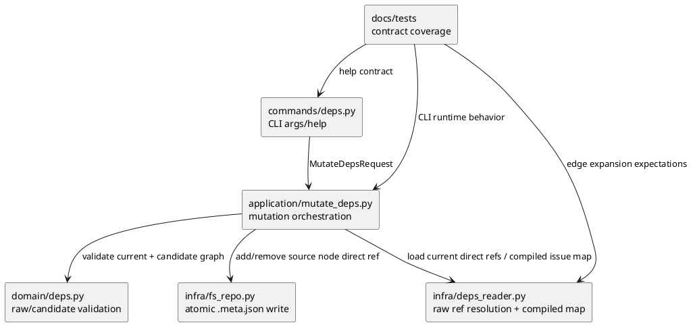

# iss-00193 Node Level Dependency Mutation — 設計（どう実現するか）

## 親図（Diagram）参照
- Epic 方針:
  - `epic-00059` は `.meta.json.depends_on` を dependency SoT とし、command-first mutation、preflight-first validation、duplicate add success/no-op、remove not-found error を固定している。
- 再利用する決定:
  - Legacy `deps.json` dual-read / fallback / auto-migration は持たない。
  - `DepsTopologyLoadResult(issue_depends_on_map, warnings)` は既存 downstream consumer 向けの compiled issue-level graph として維持する。

## 目的・制約
- 目的:
  - `deps add/remove` の endpoint を issue node 専用から initiative / epic / issue node 共通へ拡張する。
  - Source node 直下 `.meta.json.depends_on` だけを direct dependency intent として更新する。
  - Raw node-level invalid state を保存前に拒否し、empty epic / initiative に後から child issue が入ったときに壊れる状態を作らない。
- 必須:
  - Valid node-level direct dependency は source node の `.meta.json.depends_on` に target node id として保存する。
  - Duplicate add は direct ref の解決結果で判定し、healthy graph では `result=unchanged` とする。
  - Remove は source node の direct ref だけを削除し、inherited / compiled edge だけでは `edge_not_found` とする。
  - Current graph / deps graph は mutation semantic 判定より前に fail-closed で検証する。
- 非交渉制約:
  - Raw node-level self / ancestor-container / descendant / cycle は、compiled issue-level graph が空でも保存前に拒否する。
  - Candidate edge が compiled issue-level self-edge を生む場合も保存前に拒否する。
  - Existing issue->issue add/remove behavior は退行させない。
- 対象外:
  - `deps-raw.puml` など raw graph visualization。
  - GitHub Issue lifecycle の変更。
  - Dependency weight / optional dependency などの新しい意味論。

## 既存実装 / 規約の理解
- 参照した実装 / docs:
  - `application/mutate_deps.py`
  - `infra/deps_reader.py`
  - `infra/fs_repo.py`
  - `domain/deps.py`
  - `commands/deps.py`
  - `tests/cli_runtime/test_deps.py`
  - `spec-dock/docs/reference_deps.md`
  - `spec-dock/docs/workflow_issue.md`
- 現状理解:
  - `deps_reader.py` は initiative / epic / issue の `.meta.json.depends_on` を解決し、source / target 配下 issue set へ展開できる。
  - `mutate_deps.py` は preflight 後に `from_node.kind != "issue"` / `to_node.kind != "issue"` を `unsupported_node_kind` で拒否している。
  - `fs_repo.add_issue_dependency/remove_issue_dependency` は名前は issue-oriented だが、渡された `meta_path` を atomic に更新するため任意 node の `.meta.json` に使える。
  - 既存 direct matching は `load_direct_dependency_resolutions` の raw ref 解決結果を使うため、numeric / scoped / URL ref の duplicate add と remove を扱える。
- 採用するパターン:
  - `application/mutate_deps.py` を orchestration point に維持する。
  - Raw ref 解決は `infra/deps_reader.py`、graph invariant は `domain/deps.py`、atomic write は `infra/fs_repo.py` に置く。
  - CLI text の success shape は維持し、help text だけ node-level 表現へ更新する。
- 採用しないもの:
  - Application 層に raw graph traversal を埋め込む設計。
  - Compiled issue-level graph だけで candidate validation を判断する設計。
  - Existing `DepsTopologyLoadResult` を raw graph projection に拡張する設計。

## 採用方針 / トレードオフ
- 論点:
  - Empty epic / initiative の valid dependency は保存したいが、raw graph として将来破綻する dependency は保存したくない。
- 選択肢:
  - A: Raw node-level graph と compiled issue-level graph の両方を mutation-time に検証する。
  - B: Compiled issue-level graph だけを検証する。
  - C: 保存後の `sync` / `check` / `validate` に委ねる。
- 決定:
  - A を採用する。
- 根拠:
  - B/C は child issue がまだない上位 node 同士の cycle / container edge を保存できてしまう。
  - A は parent Epic の fail-closed mutation contract とユーザー回答に一致する。

## 依存関係分析
- module 依存:
  - `infra/deps_reader.py`:
    - すべての dependency-capable node の direct ref resolution を提供する。
  - `domain/deps.py`:
    - raw node graph validation と candidate add validation を提供する。
  - `infra/fs_repo.py`:
    - neutral name の node dependency writer wrapper を提供する。
  - `application/mutate_deps.py`:
    - current preflight、direct edge 判定、candidate validation、write、post-sync を統合する。
  - `commands/deps.py`:
    - CLI help text を node id 表現へ更新する。
- function 依存:
  - `mutate_deps` は `build_graph` と `load_issue_depends_on_map` を現行通り使う。
  - Candidate raw validation は direct dependency resolution map を入力にする。
  - Candidate compiled validation は existing issue expansion logic と同じ node->issue expansion semantics を使う。
- 実装起点:
  - 先に raw node direct resolution / validation helper の contract を固定し、その後 `mutate_deps.py` の issue-only guard を外す。
- 順序への影響:
  - Tests は public CLI behavior で赤を作り、helper 実装はその Green のための最小差分にする。

## モジュール依存図（Module Dependency Diagram）
- タイトル:
  - Node-level dependency mutation boundary
- 答える問い:
  - `deps add/remove` の node-level mutation で、どの module が CLI 入力、direct ref resolution、raw / compiled validation、atomic write、docs/tests contract を担うか。
- 範囲:
  - `deps add/remove` の runtime mutation path、provider-side docs、CLI runtime tests。
- 含めない詳細:
  - 全 call graph、全 private helper、`deps check` readiness 再設計、raw dependency visualization。
- 更新条件:
  - Validation helper の配置、writer port の責務、または docs/tests の contract owner が変わるとき。



## インターフェース契約
- `deps_reader`:
  - Add or expose a helper equivalent to `load_node_dependency_resolutions(specdock_dir, graph) -> dict[str, list[DirectDependencyResolution]]`.
  - It resolves direct refs for every initiative / epic / issue node and must not skip sources whose child issue set is empty.
  - Existing `load_direct_dependency_resolutions(specdock_dir, graph, src_id)` remains available for direct matching.
- `domain.deps`:
  - Add `validate_raw_node_dependency_graph(graph, raw_map) -> None`.
    - Rejects raw self edge.
    - Rejects source -> ancestor/container edge.
    - Rejects source -> descendant edge.
    - Rejects raw node-level cycle.
  - Add candidate validation helper for `from_id`, `to_id`.
    - Builds candidate raw map and calls raw validation.
    - Builds or receives candidate compiled issue map and rejects compiled cycle/self-edge.
- `fs_repo` / ports:
  - Add neutral wrappers `add_node_dependency(meta_path, to_id)` and `remove_node_dependency(meta_path, to_id, matching_refs=...)` where useful.
  - Existing issue-named methods may remain as compatibility wrappers to avoid broad churn.
- CLI:
  - `deps add/remove --from/--to` help text says node id, with examples including `iss-*`, `epic-*`, and `init-*`.

## シーケンス差分（Sequence Delta）
### `deps add`
1. Parse `--from` / `--to` through existing node id normalization.
2. Load node records and build `SpecGraph`.
3. Resolve current raw node direct dependencies for all dependency-capable nodes.
4. Load current compiled issue-level dependency map.
5. Preflight current raw graph and current compiled graph; fail as `preflight_validate_failed` before duplicate / not-found / semantic checks.
6. Resolve source and target node ids.
7. If matching direct ref already exists on the source node, return `result=unchanged` without write.
8. Validate candidate raw edge:
   - self / ancestor / descendant / raw cycle rejected.
9. Validate candidate compiled expansion:
   - compiled self-edge and cycle rejected.
   - empty expansion is not a write failure when raw validation passes.
10. Atomic write to source `.meta.json.depends_on`.
11. Run existing post-mutation sync.

### `deps remove`
1. Perform the same current graph / deps preflight before semantic checks.
2. Resolve source and target node ids.
3. Resolve source direct refs and match target by resolved node id.
4. If no direct match exists, return `edge_not_found` without write.
5. Remove matching raw ref(s) from source `.meta.json.depends_on`.
6. Run existing post-mutation sync.

## ドメインモデル差分（Domain Model Delta）
- New domain concept:
  - Raw node-level dependency graph:
    - vertices: initiative / epic / issue nodes.
    - edges: source node `.meta.json.depends_on` direct refs resolved to node ids.
- Invariants:
  - Raw graph is acyclic.
  - Raw edge may cross initiative / epic / issue kinds, but may not point to self, ancestor, or descendant.
  - Candidate raw graph and candidate compiled issue graph must both be valid before write.
  - Empty source / target issue expansion is allowed only when raw graph invariants pass.

## ディレクトリ / ファイル変更計画
```text
src/spec_dock/assets/spec_dock/scripts/spec_dock_runtime/
|-- commands/
|   `-- deps.py               # 変更: add/remove help text を issue id から node id へ更新
|-- application/
|   `-- mutate_deps.py        # 変更: issue-only guard を除去し、raw + compiled candidate validation を統合
|-- domain/
|   `-- deps.py               # 変更: raw node graph validation と candidate validation helper を追加
|-- infra/
|   |-- deps_reader.py        # 変更: all-node direct dependency resolution helper / expansion reuse
|   `-- fs_repo.py            # 変更: neutral node dependency writer wrapper を追加（既存 wrapper 維持）
`-- application/
    `-- ports.py              # 必要時のみ変更: neutral writer method を port に追加

src/spec_dock/assets/spec_dock/docs/
|-- reference_deps.md         # 変更: node-level mutation contract / validation boundary / direct-edge semantics
`-- workflow_issue.md         # 変更: deps add/remove examples を node-level wording に更新

spec-dock/docs/
|-- reference_deps.md         # dogfooding mirror 確認または refresh 対象
`-- workflow_issue.md         # dogfooding mirror 確認または refresh 対象

tests/
|-- cli_runtime/test_deps.py  # 変更: node-level add/remove/negative/direct-match regressions
`-- unit/infra/test_init_update.py # 必要時のみ変更: shipped docs/help/wrapper snapshot expectations
```

## 要件 → 設計マッピング
- AC-001:
  - `mutate_deps.py` の endpoint kind guard を node-level validation に置換し、source `.meta.json.depends_on` に target node id を保存する。
- AC-002:
  - Source direct refs を resolved target node id で照合し、matching raw ref を削除する。
- AC-003:
  - Direct matching refs が存在する場合だけ duplicate add を `result=unchanged` にする。
- AC-004:
  - Inherited-only / compiled-only edge は direct matching refs が空なので `edge_not_found` にする。
- AC-005:
  - Raw validation helper は child issue が空であることを rejection 理由にしない。
- AC-006:
  - Candidate raw graph cycle validation を write 前に実行する。
- AC-007:
  - Self / ancestor / descendant / compiled self-edge validation を write 前に実行する。
- AC-008:
  - Existing issue->issue success / unchanged / not-found / preflight / write failure tests を維持する。
- AC-009:
  - Provider docs、dogfooding mirror、CLI help text、必要な snapshot tests を更新する。

## テスト戦略
- CLI runtime acceptance:
  - Valid epic->epic / initiative->epic / issue->epic add writes source `.meta.json.depends_on` and returns `result=updated`.
  - Valid node-level remove deletes the matching direct raw ref and returns `result=updated`.
  - Empty epic / initiative dependency add succeeds when raw validation passes.
- CLI runtime negative:
  - Raw node cycle is rejected before write, including empty containers.
  - Source -> ancestor/container, source -> descendant, self, and compiled self-edge are rejected before write.
  - Inherited-only remove returns `edge_not_found`.
  - Broken current graph fails preflight before duplicate/no-op or remove not-found semantics.
- Regression:
  - Existing issue->issue add/remove, duplicate unchanged, remove not-found, shorthand duplicate/remove, write failure, post-sync behavior remain intact.
- Docs / help:
  - `deps add --help` and `deps remove --help` no longer say issue-only.
  - `reference_deps.md` and `workflow_issue.md` document node-level mutation and direct-edge semantics.

## 要件 / 例外 -> 検証マッピング
- EC-001:
  - Test empty `epic-a -> epic-b` then `epic-b -> epic-a`; second add fails no-write.
- EC-002:
  - Test `issue-x -> parent epic-a`; add fails no-write by compiled self-edge or ancestor/container rule.
- EC-003:
  - Test `epic-a -> child issue-x`; add fails no-write.
- EC-004:
  - Test `epic-a -> parent initiative-a`; add fails no-write even with empty child issue set.
- EC-005:
  - Existing raw shorthand direct ref resolves for duplicate add unchanged and remove deletes matching raw ref.
- EC-006:
  - Existing broken graph fails as preflight before semantic outcomes.

## リスク / 移行 / ロールバック
- リスク:
  - Raw validation logic が `deps_reader.py` と `domain/deps.py` に分散すると drift しやすい。
    - 対応: graph invariant は domain helper に集約し、reader は resolution に寄せる。
  - Neutral writer rename が広がりすぎる。
    - 対応: 既存 issue-named writer を残し、必要な wrapper だけ追加する。
  - Inherited edge を direct edge と誤認する。
    - 対応: duplicate / remove は source direct resolution matching のみで判定する。
- 移行:
  - Storage migration は不要。既存 `.meta.json.depends_on` を継続利用する。
  - `deps.json` fallback は導入しない。
- ロールバック:
  - Issue 差分 revert のみ。feature flag / compatibility mode は作らない。

## 委任ドラフト採用
- 採用元:
  - `discussions/20260617t000000z-draft-design-node-level-dependency-mutation.md`
- 採用内容:
  - Raw + compiled 二段 validation。
  - Direct-vs-inherited mutation boundary。
  - File / module change plan。
  - Tests and docs impact strategy。
- 採用しなかった内容:
  - Mermaid diagram は canonical design では PlantUML module dependency diagram に統合した。
  - Helper names are design-level suggestions; implementation may choose smaller names if contracts remain satisfied.

## 未確定事項
- なし。
