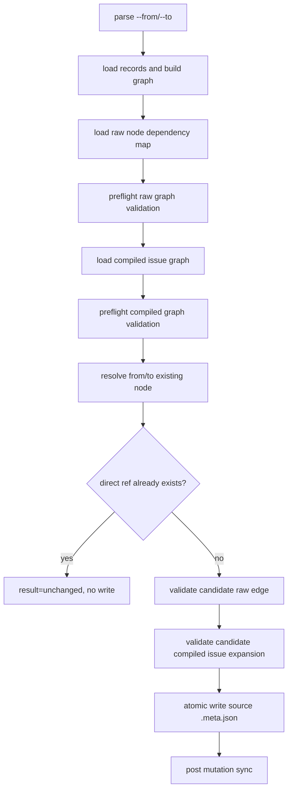

# iss-00193 Node Level Dependency Mutation - delegated design draft

## 1. Requirement Coverage

- AC-001/002: `deps add/remove --from <initiative|epic|issue> --to <initiative|epic|issue>` writes only the source node's direct `.meta.json.depends_on`.
- AC-003/004: duplicate add and remove existence checks stay direct-ref based, not compiled/inherited-edge based.
- AC-005: empty epic/initiative dependencies are allowed when raw node validation passes, even if issue-level expansion is empty.
- AC-006/007: self, ancestor/container, descendant, raw node-level cycle, and compiled issue-level self-edge are rejected before write.
- AC-008/009: existing issue->issue behavior, CLI help, `reference_deps.md`, and `workflow_issue.md` must be updated without reintroducing `deps.json` fallback or raw visualization.

Source requirement revision: `spec-dock/active/issue/requirement.md`, final update `2026-06-17`, with fresh requirement spec-review pass recorded in `spec-dock/active/issue/report.md`.

## 2. Existing Context Findings

- `deps_reader.py` already resolves initiative / epic / issue refs from `.meta.json.depends_on` and compiles them to the existing issue-level `DepsTopologyLoadResult`.
- `mutate_deps.py` currently fails after preflight when either endpoint is non-issue. That kind guard is the main mismatch with the reader contract.
- `fs_repo.py` writer names are issue-oriented, but the implementation writes a passed `meta_path` and can already update any node's `.meta.json`.
- Existing tests encode issue-only rejection and issue->issue regressions. Those issue-only expectations must become node-level success or node-level validation failures.

## 3. Design Decisions

- Keep `.meta.json.depends_on` as the only storage and write boundary. Do not add a graph-level file or `deps.json` compatibility path.
- Add raw node-level validation as a mutation-time gate in front of writes and in front of duplicate success/no-op.
- Keep downstream consumers on the compiled issue-level map. The public `DepsTopologyLoadResult(issue_depends_on_map, warnings)` surface should not change for this issue.
- Preserve direct-vs-inherited semantics by resolving direct refs from the source node and comparing resolved target node ids. A compiled/inherited edge alone is never removable and does not make add unchanged.
- Prefer small neutral wrappers such as `add_node_dependency` / `remove_node_dependency`, while keeping existing issue-named ports as compatibility wrappers if needed by delete/scrub code.

## 4. Alternatives Considered

- Compiled-only validation: rejected because raw cycles between empty epics/initiatives would be saved and later break when issues are added.
- Save first, fail during `sync/check/validate`: rejected because it violates the parent epic's preflight-first and no-invalid-state mutation contract.
- Full raw dependency visualization or new projection artifacts: rejected as out of scope and owned by `iss-00192`.

## 5. Boundary / Contract Model

- Command boundary: `deps add/remove` accepts existing initiative, epic, or issue node ids after normal node id normalization.
- Storage boundary: only the source node's `.meta.json.depends_on` changes.
- Validation boundary:
  - current raw node graph validates before add/remove semantic checks;
  - current compiled issue graph validates before add/remove semantic checks;
  - candidate raw node edge validates before add write;
  - candidate compiled issue expansion validates before add write.
- No GitHub lifecycle behavior changes. Mutation preflight remains local dependency consistency focused and keeps `enforce_github_mandatory_linkage=False`.

## 6. Dependency Analysis

Implementation order should flow from lower-level reusable helpers to CLI/docs/tests:

```text
infra/deps_reader.py
  -> domain/deps.py raw/candidate validation
  -> infra/fs_repo.py neutral node dependency writer wrapper
  -> application/mutate_deps.py orchestration
  -> commands/deps.py help text
  -> tests/cli_runtime/test_deps.py and docs
```

`application/mutate_deps.py` should remain the orchestration point. It should not embed graph traversal details beyond calling named validation helpers.

## 7. Source of Record

- Canonical dependency state: node-local `.meta.json.depends_on`.
- Current graph source: `node_reader.load_node_records()` plus `build_graph`.
- Ref resolution source: `deps_reader` raw-ref resolver, including node id and supported GitHub shorthand forms.
- Canonical design authority remains `design.md` after main-orchestrator adoption and fresh spec-review. This file is evidence only.

## 8. Data Flow / Domain Model / Interface Contract

Suggested flow for `deps add`:



Suggested helper contracts:

- `deps_reader.load_node_dependency_resolutions(specdock_dir, graph) -> dict[str, list[DirectDependencyResolution]]`
  - resolves every initiative / epic / issue node's direct refs, including empty containers.
  - does not skip sources with no child issues.
- `domain.deps.validate_raw_node_dependency_graph(graph, raw_map) -> None`
  - rejects self edges, ancestor/container edges, descendant edges, and cycles.
- `domain.deps.ensure_node_dependency_add_is_valid(graph, raw_map, from_id, to_id, issue_depends_on_map) -> None`
  - validates the candidate raw graph and candidate compiled issue-level graph.
  - rejects compiled self-edge even when raw ancestry checks would miss a future expansion nuance.
- `fs_repo.add_node_dependency(meta_path, to_id)` and `remove_node_dependency(meta_path, to_id, matching_refs=...)`
  - neutral names over the existing atomic `.meta.json` update behavior.

## 9. File / Module Change Plan

```text
src/spec_dock/assets/spec_dock/scripts/spec_dock_runtime/
|-- application/
|   `-- mutate_deps.py        # remove issue-only endpoint guard; orchestrate raw + compiled preflight and candidate validation
|-- domain/
|   `-- deps.py               # add raw node graph validation and candidate compiled expansion checks
|-- infra/
|   |-- deps_reader.py        # expose all-node direct dependency resolution without empty-source skip
|   `-- fs_repo.py            # add neutral node dependency writer wrappers; keep compatibility wrappers if needed
|-- application/
|   `-- ports.py              # add or alias neutral node dependency port methods if wrapper naming changes
`-- commands/
    `-- deps.py               # update help text from issue id to node id

tests/
`-- cli_runtime/test_deps.py  # update issue-only rejection tests; add node-level add/remove and validation regressions

src/spec_dock/assets/spec_dock/docs/
|-- reference_deps.md         # provider-side dependency reference update
`-- workflow_issue.md         # command examples update
```

Dogfooding `spec-dock/docs/*` copies should be inspected or refreshed according to the repo's shipped asset workflow, but this draft does not edit them.

## 10. Migration / Compatibility / Rollback

- No storage migration is needed. Existing node-level `.meta.json.depends_on` values remain the source of truth.
- No `deps.json` dual-read, fallback write, or auto-migration is introduced.
- Existing issue->issue add/remove output remains `result=updated|unchanged` and `edge_not_found` behavior remains an error.
- Rollback is issue diff revert. Do not add a feature flag or compatibility mode.

## 11. Observability

- Keep current CLI success shape:
  - `spec-dock: ok (deps add) from=<source-id> to=<target-id> result=updated`
  - `spec-dock: ok (deps add) ... result=unchanged`
  - `spec-dock: ok (deps remove) ... result=updated`
- Error codes should stay specific and stable where existing contracts exist:
  - keep `preflight_validate_failed`, `invalid_add_unresolved`, `edge_not_found`, `invalid_add_self_dependency`, `invalid_add_cycle`, `write_failed`;
  - add explicit node-level codes only if tests lock them, for example `invalid_add_ancestor_dependency` and `invalid_add_descendant_dependency`.
- Empty compiled expansion should not become a write failure. It should follow existing warning/projection behavior.

## 12. Test Strategy

Minimum regression set:

- Existing issue->issue add/remove, duplicate unchanged, remove not-found, shorthand remove, write failure, and preflight-before-duplicate tests continue to pass.
- Epic->epic add writes the source epic `.meta.json.depends_on` and sync/check can consume the compiled projection when child issues exist.
- Initiative/epic/issue cross-kind add/remove succeeds for valid direct refs, including empty source or target containers.
- Inherited-only edge remove returns `edge_not_found`; inherited-only add creates a direct source ref.
- Duplicate add with existing raw shorthand ref returns `result=unchanged` and does not rewrite.
- Current broken raw graph fails preflight before duplicate/no-op and before remove not-found.
- Candidate raw cycle fails before save, including empty epic/initiative cycle.
- Candidate self, ancestor/container, descendant, and compiled self-edge fail before save.
- CLI help text and provider-side docs mention initiative / epic / issue node ids and direct-edge semantics.

## 13. ADR Candidates

- None required for this issue. Option A is issue-local concretization of the parent epic's command-first, fail-closed mutation policy.
- If future work makes raw node graph a public projection or visualization API, record that separately, likely in `iss-00192` or a follow-up ADR.

## 14. Risks

- Raw validation duplicated between `deps_reader.py` and `domain/deps.py` could drift. Prefer a single domain helper for self/ancestor/descendant/cycle checks and have application call it consistently.
- Removing the issue-only guard may accidentally treat compiled/inherited edges as direct edges if direct resolution is not used for existence checks. Tests must lock direct-only matching.
- Empty container behavior can be confused with "no dependency." The design must allow storage while still rejecting raw cycles.
- Neutral writer renaming can create broad churn. Keep wrappers small and avoid unrelated delete/scrub refactors.

## 15. Requirement Clarification Requests

None. The validation boundary was resolved by the user-approved Option A interview: raw node-level graph validation is required before save.

## 16. Integration Notes for Main Orchestrator

- Adopt the raw validation boundary into canonical `design.md` explicitly: self, ancestor/container, descendant, raw cycle, and compiled issue-level self-edge all reject before save, including empty compiled graph cases.
- Preserve direct-vs-inherited semantics in design wording. The source node's direct `.meta.json.depends_on` is the only add/remove existence surface.
- Keep scope narrow: no `deps-raw` visualization, no legacy `deps.json` fallback, no GitHub lifecycle changes.
- After adoption, run a fresh `spec-reviewer` on canonical `design.md`; this draft does not claim reviewer pass or phase promotion.

No canonical edit, final authority, promotion, reviewer-pass, or user-dialogue ownership is claimed.
