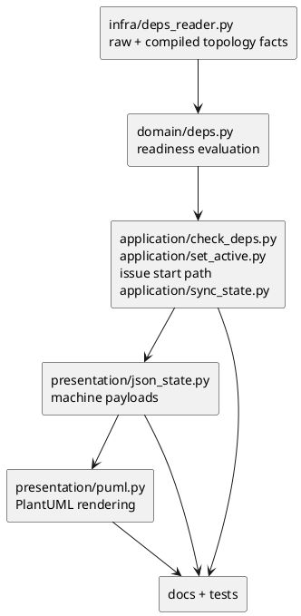

# iss-00207 Fix dependency projections for node level blockers — 設計（どう実現するか）

## 設計目的
- `.meta.json.depends_on` に保存される initiative / epic / issue の raw direct dependency を保持したまま、readiness 判定では issue-level blocker と high-level node blocker を同じ安全性で扱う。
- `deps check`、`active set`、`issue start`、`sync`、`deps-issues.*`、`deps-raw.puml` が同じ dependency interpretation を参照する構造にする。
- `deps-issues` は readiness / blocker authority、`deps-raw` は raw visual/debug artifact という境界を維持する。

## 採用するモデル
- raw direct dependency:
  - `.meta.json.depends_on` から解決した node-to-node edge。initiative / epic / issue endpoint をそのまま保持する。
- compiled issue dependency:
  - non-empty initiative / epic dependency を child issue に展開した issue-to-issue edge。既存の `effective_depends_on` はこの issue-level graph を表す。
- node-level blocker:
  - high-level dependency が issue に展開できない、または展開結果だけでは安全に ready と言えない場合に readiness を塞ぐ high-level node。
- satisfied dependency:
  - done / closed / all-descendant-done などにより readiness を塞がないが、debug context と visual context には残す dependency。

## 主要決定
- D-001: storage format は変えない。
  - `.meta.json.depends_on` の保存形式は維持し、empty initiative / epic dependency の保存も許可する。
- D-002: warning ではなく evaluation contract に node blocker を持たせる。
  - `deps_ref_expanded_to_empty` は debug warning として残してよいが、readiness source of truth にはしない。
- D-003: `DepsEvaluation.blockers` は互換性のため文字列 list を維持し、issue blocker と node blocker の両方の node id を含める。
  - 新規 consumer は `issue_blockers` と `node_blockers` を優先して型を判別する。
- D-004: `deps-issues.json` は schema v2 の readiness context artifact にする。
  - `index.json` の todo issue projection を再パースして作る方式をやめ、`SyncStateResult` の dependency state から生成する。
- D-005: high-level node status は presentation ではなく domain / application boundary までに解決する。
  - renderer は渡された state / state_source を表示し、独自に readiness を推論しない。

## high-level node status
- 解決優先順位:
  1. GitHub-linked node で GitHub state / snapshot enrichment が取得できる場合はそれを使う。
  2. GitHub enrichment が使えない場合は local SpecDock metadata と descendant issue state から算出する。
  3. open / done / closed に確定できない場合は `unknown` とする。
- descendant aggregate:
  - descendant issue が 1 件以上あり、全件 done / closed 相当なら high-level node は `done` 相当。
  - descendant issue に open / blocked / ready / doing 相当が 1 件以上あれば `open` 相当。
  - descendant issue が 0 件で authoritative state がなければ `unknown`。
- readiness:
  - empty open high-level dependency は `node_blockers.reason=empty_open`。
  - empty unknown high-level dependency は `node_blockers.reason=empty_unknown` かつ `guard_reason=unknown`。
  - empty done / closed high-level dependency は `satisfied_dependencies` に残し、readiness blocker にはしない。

## データ / インターフェース契約
- `DepsTopologyLoadResult`:
  - 既存の `issue_depends_on_map` と `warnings` を維持する。
  - 追加候補:
    - `raw_node_depends_on_map: dict[str, list[str]]`
    - `dependency_contexts_by_issue_id: dict[str, list[DepsDependencyContext]]`
    - `node_status_by_id: dict[str, HighLevelNodeStatus]`
- `DepsEvaluation`:
  - 既存:
    - `ready`
    - `guard_reason`
    - `blockers`
    - `blockers_top`
    - `closure`
  - 追加:
    - `issue_blockers: list[str]`
    - `node_blockers: list[DepsNodeBlocker]`
    - `satisfied_dependencies: list[DepsDependencyContext]`
    - `debug_context: dict[str, object]`
- `deps check --json`:
  - `schema_version: 2` を返す。
  - `blockers` は issue / high-level を含む all blocker node id list。
  - `issue_blockers` と `node_blockers` で typed consumer 向けの内訳を返す。
  - satisfied dependency や warning-only debug context があっても、blocker がなければ exit code は 0。
  - node blocker があれば `ready=false` かつ exit code は非 0。

## レイヤー別責務
- `infra/deps_reader.py`:
  - raw ref resolution と compiled issue dependency の topology facts を返す。
  - readiness 判定は行わない。
  - empty expansion を warning だけで捨てず、domain が評価できる context として残す。
- `domain/deps.py`:
  - issue-level blockers、node-level blockers、satisfied dependencies、guard_reason を算出する。
  - high-level node status の判定規則を集約する。
- `application/check_deps.py`:
  - topology / status context を domain evaluation へ渡し、JSON / text output に typed blocker context を渡す。
- `application/set_active.py`:
  - `DepsEvaluation.ready` と all blockers に基づいて active selection を止める。
  - error message に high-level node blocker id と reason を含める。
- `application/issue start` path:
  - `active set` と同じ readiness interpretation を使い、node-blocked issue の start を止める。
- `application/sync_state.py`:
  - sync 中の dependency evaluation を `SyncStateResult` に保持し、presentation へ lossless に渡す。
- `presentation/json_state.py`:
  - `deps-issues.json` を `SyncStateResult` から作り、todo-only `index.json` 再パースに依存しない。
  - `deps-raw` payload に high-level participant state / state_source を含める。
- `presentation/puml.py`:
  - payload の state と edge state を描画する。
  - readiness rule や high-level status を renderer 内で再計算しない。

## モジュール依存図


## 生成 artifact 設計
- `.agent/deps-issues.json`:
  - `schema_version: 2`
  - `projection: "issue-readiness-with-dependency-context"`
  - nodes:
    - current open / unknown issue nodes
    - readiness を説明する issue blocker nodes
    - node-level blocker の initiative / epic nodes
    - displayed issue に直接関係する satisfied dependency nodes
  - edges:
    - JSON direction は existing convention に合わせて dependent -> prerequisite を維持する。
    - `state: "blocking" | "satisfied"`
    - `relation: "compiled_issue" | "raw_direct"`
    - `source: "readiness" | "debug"` など、authority/debug の区別を可能にする field を持たせる。
- `deps-issues.puml`:
  - blocking edge と satisfied edge を label / color / line style で区別する。
  - node-level blocker は high-level package / node として表示する。
  - ready / blocked / done / unknown の色は JSON payload に基づく。
- `deps-raw.puml`:
  - raw direct edge を表示する。
  - initiative / epic package に `state` と `state_source` 由来の色または note を表示する。
  - readiness authority ではないことを legend または docs で明示する。

## ファイル変更計画
```text
src/spec_dock/assets/spec_dock/scripts/spec_dock_runtime/
|-- infra/
|   |-- contracts.py        # DepsTopologyLoadResult の互換 field 追加
|   `-- deps_reader.py      # raw map / dependency context seed を保持
|-- domain/
|   |-- models.py           # 必要に応じて node blocker / context / status model を追加
|   `-- deps.py             # issue + node blocker readiness evaluation
|-- application/
|   |-- check_deps.py       # deps check JSON/text と exit code
|   |-- set_active.py       # active guard の blocker 表示
|   `-- sync_state.py       # SyncStateResult に enriched dependency context を通す
|-- presentation/
|   |-- json_state.py       # deps-issues v2 と deps-raw payload state
|   `-- puml.py             # blocker/satisfied/high-level state rendering

src/spec_dock/assets/spec_dock/docs/
|-- reference_deps.md       # dependency semantics
`-- reference_sync.md       # generated artifact authority

tests/
|-- cli_runtime/test_deps.py
|-- cli_runtime/test_sync.py
|-- unit/domain/
|-- unit/infra/
`-- unit/presentation/
```

## 要件 → 設計マッピング
- AC-001:
  - `node_blockers` と `DepsEvaluation.ready=false` により empty open high-level dependency を guard 対象にする。
  - `deps check`、`active set`、`issue start` は同じ evaluation を参照する。
- AC-002:
  - empty done / closed high-level dependency は `satisfied_dependencies` と raw/debug view に残す。
- AC-003:
  - non-empty high-level dependency の child issue expansion は `issue_depends_on_map` / `effective_depends_on` として維持する。
- AC-004:
  - `deps-issues` は `SyncStateResult` 由来の readiness context artifact に変更し、todo-only filtering で blocker context を落とさない。
- AC-005:
  - `deps-raw` payload に high-level node state / state_source を含め、renderer はそれを package state として描画する。
- AC-006:
  - docs と tests で storage / readiness / raw visual の authority 境界、schema v2、node blocker semantics を固定する。
- EC-001:
  - unknown high-level node は fail-closed blocker とし、`guard_reason=unknown` を返す。
- EC-002:
  - done child-only dependency は ready のまま satisfied context に残す。
- EC-003:
  - raw graph cycle validation は existing fail-closed path を維持し、readiness projection 前に止める。
- EC-004:
  - docs と renderer label で `deps-raw` を raw visual/debug artifact と明記する。

## テスト戦略
- domain / infra:
  - issue -> empty open epic: node blocker、`ready=false`。
  - issue -> empty closed epic: satisfied dependency、blocker なし。
  - issue -> empty unknown epic: node blocker、`guard_reason=unknown`。
  - issue -> non-empty epic with open child: child issue blocker を維持。
  - issue -> non-empty epic with done children: blocker なし、satisfied context。
  - raw node-level cycle: projection 前に fail-closed。
- CLI:
  - `deps check --json`: node blocker fields と exit code 非 0。
  - warning-only / satisfied-only: ready なら exit code 0。
  - `active set`: node-blocked issue を拒否。
  - `issue start`: node-blocked issue を拒否。
- sync / presentation:
  - `.agent/deps-issues.json` v2 に high-level blocker と satisfied context が出る。
  - `deps-issues.puml` が blocking / satisfied edge を区別する。
  - `deps-raw.puml` が initiative / epic package state を payload 由来で表示する。
- docs:
  - `reference_deps.md` と `reference_sync.md` が新 contract と authority 境界を説明する。

## リスク / トレードオフ / ロールバック
- 既存 consumer が `blockers` を issue-only と仮定している可能性:
  - typed fields を追加し、docs で `blockers` は all blocker node ids と明記する。
- `deps-issues` v2 で表示 node が増える:
  - readiness 説明に必要な context node へ限定し、全履歴 graph にはしない。
- unknown fail-closed による過剰 block:
  - reason / status_source を表示し、operator が不足情報を追跡できるようにする。
- rollback:
  - storage migration はないため issue diff revert で戻す。
  - feature flag、dual-read、legacy `deps.json` fallback は導入しない。

## 設計ドラフト採用
- 採用元:
  - `discussions/20260618t151109z-draft-design-node-level-dependency-projection.md`
- 採用内容:
  - raw / compiled / node blocker / satisfied dependency の分離。
  - typed blocker fields と `blockers` compatibility 方針。
  - high-level node status source と unknown fail-closed。
  - `deps-issues` v2 と `deps-raw` rendering boundary。
- 採用しない内容:
  - ADR candidate は本 issue では即時 ADR 化せず、実装中に durable decision 化が必要になった場合だけ report から ADR / follow-up へ昇格する。

## 未確定事項
- 人間への blocking question はない。
- 実装中に `DepsTopologyLoadResult` の既存所在や `DepsEvaluation` dataclass の所在が異なる場合は、同じ契約を保ったまま local structure に合わせる。
- `deps-issues.json` の field 名は plan の closure と tests で固定し、実装中に変更が必要なら plan amendment と fresh review に戻す。
