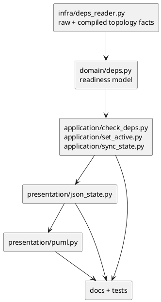

# Node-level dependency projection design draft for iss-00207

Source requirement revision: `iss-00207` requirement last updated `2026-06-18`; user-provided input states a fresh `spec-reviewer` pass has no findings. This is delegated draft evidence only and does not edit canonical `design.md`.

## 1. Requirement Coverage

This design covers the issue requirement by treating node-level direct dependencies as first-class storage edges while keeping readiness evaluation explicit about which dependencies are compiled issue blockers, unresolved high-level node blockers, and satisfied dependencies.

- `raw direct deps`: the direct `.meta.json.depends_on` edge after shorthand resolution, preserving initiative / epic / issue endpoints.
- `compiled issue deps`: issue-to-issue dependencies produced from non-empty high-level dependency expansion; this keeps existing child issue expansion behavior.
- `unresolved node-level blockers`: high-level dependency targets that do not expand to open issue blockers but are still not satisfied, especially empty open / unknown initiative or epic nodes.
- `satisfied dependencies`: direct or compiled dependencies that are done / closed / all-descendant-done and therefore must not block readiness, but must remain visible as debug and projection context.

Requirement mapping:

| Requirement | Design coverage |
|---|---|
| AC-001 | Empty open initiative / epic dependency is converted into `node_blockers` and makes `ready=false`. |
| AC-002 | Empty done / closed high-level dependency is emitted as `satisfied_dependencies`, not as a blocker. |
| AC-003 | Non-empty high-level dependency keeps existing child issue expansion; open children block, done children satisfy. |
| AC-004 | `deps-issues` becomes a readiness-context artifact sourced from sync dependency state, not a lossy todo-only rebuild from `index.json`. |
| AC-005 | `deps-raw.puml` consumes explicit high-level node state from payload; renderer does not infer readiness. |
| AC-006 | Provider docs and regression tests must update the new authority boundary and payload contract. |
| EC-001 | Unknown high-level target state is fail-closed as `node_blockers` with reason `unknown`. |
| EC-002 | Done child-only dependencies remain non-blocking and visible as satisfied context. |
| EC-003 | Raw node-level cycle validation remains preflight fail-closed before readiness projection. |
| EC-004 | Docs keep `deps-raw.puml` as raw visual/debug artifact, not readiness authority. |

## 2. Existing Context Findings

The current code loses high-level dependency meaning in two places.

- `infra/deps_reader.py` resolves raw direct dependencies but `load_issue_depends_on_map()` returns only `DepsTopologyLoadResult(issue_depends_on_map, warnings)`. Empty high-level expansion is reduced to warning `deps_ref_expanded_to_empty`.
- `domain/deps.py` evaluates readiness through issue IDs only. If compiled issue blockers are empty, the target can become ready even when the raw dependency target is an empty open epic.
- `presentation/json_state.py` builds `deps-issues.json` by parsing the todo `index.json` projection, so done prerequisites and high-level context are already gone.
- `presentation/puml.py` colors issue rectangles but high-level raw participants are packages with no state.
- `reference_deps.md` and `reference_sync.md` currently describe `deps-issues.*` as readiness / blocker authority, but the current payload is todo issue-only and cannot represent node-level blockers.

The parent epic requires `.meta.json` to remain the storage source of truth and forbids reintroducing `deps.json` compatibility. The initiative guardrail prefers clear source-of-truth and generated-view boundaries over backward-compatible ambiguity.

## 3. Design Decisions

Decision 1: keep raw node dependencies and compiled issue dependencies as separate model concepts.

- Raw direct dependency remains the stored, auditable edge.
- Compiled issue dependency remains the operational issue-to-issue graph for non-empty high-level targets.
- Empty high-level targets are not forced into fake issue edges.

Decision 2: extend topology and evaluation contracts instead of overloading warnings.

- `DepsTopologyLoadResult` should retain `issue_depends_on_map` and `warnings` for compatibility.
- Add fields for `raw_node_depends_on_map`, `direct_dependency_contexts`, `node_blockers_by_issue_id`, and `satisfied_dependencies_by_issue_id`.
- `DepsEvaluation` should keep the existing `blockers: list[str]` shape as the guard-facing blocker id list, but add typed fields:
  - `issue_blockers: list[str]`
  - `node_blockers: list[DepsNodeBlocker]`
  - `satisfied_dependencies: list[DepsDependencyContext]`
  - `debug_context: DepsDebugContext | None`
- `blockers` may contain both issue IDs and high-level node IDs so existing command output remains meaningful. New consumers should prefer `issue_blockers` and `node_blockers`.

Decision 3: high-level node status is resolved before presentation and treated fail-closed when unknown.

- GitHub live snapshot / enrichment wins when available for a linked high-level node.
- If GitHub is unavailable, use cached generated state when present.
- If neither exists, derive from descendant issue status:
  - all descendant issues done and at least one descendant exists -> `done`
  - any descendant issue open / blocked / ready / doing -> `open`
  - empty descendant set with no authoritative high-level state -> `unknown`
- `unknown` and `open` high-level empty targets block readiness.
- `closed` / `done` high-level empty targets are satisfied.

Decision 4: `deps-issues` should become a readiness-context artifact.

- It should be built from `SyncStateResult` dependency state directly, not by reparsing `index.json`.
- It should include open issue nodes plus dependency context nodes needed to explain readiness: issue blockers, high-level node blockers, and satisfied direct dependency targets.
- PlantUML should render `blocks` for unresolved blockers and `satisfied` for non-blocking dependency context.

Decision 5: `deps-raw` remains raw visual/debug only.

- `deps-raw.puml` should show raw direct edges and participant state, including initiative / epic package color.
- It must not become the readiness authority and should not define blocking rules inside the renderer.

## 4. Alternatives Considered

Alternative A: Treat empty high-level dependency as validation error.

- Rejected because the requirement explicitly allows saving empty initiative / epic dependencies and only changes readiness interpretation.

Alternative B: Expand empty open high-level dependency to a synthetic issue node.

- Rejected because it creates artificial graph nodes and pollutes issue-level dependency semantics.

Alternative C: Put node blockers only in `warnings`.

- Rejected because `active set`, `issue start`, and `deps check` need a guard contract, not a human-only note.

Alternative D: Keep `deps-issues` todo issue-only and add a new artifact.

- Rejected for this issue because current docs already position `deps-issues.*` as readiness / blocker authority. A new artifact would leave the default agent-facing read path misleading.

## 5. Boundary / Contract Model

Layer boundaries:

- `infra/deps_reader.py`: resolves raw refs and reports topology facts. It should not decide readiness.
- `domain/deps.py`: converts topology facts and status context into readiness, blockers, satisfied dependencies, and node states.
- `application/check_deps.py`, `set_active.py`, `sync_state.py`: load graph/status/topology, invoke domain evaluation, and pass complete state to presentation.
- `presentation/json_state.py`: serializes already-computed dependency state.
- `presentation/puml.py`: renders payload only; it must not infer high-level status or blocker semantics.

Compatibility boundary:

- `.meta.json.depends_on` storage remains unchanged.
- `issue_depends_on_map` remains available and issue-only.
- Existing JSON top-level `ready`, `blockers`, `effective_depends_on`, and `warnings` remain present.
- New payload fields disambiguate `issue_blockers`, `node_blockers`, `satisfied_dependencies`, and debug context.

## 6. Dependency Analysis

Implementation should start at the lower dependency layers and move outward.



Risky dependency points:

- `set_active.py` currently prints `deps.blockers`; it must display both issue and node blockers without assuming every blocker is an issue.
- `sync_state.py` currently calls `evaluate_readiness()` per issue after building `effective_deps_map`; it should preserve topology context for node blockers and satisfied dependencies.
- `json_state.py` currently rebuilds `deps-issues` from `index.json`; this should be removed for the new artifact path.

## 7. Source of Record

Source of record boundaries:

- Storage source of record: node-local `.meta.json.depends_on`.
- Runtime topology source: `DepsTopologyLoadResult` enriched from `deps_reader.py`.
- Readiness source: `domain/deps.py` evaluation results.
- Agent-facing generated source: `.agent/deps-issues.json` for readiness / blocker context.
- Human raw debug source: `deps-raw.puml` for raw direct dependency inspection.
- Docs source: provider-side `src/spec_dock/assets/spec_dock/docs/reference_deps.md` and `reference_sync.md`; dogfooding docs are mirror/verification targets.

## 8. Data Flow / Domain Model / Interface Contract

Proposed new domain records:

```python
@dataclass(frozen=True)
class HighLevelNodeStatus:
    node_id: str
    kind: Literal["initiative", "epic"]
    state: Literal["open", "done", "closed", "unknown"]
    source: Literal["github", "cache", "descendant_aggregate", "none"]
    descendant_issue_ids: list[str]

@dataclass(frozen=True)
class DepsNodeBlocker:
    source_node_id: str
    source_issue_id: str
    target_node_id: str
    target_kind: Literal["initiative", "epic"]
    reason: Literal["empty_open", "empty_unknown"]
    status: HighLevelNodeStatus

@dataclass(frozen=True)
class DepsDependencyContext:
    source_node_id: str
    source_issue_id: str
    target_node_id: str
    target_kind: Literal["initiative", "epic", "issue"]
    relation: Literal["compiled_issue", "raw_direct"]
    state: Literal["blocking", "satisfied", "unknown"]
    reason: str
    expanded_issue_ids: list[str]
```

`DepsTopologyLoadResult` extension:

```python
@dataclass(frozen=True)
class DepsTopologyLoadResult:
    issue_depends_on_map: dict[str, list[str]]
    warnings: list[str]
    raw_node_depends_on_map: dict[str, list[str]] = field(default_factory=dict)
    dependency_contexts_by_issue_id: dict[str, list[DepsDependencyContext]] = field(default_factory=dict)
```

`DepsEvaluation` extension:

```python
@dataclass(frozen=True)
class DepsEvaluation:
    ready: bool
    guard_reason: Literal["ready", "blocked", "unknown"]
    blockers: list[str]
    blockers_top: list[str]
    closure: list[str]
    issue_blockers: list[str] = field(default_factory=list)
    node_blockers: list[DepsNodeBlocker] = field(default_factory=list)
    satisfied_dependencies: list[DepsDependencyContext] = field(default_factory=list)
    debug_context: dict[str, object] = field(default_factory=dict)
```

Readiness rules:

- An issue is ready only when:
  - its own status is not `unknown` and not `done` handling special case,
  - issue blockers are empty,
  - node blockers are empty.
- A done target issue remains ready and has no blockers.
- Guard reason:
  - `ready` when no blockers and target status known enough.
  - `blocked` when any blocker has known open/blocking state.
  - `unknown` when target status or any node blocker status is unknown.

`deps check --json` shape:

```json
{
  "schema_version": 2,
  "target": "iss-00010",
  "ready": false,
  "effective_depends_on": ["iss-00030"],
  "blockers": ["iss-00030", "epic-00020"],
  "issue_blockers": ["iss-00030"],
  "node_blockers": [
    {
      "node_id": "epic-00020",
      "kind": "epic",
      "reason": "empty_open",
      "state": "open",
      "source": "github"
    }
  ],
  "satisfied_dependencies": [
    {
      "node_id": "epic-00021",
      "kind": "epic",
      "relation": "raw_direct",
      "state": "satisfied",
      "reason": "closed"
    }
  ],
  "warnings": []
}
```

`deps-issues.json` responsibilities:

- Schema version should bump to `2`.
- Projection should become `issue-readiness-with-dependency-context`.
- Nodes should include:
  - open / unknown issues in the current working set,
  - blocker issues needed to explain readiness,
  - high-level node blockers,
  - satisfied high-level or issue prerequisites when directly connected to displayed open issues.
- Edges should keep JSON direction `dependent -> prerequisite` and include `state: "blocking" | "satisfied"` plus `relation: "compiled_issue" | "raw_direct"`.

`deps-raw.puml` responsibilities:

- Payload should include `state`, `state_source`, and `participant` for initiative / epic / issue nodes.
- PlantUML should color high-level packages using payload state.
- Edge label should remain raw direct dependency semantics; no readiness authority is derived there.

## 9. File / Module Change Plan

```text
src/spec_dock/assets/spec_dock/scripts/spec_dock_runtime/
|-- infra/
|   |-- contracts.py        # extend DepsTopologyLoadResult with compatible default fields
|   `-- deps_reader.py      # emit raw map and dependency context seeds during direct dependency resolution
|-- domain/
|   |-- models.py           # add blocker/context/status dataclasses and extend DepsEvaluation/DepsNodeState if needed
|   `-- deps.py             # resolve high-level dependency status and evaluate issue + node blockers together
|-- application/
|   |-- check_deps.py       # pass topology context into inspection and JSON/text result
|   |-- set_active.py       # guard active set on combined blockers and display high-level blocker ids
|   `-- sync_state.py       # carry enriched dependency context through SyncStateResult
|-- presentation/
|   |-- json_state.py       # build deps-issues v2 from SyncStateResult, enrich deps-raw payload states
|   `-- puml.py             # render blocking/satisfied labels and high-level package state colors
`-- docs/
    |-- reference_deps.md   # document node-level blocker and satisfied dependency semantics
    `-- reference_sync.md   # document deps-issues v2 and deps-raw visual/debug boundary

tests/
|-- cli_runtime/test_deps.py                 # deps check / active guard cases
|-- cli_runtime/test_sync.py                 # generated deps-issues/deps-raw payload cases
|-- unit/presentation/test_runtime_sync_s07.py or adjacent presentation tests
`-- unit/domain or unit/infra deps tests       # topology/evaluation focused cases if existing layout supports it
```

Provider-side files are the source of truth. Dogfooding `spec-dock/...` mirror docs should be updated only if the implementation plan includes scaffold/dogfooding refresh and review.

## 10. Migration / Compatibility / Rollback

Migration:

- No storage migration is needed because `.meta.json.depends_on` stays unchanged.
- Generated artifacts can move to schema v2 because they are regenerated state.
- Tests that assert `deps-issues` is todo issue-only must be updated as explicit contract changes.

Compatibility:

- `DepsTopologyLoadResult(issue_depends_on_map, warnings)` remains readable by existing callers because new fields use defaults.
- `DepsEvaluation.blockers` remains a list of string node IDs, but consumers should no longer assume issue-only IDs.
- `effective_depends_on` remains issue-level to avoid conflating compiled graph and raw direct dependency context.
- `deps-raw.puml` remains non-authoritative even when colored.

Rollback:

- Roll back by reverting this issue's implementation diff.
- Do not add feature flags, dual-read, `deps.json` fallback, or compatibility mode.
- If generated artifact schema v2 causes unexpected downstream breakage, revert presentation/schema changes with the domain contract as one issue-scoped revert, then re-plan narrower adoption.

## 11. Observability

CLI and artifact observability should expose why an issue is blocked:

- `deps check --json`: include `guard_reason`, `issue_blockers`, `node_blockers`, `satisfied_dependencies`, and `warnings`.
- `deps check` text: include high-level node blockers with reason and status source.
- `active set` / `issue start`: blocked error should list high-level node blockers, not just issue blockers.
- `.agent/deps-issues.json`: include machine-readable blocker and satisfied context.
- `deps-issues.puml`: visually distinguish `blocks` and `satisfied`.
- `deps-raw.puml`: show derived visual state and source for high-level participants via legend or label.

Warnings:

- Keep `deps_ref_expanded_to_empty` only as a topology warning/debug signal.
- Do not use it as the readiness source of truth.
- Add more specific debug codes only if tests show ambiguity, for example `deps_node_blocker_empty_open` or `deps_node_blocker_unknown`.

## 12. Test Strategy

Focused tests should be red-first where practical.

- Domain/topology:
  - issue -> empty open epic produces node blocker and `ready=false`.
  - issue -> empty closed epic produces satisfied dependency and no blocker.
  - issue -> empty unknown epic produces node blocker, `ready=false`, `guard_reason=unknown`.
  - issue -> non-empty epic with open child keeps compiled child blocker.
  - issue -> non-empty epic with done children is ready and records satisfied context.
  - raw cycle validation remains fail-closed before projection.
- CLI:
  - `deps check --id <issue> --json` returns node blocker fields and non-zero when blocked.
  - `active set --id <issue>` rejects node-blocked issue unless forced.
  - `issue start` uses the same readiness semantics, directly or through active guard.
- Sync/presentation:
  - `.agent/deps-issues.json` includes high-level blocker context and satisfied context.
  - `deps-issues.puml` renders blocking and satisfied edges with correct direction.
  - `deps-raw.puml` colors initiative / epic packages from payload state.
- Docs:
  - `reference_deps.md` explains raw / compiled / node blocker / satisfied dependency terms.
  - `reference_sync.md` no longer calls `deps-issues` todo issue-only without explaining context nodes.

## 13. ADR Candidates

- ADR candidate: `deps-issues` projection changes from todo issue-only to readiness context.
  - Reason: this changes the default agent-facing dependency artifact contract.
- ADR candidate: high-level unknown status is fail-closed.
  - Reason: active guard safety trades off convenience for avoiding unsafe starts.
- ADR candidate: `DepsEvaluation.blockers` accepts any node ID while typed fields disambiguate issue vs high-level blockers.
  - Reason: this is a compatibility and semantics decision likely to affect future consumers.

## 14. Risks

- Existing consumers may assume `blockers` contains only issue IDs. Mitigation: add `issue_blockers` / `node_blockers`, update docs, and adjust tests.
- `deps-issues` v2 may surprise users who expect a small todo issue-only graph. Mitigation: keep projection name explicit and avoid including unrelated full-history nodes.
- High-level status derivation can over-block local-only or stale nodes. Mitigation: use GitHub/cache first, descendant aggregate second, and label unknown blockers clearly.
- Rendering satisfied dependencies may visually look like blocking if labels/colors are weak. Mitigation: use explicit `satisfied` edge label and neutral/done color.
- Implementation could sprawl across sync, active, deps, docs, and tests. Mitigation: implement in layer order and keep storage format unchanged.

## 15. Requirement Clarification Requests

No blocking human clarification is required for design adoption because `requirement.md` already fixes the key behavior: empty open / unknown high-level dependency blocks, empty done / closed high-level dependency satisfies, and `deps-raw` remains non-authoritative.

Clarification candidates for main orchestrator only:

- Should `deps-issues.json` v2 keep the existing projection string with a schema bump, or rename projection to `issue-readiness-with-dependency-context`?
- Should `DepsEvaluation.blockers` be documented as "all blocker node IDs" immediately, or should JSON preserve legacy issue-only `blockers` and add `all_blockers`? This draft recommends all blocker node IDs for command usefulness plus typed fields for disambiguation.

## 16. Integration Notes for Main Orchestrator

Adoption path:

1. Copy the contract decisions into canonical `design.md` only after review.
2. Plan implementation in layer order: infra contract -> domain readiness -> application commands -> presentation artifacts -> docs/tests.
3. Treat existing todo-only `deps-issues` tests as contract-change tests, not accidental regressions.
4. Keep `.meta.json.depends_on` unchanged and avoid any fallback to legacy `deps.json`.
5. Require fresh `spec-reviewer` after canonical design/plan adoption and code/test plan updates.

Leaf evidence used:

- Active issue requirement, design scaffold, and plan scaffold.
- Parent epic and initiative docs.
- Existing research discussion `20260618t145427z-research-node-level-dependency-projection-failure-analysis.md`.
- Runtime source files for dependency reading, evaluation, application flows, JSON payloads, PlantUML rendering, and provider docs.

Forbidden actions avoided:

- No canonical `requirement.md`, `design.md`, `plan.md`, or `report.md` edits.
- No source code, tests, config, docs outside this discussion file, GitHub state, or secrets were edited by this delegated draft.
- No implementation readiness, reviewer pass, phase promotion, or final authority is claimed.

Unresolved requirement gaps: none.

No canonical edit, final authority, promotion, reviewer-pass, or user-dialogue ownership is claimed.
