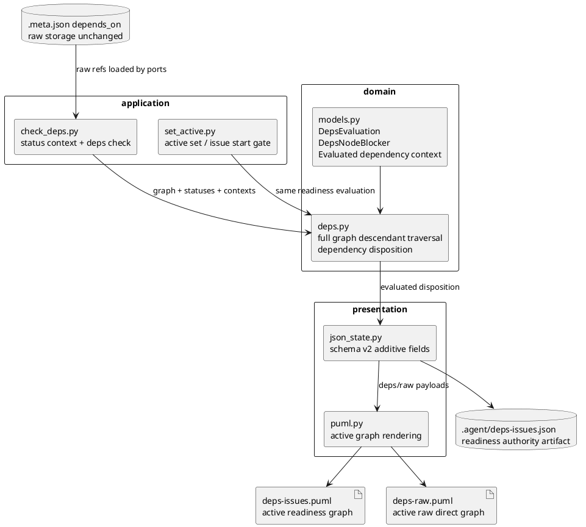

# iss-00209 Improve dependency PlantUML view rendering — 設計

## 親図（Diagram）参照
- Epic:
  - `epic-00059` Dependency metadata unification and command mutation
- Initiative:
  - `init-local-00003` Architecture maintenance and hardening
- 再利用する決定:
  - `.meta.json.depends_on` は raw storage のまま維持する。
  - `deps-issues.*` は readiness / blocker authority。
  - `deps-raw.puml` は raw direct dependency の human-facing visual/debug artifact。

## 目的・制約
- 目的:
  - GitHub lifecycle state と dependency readiness interpretation を分離し、blocker 判定と PlantUML 表示を同じ authority から導く。
  - GitHub-open all-descendant-done high-level dependency を satisfied とし、empty-open high-level dependency を blocker として残す。
  - `deps-issues.puml` と `deps-raw.puml` の表示を active dependency reading に寄せ、done / closed / resolved-only noise を減らす。
- 必須:
  - `dependency_disposition` と `disposition_basis` を導入する。
  - descendant issue membership は full graph から計算する。
  - `deps check`, `active set`, `issue start`, `sync`, generated JSON, generated PUML を一貫させる。
- 禁止:
  - `.meta.json.depends_on` storage format と `deps add/remove` mutation contract を変更しない。
  - presentation layer だけで blocker 判定を再推論しない。
  - 新しい `deps-raw-all.puml` artifact を追加しない。

## 既存実装 / 規約の理解
- 参照した実装 / docs:
  - `src/spec_dock/assets/spec_dock/scripts/spec_dock_runtime/domain/models.py`
  - `src/spec_dock/assets/spec_dock/scripts/spec_dock_runtime/domain/deps.py`
  - `src/spec_dock/assets/spec_dock/scripts/spec_dock_runtime/application/check_deps.py`
  - `src/spec_dock/assets/spec_dock/scripts/spec_dock_runtime/application/set_active.py`
  - `src/spec_dock/assets/spec_dock/scripts/spec_dock_runtime/presentation/json_state.py`
  - `src/spec_dock/assets/spec_dock/scripts/spec_dock_runtime/presentation/puml.py`
  - `spec-dock/docs/reference_deps.md`
  - `spec-dock/docs/reference_sync.md`
- 現状理解:
  - `deps_reader` は raw node dependency context を返すが、readiness authority ではない。
  - `domain/deps.py` は `DepsEvaluation` を返し、`node_blockers` と `satisfied_dependencies` を決める中心である。
  - `check_deps.py::resolve_high_level_status_context()` は GitHub / cache / descendant aggregate / local を使って high-level state を解決する。
  - `set_active.py` と `issue start` は readiness guard を共有するため、domain readiness を直せば downstream に効く。
  - `json_state.py` / `puml.py` は現在 satisfied context を見える edge として出しやすく、図のノイズになっている。
- 採用するパターン:
  - Domain first: readiness disposition を domain で決め、application / presentation はそれを消費する。
  - Additive schema: schema v2 の既存 key を残し、新 field を追加する。
- 採用しないもの:
  - Rendering-only fix。
  - `open` / `closed` を dependency readiness の意味で再利用する命名。
  - todo projection から high-level emptiness を推定する実装。

## 採用方針 / トレードオフ
- 論点:
  - GitHub-open all-done epic / initiative を blocker と見なすか。
- 決定:
  - GitHub lifecycle fact は `lifecycle_state` として保持する。
  - dependency readiness interpretation は `dependency_disposition` として保持する。
  - GitHub-open all-descendant-done high-level dependency は `dependency_disposition=satisfied` とする。
  - Empty GitHub-open high-level dependency は `dependency_disposition=blocking` とし、`node_blocker` として扱う。
- トレードオフ:
  - GitHub open parent が active graph から消える場合があるが、complete audit は `.meta.json.depends_on` / `.agent/index-all.json` に残る。
  - JSON は additive fields を増やすが、既存 consumer 互換性を保ちやすい。

## 依存関係分析
- module 依存:
  - `domain/models.py` -> `domain/deps.py` -> `application/check_deps.py` / `application/set_active.py` -> `presentation/json_state.py` -> `presentation/puml.py`
- file 依存:
  - `deps_reader.py` output は storage / topology fact として維持する。
  - `check_deps.py` は full graph descendant status を domain に渡すための context を組み立てる。
  - `json_state.py` は `DepsEvaluation` の evaluated context を `.agent/deps-issues.json` と PUML payload に反映する。
- 実装起点:
  - `domain/models.py` と `domain/deps.py` の contract を先に固定する。
- 順序への影響:
  - Domain tests で disposition table を固定してから application / presentation へ進む。

## モジュール依存図（Module Dependency Diagram）


## インターフェース契約
- Domain model:
  - Add evaluated high-level dependency context fields:
    - `lifecycle_state`
    - `lifecycle_source`
    - `dependency_disposition`
    - `disposition_basis`
  - Keep existing `DepsNodeBlocker` and `DepsDependencyContext` compatibility where feasible.
- `deps check --json`:
  - Preserve existing top-level fields.
  - Enrich `node_blockers` and `satisfied_dependencies` with lifecycle / disposition fields.
- `.agent/deps-issues.json`:
  - Keep `schema_version: 2`.
  - Preserve `nodes`, `edges`, `deps`, `projection`, `source`, `edge_direction`.
  - Treat `nodes` / `edges` as the active readiness graph surface.
  - Add a top-level `dependency_contexts` list for evaluated high-level dependency context that must remain machine-readable even when not rendered as active graph nodes / edges.
  - Add lifecycle / disposition fields on included high-level nodes when they are active graph participants.
  - Add lifecycle / disposition fields to `dependency_contexts` for satisfied-but-not-rendered high-level dependencies, including GitHub-open all-descendant-done targets.
- PUML:
  - `deps-issues.puml`:
    - Render active blockers and actionable issue states.
    - Do not render done issue, closed high-level node, GitHub-open all-descendant-done high-level node, or satisfied-only edge as active graph content.
    - Use `blocks` for blocking edge labels.
  - `deps-raw.puml`:
    - Render active raw direct edges as `raw_direct`.
    - Use package representation for initiative / epic.
    - Filter done / closed / resolved-only visual noise from the active raw view.

## ドメインモデル差分
| target | lifecycle_state | descendant issue count | descendant states | dependency_disposition | disposition_basis | blocker surface |
|---|---|---:|---|---|---|---|
| epic/initiative | open | 0 | N/A | blocking | empty_open_container | node_blocker |
| epic/initiative | unknown | 0 | N/A | indeterminate | empty_unknown_container | node_blocker |
| epic/initiative | closed | any | any | satisfied | lifecycle_closed | none |
| epic/initiative | done | any | any | satisfied | local_done | none |
| epic/initiative | open | >0 | all done/closed | satisfied | all_descendant_issues_done | none |
| epic/initiative | open | >0 | any open/ready/blocked | blocking | descendant issue blockers |
| epic/initiative | open | >0 | any unknown | indeterminate | descendant issue unknown |

### Descendant Traversal
- Epic descendant issues:
  - full graph issue nodes whose `epic_id == target_epic_id`.
- Initiative descendant issues:
  - full graph issue nodes whose `initiative_id == target_initiative_id`.
- The traversal does not use todo projection. Done issues absent from `index.json` still count.

### `.agent/deps-issues.json` Context Separation
- `nodes`:
  - Active graph participants only.
  - Includes actionable issues, issue blockers, empty/unknown high-level node blockers, and other active readiness participants.
  - Does not include done issue, closed high-level node, GitHub-open all-descendant-done high-level node, or satisfied-only context solely to explain readiness.
- `edges`:
  - Active graph edges only.
  - Includes blocking edges.
  - Does not include satisfied-only edges as active graph edges.
- `dependency_contexts`:
  - Machine-readable evaluated high-level dependency context.
  - Includes both blocking / indeterminate / satisfied high-level contexts.
  - Preserves satisfied-but-not-rendered context required by AC-003.
  - Minimum fields:
    - `source_node_id`
    - `source_issue_id`
    - `target_node_id`
    - `target_node_kind`
    - `target_issue_ids`
    - `expansion`
    - `lifecycle_state`
    - `lifecycle_source`
    - `dependency_disposition`
    - `disposition_basis`
- Rendering rule:
  - `deps-issues.puml` consumes `nodes` / `edges` for the active graph and may ignore satisfied `dependency_contexts`.
  - Agents that need explanation of why a GitHub-open high-level dependency is not blocking read `dependency_contexts`.

## ディレクトリ / ファイル変更計画
```text
src/spec_dock/assets/spec_dock/scripts/spec_dock_runtime/
|-- domain/
|   |-- models.py          # Modify: lifecycle/disposition model fields
|   `-- deps.py            # Modify: disposition classification and full graph descendant handling
|-- application/
|   |-- check_deps.py      # Modify: high-level context resolution and deps check output
|   `-- set_active.py      # Modify if needed: consume enriched readiness result without duplicate rules
`-- presentation/
    |-- json_state.py      # Modify: schema v2 additive fields and active graph payloads
    `-- puml.py            # Modify: deps-issues/deps-raw rendering policy

src/spec_dock/assets/spec_dock/docs/
|-- reference_deps.md      # Modify: lifecycle vs disposition contract
`-- reference_sync.md      # Modify: generated artifact and PUML policy

spec-dock/docs/
|-- reference_deps.md      # Refresh / inspect mirror when provider docs change
`-- reference_sync.md      # Refresh / inspect mirror when provider docs change

tests/
|-- unit/domain/test_deps.py
|-- unit/application/test_check_deps.py
|-- unit/application/test_set_active.py
|-- unit/presentation/test_runtime_sync_s07.py
|-- unit/presentation/test_deps_raw_puml.py
|-- cli_runtime/test_deps.py
`-- cli_runtime/test_sync.py
```

## 要件 → 設計マッピング
- AC-001 -> `dependency_disposition=blocking`, `disposition_basis=empty_open_container`, node blocker handling.
- AC-002 -> `dependency_disposition=satisfied`, `disposition_basis=all_descendant_issues_done`, no blocker handling.
- AC-003 -> additive JSON fields in `deps check --json` and `.agent/deps-issues.json`.
- AC-004 -> `deps-issues.puml` active readiness graph filtering and labels.
- AC-005 -> `deps-raw.puml` active raw direct graph filtering and high-level package representation.
- AC-006 -> no storage / mutation contract changes.
- EC-001 -> full graph descendant traversal.
- EC-002 -> fail-closed unknown disposition.
- EC-003 -> closed high-level satisfaction.
- EC-004 -> raw view is not readiness authority.

## テスト戦略
- 単体:
  - `domain/deps.py` disposition table tests.
  - `check_deps.py` status aggregation and full graph descendant tests.
  - `set_active.py` guard behavior tests.
- 統合:
  - CLI runtime tests for `deps check`, `sync`, `active set`, and `issue start`.
  - GitHub stub scenarios for empty open, empty closed, all-descendant-done, mixed descendants, and unknown descendants.
- Presentation:
  - `.agent/deps-issues.json` schema v2 additive field assertions.
  - `deps-issues.puml` omits satisfied-only active graph content.
  - `deps-raw.puml` keeps `raw_direct` active edges and package high-level representation.
- Manual:
  - Refresh realistic manual fixture under `manual-tests/` and inspect generated PlantUML.

## 要件 / 例外 -> 検証マッピング
- AC-001:
  - domain red test + `deps check` CLI exit 3 + active/issue start rejection.
- AC-002:
  - domain red test + `deps check` CLI exit 0 + active/issue start success.
- AC-003:
  - JSON assertion on lifecycle / disposition fields.
- AC-004:
  - PUML assertion and manual screenshot / visual inspection if needed.
- AC-005:
  - PUML assertion for active raw direct edges and omitted resolved noise.
- AC-006:
  - existing `deps add/remove` regression suite and docs inspection.
- EC-001:
  - regression using done descendants absent from todo projection.
- EC-002:
  - unknown status fail-closed test.

## リスク / 移行 / ロールバック
- Migration:
  - No persisted data migration.
  - Existing `.meta.json.depends_on` remains valid.
  - Generated `.agent/*` and PUML artifacts are refreshed by `sync`.
- Compatibility:
  - Keep schema version 2 and add fields.
  - Avoid removing existing JSON keys in the first pass.
  - `dependency_contexts` is additive and does not require rendering all contexts as graph nodes.
- Risk:
  - Presentation filters can drift from domain readiness if they infer state locally. Mitigation: consume evaluated disposition fields.
  - Full graph traversal can be confused with todo projection. Mitigation: test done descendants absent from todo projection.
  - `deps-raw.puml` may no longer be a complete metadata audit. Mitigation: document it as active raw direct view and point audit users to `.meta.json.depends_on` / `.agent/index-all.json`.
- Rollback:
  - Revert issue diff and rerun `sync` to avoid stale generated artifacts.

## 未確定事項
- none
