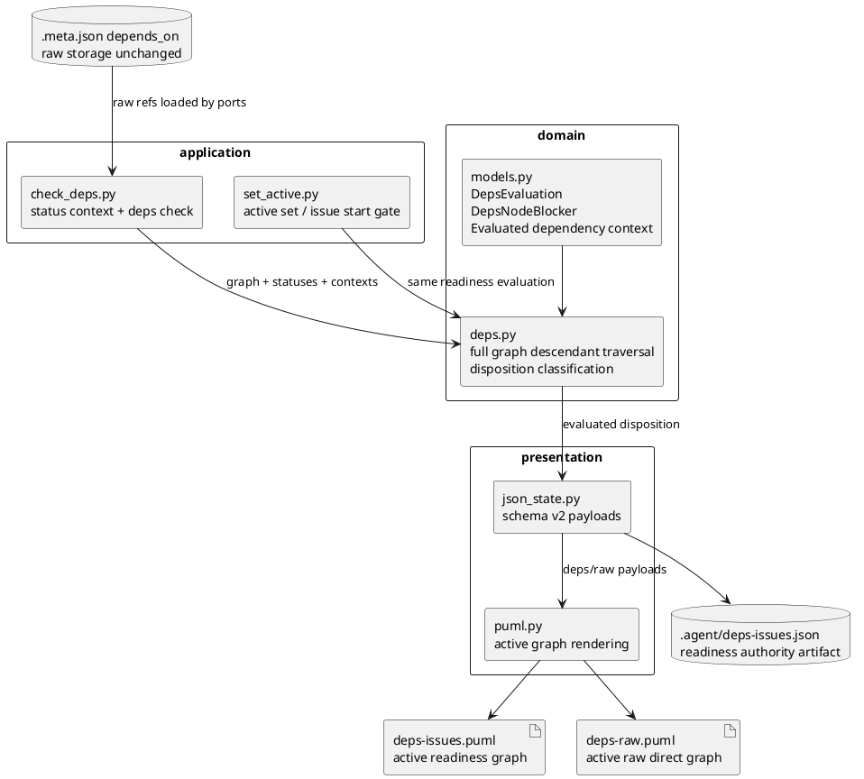

# Draft Design: Dependency Disposition PlantUML Rendering

This is delegated draft architecture evidence for `iss-00209`. It is not canonical `design.md`, does not claim adoption, and should be reviewed by the main orchestrator before any reflection.

## 1. Requirement Coverage

- AC-001: Empty open high-level dependency blocks.
  - Design: keep empty `initiative` / `epic` targets as `dependency_disposition=blocking` with `disposition_basis=empty_open_container`; expose them as node blockers and render them in `deps-issues.puml`.
- AC-002: GitHub-open all-done high-level dependency is satisfied.
  - Design: compute descendant issue state from the full graph, not the todo projection; if descendants exist and all are done/closed, emit `dependency_disposition=satisfied` with `disposition_basis=all_descendant_issues_done`.
- AC-003: Lifecycle and disposition are both visible to machine consumers.
  - Design: preserve lifecycle facts as `lifecycle_state` / `lifecycle_source` while adding readiness interpretation fields to `deps check --json` and `.agent/deps-issues.json`.
- AC-004: `deps-issues.puml` remains actionable.
  - Design: render blocking issue and node blocker edges only; omit done/closed/all-descendant-done satisfied-only nodes and edges from the active graph.
- AC-005: `deps-raw.puml` remains active raw direct view.
  - Design: keep raw direct edge semantics and package representation for high-level nodes, but filter out resolved-only high-level context and done/closed issue noise from the active raw view.
- AC-006: Storage and mutation contracts remain unchanged.
  - Design: do not change `.meta.json.depends_on`, `deps add`, or `deps remove`; all changes sit in readiness evaluation, application consumers, generated schema v2 context, rendering, docs, and tests.
- EC-001:
  - Full graph descendant traversal is mandatory so done descendants absent from `index.json` do not make a high-level dependency appear empty.
- EC-002:
  - Unknown descendant status is fail-closed: `dependency_disposition=indeterminate`, `disposition_basis=descendant_issue_unknown`, and command behavior remains not-ready.
- EC-003:
  - Closed high-level node with no child issues is satisfied by lifecycle.
- EC-004:
  - `deps-raw.puml` is not readiness authority; `.agent/deps-issues.json` and `deps check` are.

## 2. Existing Context Findings

- `reference_deps.md` and `reference_sync.md` already separate raw dependency storage from readiness authority.
- Current domain code has `DepsDependencyContext`, `DepsHighLevelStatus`, `DepsNodeBlocker`, and `DepsEvaluation`, but the model does not explicitly name `dependency_disposition` or `disposition_basis`.
- Current readiness logic already handles empty open blockers and some satisfied high-level contexts, but the public schema still exposes `reason`, `state`, and `satisfied_dependencies` rather than a unified disposition model.
- Current `check_deps.py::resolve_high_level_status_context()` can derive high-level state from GitHub/cache/local/descendant aggregation. The design should avoid treating GitHub `open` as the sole blocker signal.
- Current `json_state.py::_build_deps_issues_v2_payload()` includes satisfied dependency edges in `.agent/deps-issues.json`; current `puml.py` renders dashed satisfied edges. That is the main presentation mismatch with the accepted requirement.
- Existing tests already cover several nearby scenarios. The implementation plan should revise expectations rather than add a parallel test universe.
- Existing discussions establish adopted local evidence for Option A: lifecycle and dependency readiness must be fixed together.

## 3. Design Decisions

- Decision 1: Add an explicit dependency disposition contract.
  - `lifecycle_state`: factual GitHub/local/cache/derived state: `open`, `closed`, `done`, `unknown`.
  - `lifecycle_source`: source of that fact: `github`, `cache`, `local`, `descendant_aggregate`, `none`.
  - `dependency_disposition`: readiness interpretation: `blocking`, `satisfied`, `indeterminate`.
  - `disposition_basis`: explanation code: `empty_open_container`, `empty_unknown_container`, `lifecycle_closed`, `local_done`, `all_descendant_issues_done`, `descendant_issue_open`, `descendant_issue_unknown`.
- Decision 2: Make full graph descendant traversal the evaluation basis for high-level dependencies.
  - Use `SpecGraph.nodes_by_id`, not `.agent/index.json`, as the source for descendant issue membership.
  - For an `epic`, descendants are issue nodes whose `epic_id == target_id`.
  - For an `initiative`, descendants are issue nodes whose `initiative_id == target_id`.
  - This intentionally includes done issues and branches that are absent from todo projection.
- Decision 3: Readiness evaluation owns disposition; presentation only consumes it.
  - `domain/deps.py` should classify high-level dependency context once.
  - `check_deps`, `active set`, and `issue start` should consume the same `DepsEvaluation`.
  - `json_state.py` and `puml.py` should not re-infer blocker status from lifecycle state alone.
- Decision 4: Keep `deps-issues.json` schema version 2 and extend compatibly.
  - Add fields; do not remove existing keys in the first pass unless a canonical plan explicitly allows breaking tests/consumers.
  - Prefer additive payloads for `node_blockers` and `satisfied_dependencies`.
- Decision 5: Treat `deps-issues.puml` as an active readiness graph.
  - It should show open/unknown issue blockers and empty high-level blockers.
  - It should not show satisfied-only edges or done/closed/all-descendant-done high-level nodes as active graph content.
- Decision 6: Treat `deps-raw.puml` as an active raw direct dependency visual/debug graph.
  - It keeps `raw_direct` labels and package rendering for high-level nodes.
  - It filters resolved-only context from the active visual output, while complete audit remains in `.meta.json.depends_on` and `.agent/index-all.json`.

## 4. Alternatives Considered

- Rendering-only filtering:
  - Rejected for this issue because it would allow `deps check` / `active set` / `issue start` to disagree with the diagrams.
- Split readiness authority into a prerequisite issue:
  - Rejected by adopted interview evidence for this issue. It is reviewable, but creates an intermediate inconsistent state.
- Use GitHub lifecycle as dependency truth:
  - Rejected because GitHub-open parent issues can be dependency-satisfied when all descendant issues are done.
- Create a new `deps-raw-all.puml` audit artifact:
  - Out of scope. The requirement explicitly keeps complete audit in metadata / `index-all` and does not add a new artifact.
- Remove satisfied context from JSON entirely:
  - Not recommended for the first implementation slice. It is riskier for machine consumers than keeping additive `dependency_disposition=satisfied` while omitting satisfied-only edges from PUML.

## 5. Boundary / Contract Model

- Domain boundary:
  - Converts raw dependency contexts plus lifecycle/descendant facts into disposition.
  - Owns fail-closed unknown behavior.
- Application boundary:
  - Loads graph, dependency topology, GitHub/cache/local status, and high-level status facts.
  - Calls domain readiness evaluation.
  - Does not duplicate disposition rules in command handlers.
- Presentation boundary:
  - Serializes existing and new machine-readable fields.
  - Renders active graph views from the evaluated contract.
- Docs boundary:
  - Provider-side docs under `src/spec_dock/assets/spec_dock/docs/` are source of shipped documentation truth.
  - Dogfooding `spec-dock/docs/` should be inspected or refreshed as secondary validation if scaffold docs change.
- Test boundary:
  - Domain tests pin disposition rules.
  - Application tests pin command-level readiness behavior.
  - Presentation tests pin schema and rendering.
  - CLI runtime tests pin end-to-end `sync`, `deps check`, `active set`, and issue-start behavior.

## 6. Dependency Analysis

- Upstream inputs:
  - `.meta.json.depends_on` raw node-level dependency storage.
  - `SpecGraph` node hierarchy and issue membership.
  - GitHub/cache/local issue lifecycle snapshots.
  - Current `.agent/index-all.json` / `.agent/index.json` only for cached status fallback, not descendant membership.
- Internal dependency order:
  - `domain/models.py` defines disposition payload types.
  - `domain/deps.py` evaluates disposition.
  - `application/check_deps.py` and `application/set_active.py` consume evaluation.
  - `presentation/json_state.py` serializes evaluated fields.
  - `presentation/puml.py` renders the JSON/payload policy.
- Downstream consumers:
  - `deps check --json`
  - `active set`
  - `issue start` through active readiness guard
  - `.agent/deps-issues.json`
  - `deps-issues.puml`
  - `deps-raw.puml`

## 7. Source of Record

- Requirement source:
  - `spec-dock/active/issue/requirement.md`, last update `2026-06-19`, current worktree has pre-existing uncommitted modification.
- Adopted discussion evidence:
  - `20260619t002903z-interview-dependency-plantuml-closed-node-policy.md`
  - `20260619t010926z-interview-dependency-disposition-scope-amendment.md`
- Runtime contract sources:
  - `spec-dock/docs/reference_deps.md`
  - `spec-dock/docs/reference_sync.md`
- Implementation source of truth:
  - Provider-side runtime under `src/spec_dock/assets/spec_dock/scripts/spec_dock_runtime/`.

## 8. Data Flow / Domain Model / Interface Contract

### Evaluation Flow

1. Reader resolves raw direct dependency references and compiles issue-level dependency context.
2. Application builds the full `SpecGraph` and status context.
3. Application resolves high-level lifecycle facts.
4. Domain evaluates target readiness using issue blockers and high-level dependency disposition.
5. Application returns one `DepsEvaluation` to command and sync consumers.
6. Presentation serializes schema v2 context and renders PUML.

### Domain Model Delta

- Add or extend a value object for high-level dependency evaluation, for example:
  - `source_node_id`
  - `source_issue_id`
  - `target_node_id`
  - `target_node_kind`
  - `target_issue_ids`
  - `expansion`
  - `lifecycle_state`
  - `lifecycle_source`
  - `dependency_disposition`
  - `disposition_basis`
- Keep `DepsNodeBlocker` as the blocking surface for empty/unknown high-level containers, but enrich it with disposition fields or derive it from the new value object.
- Keep `DepsDependencyContext` as raw context if that keeps the diff smaller; add a separate evaluated context if mixing raw and evaluated fields would blur responsibility.

### Disposition Table

| target | lifecycle_state | descendant issue count | descendant states | dependency_disposition | disposition_basis | blocker surface |
|---|---|---:|---|---|---|---|
| epic/initiative | open | 0 | N/A | blocking | empty_open_container | node_blocker |
| epic/initiative | unknown | 0 | N/A | indeterminate | empty_unknown_container | node_blocker |
| epic/initiative | closed | any | any | satisfied | lifecycle_closed | none |
| epic/initiative | done | any | any | satisfied | local_done | none |
| epic/initiative | open | >0 | all done/closed | satisfied | all_descendant_issues_done | none |
| epic/initiative | open | >0 | any open/ready/blocked | blocking | descendant_issue_open | descendant issue blockers |
| epic/initiative | open | >0 | any unknown | indeterminate | descendant_issue_unknown | unknown/blocked issue surface |

### JSON Compatibility

- Keep `schema_version: 2`.
- Preserve existing top-level `node_blockers` and `satisfied_dependencies` arrays for `deps check --json`.
- Add fields inside those objects:
  - `lifecycle_state`
  - `lifecycle_source`
  - `dependency_disposition`
  - `disposition_basis`
- Preserve existing `.agent/deps-issues.json` keys:
  - `projection`
  - `source`
  - `deps`
  - `nodes`
  - `edges`
  - `edge_direction`
- Add node-level fields for high-level nodes when included:
  - `lifecycle_state`
  - `lifecycle_source`
  - `dependency_disposition`
  - `disposition_basis`
- Avoid using satisfied-only edges as the primary schema carrier. If a satisfied dependency must remain machine-readable, prefer node/field context over a rendered graph edge.

## 9. File / Module Change Plan

```text
src/spec_dock/assets/spec_dock/scripts/spec_dock_runtime/
|-- domain/
|   |-- models.py          # extend dependency evaluation payload types
|   `-- deps.py            # centralize disposition classification and full graph descendant traversal
|-- application/
|   |-- check_deps.py      # pass high-level lifecycle and full graph facts into evaluation; JSON result uses enriched fields
|   `-- set_active.py      # consume same readiness evaluation for active set / issue start gate
`-- presentation/
    |-- json_state.py      # serialize schema v2 additive disposition fields and active graph payloads
    `-- puml.py            # render active blocker graph and filtered raw direct graph

src/spec_dock/assets/spec_dock/docs/
|-- reference_deps.md      # source docs for lifecycle vs disposition and schema fields
`-- reference_sync.md      # source docs for deps-issues/deps-raw display policy

spec-dock/docs/
|-- reference_deps.md      # dogfooding mirror/inspection target if docs are refreshed
`-- reference_sync.md      # dogfooding mirror/inspection target if docs are refreshed

tests/
|-- unit/domain/test_deps.py
|-- unit/application/test_check_deps.py
|-- unit/application/test_set_active.py
|-- unit/presentation/test_runtime_sync_s07.py
|-- unit/presentation/test_deps_raw_puml.py
|-- cli_runtime/test_deps.py
`-- cli_runtime/test_sync.py
```

No storage migration file is planned. No `.meta.json.depends_on` format change is planned.

## 10. Migration / Compatibility / Rollback

- Migration:
  - No persisted data migration.
  - Existing `.meta.json.depends_on` remains valid.
  - Existing generated `.agent/*` and PUML artifacts are regenerated by `sync`.
- Compatibility:
  - Additive JSON fields keep current schema version 2 consumers working.
  - If tests require removing satisfied edges from `.agent/deps-issues.json`, do that only after confirming no consumer depends on those edges. PUML can drop them first.
- Rollback:
  - Revert the issue diff. Do not add compatibility flags or dual behavior.
  - Regenerate `sync` artifacts after rollback to avoid stale view confusion.

## 11. Observability

- `deps check --json` should make these cases auditable without reading PUML:
  - empty open high-level blocker
  - GitHub-open all-done high-level satisfied dependency
  - unknown high-level/descendant fail-closed path
- `.agent/deps-issues.json` should expose lifecycle/disposition separation for agents.
- `deps-issues.puml` should visually answer only "what is active and blocking/actionable now".
- `deps-raw.puml` should visually answer only "which active raw direct edges are currently relevant".
- `sync --force` placeholder behavior should remain fail-closed and should not emit partial readiness authority.

## 12. Test Strategy

- Domain:
  - Empty GitHub-open epic/initiative returns not ready, `dependency_disposition=blocking`, `disposition_basis=empty_open_container`.
  - GitHub-open high-level dependency with all descendant issues done returns ready and satisfied.
  - Done descendants absent from todo projection still count for disposition.
  - Unknown descendant status returns indeterminate/fail-closed.
- Application:
  - `deps check --json` includes lifecycle and disposition fields.
  - `active set` rejects empty open high-level blockers even with force where current contract says force cannot bypass dependency guard.
  - `active set` and issue start allow all-descendant-done high-level dependencies.
  - `--no-github` cache fallback does not mask descendant aggregation.
- Presentation:
  - `.agent/deps-issues.json` retains schema v2 and includes additive fields.
  - `deps-issues.puml` omits satisfied-only high-level nodes/edges and labels blocking edges as `blocks`.
  - `deps-raw.puml` keeps package rendering for high-level nodes and `raw_direct` labels while omitting done/closed/resolved-only visual noise.
- CLI runtime:
  - `sync --github` and `sync --no-github` scenarios for empty open, empty closed, all-descendant-done, and mixed descendant high-level dependencies.
  - Existing disabled deps placeholder tests remain unchanged.
- Manual:
  - Run realistic dogfooding `sync`, inspect `deps-issues.puml` and `deps-raw.puml`, and record whether active blockers are readable without done/closed clutter.

## 13. ADR Candidates

- ADR not required for the first implementation if the policy remains issue-local and reversible.
- ADR candidate if this becomes a cross-workflow lifecycle policy:
  - "Separate GitHub lifecycle facts from SpecDock dependency disposition."
- ADR candidate if schema compatibility is intentionally broken:
  - "Remove satisfied-only context from deps-issues schema v2."

## 14. Risks

- JSON consumer risk:
  - Removing satisfied edges from `.agent/deps-issues.json` may break consumers that inspect them. Prefer additive fields first.
- Semantic drift risk:
  - If presentation filters on lifecycle instead of disposition, diagrams can disagree with `deps check`.
- Projection risk:
  - Using todo projection for descendant counting misclassifies all-done high-level nodes as empty open blockers.
- GitHub cache risk:
  - Cached open state for high-level nodes can hide descendant aggregate satisfaction if precedence is wrong.
- Scope risk:
  - This issue is larger than a pure renderer fix. Keep implementation slices aligned to domain -> application -> presentation -> docs/tests.

## 15. Requirement Clarification Requests

- none.

The adopted discussions answer the two material questions:
- closed/done/all-descendant-done high-level context should not remain active PlantUML noise;
- `iss-00209` should include readiness authority and rendering together.

## 16. Integration Notes for Main Orchestrator

- Treat this file as a draft evidence source only.
- Canonical `design.md`, `plan.md`, and `report.md` still require main-orchestrator authoring and fresh `spec-reviewer` review.
- The current active issue `requirement.md` is already modified in the worktree before this draft work; do not attribute that change to this draft.
- When integrating, prefer a staged plan:
  1. Domain disposition model and tests.
  2. Application command behavior and JSON fields.
  3. `deps-issues.json` / `deps-issues.puml` rendering policy.
  4. `deps-raw.puml` active raw visual filtering.
  5. Provider docs, dogfooding inspection, and manual evidence.
- No canonical edit, final authority, promotion, reviewer-pass, or user-dialogue ownership is claimed.

## Module Dependency Diagram


