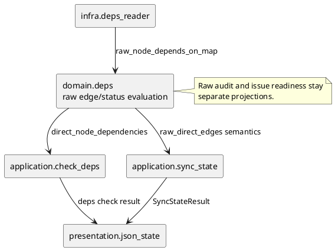

# iss-00235 Repair high level dependency source projection — 設計（どう実現するか）

## 設計目的
- `.meta.json.depends_on` に保存された high-level source node (`initiative` / `epic`) 自体の direct dependency を、issue readiness projection で失わない。
- `deps check --id <initiative|epic>` は、target node 自体の direct dependency を machine-readable に返し、未解決なら non-ready と判定する。
- `.agent/index-all.json` は full-history raw audit surface として、保存済み raw direct edge を complete に返す。
- `effective_depends_on`、`deps-issues.json`、`deps-raw.puml` の既存責務は拡大しない。

## 既存実装の理解
- `infra.deps_reader.load_issue_depends_on_map()` は各 node の `.meta.json.depends_on` を解決し、`raw_node_depends_on_map` に保持している。
- 同じ処理は source node を `_issue_ids_for_dep_node()` で issue ids に展開し、issue source ごとの `issue_depends_on_map` と `dependency_contexts_by_issue_id` を作る。
- Source initiative / epic に descendant issue がない場合、`src_issue_ids` が空になり、raw edge は `raw_node_depends_on_map` にだけ残って readiness evaluation へ渡らない。
- `domain.deps.inspect_target_deps()` と `DepsDependencyContext` は issue-keyed readiness を中心にしており、high-level source node 自体を first-class readiness source として扱っていない。
- `presentation.json_state.render_deps_check_json()` は issue readiness fields を返すが、target node 自体の direct raw dependency を表す field を持たない。
- `.agent/index-all.json` の `deps.issue_edges` は issue readiness projection であり、complete raw node graph ではない。

## 採用方針
- Raw direct dependency audit と issue readiness projection を分離する。
- `effective_depends_on` は issue-level effective blocker / closure として維持し、high-level source direct dependency を混ぜない。
- `deps check` は additive field で target node 自体の direct dependency status を返す。
- `index-all` は additive field で complete raw direct edge audit を返す。
- `deps-issues.json` は issue readiness artifact のままとし、complete raw node graph dump にしない。
- `deps-raw.puml` はこの issue では complete audit contract に昇格しない。

## インターフェース契約

### `deps check --json`
- 新しい additive field として `direct_node_dependencies` を返す。
- Entry は次の情報を持つ。
  - `source_node_id`
  - `source_node_kind`
  - `target_node_id`
  - `target_node_kind`
  - `target_issue_ids`
  - `expansion`
  - `lifecycle_state`
  - `lifecycle_source`
  - `dependency_disposition`
  - `disposition_basis`
- Value schema は既存 domain vocabulary に揃える。
  - `expansion`: `issue` / `expanded` / `empty`
  - `lifecycle_state`: `open` / `closed` / `done` / `unknown`
  - `lifecycle_source`: existing high-level status source (`github` / `cache` / `descendant_aggregate` / `local` / `none` / `unknown`)
  - `dependency_disposition`: `blocking` / `satisfied` / `indeterminate`
  - `disposition_basis`: `empty_open_container` / `empty_unknown_container` / `lifecycle_closed` / `local_done` / `all_descendant_issues_done` / `descendant_issue_open` / `descendant_issue_unknown`
- Target node 自体の direct dependency に `blocking` または `indeterminate` が含まれる場合、top-level `ready` は `false` とする。
- Top-level `blockers` には unresolved direct target node ids を含め、CLI / simple consumers からも non-ready 理由を追えるようにする。
- `effective_depends_on` は issue readiness projection のままとし、direct high-level source dependency だけを理由に値を増やさない。

Example:

```json
{
  "target": "init-00001",
  "ready": false,
  "effective_depends_on": [],
  "blockers": ["epic-00002"],
  "direct_node_dependencies": [
    {
      "source_node_id": "init-00001",
      "source_node_kind": "initiative",
      "target_node_id": "epic-00002",
      "target_node_kind": "epic",
      "target_issue_ids": [],
      "expansion": "empty",
      "lifecycle_state": "open",
      "lifecycle_source": "local",
      "dependency_disposition": "blocking",
      "disposition_basis": "empty_open_container"
    }
  ]
}
```

### `.agent/index-all.json`
- `deps.raw_direct_edges` を追加する。
- `raw_direct_edges` は `.meta.json.depends_on` から解決できた direct node-to-node edge を complete に返す。
- Satisfied / done / closed dependency も raw audit からは消さない。
- Entry shape:

```json
{
  "from": "init-00001",
  "from_kind": "initiative",
  "to": "epic-00002",
  "to_kind": "epic",
  "relation": "raw_direct"
}
```

## ドメインモデル差分
- Raw direct edge:
  - Source / target node id と kind を持つ、storage-derived audit model。
  - Readiness のために filter しない。
- Direct node dependency status:
  - `deps check` target node 自体の direct dependency を status-aware に評価した model。
  - Target high-level lifecycle と descendant expansion を参照し、既存の disposition 語彙で `blocking` / `satisfied` / `indeterminate` を表す。
- 既存 issue readiness model:
  - `DepsEvaluation`
  - `DepsDependencyContext`
  - `DepsNodeBlocker`
  - `DepsState`
  - これらは既存の issue-source readiness path を維持する。

## モジュール依存図



## ファイル変更計画
```text
src/spec_dock/assets/spec_dock/scripts/spec_dock_runtime/
|-- domain/
|   |-- models.py       # 追加: raw direct edge / direct node dependency status model
|   `-- deps.py         # 追加: target node direct dependency disposition evaluation
|-- infra/
|   |-- contracts.py    # 必要なら raw edge/status 入出力型を追加
|   `-- deps_reader.py  # 既存 raw_node_depends_on_map を維持; kind-aware audit に必要な解決情報を供給
|-- application/
|   |-- contracts.py    # DepsCheckResult / SyncStateResult に additive data を追加
|   |-- check_deps.py   # target node direct dependency status を inspection へ統合
|   `-- sync_state.py   # complete raw direct edges を sync state へ運ぶ
`-- presentation/
    `-- json_state.py   # deps check JSON と index-all JSON に additive fields を出力

tests/
|-- unit/application/test_check_deps.py
|-- unit/presentation/test_runtime_sync_s07.py
|-- cli_runtime/test_runtime_deps_s04.py
`-- unit/domain/test_deps.py
```

## 要件 → 設計マッピング
- AC-001:
  - `deps check --json` に `direct_node_dependencies` を追加し、high-level source node 自体の direct dependency を返す。
- AC-002:
  - Direct node dependency status に unresolved `blocking` / `indeterminate` がある場合、top-level `ready` を `false` にする。
- AC-003:
  - `.agent/index-all.json` の `deps.raw_direct_edges` に complete raw direct edge audit を追加する。
- AC-004:
  - Existing issue readiness path と `effective_depends_on` の意味は維持する。
- EC-001:
  - Empty source でも raw direct dependency status は issue expansion に依存せず評価する。
- EC-002:
  - Non-empty source は direct node status と descendant issue readiness projection を別 field として表示する。
- EC-003:
  - `.agent/index-all.json` の raw audit は readiness disposition によって edge を落とさない。
- EC-004:
  - Issue source -> high-level target は既存 `dependency_contexts_by_issue_id` と node blocker semantics を使い続ける。

## テスト戦略
- Domain / application:
  - Empty high-level source `init -> epic` が unresolved のとき、`deps check` result は `ready=false`、`blockers=["epic-..."]`、`direct_node_dependencies` を持つ。
  - Non-empty high-level source は direct node status と issue readiness projection を混同しない。
  - Satisfied / done / closed target は readiness blocker から外れても direct status と raw audit には残る。
- Presentation:
  - `render_deps_check_json()` が `direct_node_dependencies` を additive に出力する。
  - `render_index_artifact()` が `.agent/index-all.json` に `deps.raw_direct_edges` を出力する。
- CLI runtime:
  - `--no-github` で GitHub live state に依存せず #235 相当の reduced reproduction を固定する。
  - Existing issue source -> high-level target tests を regression させない。

## リスク / 互換性
- `blockers` に high-level node ids が入るため、blockers を issue ids only と仮定する consumer があれば注意が必要。
- ただし既存でも `node_blockers` は node-level blocker を表しており、non-ready reason を machine-readable に返す要件を優先する。
- JSON changes は additive で、既存 `.meta.json.depends_on` storage migration は不要。
- `deps-issues.json` と `deps-raw.puml` の contract を広げないため、変更範囲は `deps check` JSON と `.agent/index-all.json` に限定される。

## 採用しない設計
- Synthetic issue を作る:
  - Storage / UI / readiness に fake node が漏れるため不採用。
- High-level source を descendant issues へ強制展開して済ませる:
  - Parent node 自体の raw direct edge を隠すため不採用。
- `effective_depends_on` に high-level source direct dependencies を混ぜる:
  - Issue-level readiness の既存意味が曖昧になるため不採用。
- `deps-issues.json` を complete raw graph dump にする:
  - Issue readiness artifact の責務を壊すため不採用。
- `deps-raw.puml` を complete audit に昇格する:
  - 既存 visual/debug projection の scope を超えるため、この issue では不採用。

## 未確定事項
- なし。
