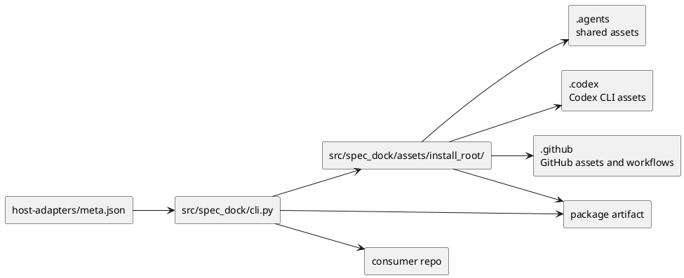
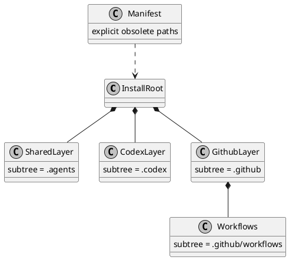
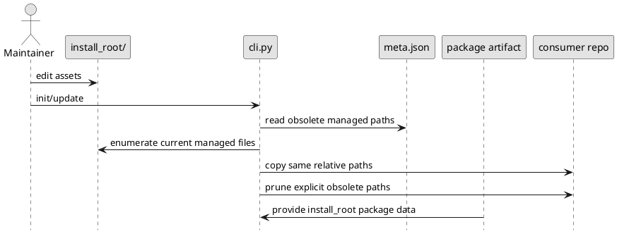

# epic-00067 Installed layout aligned asset source structure for agent tooling — 設計（HOW）

## 全体像
- target boundary:
  - agent-tooling 用 provider-side assets を `src/spec_dock/assets/install_root/` に集約し、installed layout を source tree へそのまま投影する。
  - consumer repo 側の install target は `.agents/`、`.codex/`、`.github/`、`.github/workflows/` のまま維持する。
  - `spec_dock/` scaffold assets は spec-dock 自身の consumer workspace 用 asset family として維持し、この epic の layout authority には含めない。
- impacted area:
  - provider-side assets tree
  - installer source discovery / copy plan
  - host adapter metadata
  - package build asset inclusion
  - init/update tests
  - checked-in dogfooding layout
- existing relation:
  - 現状は `codex_skills/` が shared skills、host adapter metadata、native shim source をまとめて抱えている。
  - `cli.py` と `host-adapters/meta.json` は install target を知っているため、必要なのは target knowledge の追加ではなく source-of-truth の再配置である。

### As-Is / To-Be
- As-Is:
  - provider-side source tree は provider 都合の grouping であり、consumer 側 install layout と同型ではない。
  - shared と host-specific が `codex_skills/` に混在し、workflow は source-of-truth として tree に表現されていない。
  - maintainer は source を読むたびに installed path へ mentally translate する必要がある。
  - package build に hidden directories と dotfiles が確実に含まれることが contract になっていない。
- To-Be:
  - `install_root/` が consumer install layout の mirror になり、source 側の file placement がそのまま install target になる。
  - shared assets は `.agents/`、Codex CLI assets は `.codex/`、GitHub assets と workflows は `.github/` に分離される。
  - installer は source tree を変換せず、copy plan と explicit managed cleanup だけを担う。
  - built artifact でも install_root 配下の hidden path 群が欠落しない。

### UML（module / context）

## 契約
### Directory contract
- canonical source root:
  - `src/spec_dock/assets/install_root/`
- shared subtree:
  - `src/spec_dock/assets/install_root/.agents/`
  - `src/spec_dock/assets/install_root/.agents/skills/`
  - `src/spec_dock/assets/install_root/.agents/host-adapters/`
- Codex subtree:
  - `src/spec_dock/assets/install_root/.codex/`
  - `src/spec_dock/assets/install_root/.codex/agents/`
- GitHub subtree:
  - `src/spec_dock/assets/install_root/.github/`
  - `src/spec_dock/assets/install_root/.github/agents/`
  - `src/spec_dock/assets/install_root/.github/workflows/`
- classification rule:
  - shared skills は reusable skill asset であり、host-specific behavior を記述していても `.agents/skills` に置く。
  - host-native shim、entry file、workflow のように install target が host root 固有のものだけを `.codex` / `.github` に置く。
- canonical examples:
  - `.agents/skills/spec-driven-tdd-workflow/SKILL.md`
  - `.agents/skills/spec-dock-codex-adapter/SKILL.md`
  - `.agents/skills/spec-dock-copilot-adapter/SKILL.md`
  - `.agents/host-adapters/meta.json`
  - `.codex/agents/spec-dock.toml`
  - `.github/agents/spec-dock.agent.md`
  - `.github/workflows/ci.yml`

### Installer contract
- source resolution:
  - installer は agent-tooling assets を `install_root/` から読む。
  - legacy path を一時的に参照するとしても authority は `install_root/` に置く。
- copy rule:
  - source tree の relative path を consumer repo root にそのまま写す。
  - 例外は source root と target root の差し替え、managed cleanup、必要最小限の permission 調整のみ。
- canonical ownership model:
  - current managed file set の canonical source は `install_root/` 配下の実在 file tree とする。
  - explicit obsolete managed file set の canonical source は manifest に記述された obsolete path set とする。
  - workflow files は `install_root/.github/workflows/` に存在する限り current managed file set に含まれる。
  - installer の prune 対象は explicit obsolete managed file set のみとし、current managed file set は copy/update 対象とする。
  - managed 外の path は delete/prune しない。
- conflict handling:
  - managed path に user change があっても current managed file set として source-of-truth に揃える。
  - non-managed path に同名 family の file があっても prune しない。
- idempotency:
  - 同一 source tree に対する init/update は deterministic に同じ installed layout を生成する。

### Manifest boundary
- `host-adapters/meta.json` は host-specific entry file、native shim target、obsolete managed paths の境界 metadata として使う。
- manifest は tree の第二の正本ではなく、host boundary と cleanup 契約を説明する補助情報に留める。
- path authority は install_root にあり、manifest は install_root と矛盾してはならない。
- workflow files の current managed membership は manifest ではなく install_root の実在 tree から決まる。

### Packaging contract
- `install_root/` 配下の hidden directories、dotfiles、workflow files、native shims は package data として built artifact に含まれなければならない。
- package-installed `spec-dock init/update` は local checkout と同じ asset discovery 結果を返さなければならない。
- packaging mismatch は spec fail とみなし、運用回避で吸収しない。

### Legacy authority retirement
- `install_root/` 導入後、agent-tooling assets の authority は `install_root/` に一本化する。
- legacy `codex_skills/` は移行期間中に reference source として残る場合でも canonical source-of-truth ではない。
- docs、tests、installer source discovery は legacy authority 依存を残さない。

### Workflow handling
- `.github/workflows/` を通常の install-shaped subtree として扱う。
- workflow file は registry や special serializer を導入せず、通常 file と同じ copy contract に乗せる。
- GitHub-specific assets review は `.github` subtree review の中で完結させる。

## データモデル
- model / table changes:
  - file tree 自体を layout model とみなし、`install_root/` を canonical representation にする。
  - manifest は boundary metadata、package build config は distribution metadata として扱う。
- invariants:
  - shared assets は `.agents/` にのみ存在する。
  - Codex-specific assets は `.codex/` にのみ存在する。
  - GitHub-specific assets と workflows は `.github/` にのみ存在する。
  - adapter skill は shared skill として `.agents/skills/` に存在する。
  - 同一 asset を shared と host-specific の両方に重複配置しない。
  - consumer repo へは source tree の relative path が保持される。
  - `spec_dock/` scaffold asset family は agent-tooling layout authority に含めない。
  - current managed file set は install_root tree、explicit obsolete managed file set は manifest で一意に決まる。

### UML（data model）

## 主要フロー
- Flow-A source authoring:
  1. maintainer edits a file under `install_root/` using the same relative path that will exist in the consumer repo.
  2. reviewer can understand destination, ownership, and host boundary directly from source placement.
  3. no separate translation table is needed to infer install destination.
- Flow-B init/update sync:
  1. installer resolves `install_root/`.
  2. installer enumerates the current managed file set from the install_root tree.
  3. installer reads explicit obsolete managed file set from manifest.
  4. installer copies each current managed file to the same relative path under the repo root.
  5. installer prunes only explicit obsolete managed paths.
  6. installer leaves non-managed files untouched.
- Flow-C packaged install:
  1. build artifact includes install_root hidden paths as package data.
  2. package-installed `spec-dock` resolves install_root assets.
  3. smoke test confirms parity with local checkout behavior.
- Flow-D future host extension:
  1. new host gets a sibling subtree under `install_root/`.
  2. shared `.agents/` remains stable.
  3. manifest is extended only for host boundary / cleanup metadata.

### UML（sequence / flow）

## 失敗設計
- failure mode:
  - `install_root/` が欠落している
  - manifest が install_root と矛盾する
  - cleanup scope が managed 外へ漏れる
  - workflow path が `.github/workflows` 以外へ drift する
  - built artifact から hidden path が欠落する
- retry:
  - source tree、manifest、package data 設定を修正して init/update を再実行する
- idempotency:
  - 同一 source tree からは同一 installed layout が得られる
- partial failure:
  - copy 途中失敗時は managed scope の incomplete state として再同期可能であること
  - package-installed smoke test failure は rollout blocker として扱う

## 移行戦略
- migration strategy:
  - T1 で `install_root/` を新設し、agent-tooling assets を install-shaped に再配置する。
  - T2 で installer の source discovery、managed sync、cleanup を `install_root/` 基準へ切り替える。
  - T3 で package data inclusion、tests、docs、checked-in dogfooding layout を新 contract に揃える。
  - T4 で legacy `codex_skills/` authority retirement を確認し、二重正本状態を解消する。
- dual write/read:
  - dual-write は持たない。
  - 一時的に legacy read が必要でも authority は `install_root/` に固定する。
- rollback:
  - rollback は issue 単位で source placement または installer source discovery を戻す。
  - installed target path contract 自体は変えない。
  - package data inclusion を optional fallback にしない。

## 観測性 / セキュリティ
- observability:
  - source tree diff、installed tree diff、init/update tests、packaged-install smoke test で layout contract を観測する。
- role / auth:
  - workflow / agent files は repository-local asset として扱い、追加認証は前提にしない。
- audit / pii:
  - 対象外。

## テスト戦略
- Unit:
  - relative path mapping
  - subtree ownership assertions
  - adapter skill classification assertions
  - manifest boundary validation
  - bounded cleanup behavior
- Integration:
  - clean repo への `spec-dock init`
  - existing repo への `spec-dock update`
  - `.github/workflows/ci.yml` の parity
  - dogfooding checked-in layout parity
  - explicit obsolete managed path prune と user-authored file preservation
- E2E:
  - source tree 更新 -> update 実行 -> installed layout 反映までの一連確認
  - package-installed `spec-dock` による smoke test
- E-AC mapping:
  - E-AC-001 -> source tree listing / path assertion tests
  - E-AC-002 -> init/update integration tests + managed boundary assertions
  - E-AC-003 -> update regression + cleanup safety tests
  - E-AC-004 -> spec review + docs consistency check
  - E-AC-005 -> directory model review + future host extension boundary check
  - E-AC-006 -> packaged-install smoke test + built artifact content check
  - E-AC-007 -> legacy authority retirement check + installer source discovery assertions

## 関連 ADR
- なし:
  - 現時点では epic 内の structure contract として閉じ、不可逆判断が出た場合のみ ADR 化する

## 未確定事項
- なし:
  - source root、責務分離、workflow placement、installer policy、packaging contract は requirement で固定済み
