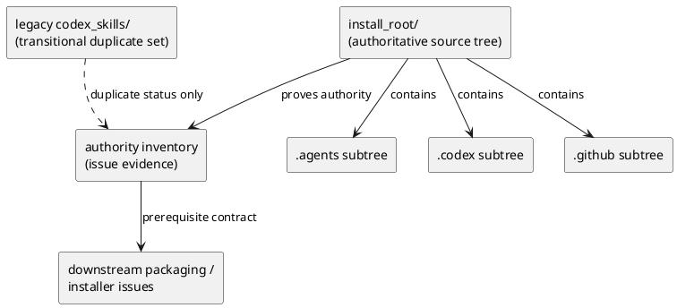
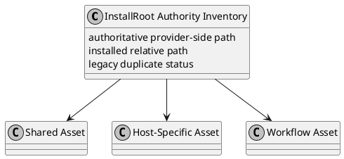

# iss-00068 Install root tree and asset classification — 設計（HOW）

## 目的・制約
- 目的:
  - `src/spec_dock/assets/install_root/` を agent-tooling 用 provider-side source-of-truth として導入し、install 後レイアウトを source tree にそのまま写像する。
  - shared / host-specific / workflow の分類規約を file placement そのもので表現し、後続 issue が package data、installer source discovery、managed ownership を迷わず実装できる土台を作る。
- MUST / MUST NOT:
  - MUST:
    - `.agents`、`.codex`、`.github`、`.github/workflows` を install-shaped subtree として `install_root/` に持つ。
    - in-scope asset inventory 全件の authoritative provider-side path を `install_root/` 側に置く。
    - legacy source が残る場合でも transitional duplicate としてのみ扱う。
  - MUST NOT:
    - `src/spec_dock/cli.py` の source discovery を切り替えない。
    - package data inclusion、managed cleanup、packaged-install verification をこの issue の成立条件にしない。
- 非交渉制約:
  - `epic-00067` の closure target は E-RQ-001、E-RQ-002、E-AC-001 のみ。
  - consumer repo 側 installed relative paths は変更しない。
  - uppercase を含む新規 path は原則導入しない。ただし shared skill asset の既存 filename convention である `SKILL.md` は明示例外として許容する。
- 前提:
  - 現行 installer は `src/spec_dock/assets/codex_skills/` と `host-adapters/meta.json` を前提にしている。
  - checked-in `.agents/`、`.codex/`、`.github/`、`.github/workflows/` は install 後 layout の実例として利用できる。

## 既存実装 / 規約の理解
- 参照した実装 / docs:
  - `src/spec_dock/cli.py`
  - `src/spec_dock/assets/codex_skills/host-adapters/meta.json`
  - `src/spec_dock/assets/codex_skills/native-shims/*`
  - `src/spec_dock/assets/codex_skills/*/SKILL.md`
  - checked-in `.agents/`、`.codex/`、`.github/`、`.github/workflows/ci.yml`
  - `epic-00067` の requirement / design / plan
- 現状理解:
  - `_build_managed_skill_install_plan()` は `assets_dir / "codex_skills"` 配下を直接探索して shared skills と native shim source を検証している。
  - host adapter metadata は `codex_skills/host-adapters/meta.json` から読まれ、`.agents` の canonical entry file と `.codex` / `.github` の target file を知っている。
  - source tree 側には install-shaped root が存在しないため、source placement から installed placement を直接読めない。
  - そのため issue-1 実装中は、current installer compatibility のために legacy files を一時的に残しつつ、authoring authority だけを `install_root/` に移す共存期間が発生する。
- 採用するパターン:
  - provider-side source へ install-shaped mirror root を導入する。
  - authority は `install_root/` に寄せ、legacy `codex_skills` は temporary coexistence の transitional duplicate として扱う。
- 採用しないもの:
  - `codex_skills` を維持したまま mapping table だけで source/install 対応を説明する案
  - issue-1 の時点で installer を `install_root` へ切り替える案
- 影響範囲:
  - 新規 provider-side asset tree
  - issue-level docs / review evidence
  - 後続 issue の package/installer/test 設計前提

## 採用方針 / トレードオフ
- 論点:
  - source tree foundation と installer 切替を同時に行うか分離するか
  - legacy source を即削除するか、一時的に残して authority のみ先に固定するか
- 選択肢:
  - Option A:
    - `codex_skills` を正本のまま維持し、docs だけで install layout を説明する
  - Option B:
    - `install_root/` を先に導入し、legacy source は transitional duplicate として残しつつ authority を移す
  - Option C:
    - `install_root/` 導入と legacy 削除と installer 切替を issue-1 で同時に行う
- 決定:
  - Option B を採用する。
  - 理由:
    - issue-1 の closure を source tree foundation に限定できる。
    - 後続 issue で packaging / installer / verification を段階分離できる。
    - legacy authority retirement を急がずとも、authoring source の一本化を先に固定できる。

## 依存関係分析
- upstream / prerequisite:
  - なし
- downstream / dependent:
  - `iss-00069`:
    - `install_root/` を package artifact に含める前提として、この issue の tree が必要
  - `iss-00070`:
    - installer の source discovery を `install_root/` へ切り替える前提として、この issue の authority inventory が必要
  - `iss-00071`:
    - source tree / dogfooding parity の検証対象として、この issue の install-shaped layout が必要
  - `iss-00072`:
    - transitional duplicate の retire 対象をこの issue の inventory から確定する
- 実装起点:
  - 依存の少ない source tree から作る。
  - 先に `install_root/` の top-level subtree を固定する。
  - 次に in-scope asset inventory 全件を authoritative path へ再配置する。
  - 最後に authority inventory と repo-wide verification rule を docs evidence として揃える。
- sequencing implications:
  - installer や packaging のコード変更はこの issue では始めない。
  - path authority の正本が揃ってから downstream issue へ進む。

### UML（必須: module / dependency）

## インターフェース契約
- API / function / protocol / data boundary:
  - Directory contract:
    - `src/spec_dock/assets/install_root/.agents/skills/<skill>/SKILL.md`
    - `src/spec_dock/assets/install_root/.agents/host-adapters/meta.json`
    - `src/spec_dock/assets/install_root/.codex/agents/spec-dock.toml`
    - `src/spec_dock/assets/install_root/.github/agents/spec-dock.agent.md`
    - `src/spec_dock/assets/install_root/.github/workflows/ci.yml`
  - Authority contract:
    - requirement に定義した In-Scope Asset Authority Inventory の `authoritative provider-side path` を唯一の authoring source とする。
    - `legacy duplicate status` に列挙した旧 path は残っていても transitional duplicate としてのみ扱う。
  - Temporary coexistence contract:
    - issue-1 では in-scope asset inventory の各 row について、まず `install_root/` 側の authoritative file を配置する。
    - current installer が `codex_skills` を参照している間は、`legacy duplicate status` に旧 path がある row について、その旧 path を current installer compatibility mirror として必ず維持する。
    - compatibility mirror は対応する `install_root/` authoritative file と byte-equivalent content を持たなければならない。
    - reviewer は inventory の各 row について、authoritative path の存在、declared legacy duplicate の有無、pair ごとの content parity、inventory 外 duplicate 不在を確認する。
    - content parity を満たせない legacy file は transitional duplicate として残してはならない。
  - Non-goal contract:
    - installer がどの root を読むかはまだ変更しない。
    - meta.json の canonical path contract もこの issue では書き換えない。

## クラス / インターフェース詳細設計（必要時）
- Class / Interface:
  - 該当なし:
    - この issue は新しい runtime class / function interface を導入しない。
- responsibility:
  - source tree layout と authority inventory を固定する。
- collaboration:
  - downstream issue はこの layout contract を前提に package / installer / verification を実装する。

### UML（任意: class / interface）

## 変更計画
- Add:
  - `src/spec_dock/assets/install_root/`
  - `src/spec_dock/assets/install_root/.agents/skills/...`
  - `src/spec_dock/assets/install_root/.agents/host-adapters/meta.json`
  - `src/spec_dock/assets/install_root/.codex/agents/spec-dock.toml`
  - `src/spec_dock/assets/install_root/.github/agents/spec-dock.agent.md`
  - `src/spec_dock/assets/install_root/.github/workflows/ci.yml`
- Modify:
  - issue `requirement.md`
  - issue `design.md`
  - `tests/test_init_update.py`
  - in-scope asset inventory に対応する legacy source files
- Delete:
  - なし:
    - legacy source はこの issue では削除しない
- Move/Rename:
  - 実装上は copy / re-home として扱う。
  - existing installed relative path は rename しない。
- Read only:
  - `src/spec_dock/cli.py`
  - `pyproject.toml`
  - `setup.py`
  - `tests/test_cli.py`

## 要件 → 設計マッピング
- AC-001 -> `install_root/` top-level subtree を新設し、`.agents`、`.codex`、`.github`、`.github/workflows` の path existence を source tree で確認可能にする。
- AC-002 -> In-Scope Asset Authority Inventory に含まれる全 asset を、class ごとの subtree へ authoritative path として再配置する。
- AC-003 -> authority inventory と repo-wide verification rule を requirement/design の両方で整合させる。
- EC-001 -> adapter skills は host-specific behavior を持っていても `.agents/skills/` に置く。
- EC-002 -> workflow asset は `.github/workflows/` に置くが、sync/packaging contract は downstream issue へ送る。
- constraint -> installer / package / cleanup は read only とし、この issue では source tree foundation に閉じる。

## テスト戦略
- Unit:
  - 該当なし:
    - runtime code / installer code を変更しないため、この issue 単独では unit test 追加を必須化しない。
- Integration:
  - source tree listing による path existence 確認
  - repo-wide search による inventory 外 duplicate 不在確認
- E2E / manual:
  - checked-in `.agents`、`.codex`、`.github`、`.github/workflows` と `install_root/` の対応確認
- migration / rollback / feature flag if needed:
  - rollback は `install_root/` subtree を差し戻し、authority inventory を元に戻す。
  - feature flag は使わない。

## 要件 / 例外 -> verification mapping
- AC-001 -> `find src/spec_dock/assets/install_root -type f | sort` による tree evidence
- AC-002 -> inventory の各 row について、authoritative path が expected subtree に存在することを per-asset assertion で確認する
- AC-003 -> inventory の各 row ごとに `src/spec_dock/assets/` 全体検索を行い、その row に許容された authoritative path と declared transitional duplicate path 以外が出ないこと、および declared pair の content parity が保たれていること
- EC-001 -> `spec-dock-codex-adapter` / `spec-dock-copilot-adapter` が `.agents/skills/` にあること
- EC-002 -> `.github/workflows/ci.yml` が `install_root/` に存在すること
- constraint -> installer / package / cleanup の downstream 責務をこの issue の acceptance に混ぜないこと

## リスク / 移行 / ロールバック（必要時）
- risk-1:
  - `install_root/` と legacy `codex_skills` の二重保持で maintainer が混乱する
  - mitigation:
    - authority inventory と verification rule で `install_root` を唯一の authoring source と明記する
    - temporary coexistence contract で legacy file を compatibility mirror に限定する
- risk-2:
  - workflow を先に source tree へ入れることで downstream scope と混同する
  - mitigation:
    - design 上で workflow placement と workflow sync contract を分離して明記する
- risk-3:
  - installer 未切替のため実装途中の一時不整合が起きる
  - mitigation:
    - legacy duplicate を authoritative file からの compatibility mirror として維持し、content parity を verification する
- rollback:
  - `install_root/` subtree を取り下げ、issue docs の authority inventory を元に戻す

## 未確定事項
- なし:
  - source root 名、subtree 責務分離、workflow placement、temporary coexistence 方針は requirement で固定済み。
