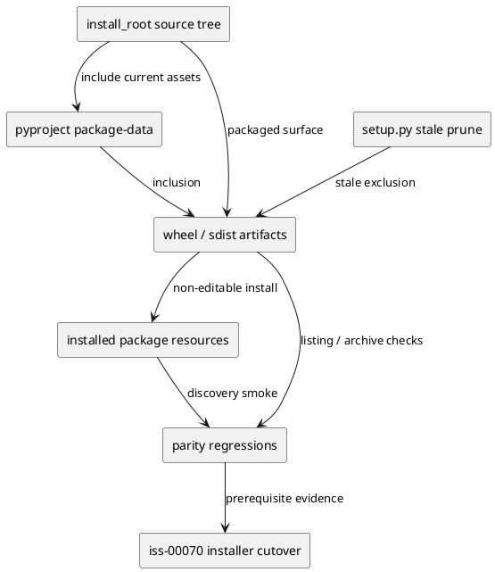
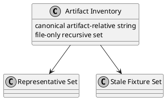

# iss-00069 Package data and installed artifact parity — 設計（HOW）

## 目的・制約
- 目的:
  - `install_root/` 配下の canonical install-shaped assets を wheel / sdist / installed package に欠落なく載せる。
  - package-installed surface が checkout fallback なしで site-packages 内 package data を観測できる状態を作り、`iss-00070` の installer cutover に渡す。
- MUST / MUST NOT:
  - MUST:
    - `install_root` full inventory を artifact-relative namespace で検証できること。
    - native shim canonical handoff surface である `install_root/.codex/agents/spec-dock.toml` と `install_root/.github/agents/spec-dock.agent.md` を installed discovery で確認できること。
    - stale build output exclusion guard が seeded fixture に対して実証されること。
  - MUST NOT:
    - installer canonical source discovery を切り替えない。
    - consumer repo reflection contract をこの issue で閉じない。
- 非交渉制約:
  - `iss-00068` の `install_root` authority contract を前提にする。
  - package parity 比較は canonical artifact-relative strings で行う。
  - `local package install` は non-editable wheel install の isolated environment に限定する。
- 前提:
  - `pyproject.toml` と `setup.py` が package data inclusion / exclusion の主契約面である。
  - `_assets_dir()` は installed package から package data root を得る観測面として使える。
  - 現行 installer は legacy root を読みうるため、issue-2 は package inclusion / installed discovery の prerequisite のみを閉じる。

## 既存実装 / 規約の理解
- 参照した実装 / docs:
  - `pyproject.toml`
  - `setup.py`
  - `tests/test_init_update.py`
  - `iss-00068/requirement.md`
  - `epic-00067/requirement.md`
- 現状理解:
  - package-data は `assets/**/*` と `.gitignore` exception のみで、dot-directory inclusion を包括的に説明していない。
  - `setup.py` の `build_py` hook は stale build output pruning を実装している。
  - bundled asset tests は `codex_skills` 依存の検証が中心で、`install_root` full inventory の package parity をまだ保証していない。
- 採用するパターン:
  - package-data inclusion を明示化し、artifact listing / installed resource listing / seeded stale-output regression の 3 層で検証する。
  - representative set と full inventory を併用する。
- 採用しないもの:
  - local checkout による暗黙 fallback を許した smoke
  - wheel / sdist 片方だけを見て parity とみなすこと
  - stale-output exclusion を source tree の不在だけで判定すること
- 影響範囲:
  - `pyproject.toml`
  - `setup.py`
  - packaging / built-artifact regression tests
  - installed package smoke / discovery tests

## 採用方針 / トレードオフ
- 論点:
  - full inventory まで artifact parity を取るか、代表例だけで済ませるか
  - stale exclusion guard を設定レビューで済ませるか、seeded regression で実証するか
- 選択肢:
  - Option A:
    - representative artifact set のみを wheel/sdist/install で確認する
  - Option B:
    - representative set は readability 用に残しつつ、full inventory parity を file-only recursive comparison で確認する
  - Option C:
    - stale exclusion guard は設定文面レビューだけで済ませる
  - Option D:
    - stale exclusion guard は build staging area に fixture を注入して artifact absence を確認する
- 決定:
  - Option B + D を採用する。
  - 理由:
    - `iss-00070` handoff には representative ではなく full inventory の discoverability が必要。
    - stale-output exclusion は fixture がないと vacuous pass になりやすい。

## 依存関係分析
- upstream / prerequisite:
  - `iss-00068`
    - `install_root/` と canonical authority inventory が存在すること
- downstream / dependent:
  - `iss-00070`
    - package-installed discovery parity を前提に installer cutover を行う
  - `iss-00071`
    - packaged-install smoke の継続検証と dogfooding parity を行う
- 実装起点:
  - 先に canonical path basis と inventory comparison rule を固定する。
  - 次に package-data inclusion / exclusion 設定を整える。
  - 最後に wheel/sdist/install/regression tests を足して handoff evidence を揃える。
- sequencing implications:
  - installer cutover 以前に package artifact parity を安定化させる。

### UML（必須: module / dependency）

## インターフェース契約
- API / function / protocol / data boundary:
  - Packaging inclusion contract:
    - `spec_dock/assets/install_root/...` を package artifact に含める。
  - Artifact comparison contract:
    - source tree file は `src/spec_dock/...` から先頭の `src/` を除いた path を canonical artifact-relative string に正規化する。
    - wheel member は archive member 中の先頭 `spec_dock/` から始まる部分を canonical artifact-relative string に正規化する。
    - sdist member は top-level distribution directory を除去した後、先頭 `src/` を除いた `spec_dock/...` を canonical artifact-relative string に正規化する。
    - installed resource は installed package root `.../site-packages/spec_dock/` からの相対 path に `spec_dock/` を前置して canonical artifact-relative string に正規化する。
    - installed inventory は installed package 内の `spec_dock/assets/install_root/` 配下を再帰走査した file-only 集合を正規化して比較する。
    - equality 比較と stale exclusion pattern match は、正規化済み `/` separator の artifact-relative strings に対して `PurePosixPath.match` 相当で評価する。
    - wrapper-era legacy workflow path は `spec_dock/assets/github/...` namespace をそのまま canonical basis として扱う。
    - `spec_dock/assets/github/...` namespace の wrapper-era stale artifacts は packaged output に残す対象ではなく、AC-004 exclusion 対象としてのみ扱う。
    - `spec_dock/assets/github/...` namespace は source / wheel / sdist / installed の正の parity inventory には含めない。
  - Installed smoke contract:
    - isolated non-editable wheel install から `spec-dock init` / `update` を実行し、checkout fallback を使わずに package data を観測する。
    - consumer repo reflection 成果物そのものは acceptance から外す。
  - Stale exclusion contract:
    - seeded stale-output fixture set は `build_py.run` 後、`_prune_stale_build_outputs()` 実行前の build staging area (`build_lib/spec_dock/assets/...`) に存在することを確認する。
    - fixture inventory は requirement に定義した 14 個の exact stale paths をそのまま使う。
    - wheel については build staging area へ注入した fixture inventory が prune 後 artifact listing で 0 件になることを確認する。
    - sdist については temporary source build context に同じ fixture inventory を source-tree relative path で注入し、build 前 source context に fixture inventory が 14 件存在することを確認したうえで、sdist source set / archive listing で 0 件になることを確認する。

## クラス / インターフェース詳細設計（必要時）
- Class / Interface:
  - 該当なし:
    - この issue は新しい runtime class を追加しない。
- responsibility:
  - package inclusion / exclusion の build-time contract を固定する。
- collaboration:
  - `iss-00070` は本 issue の parity evidence を前提に installer source discovery を切り替える。

### UML（任意: class / interface）

## 変更計画
- Add:
  - `install_root` full inventory parity regression
  - isolated non-editable wheel install smoke
  - seeded stale-output fixture regression
- Modify:
  - `pyproject.toml`
  - `setup.py`
  - `tests/test_init_update.py`
  - issue `requirement.md`
  - issue `design.md`
- Delete:
  - なし
- Move/Rename:
  - なし:
    - path basis を正規化して比較するだけで、asset path 自体は rename しない
- Read only:
  - `src/spec_dock/cli.py`
  - `iss-00068` docs
  - `iss-00070` source discovery logic

## 要件 → 設計マッピング
- AC-001 -> wheel / sdist / installed wheel の 3 系統で full install_root inventory を artifact-relative listing 比較する。
- AC-002 -> isolated env で `init/update` smoke と canonical native shim handoff surface discovery を確認する。
- AC-003 -> full inventory parity を `iss-00070` handoff prerequisite として artifact-level に固定する。
- AC-004 -> seeded stale-output fixture を build staging area に注入し、exclusion guard を実証する。
- EC-001 -> hidden path inclusion を explicit package-data / listing check で担保する。
- EC-002 -> stale exclusion と current asset inclusion が同時に成立する regression を置く。
- EC-003 -> installed package parity までを確認し、source discovery cutover 自体は downstream に送る。
- constraint -> installer cleanup / managed ownership は read only に保つ。

## テスト戦略
- Unit:
  - packaging helper / path normalization helper が切り出されるなら、その正規化規則を unit test する。
- Integration:
  - wheel / sdist archive listing test
  - installed resource recursive inventory parity test
  - isolated wheel-install `init/update` smoke
  - seeded stale-output fixture exclusion test
- E2E / manual:
  - `uvx --from . spec-dock` に近い package-installed 経路での manual smoke
- migration / rollback / feature flag if needed:
  - rollback は package-data / setup exclusions / tests を元に戻す。
  - feature flag は使わない。

## 要件 / 例外 -> verification mapping
- AC-001 -> canonical artifact-relative full inventory の equality across source / wheel / sdist / installed package
- AC-002 -> isolated env での `init/update` 実行と `install_root/.codex` / `.github/agents` discovery assertion
- AC-003 -> full inventory parity evidence を handoff artifact として保存
- AC-004 -> seeded stale fixture paths の staging-presence と artifact-absence を同一 regression で確認
- legacy namespace stale assets -> `spec_dock/assets/github/...` を含む wrapper-era fixture inventory が wheel / sdist の両方で除外されること
- positive parity inventory -> `spec_dock/assets/github/...` namespace を含めず、`install_root` 由来の artifact-relative inventory のみで比較すること
- representative set -> requirement に定義した exact 7 paths を wheel / sdist / installed resource listing で明示 assertion する
- EC-001 -> dot-directory / dotfile を含む inventory rows が archive listing に存在すること
- EC-002 -> stale exclusion set patterns が normalized `/` strings 上で `PurePosixPath.match` semantics で評価されること
- EC-003 -> installed package parity は pass するが consumer repo reflection は assertion しないこと
- constraint -> `src/spec_dock/cli.py` の source discovery logic を変えないこと

## リスク / 移行 / ロールバック（必要時）
- risk-1:
  - hidden path が wheel/sdist から silently drop する
  - mitigation:
    - full inventory archive listing regression
- risk-2:
  - installed smoke が checkout fallback で偽陽性になる
  - mitigation:
    - isolated non-editable wheel install と site-packages-only discovery contract
- risk-3:
  - stale exclusion guard が source tree の不在だけで vacuous pass する
  - mitigation:
    - seeded stale-output fixture set を build staging area に注入する
- rollback:
  - package-data / setup / tests を pre-change state に戻す

## 未確定事項
- なし:
  - canonical path basis、full inventory parity、isolated wheel install smoke、stale fixture regression をこの issue の設計契約として固定する。
