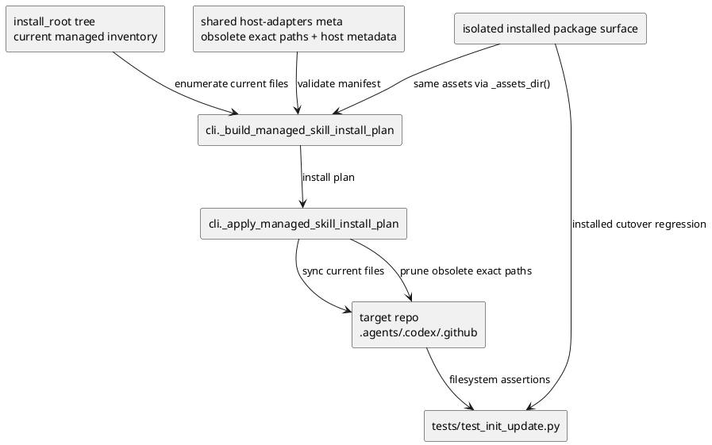
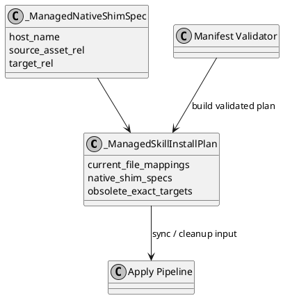

# iss-00070 Installer source discovery and managed ownership — 設計（HOW）

## 目的・制約
- 目的:
  - installer の agent-tooling source discovery を `codex_skills` authority から `install_root` authority へ一括切替する。
  - current managed file set と explicit obsolete managed file set を単一の runtime contract として定義し、init/update の sync と cleanup を fail-closed にする。
  - `iss-00069` で成立した isolated installed package surface をそのまま消費し、checkout fallback なしで cutover 後の authoritative reflection が成立する設計にする。
- MUST / MUST NOT:
  - MUST:
    - `src/spec_dock/assets/install_root/` 実在 tree から current managed inventory を導出すること。
    - `.agents/host-adapters/meta.json` を source-of-truth manifest として in-memory validate してから sync を始めること。
    - sync 完了前に cleanup を走らせず、manifest invalid / path conflict では no-mutation fail にすること。
    - `.github/workflows/` を current managed membership に含めること。
  - MUST NOT:
    - legacy `codex_skills` を fallback source として runtime 参照しないこと。
    - current managed set でも obsolete managed set でもない path を prune しないこと。
    - broad migration manager や history-aware bootstrap を導入しないこと。
- 非交渉制約:
  - user 方針どおり one-shot cutover を採用し、過剰な backward compatibility や多段 migration は持たない。
  - package parity 自体の owner は `iss-00069` に残し、本 issue は installed package surface 上での authoritative reflection だけを追加で証明する。
  - issue-local quality gate として `validate` / `sync --github` は本 issue の `S99` で実行する。ただし、dogfooding checked-in state の最終 refresh、authority retirement、epic 全体の final closeout は `iss-00071` / `iss-00072` に handoff する。
- 前提:
  - `iss-00068` で `install_root` tree と asset classification が確定済み。
  - `iss-00069` で wheel / sdist / isolated installed package に `install_root` assets が入ることが確定済み。
  - 現行実装の managed install/update contract は `src/spec_dock/cli.py` に集中している。

## 既存実装 / 規約の理解
- 参照した実装 / docs:
  - `src/spec_dock/cli.py`
  - `src/spec_dock/assets/codex_skills/host-adapters/meta.json`
  - `tests/test_init_update.py`
  - `iss-00068/requirement.md`
  - `iss-00069/requirement.md`
  - `epic-00067/requirement.md`
- 現状理解:
  - `_build_managed_skill_install_plan()` は managed skill source を `assets_dir / "codex_skills" / <skill>/SKILL.md` から読んでいる。
  - `_HOST_ADAPTER_META_ASSET_REL` は `codex_skills/host-adapters/meta.json` を指し、manifest schema も host ごとの `native_shim.obsolete_managed_paths` に cleanup を分散保持している。
  - `_apply_managed_skill_install_plan()` は shared skills、meta.json、native shim を個別に copy したあと、skill directory cleanup と native shim obsolete cleanup を別ルールで実行している。
  - workflow cleanup は `_install_repo_scaffold()` 側の legacy special-case に残っており、current managed membership と同じ contract 面に入っていない。
  - 現行 negative tests は invalid `native_shim.obsolete_managed_paths` を中心にしていて、top-level shared cleanup manifest や workflow ownership を一体で検証していない。
- 採用するパターン:
  - source tree を inventory として再帰走査し、その inventory を current managed authority にする。
  - manifest は tree の第二正本ではなく、obsolete exact paths と host-native shim boundary を記述する補助 metadata に限定する。
  - preflight validate -> current sync -> post-sync verification -> obsolete cleanup の 4 段で処理を直列化する。
- 採用しないもの:
  - host / asset class ごとの個別 cleanup 実装の継続
  - git history や merge-base を runtime contract に持ち込むこと
  - consumer repo 既存 manifest を読んで判断を変えること
- 影響範囲:
  - `src/spec_dock/cli.py`
  - `src/spec_dock/assets/install_root/.agents/host-adapters/meta.json`
  - `tests/test_init_update.py`
  - installed package cutover regression

## 採用方針 / トレードオフ
- 論点:
  - current managed membership を manifest 主導にするか、tree 主導にするか
  - cleanup manifest を host-local に残すか、shared top-level に集約するか
  - workflow ownership を special-case のまま残すか、managed install plan に統合するか
- 選択肢:
  - Option A:
    - current managed membership も obsolete membership も manifest で表現する
  - Option B:
    - current managed membership は `install_root` tree、obsolete membership は manifest の explicit exact paths に分離する
  - Option C:
    - workflow cleanup は既存の special-case を温存する
  - Option D:
    - workflow も current managed inventory / obsolete manifest の contract に統合する
- 決定:
  - Option B + D を採用する。
  - 理由:
    - epic が要求する canonical ownership model は current tree と explicit obsolete set の二層モデルであり、current membership を manifest に戻すと第二正本が復活する。
    - workflow を special-case のまま残すと `.github/workflows` first-class ownership が満たせない。
    - one-shot cutover 方針では simple inventory + explicit obsolete exact paths の方が review / test / implementation すべてが短く閉じる。

## 依存関係分析
- upstream / prerequisite:
  - `iss-00068`
    - `install_root/.agents` / `.codex` / `.github` / `.github/workflows` が source-of-truth として存在すること
  - `iss-00069`
    - `_assets_dir()` 経由で installed package から `install_root` inventory を観測できること
- downstream / dependent:
  - `iss-00071`
    - init/update parity、packaged-install cutover smoke、dogfooding parity を最終検証する
  - `iss-00072`
    - legacy authority cleanup と final spec close を行う
- 実装起点:
  - 先に inventory / manifest schema / validation error surface を固定する。
  - 次に `_build_managed_skill_install_plan()` を current managed inventory builder へ置き換える。
  - 最後に `_apply_managed_skill_install_plan()` を no-mutation preflight と integrated cleanup contract に切り替える。
- sequencing implications:
  - inventory builder と manifest validation が固まるまで cleanup 実装に触れない。
  - package-installed cutover regression は checkout runtime と同じ install plan を使う最後の検証として追加する。

### UML（必須: module / dependency）

## インターフェース契約
- API / function / protocol / data boundary:
  - `_HOST_ADAPTER_META_ASSET_REL`
    - `Path("install_root") / ".agents" / "host-adapters" / "meta.json"` に更新する。
  - current managed inventory builder
    - input:
      - `assets_dir`
    - output:
      - `install_root` 配下の file-only recursive inventory
      - shared skill sync targets
      - host native shim sync targets
      - workflow sync targets
      - validated obsolete exact target path set
    - rule:
      - source relative pathは `install_root/` から target repo root への単純写像とする。
  - source-of-truth manifest schema
    - location:
      - `install_root/.agents/host-adapters/meta.json`
    - contract:
      - `targets.<host>.enabled`
      - `targets.<host>.entry_file`
      - `targets.<host>.native_shim.{managed,owner,target_file,source_of_truth_asset,delegates_to}`
      - top-level `managed_assets.obsolete_exact_file_paths`
    - validation:
      - required host は `codex` / `copilot` の 2 件に固定し、両方とも `targets` に存在して `enabled: true` でなければ fail する
      - required host が `enabled: false`、missing、wrong-type のいずれでも fail する
      - non-required host は存在してよいが、`enabled: false` の entry は sync/cleanup 対象に含めない
      - non-required host でも entry object / `enabled` shape は validate し、`enabled: true` かつ `native_shim.managed: true` の場合は path safety validation を required host と同じルールで通す
      - `source_of_truth_asset` は `install_root` relative file
      - obsolete paths は normalized posix exact file path、allowed namespace 内、duplicate / overlap 不可
  - apply contract
    - phase-1:
      - provider-side manifest と inventory を in-memory validate
      - current managed target paths と obsolete target paths を plan 化する
      - target repo に対する directory/container conflict を preflight し、`init` / `update` のいずれでも `_install_spec_dock` より前に実行する
    - phase-2:
      - current managed files をすべて copy
      - host-adapters meta.json も current managed file として copy
    - phase-3:
      - current managed files が揃っていることを post-sync verify
      - その後で obsolete exact file paths のみ prune
    - failure:
      - phase-1 失敗時は target repo no-mutation
      - phase-2 失敗時は atomic rollback を要求せず、partial write はありうるが cleanup は未実行であること
      - phase-3 失敗時も cleanup 未実行であり、partial write rollback は要求しない

## クラス / インターフェース詳細設計（必要時）
- Class / Interface:
  - `_ManagedSkillInstallPlan`
    - 現在の `managed_skill_names` + `native_shim_specs` だけでは workflow/current inventory を表せないため、current managed file mappings と obsolete exact file mappings を持つ構造へ拡張する。
  - `_ManagedNativeShimSpec`
    - host-native shim boundary を保持する lightweight record として維持する。
  - 新規 helper 群
    - `_iter_install_root_files(assets_dir: Path) -> tuple[Path, ...]`
    - `_load_host_adapter_manifest(assets_dir: Path) -> dict[str, Any]`
    - `_validate_host_adapter_manifest(...)`
    - `_preflight_target_conflicts(target_root: Path, current_targets: ..., obsolete_targets: ...)`
    - `_prune_obsolete_managed_paths(...)`
- responsibility:
  - inventory helper は current managed membership の authority を担う。
  - manifest helper は obsolete exact path / host-native shim boundary の validation を担う。
  - apply helper は no-mutation preflight と ordered sync/cleanup を担う。
- collaboration:
  - inventory helper は manifest helper に host-native shim assertions を渡す。
  - apply helper は build helper が返した validated plan だけを受け取り、独自に source discovery をしない。

### UML（任意: class / interface）

## 変更計画
- Add:
  - `install_root` recursive inventory helper
  - top-level `managed_assets.obsolete_exact_file_paths` validation
  - target directory/container conflict preflight
  - transition verification helper for previous/current provider asset snapshots
  - installed package authoritative reflection regression
- Modify:
  - `src/spec_dock/cli.py`
  - `src/spec_dock/assets/install_root/.agents/host-adapters/meta.json`
  - `tests/test_init_update.py`
  - issue `requirement.md`
  - issue `design.md`
- Delete:
  - legacy workflow special-case prune contract
  - legacy `native_shim.obsolete_managed_paths` cleanup authority
- Move/Rename:
  - host adapter metadata authority を `codex_skills/host-adapters/meta.json` から `install_root/.agents/host-adapters/meta.json` へ移す
  - source_of_truth_asset values を `install_root/...` basis に更新する
- Read only:
  - `iss-00068` docs
  - `iss-00069` docs
  - epic docs

## 要件 → 設計マッピング
- AC-001 -> `install_root` recursive inventory を current managed file set として build し、relative path そのままで sync する。
- AC-002 -> current targets と obsolete exact targets の disjoint contract、post-sync verification、cleanup 後段化で保証する。
- AC-003 -> `_HOST_ADAPTER_META_ASSET_REL`、manifest schema、validation helper、issue report handoff evidence を固定する。
- AC-004 -> source-side move/delete は tests 内の explicit transition fixture で「previous provider asset snapshot」と「current provider asset snapshot」を並べ、両 snapshot から同じ inventory helper を使って target path 集合を導出して差分を取り、removed target path が obsolete exact path set へ昇格しているか ownership transfer されていることを provider-side verification として検証する。
- AC-005 -> malformed manifest / target conflict を preflight で検出し no-mutation fail を確認する。
- AC-006 -> `install_root` authoritative asset と legacy duplicate divergence fixture を用意し、runtime が legacy source を読まないことを確認する。
- AC-007 -> `iss-00069` の isolated installed package 環境を再利用し、package-installed init/update でも current inventory / obsolete cleanup contract が同じく成立することを確認する。
- EC-001 -> workflow add/move/delete を inventory membership と obsolete exact path update で扱う。
- constraint -> one-shot cutover と no broad compatibility のため、history-aware fallback は設計に含めない。

## テスト戦略
- Unit:
  - manifest validation helper を切り出す場合は、allowed namespace、duplicate、overlap、non-install_root `source_of_truth_asset` を unit で確認する。
  - inventory helper の `install_root -> target root` relative path mapping を unit で確認する。
  - transition verification helper では previous/current snapshots の removed target path 検出と obsolete/transfer 判定を unit で確認する。
- Integration:
  - checkout runtime での init/update current managed reflection
  - malformed manifest negative tests
  - target directory/container conflict no-mutation tests
  - stale legacy duplicate divergence tests
  - source-side move/delete に伴う obsolete exact path cleanup tests
  - E2E / manual:
  - `iss-00069` で作る isolated installed package surface を使い、package-installed `spec-dock init/update` の authoritative reflection smoke を行う。
- migration / rollback / feature flag if needed:
  - feature flag は使わない。
  - rollback は `cli.py` の source discovery と manifest schema を pre-cutover 状態へ戻すが、設計上は one-shot cutover を前提にする。

## 要件 / 例外 -> verification mapping
- AC-001 -> init/update integration tests + filesystem assertions
- AC-002 -> cleanup safety regression + no-cleanup-on-partial-sync assertion
- AC-003 -> code review + manifest fixture validation + issue report `handoff-validation-evidence`
- AC-004 -> previous/current provider snapshot fixture regression
- AC-005 -> malformed manifest matrix + target conflict no-mutation regression
- AC-006 -> legacy duplicate divergence regression across shared skill / shared metadata / native shim classes
- AC-007 -> isolated installed package cutover regression
- EC-001 -> workflow add/delete fixture with obsolete exact path assertion
- fail-closed constraint -> stderr assertion + filesystem no-mutation assertion

## リスク / 移行 / ロールバック（必要時）
- risk-1:
  - inventory helper が `install_root` 全 file を current managed とみなし、spec-dock runtime assets まで誤って巻き込む
  - mitigation:
    - recursive inventory 対象を `install_root` に限定し、target namespace assertions を追加する
- risk-2:
  - manifest schema migration 中に old/new field が混在し、cleanup scope が曖昧になる
  - mitigation:
    - one-shot cutover で `native_shim.obsolete_managed_paths` authority を削除し、top-level `managed_assets.obsolete_exact_file_paths` だけを正本にする
- risk-3:
  - target conflict で partial mutation が起きる
  - mitigation:
    - provider-side manifest validationと target preflight を copy 前にまとめて実行する
- risk-4:
  - package-installed runtime が checkout path を暗黙参照して偽陽性になる
  - mitigation:
    - `iss-00069` の isolated installed package harness を再利用する
- rollback:
  - issue-level rollback は `cli.py` と host-adapters manifest schema の変更を戻す。
  - ただし spec contract 上は one-shot cutover を維持し、dual-authority rollback plan は持たない。

## 未確定事項
- なし:
  - one-shot cutover、tree-driven current inventory、top-level obsolete exact path manifest、workflow統合、installed-package cutover verification を本 issue の設計契約として固定する。
