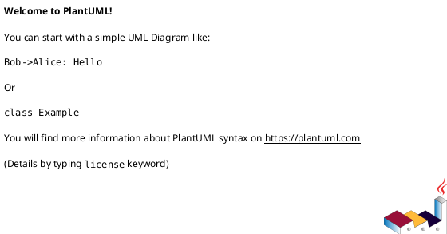

# iss-00071 Verification dogfooding and update parity — 設計（HOW）

## 目的・制約
- 目的:
  - ...
- MUST / MUST NOT:
  - ...
- 非交渉制約:
  - ...
- 前提:
  - ...

## 既存実装 / 規約の理解
- 参照した実装 / docs:
  - ...
- 現状理解:
  - ...
- 採用するパターン:
  - ...
- 採用しないもの:
  - ...
- 影響範囲:
  - ...

## 採用方針 / トレードオフ
- 論点:
  - ...
- 選択肢:
  - ...
- 決定:
  - ...

## 依存関係分析
- upstream / prerequisite:
  - ...
- downstream / dependent:
  - ...
- 実装起点:
  - 依存の少ないもの / 先に固定すべき interface / 先に通すべき test を書く
- sequencing implications:
  - plan では upstream / prerequisite から順に step を組む

### UML（必須: module / dependency）

```plantuml
@startuml
top to bottom direction
' overwrite this placeholder with the actual module/dependency diagram
' place prerequisite / lower-dependency modules above, and dependent modules below

rectangle "replace-with-module-a" as A
rectangle "replace-with-module-b" as B
A --> B : depends_on
@enduml
```

## インターフェース契約
- API / function / protocol / data boundary:
  - ...

## クラス / インターフェース詳細設計（必要時）
- Class / Interface:
  - ...
- responsibility:
  - ...
- collaboration:
  - ...

### UML（任意: class / interface）

## 変更計画
- Add:
  - ...
- Modify:
  - ...
- Delete:
  - ...
- Move/Rename:
  - ...
- Read only:
  - ...

## 要件 → 設計マッピング
- AC-001 -> ...
- EC-001 -> ...
- constraint -> ...

## テスト戦略
- Unit:
  - ...
- Integration:
  - ...
- E2E / manual:
  - ...
- migration / rollback / feature flag if needed:
  - ...

## 要件 / 例外 -> verification mapping
- AC-001 -> ...
- EC-001 -> ...
- constraint -> ...

## リスク / 移行 / ロールバック（必要時）
- ...

## 未確定事項
- Q-001:
  - 質問:
  - 選択肢:
    - A:
      - ...
    - B:
      - ...
  - 推奨案:
    - ...
  - 影響範囲:
    - ...
