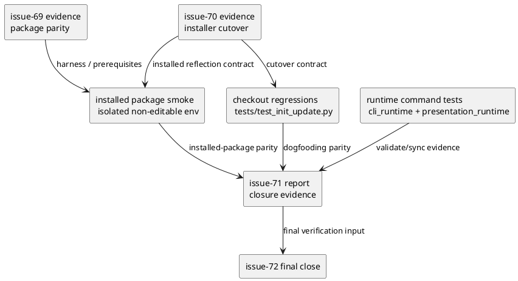
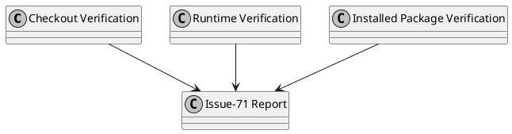

# iss-00071 Verification dogfooding and update parity — 設計（HOW）

## 目的・制約
- 目的:
  - `iss-00069` と `iss-00070` の prerequisite evidence を final verification bundle に統合し、epic の `E-AC-002` / `E-AC-003` を閉じる。
  - checkout runtime、isolated installed package、checked-in dogfooding workspace の 3 面で install-shaped contract が同じ outcome を返すことを示す。
- MUST / MUST NOT:
  - MUST:
    - closure evidence を issue-71 report に集約すること。
    - `validate` / `sync` / `sync --github` の primary evidence を hermetic subprocess tests と fixture-driven assertions で固定すること。
    - checked-in `.agents` / `.codex` / `.github` / `.github/workflows` と `spec-dock/` scaffold の parity recovery を観測すること。
    - isolated installed package smoke を non-editable / no-checkout-fallback 条件で固定すること。
  - MUST NOT:
    - installer cutover 実装や package inclusion 実装を再設計しないこと。
    - legacy authority retirement の cleanup owner を吸収しないこと。
- 非交渉制約:
  - `E-AC-002` / `E-AC-003` の closure owner は this issue。
  - manual command 実行は補助証跡であり、closure 判定の primary evidence は automated tests / fixture-driven assertions とする。
  - `sync --github` の closure evidence はネットワークや認証に依存しない hermetic surface に固定する。
- 前提:
  - `iss-00069` requirement/design は pass 済み。
  - `iss-00070` requirement/design は pass 済み。
  - checked-in dogfooding repo は `spec-dock update` で収束可能な snapshot を持つ。

## 既存実装 / 規約の理解
- 参照した実装 / docs:
  - `tests/test_init_update.py`
  - `tests/test_cli.py`
  - `tests/cli_runtime/test_validate.py`
  - `tests/cli_runtime/test_sync.py`
  - `tests/presentation_runtime/test_runtime_sync_s07.py`
  - `src/spec_dock/assets/spec_dock/scripts/spec_dock_runtime/cli/parser.py`
  - `src/spec_dock/assets/spec_dock/scripts/spec_dock_runtime/commands/sync.py`
  - `src/spec_dock/assets/spec_dock/scripts/spec_dock_runtime/commands/validate.py`
  - `src/spec_dock/assets/spec_dock/scripts/spec_dock_runtime/application/sync_state.py`
  - `src/spec_dock/assets/spec_dock/scripts/spec_dock_runtime/application/validate_tree.py`
  - `iss-00069` docs
  - `iss-00070` docs
- 現状理解:
  - runtime command surface は `validate` と `sync` / `sync --github` に分かれ、preflight は `validate_required_artifacts_for_graph` に集中している。
  - `sync --force` は preflight failure を degraded success/warning で継続する専用分岐を持つ。
  - checked-in dogfooding parity は `tests/test_init_update.py` に snapshot/subprocess 系の検証が既にある。
  - issue-69/70 の handoff evidence が pass しても、それを closing evidence として一箇所に集約する document contract はまだない。
- 採用するパターン:
  - verification owner issue として、既存 test surfaces を束ねて closure matrix へ対応付ける。
  - checkout / installed package / checked-in workspace の 3 面を別サブセットで検証し、最後に report へ集約する。
  - `sync --github` は external connectivity ではなく fixture-backed subprocess evidence を一次証拠にする。
- 採用しないもの:
  - live GitHub 連携やネットワーク成功を closure 条件に含めること
  - manual run だけで acceptance を閉じること
  - issue-72 の legacy cleanup を前提にしないと緑にならない verification
- 影響範囲:
  - `tests/test_init_update.py`
  - `tests/test_cli.py`
  - `tests/cli_runtime/`
  - `tests/presentation_runtime/`
  - issue report evidence

## 採用方針 / トレードオフ
- 論点:
  - final verification を単一 giant suite で閉じるか、既存 suite 群を束ねるか
  - `sync --github` を manual evidence にするか、hermetic test evidence にするか
  - checked-in `spec-dock/` を parity-managed surface に含めるか、実行 fixture としてだけ扱うか
- 選択肢:
  - Option A:
    - 新しい end-to-end mega test を作る
  - Option B:
    - 既存 checkout/runtime/dogfooding suites を整理し、closure matrix を report で束ねる
  - Option C:
    - `sync --github` の成功を手動実行ログで証明する
  - Option D:
    - `sync --github` は fixture-driven subprocess tests を primary evidence にする
  - Option E:
    - checked-in `spec-dock/` を parity owner surface に含める
  - Option F:
    - checked-in `spec-dock/` は runtime verification fixture として収束確認だけ行う
- 決定:
  - Option B + D + F を採用する。
  - 理由:
    - final verification の責務は新機能実装ではなく closure evidence の統合であり、既存 suite を活かす方が compact で stable。
    - `sync --github` は hermetic evidence に固定しないと reviewer ごとの解釈が割れる。
    - `spec-dock/` は agent-tooling parity の owner ではないため、runtime verification fixture としての整合確認に留める。

## 依存関係分析
- upstream / prerequisite:
  - `iss-00069`
    - isolated installed package parity / smoke harness
  - `iss-00070`
    - installer cutover contract
    - issue report `handoff-validation-evidence`
- downstream / dependent:
  - `iss-00072`
    - final authority retirement review の前提として、verification 面が green で揃っていること
- 実装起点:
  - 先に closure matrix と evidence sink を report に固定する。
  - 次に runtime command verification と checked-in parity verification を整理する。
  - 最後に installed package smoke を final bundle に接続する。
- sequencing implications:
  - issue-71 は issue-69/70 の pass 後でなければ着手しない。
  - issue-72 は issue-71 report を final verification source として参照する。

### UML（必須: module / dependency）

## インターフェース契約
- API / function / protocol / data boundary:
  - closure evidence contract
    - issue-71 report は最低でも次の sections を持つ:
      - `checkout-verification`
      - `runtime-command-verification`
      - `installed-package-verification`
      - `dogfooding-parity`
      - `upstream-handoff-consumed`
    - artifact path:
      - `spec-dock/initiatives/init-local-00003-architecture-maintenance-and-hardening/epics/epic-00067-installed-layout-aligned-asset-source-structure-for-agent-tooling/issues/iss-00071-verification-dogfooding-and-update-parity/report.md`
    - enforcement:
      - issue execution 完了条件に上記 5 heading の存在確認だけでなく、各 section の required fields 充足確認を含める
      - `checkout-verification` には `suite_or_command`、`target_surface`、`result` を持つこと
      - `runtime-command-verification` には `command_family`、`fixture_or_test`、`result` を持つこと
      - `installed-package-verification` には `isolated_env_contract`、`no_fallback_confirmation`、`result` を持つこと
      - `dogfooding-parity` には `surface`、`before_after_summary`、`result` を持つこと
      - `upstream-handoff-consumed` には `issue69_refs`、`issue70_refs`、`consumed_subchecks`、`reverified_in_issue71` を持つこと
      - spec review / final review では report 見出しと required fields の completeness を check 項目に含める
  - runtime command evidence
    - `validate`
    - `sync`
    - `sync --github`
    - `sync --force`
    - primary evidence は subprocess test と fixture-driven stdout/stderr assertion
  - installed package evidence
    - non-editable isolated install
    - no checkout / `PYTHONPATH` / cwd fallback
    - package-installed `init/update` final smoke
  - dogfooding parity evidence
    - checked-in `.agents` / `.codex` / `.github` / `.github/workflows` は parity-managed surface
    - checked-in `spec-dock/` は runtime fixture surface
    - `spec-dock update` 後の収束結果を before/after 付きで report へ記録する
  - upstream handoff evidence
    - issue-69 source:
      - `spec-dock/initiatives/init-local-00003-architecture-maintenance-and-hardening/epics/epic-00067-installed-layout-aligned-asset-source-structure-for-agent-tooling/issues/iss-00069-package-data-and-installed-artifact-parity/report.md` の `package-parity-evidence` section
    - primary source:
      - `spec-dock/initiatives/init-local-00003-architecture-maintenance-and-hardening/epics/epic-00067-installed-layout-aligned-asset-source-structure-for-agent-tooling/issues/iss-00070-installer-source-discovery-and-managed-ownership/report.md` の `handoff-validation-evidence` section
    - execution gate:
      - issue-71 implementation の step-0 で issue-69 / issue-70 の上記 sections を確認し、placeholder-only ではない evidence-bearing content を持たない限り final verification execution を開始しない
      - pre-implementation の doc phase では template section の存在だけを要求し、実 execution readiness は implementation 開始時の gate で判定する
      - 最低でも `source inventory / manifest assertions`、`invalid manifest negative test coverage`、`current managed / obsolete managed boundary assertions`、`installed-package cutover evidence` の 4 項目に、参照した test / command output summary / result を埋めていること
      - issue-69 `package-parity-evidence` には最低でも `full inventory parity`、`representative asset set`、`stale exclusion guard`、`isolated install smoke` の 4 項目に、参照した test / command output summary / result を埋めていること
    - consumption rule:
      - issue-71 report の `upstream-handoff-consumed` section には、issue-69 package parity evidence と issue-70 handoff evidence の参照先、消費した subchecks、final verification で再確認した箇所を列挙する

## クラス / インターフェース詳細設計（必要時）
- Class / Interface:
  - 新しい production class は追加しない。
  - 必要なら verification helper / report helper を tests 側へ追加する。
- responsibility:
  - runtime tests は command contract を証明する。
  - `tests/test_init_update.py` は checkout + dogfooding parity を証明する。
  - installed-package harness は package-installed reflection を証明する。
- collaboration:
  - issue-70 report の handoff evidence は issue-71 report の `upstream-handoff-consumed` に要約して取り込む。

### UML（任意: class / interface）

## 変更計画
- Add:
  - issue-71 report evidence structure
  - final verification bundle mapping
  - installed package final smoke linkage
  - issue-70 report handoff section dependency
- Modify:
  - `tests/test_init_update.py`
  - `tests/test_cli.py`
  - `tests/cli_runtime/test_validate.py`
  - `tests/cli_runtime/test_sync.py`
  - `tests/presentation_runtime/test_runtime_sync_s07.py`
  - issue `requirement.md`
  - issue `design.md`
- Delete:
  - なし
- Move/Rename:
  - なし
- Read only:
  - `src/spec_dock/cli.py`
  - issue-69 / issue-70 docs and reports

## 要件 → 設計マッピング
- AC-001 -> issue-69/70 report を input にして issue-71 report へ closure matrix を集約する。
- AC-002 -> checked-in parity regression + `spec-dock update` convergence verification。
- AC-003 -> hermetic subprocess tests for `validate` / `sync` / `sync --github`。
- AC-004 -> fail-fast / degraded semantics regression for missing artifact and `sync --force`。
- AC-005 -> non-editable isolated installed package smoke reused from issue-69/70。
- EC-001 -> drifted checked-in workspace を update で convergence させ、その before/after を記録する。
- EC-002 -> degraded success path を normal success path と分離して report へ記録する。
- constraint -> `spec-dock/` は fixture surface として収束確認するが、agent-tooling authority owner とは扱わない。

## テスト戦略
- Unit:
  - 新規 production unit test は前提にしない。
  - 必要なら evidence aggregation helper を test helper として unit 検証する。
- Integration:
  - `tests/test_init_update.py` の checked-in parity / installed smoke / update convergence
  - `tests/test_cli.py` の runtime command contract
  - `tests/cli_runtime/test_validate.py`
  - `tests/cli_runtime/test_sync.py`
  - `tests/presentation_runtime/test_runtime_sync_s07.py`
- E2E / manual:
  - `./spec-dock/scripts/spec-dock validate`
  - `./spec-dock/scripts/spec-dock sync`
  - `./spec-dock/scripts/spec-dock sync --github`
  - ただし manual evidence は補助証跡のみ
- migration / rollback / feature flag if needed:
  - feature flag なし
  - rollback は verification docs/tests の変更を戻すだけで、installer/package contract 自体は戻さない

## 要件 / 例外 -> verification mapping
- AC-001 -> issue report section completeness check
- AC-002 -> checked-in parity regression + filesystem assertions
- AC-003 -> hermetic runtime subprocess tests
- AC-004 -> fail-fast / degraded command tests
- AC-005 -> isolated installed package final smoke
- EC-001 -> drifted snapshot parity recovery test
- EC-002 -> `sync --force` degraded stdout/stderr assertions
- closure-owner constraint -> issue-71 report references to epic `E-AC-002` / `E-AC-003`

## リスク / 移行 / ロールバック（必要時）
- risk-1:
  - evidence が複数 suite に分散したままで closure review が曖昧になる
  - mitigation:
    - issue-71 report sections を固定する
- risk-2:
  - `sync --github` evidence が外部環境依存になり flaky になる
  - mitigation:
    - hermetic subprocess tests を primary に固定する
- risk-3:
  - installed package smoke が checkout fallback で偽陽性になる
  - mitigation:
    - non-editable isolated install / no fallback 条件を requirement/design 両方で固定する
- risk-4:
  - checked-in dogfooding parity と runtime fixture parity が混ざって scope が崩れる
  - mitigation:
    - `.agents/.codex/.github/.github/workflows` を parity-managed surface、`spec-dock/` を runtime fixture surfaceとして分離する
- rollback:
  - issue-71 の rollback は verification docs/tests/report wiring のみ
  - upstream installer/package contracts は rollback 対象外

## 未確定事項
- なし:
  - final verification の 3 面、report 集約、hermetic primary evidence、`spec-dock/` の fixture 扱いを本 issue の設計契約として固定する。
