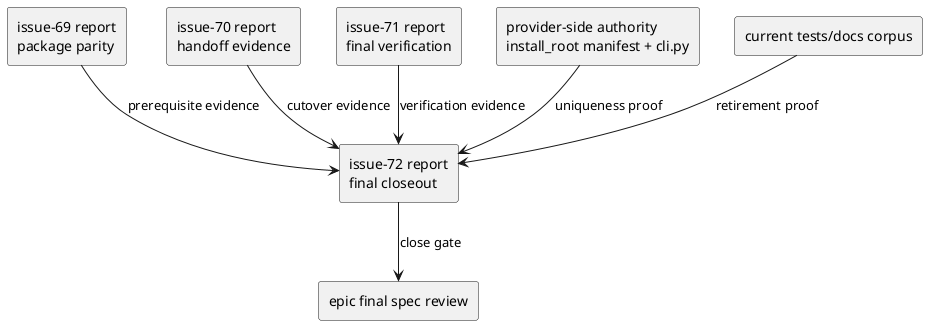
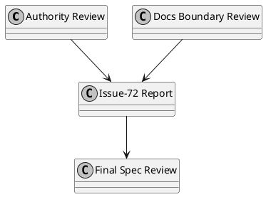

# iss-00072 Legacy authority retirement and final spec close — 設計（HOW）

## 目的・制約
- 目的:
  - `install_root` を唯一の current authority として最終固定し、legacy `codex_skills` authority 文脈を current code/tests/assets/current docs から退役させたうえで、legacy tree 自体も削除する。
  - issue-71 までの evidence chain を final closeout review へ接続し、epic-00067 の closeout verdict を reviewer が再現可能に判断できるようにする。
- MUST / MUST NOT:
  - MUST:
    - provider-side authoritative manifest を final review corpus に含めること。
    - current docs corpus と historical records を明示ルールで分離すること。
    - final close report で authority uniqueness / historical boundary / future host extension / upstream verification prerequisite / dogfooding convergence の 5 項目を明示すること。
  - MUST NOT:
    - historical closed records を全面 rewrite しないこと。
    - issue-71 で閉じた verification 実行を再定義しないこと。
    - Claude Code 実装を紛れ込ませないこと。
- 非交渉制約:
  - authority retirement は code/tests/assets/current docs の 4 面で成立していなければならない。
  - `src/spec_dock/assets/install_root/.agents/host-adapters/meta.json` を provider-side authoritative manifest として必ず確認する。
  - final close review の pass 条件は具体 artifact に落とし、review verdict 自体を acceptance の代わりにしない。
- 前提:
  - issue-71 final verification が pass 済みである。
  - issue-70 までで installer/runtime authority は `install_root` へ切替済みである。
  - issue-level reports を final closeout evidence sink として更新できる。

## 既存実装 / 規約の理解
- 参照した実装 / docs:
  - `src/spec_dock/cli.py`
  - `src/spec_dock/assets/install_root/.agents/host-adapters/meta.json`
  - `tests/test_init_update.py`
  - epic-00067 docs
  - issue-68 docs and report
  - issue-69 / issue-70 / issue-71 docs and reports
- 現状理解:
  - issue-70 で runtime authority は `install_root` に寄せる設計で、`cli.py` の current execution path と provider-side authoritative manifest はすでに `install_root` を正本としている。
  - 残っている主な矛盾は `tests/test_init_update.py` の legacy duplicate / parity assumptions、`AGENTS.md` の provider-side directory map、issue-72 / epic closeout docs の未充足、そして `src/spec_dock/assets/codex_skills/` 実体の残置である。
  - issue-71 で verification owner は閉じるが、authority uniqueness の final statement と docs/test cleanup owner はまだ残る。
  - historical issue/report/discussion を巻き込み始めると current authority cleanup の scope が不定になる。
- 採用するパターン:
  - final close を「current tests/guidance の authority retire + legacy tree deletion readiness review + docs corpus の deterministic review + final report aggregation」の 4 部構成で閉じる。
  - historical records は rewrite せず、current docs corpus を列挙してそこだけを authoritative review 対象にする。
  - final report を non-circular close gate の一次証跡にする。
- 採用しないもの:
  - repo 全文書の一括文言置換
  - review verdict だけを acceptance criteria にすること
  - checked-in mirror のみを見て provider-side authority を確認したとみなすこと
- 影響範囲:
  - `tests/test_init_update.py`
  - `AGENTS.md`
  - `src/spec_dock/assets/install_root/**`
  - `src/spec_dock/assets/codex_skills/**`
  - epic-00067 current docs
  - issue reports 69-72
  - epic report / current closeout docs

## 採用方針 / トレードオフ
- 論点:
  - historical docs まで authority cleanup 対象に含めるか
  - final close report を自由記述にするか、fixed sections を持たせるか
  - authority uniqueness の証拠を checked-in artifacts 中心にするか、provider-side authority 中心にするか
- 選択肢:
  - Option A:
    - repo 全 historical records を含めて `codex_skills` 文言を掃除する
  - Option B:
    - current docs corpus を固定し、historical records は out-of-scope にする
  - Option C:
    - legacy tree を物理削除し、historical reference は records にだけ残す
  - Option D:
    - final report は generic session log のままにする
  - Option E:
    - final report に fixed closeout sections を持たせる
  - Option F:
    - checked-in mirror だけで authority retirement を判断する
  - Option G:
    - provider-side authoritative manifest と current code/tests/docs を主証拠にする
- 決定:
  - Option B + C + E + G を採用する。
  - 理由:
    - user 方針どおり compact な一括切替 closeout を維持できる。
    - backward compatibility 不要のため、legacy tree を残す benefit よりも current repo clarity の benefit が大きい。
    - fixed report sections がないと final close review が circular になりやすい。
    - authority uniqueness は checked-in mirror ではなく provider-side authority を見ないと誤判定しうる。

## 追加分析の正本
- full-suite residual repair の詳細分析は次の独立 report を正本とする。
  - `discussions/20260414t012350z-research-runtime-shell-structural-regression-analysis.md`
- この設計書では issue-72 の設計判断だけを保持し、failure list / root cause options / comparison の詳細は analysis report へ分離する。
- この追加分析から採用する設計判断は次の 2 点である。
  - `RuntimeShellS11Tests.test_final_api_call_site_and_structural_regression` のような residual failure は、まず issue-72 変更により導入・顕在化した回帰かを切り分ける。
  - issue-72 起因だと証明できた場合に限り、test 緩和ではなく `commands/deps.py` から `domain.ids` 直 import を除去するような局所実装修正を採用候補とする。issue-72 起因でない residual は informational risk / follow-up issue として扱う。

## PR review feedback incorporation
- review inputs:
  - `discussions/20260414t034500z-research-review-analysis-a-test-to-test-call.md`
  - `discussions/20260414t034600z-research-review-analysis-b-shipped-ci-workflow-scope.md`
  - `discussions/20260414t034700z-research-review-analysis-c-managed-install-plan-unused-fields.md`
  - `discussions/20260414t034800z-research-review-analysis-d-offline-build-tomli-gap.md`
  - `discussions/20260414t034900z-research-review-analysis-e-top-level-bot-review-bodies.md`
- scope decision:
  - mandatory 指摘 `B` / `D` に加えて、user decision により hygiene 指摘 `A` / `C` も同一 repair tranche に含める。
  - `E` は triage policy の整理であり、実装修正対象には含めない。
- adopted repair set:
  - `A`:
    - `tests/presentation_runtime/test_runtime_sync_s07.py` の test-to-test call を private helper 抽出へ置換する。
  - `B`:
    - `src/spec_dock/assets/install_root/.github/workflows/ci.yml` を managed repo generic workflow へ修正し、provider repo 固有の `pip install .` / `tests/test_cli.py` 前提を除去する。
  - `C`:
    - `src/spec_dock/cli.py` の `_ManagedSkillInstallPlan` から apply path で未使用の field を外し、builder 内 local validation data と plan shape を分離する。
  - `D`:
    - issue-69 hermetic wheelhouse contract に `tomli` を追加し、Python 3.10 の fresh venv + `--no-index` backend install を成立させる。
 - acceptance linkage rule:
  - `B` / `D` は shipped contract と hermetic contract の不足を是正する mandatory remediation として issue-72 closeout evidence に結び付ける。
  - `A` / `C` は同一 tranche で実施する付随 remediation だが、独立に AC を閉じる根拠としては扱わない。

## 依存関係分析
- upstream / prerequisite:
  - issue-68:
    - install_root tree / asset classification evidence
  - issue-69:
    - package parity evidence
  - issue-70:
    - installer cutover / handoff evidence
  - issue-71:
    - final verification evidence
- downstream / dependent:
  - epic-00067 final closure
- 実装起点:
  - 先に current docs corpus と final report contract を固定する。
  - 次に authority retirement review surfaces を code/tests/assets/docs に割り付ける。
  - 最後に final close gate を issue-72 report に集約する。
- sequencing implications:
  - issue-72 は issue-71 pass 後にしか実行しない。
  - 最初に requirement/design/plan/report contract を固め、その後 tests/guidance cleanup を入れ、最後に epic/issue closeout docs を揃える。
  - final epic spec review は issue-72 report と current closeout docs が埋まってから行う。
  - PR review repair tranche は S02 の後、S90 / S99 の前に差し込み、closeout contract を崩さずに `B` / `D` を mandatory remediation、`A` / `C` を ancillary remediation として局所実装する。

### UML（必須: module / dependency）

## インターフェース契約
- API / function / protocol / data boundary:
  - deletion readiness contract
    - `src/spec_dock/assets/codex_skills/**` を削除できる条件は次に固定する。
      - current code が `codex_skills` を runtime path / authority path として参照しない
      - package install contract が `codex_skills` physical inventory を required artifact として期待しない
      - current tests が `codex_skills` physical tree の存在を expected inventory として要求しない
      - current docs が `codex_skills` を surviving artifact として案内しない
    - deletion 実施後は、historical records に残る mention を除き、current repo surface search で `src/spec_dock/assets/codex_skills/` path がゼロ件になることを pass 条件とする。
  - current docs corpus contract
    - review corpus は次に固定する。
      - `spec-dock/initiatives/init-local-00003-architecture-maintenance-and-hardening/epics/epic-00067-installed-layout-aligned-asset-source-structure-for-agent-tooling/{requirement.md,design.md,plan.md}`
      - `spec-dock/initiatives/init-local-00003-architecture-maintenance-and-hardening/epics/epic-00067-installed-layout-aligned-asset-source-structure-for-agent-tooling/report.md`
      - `spec-dock/initiatives/init-local-00003-architecture-maintenance-and-hardening/epics/epic-00067-installed-layout-aligned-asset-source-structure-for-agent-tooling/issues/iss-00068-*/{requirement.md,design.md,report.md}`
      - `spec-dock/initiatives/init-local-00003-architecture-maintenance-and-hardening/epics/epic-00067-installed-layout-aligned-asset-source-structure-for-agent-tooling/issues/iss-00069-*/{requirement.md,design.md,report.md}`
      - `spec-dock/initiatives/init-local-00003-architecture-maintenance-and-hardening/epics/epic-00067-installed-layout-aligned-asset-source-structure-for-agent-tooling/issues/iss-00070-*/{requirement.md,design.md,report.md}`
      - `spec-dock/initiatives/init-local-00003-architecture-maintenance-and-hardening/epics/epic-00067-installed-layout-aligned-asset-source-structure-for-agent-tooling/issues/iss-00071-*/{requirement.md,design.md,report.md}`
      - `spec-dock/initiatives/init-local-00003-architecture-maintenance-and-hardening/epics/epic-00067-installed-layout-aligned-asset-source-structure-for-agent-tooling/issues/iss-00072-*/{requirement.md,design.md,report.md}`
      - `AGENTS.md`
      - `src/spec_dock/assets/spec_dock/docs/**`
      - `src/spec_dock/assets/spec_dock/system/**`
      - `spec-dock/docs/**`
      - `spec-dock/system/**`
  - authoritative manifest contract
    - `src/spec_dock/assets/install_root/.agents/host-adapters/meta.json` を provider-side authority review の primary artifact とする。
    - checked-in `.agents/host-adapters/meta.json` は consumer mirror として secondary artifact 扱いにする。
  - legacy reference verification contract
    - current-surface search corpus は次に固定する。
      - `src/spec_dock/cli.py`
      - `src/spec_dock/assets/install_root/**`
      - `tests/**`
      - current docs corpus
    - allowed residual matches は次に限定する。
      - `tests/**` 内の historical regression coverage / inert duplicate classification / prior-issue evidence としての `codex_skills` mention
      - historical closed issue/report/discussion
      - current docs の historical boundary / deleted legacy tree と明示された節
    - forbidden residual matches は次に固定する。
      - current code/tests/current docs が `codex_skills` を source-of-truth、runtime authority、current metadata source、expected bundled path として扱うこと
      - current assets review で `codex_skills` が current metadata source として必要だと判定されること
  - final report contract
    - artifact path:
      - `spec-dock/initiatives/init-local-00003-architecture-maintenance-and-hardening/epics/epic-00067-installed-layout-aligned-asset-source-structure-for-agent-tooling/issues/iss-00072-legacy-authority-retirement-and-final-spec-close/report.md`
    - required sections:
      - `authority-uniqueness`
      - `historical-boundary`
      - `future-host-extension`
      - `upstream-prerequisites`
      - `final-close-gate`
    - required fields:
      - `authority-uniqueness`:
        - `provider_authority_artifacts`
        - `retired_legacy_surfaces`
        - `dogfooding_convergence_evidence`
        - `result`
      - `historical-boundary`:
        - `current_docs_corpus`
        - `out_of_scope_historical_records`
        - `result`
      - `future-host-extension`:
        - `current_model_statement`
        - `claude_code_scope_statement`
        - `result`
      - `upstream-prerequisites`:
        - `epic_requirement_refs`
        - `epic_design_refs`
        - `epic_plan_refs`
        - `epic_report_refs`
        - `epic_report_status`
        - `issue68_refs`
        - `issue68_evidence_status`
        - `issue69_refs`
        - `issue69_evidence_status`
        - `issue70_refs`
        - `issue70_evidence_status`
        - `issue71_refs`
        - `issue71_evidence_status`
        - `issue72_requirement_refs`
        - `issue72_design_refs`
        - `contradiction_summary`
        - `result`
      - `final-close-gate`:
        - `gate_checks`
        - `result`
    - optional post-review audit:
      - `spec_review_reference`
    - pre-execution note:
      - issue-72 prep phase では `issue-72 report` と `epic current report` が template / pending 状態で残っていてよい
      - ただし S02 と S99 の gate を通るまでに、`epic current report` は evidence-bearing content へ更新されなければならない
  - final close gate
    - non-circular checks は次に固定する。
      - provider-side authority artifact が `install_root` に一致する
      - current code/tests/docs/assets から legacy authority reference が retire されている
      - issue-72 で変更した provider-side docs / mirror-affecting surfaces について、`spec-dock update` 後に dogfooding mirror が収束する fresh evidence がある
      - issue-71 parity evidence は issue-72 で未変更の surface に対する補助参照としてのみ使われる
      - historical records は out-of-scope と current docs で区別されている
      - future host extension point が current model で説明されている
      - epic-00067 `requirement.md` / `design.md` / `plan.md` / `report.md` と、issue-68 から issue-72 の `requirement.md` / `design.md` / `report.md` に限定した evidence chain に contradiction がない
      - epic current report refs が issue-72 report から辿れ、placeholder ではなく evidence-bearing content を持つ
      - issue-68 / issue-69 / issue-70 / issue-71 prerequisite refs が issue-72 report から辿れ、かつ upstream report section が placeholder ではなく evidence-bearing content と passing result を持つ
      - issue-71 verification prerequisite が report refs で辿れ、placeholder-only evidence ではない
      - prep phase の spec review では epic current report の placeholder 状態を許容するが、S02 で status/evidence を埋める concrete implementation gate が plan に存在しなければならない
  - review repair contract
    - `A` helper extraction:
      - public test 名と issue traceability は維持しつつ、shared assertion 群は private helper に抽出する
      - test method から別 test method を直接呼ばない
    - `B` shipped CI workflow scope:
      - `install_root` 配布 workflow は managed repo 一般で成立する command だけを使う
      - provider repo 固有の package install / provider test suite 実行は shipped workflow に含めない
      - baseline は local managed repo で自己完結する validation command を優先する
    - `C` managed install plan shape:
      - `_ManagedSkillInstallPlan` は apply path の実消費者が必要とする field だけを持つ
      - manifest validation や inventory derivation の補助データは builder 内 local 変数へ留める
    - `D` hermetic wheelhouse:
      - issue-69 offline build backend requirement set は Python 3.10 条件付き依存まで含めて self-contained でなければならない
      - wheelhouse filenames contract と requirement contract は同時更新する
      - fresh venv + `pip install --no-index --find-links <wheelhouse>` で backend install が通ることを検証する
  - issue-68 traceability anchors
    - `issue68_refs` は少なくとも次の見出しを参照する
      - `iss-00068/requirement.md`:
        - `## In-Scope Asset Authority Inventory`
        - `### Authority Verification Rule`
      - `iss-00068/design.md`:
        - `## インターフェース契約`
        - `## 要件 → 設計マッピング`
  - legacy mention policy
    - forbidden:
      - current code/tests/assets/current docs が `codex_skills` を source-of-truth、runtime authority、expected bundled path、current metadata source として扱うこと
    - allowed:
      - current docs/report の historical boundary section で、`codex_skills` を deleted legacy tree / historical reference と明示した説明
      - historical closed issue/report/discussion に残る履歴記述
      - closeout review のための scoped search result 引用

## クラス / インターフェース詳細設計（必要時）
- Class / Interface:
  - 新しい production class は追加しない。
  - 必要なら report completeness を確認する test/review helper を追加する。
- responsibility:
  - source search / tests は legacy authority reference retirement を証明する。
  - current docs corpus review は historical boundary を証明する。
  - issue-72 report は final close gate の一次証跡を持つ。
- collaboration:
  - issue-69/70/71 reports は issue-72 report の `upstream-prerequisites` section へ集約される。

### UML（任意: class / interface）

## 変更計画
- Add:
  - issue-72 report closeout sections
  - final-close gate mapping
- Modify:
  - current docs under epic-00067 / issue-68..72 as needed
  - `tests/test_init_update.py`
  - `AGENTS.md`
  - authoritative / checked-in manifest references if still legacy
  - epic / issue closeout reports if issue-72 acceptance traceability requires them
- Delete:
  - legacy authority references from current code/tests/docs/assets
- Move/Rename:
  - なし:
    - closeout tranche は authority cleanup であり、新しい path model 自体は issue-68/70 で固定済み
- Read only:
  - historical closed issue/report/discussion
  - issue-71 verification artifacts except referenced summaries

## 要件 → 設計マッピング
- AC-001 -> source search + authoritative manifest review + current docs corpus review で uniqueness を確認する。
- AC-001 -> PR review repair tranche では `B` と `D` を shipped contract / hermetic contract の具体修正として追加する。
- AC-002 -> issue-72 report に legacy retirement / uniqueness evidence を集約する。
- AC-003 -> epic / issue current docs で future host extension statement を確認する。
- AC-004 -> final close gate を concrete artifact checks に分解し、issue-72 report に記録する。
- EC-001 -> physical tree 削除後も authority reference が current surfaces に残らず、historical references が records に隔離されていることを確認する。
- EC-002 -> historical records は out-of-scope として残し、current docs で current authority statement を上書きする。
- constraint -> current docs corpus を固定して review sprawl を防ぐ。

## テスト戦略
- Unit:
  - 必須ではない。
  - 必要なら legacy authority path search helper / report completeness helper を補助実装として検証する。
- Integration:
  - `tests/test_init_update.py` の authority path assertions 更新
  - relevant CLI/runtime tests に current authority assertions が残る場合だけ、その更新
  - current docs corpus review
  - final report completeness check
- E2E / manual:
  - `rg "codex_skills"` による scoped search
  - final spec review
  - manual review は provider-side authoritative manifest と current docs corpus を対象にする
- search interpretation:
  - scoped search の hit は `forbidden authority-role reference` と `allowed historical mention` に分類して report へ記録する
- migration / rollback / feature flag if needed:
  - feature flag なし
  - rollback は closeout docs/tests/code cleanup を戻すが、issue-71 verification 以前へは戻さない

## 要件 / 例外 -> verification mapping
- AC-001 -> scoped source search + authoritative manifest inspection
- AC-002 -> issue-72 report `authority-uniqueness` / `upstream-prerequisites`
- AC-003 -> current docs corpus review for extension model
- AC-004 -> issue-72 report `final-close-gate` + final spec review reference
- EC-001 -> physical tree deleted and historical references isolated to records
- EC-002 -> current docs overwrite statement + historical docs untouched list
- non-circular constraint -> explicit gate checks listed in report before review verdict

## リスク / 移行 / ロールバック（必要時）
- risk-1:
  - historical docs へ scope が膨らみ closeout が終わらない
  - mitigation:
    - current docs corpus を固定する
- risk-2:
  - checked-in mirror だけ見て provider authority regression を見逃す
  - mitigation:
    - provider-side authoritative manifest review を mandatory にする
- risk-3:
  - final spec close が review verdict 依存の circular contract になる
  - mitigation:
    - issue-72 report に explicit gate checks を固定する
- risk-4:
  - future host extension statement が曖昧で `E-RQ-008` close が弱くなる
  - mitigation:
    - `.agents` shared + sibling host roots を current docs/report に明記する
- rollback:
  - closeout tranche の rollback は authority-retirement cleanup のみ
  - install_root model や issue-71 verification contract は rollback 対象外

## 未確定事項
- なし:
  - current docs corpus、authoritative manifest primary review、legacy tree deletion、final report sections、non-circular final close gate をこの issue の設計契約として固定する。
