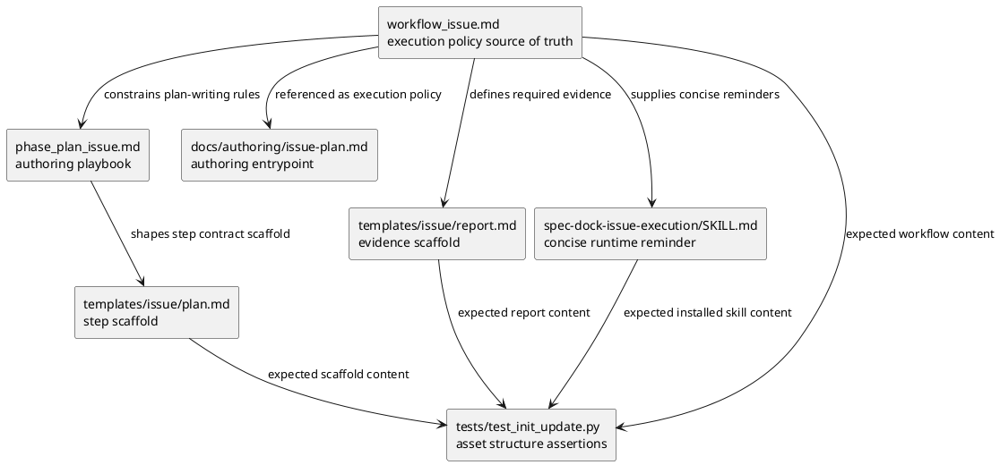

# iss-00098 Delegated Implementation Orchestration Contract — 設計（HOW）

## 親 Diagram 参照
- Epic diagram:
  - N/A: この Issue は installed layout / agent tooling の文書・テンプレート契約を局所的に強化するもので、親 Epic diagram の再掲は不要。
- Initiative diagram:
  - N/A: system context や container 境界は変えない。
- 再利用する決定:
  - `src/spec_dock/assets/install_root/` は installed agent-tooling assets の provider-side source of truth。
  - `src/spec_dock/assets/spec_dock/` は consumer workspace に生成される `spec-dock/` scaffold の provider-side source of truth。
  - dogfooding 側の `.agents/` と `spec-dock/` は、今回の契約変更を検証・利用する mirror であり、provider source だけ、または mirror だけを単独で更新してはならない。
  - docs は policy / source of truth、templates は最小 scaffold、skills は concise routing / execution reminders とする。

## 目的・制約
- 目的:
  - 親 Codex を実装者ではなく orchestration owner として固定し、実作業を plan step 単位で delegated worker に渡す contract を Issue workflow に組み込む。
  - `dev-coder` / `doc-writer` / reviewer の責務を docs、templates、skills、report evidence に一貫して表現する。
  - plan author が後続の実装 step を書くときに、delegation contract、reviewer gate、exception record を迷わず埋められる状態にする。
- 必須 / 禁止:
  - 親 Codex の通常責務は inspect / plan / delegate / verify / integrate / report に限定する。
  - runtime / tests / scaffold behavior は `dev-coder`、shipped docs / templates / skills / workflow text は `doc-writer` を primary worker とする。
  - `dev-coder` や `doc-writer` の実作業は reviewer gate の代替にしない。
  - `approved-local-execution` は「小さい」「機械的」を理由にした無記録 direct implementation として残さず、exception semantics へ寄せる。
- 非交渉制約:
  - provider source と dogfooding mirror を同期させる。
  - `workflow_issue.md` と `.agents/skills/spec-dock-issue-execution/SKILL.md` の execution contract を矛盾させない。
  - Requirement / design / plan promotion は fresh `spec-reviewer` pass を必要とする。
- 前提:
  - 新しい CLI command や runtime enforcement は追加しない。
  - `dev-coder`、`doc-writer`、`code-reviewer`、`qa-reviewer`、`spec-reviewer` は named role として利用可能である。

## 既存実装 / 規約の理解
- 参照した実装 / docs:
  - `spec-dock/docs/workflow_spec_authoring.md`: phase promotion と reviewer state の正本。
  - `spec-dock/docs/phase_design.md`: Issue design の dependency / file-change planning と UML policy の正本。
  - `spec-dock/docs/workflow_issue.md`: Issue execution / completion contract の正本。
  - `src/spec_dock/assets/spec_dock/docs/workflow_issue.md`: consumer scaffold provider source。
  - `src/spec_dock/assets/spec_dock/docs/phase_plan_issue.md`: Issue plan authoring playbook provider source。
  - `src/spec_dock/assets/spec_dock/docs/authoring/issue-plan.md`: Issue plan authoring entrypoint provider source。
  - `src/spec_dock/assets/spec_dock/templates/issue/plan.md`: Issue plan scaffold provider source。
  - `src/spec_dock/assets/spec_dock/templates/issue/report.md`: Issue report scaffold provider source。
  - `src/spec_dock/assets/install_root/.agents/skills/spec-dock-issue-execution/SKILL.md`: installed issue-execution skill provider source。
  - `.agents/skills/spec-dock-issue-execution/SKILL.md`: dogfooding mirror skill。
- 現状理解:
  - `workflow_issue.md` には既に `Implementation Delegation Gate`、`delegated` / `approved-local-execution`、per-step `code-reviewer`、S90 docs impact、S99 final quality gate がある。
  - `phase_plan_issue.md` と `authoring/issue-plan.md` は plan の書き方を所有し、execution policy は再定義しない。
  - issue plan template には delegation 判断欄があるが、requirement が求める `delegation contract` の必須入力全体はまだ表現しきれていない。
  - issue report template には delegation / review evidence の表があるが、delegated worker summary、parent integration decision、Parent Implementation Exception を必須 evidence として固定する余地がある。
  - skill は role selection matrix と実行 reminder を持つが、docs の正本性を保つため、詳細 policy を skill へ重複展開しすぎない設計が必要。
- 採用するパターン:
  - `workflow_issue.md` を execution policy の正本にし、`phase_plan_issue.md` / `authoring/issue-plan.md` / templates / skill はそこへ参照・埋め込みを合わせる。
  - provider source と dogfooding mirror を同一内容に保つ。
  - structural docs/template assertions は `tests/test_init_update.py` で固定する。
- 採用しないもの:
  - runtime validator、transcript audit、`spec-dock issue delegate` の追加。
  - skill へ workflow policy 全文を複製すること。
  - plan step の詳細実装順や test case 本文を design へ先書きすること。
- 影響範囲:
  - shipped docs / templates / skills / workflow text が主対象。
  - runtime behavior は対象外。ただし scaffold behavior と generated asset content の期待値は tests で確認する。

## 採用方針 / トレードオフ
- 論点: delegated-by-default をどこで所有するか
  - 決定: `workflow_issue.md` が `Parent Agent Invariant`、delegated worker handoff、exception gate、reviewer gate fail condition を所有する。
  - 理由: Issue execution / completion の正本がここにあり、plan / report / skill から参照される中心だから。
- 論点: plan 側の責務
  - 決定: `phase_plan_issue.md` と `authoring/issue-plan.md` は、各 implementation step に `delegation contract` をどう書くかを所有する。execution policy の再定義は避ける。
  - 理由: plan authoring docs は step の構造化が責務であり、approval cadence や completion 判定は `workflow_issue.md` に残すべきため。
- 論点: templates の責務
  - 決定: plan template は step-local `delegation contract` の欄を追加し、report template は delegation evidence と `Parent Implementation Exception` の記録欄を追加する。
  - 理由: templates は最小 scaffold だが、必須 evidence の置き場がないと future agent が workflow policy を満たせないため。
- 論点: skills の責務
  - 決定: issue-execution skill は「親 Codex invariant」「role selection」「docs source of truth」「stop conditions」を短く示す reminder に留める。
  - 理由: skills に詳細 policy を重複させると docs と drift しやすい。
- 論点: reviewer gate mapping
  - 決定: code / runtime / tests / scaffold behavior を含む step は per-step `code-reviewer`、docs-only / template-only / skill-text-only step は `spec-reviewer` docs/spec alignment を対応 gate として明記する。S99 では `qa-reviewer`、issue-wide `code-reviewer`、`spec-reviewer` を維持する。
  - 理由: docs-only step に code review を要求すると review focus がずれ、runtime/scaffold step を spec review だけで通すと regressions を見落とす。

## 依存関係分析
- module 依存:
  - Provider scaffold docs/templates:
    - `src/spec_dock/assets/spec_dock/docs/workflow_issue.md` が execution policy の provider source。
    - `src/spec_dock/assets/spec_dock/docs/phase_plan_issue.md` と `src/spec_dock/assets/spec_dock/docs/authoring/issue-plan.md` は plan authoring から `workflow_issue.md` を参照する。
    - `src/spec_dock/assets/spec_dock/templates/issue/plan.md` / `report.md` は上記 docs を満たす scaffold を提供する。
  - Provider installed skill:
    - `src/spec_dock/assets/install_root/.agents/skills/spec-dock-issue-execution/SKILL.md` は installed agent に配布される concise reminder。
    - `.agents/skills/spec-dock-issue-execution/SKILL.md` は dogfooding mirror。
  - Tests:
    - `tests/test_init_update.py` は provider assets から生成・同期される docs/templates/skill content の structural expectations を固定する。
- class 依存（必要時）:
  - N/A: Python class / runtime type は変更しない。
- function 依存（必要時）:
  - N/A: runtime function は変更しない。テスト更新は asset content assertion のみ。
- file 依存:
  - `workflow_issue.md` の contract が upstream。
  - `phase_plan_issue.md`、`authoring/issue-plan.md`、`templates/issue/plan.md`、`templates/issue/report.md`、`spec-dock-issue-execution/SKILL.md` は downstream。
  - `tests/test_init_update.py` は provider assets と mirror generation の expected content に依存する。
- 上流 / 前提:
  - `requirement.md` の AC-001 から AC-006、EC-001 から EC-004。
  - `workflow_spec_authoring.md` の reviewer state semantics。
  - `phase_design.md` の Issue design handoff / UML / file-change planning contract。
- 下流 / 依存先:
  - `plan.md` はこの design の affected surfaces と responsibility boundary から step を分割する。
  - 後続 implementation は provider source と mirror を同時更新し、tests で content drift を検出する。
- 実装起点:
  - design としては `workflow_issue.md` を upstream contract として固定する。plan では downstream docs/templates/skills/tests を、責務境界に沿って reviewable step に分ける。
- 順序への影響:
  - plan は `workflow_issue.md` の contract を先に固め、その後に plan authoring docs、templates、skill、tests/mirror verification へ落とす構造にする。

## Module Dependency Diagram
- タイトル:
  - Delegated implementation orchestration contract surfaces
- 答える問い:
  - Delegated-by-default の正本をどの file が所有し、どの downstream surface がその契約を消費するか。
- 範囲:
  - shipped docs / templates / skills / tests の依存方向。
- 含めない詳細:
  - runtime CLI call graph、Python class、GitHub workflow、sub-agent runtime 実装。
- 更新条件:
  - execution policy の正本、provider/mirror ownership、または reviewer gate mapping が変わるとき。
- 図:

### UML（module dependency / responsibility boundary）


## Local Diagram Delta（必要時）
- 変更する境界 / 責務 / 相互作用:
  - 親 Codex、delegated worker、reviewer の責務境界を workflow text と evidence scaffold に追加する。
  - N/A: Sequence / State 図は不要。runtime interaction や lifecycle state machine は変えない。

## インターフェース契約
- Parent Agent Invariant:
  - 親 Codex は orchestration owner として、source docs の確認、step contract の整理、worker handoff、worker report の統合、reviewer gate 起動、final reporting を担当する。
  - 親 Codex は code / test / scaffold / template / runtime / shipped asset の direct implementation を通常経路にしない。
- Delegated Worker Handoff:
  - 必須項目は `delegated role`、`scope`、`source of truth`、`allowed changes`、`forbidden changes`、`required verification`、`stop conditions`、`output required`。
  - runtime / tests / scaffold behavior は `dev-coder`、shipped docs / templates / skills / workflow text は `doc-writer` を primary role とする。
  - 複合 step は plan で分割するか、allowed paths と reviewer focus を分離して委任する。
- Plan Step Delegation Contract:
  - 各 implementation step は `delegated role`、`input docs`、`allowed paths`、`forbidden changes`、`acceptance criteria`、`required tests`、`reviewer focus`、`stop conditions`、`output required` を持つ。
  - この contract は `具体テストケース一覧`、`step closure contract`、`behavior slice execution` の代替ではなく、それらの前提境界として置く。
- Reviewer Gate Mapping:
  - code / runtime / tests / scaffold behavior を含む step: per-step `code-reviewer` pass が必須。final では issue-wide `code-reviewer` も必須。
  - docs-only / template-only / skill-text-only step: `spec-reviewer` による docs/spec alignment pass が対応 gate。必要に応じて S90 docs impact でも同じ gate を使う。
  - Issue 全体: S99 で `qa-reviewer`、issue-wide `code-reviewer`、`spec-reviewer` をすべて pass まで回す。
- Parent Implementation Exception:
  - 必須項目は `delegation unavailable reason`、`user approval / risk acceptance`、`allowed files`、`allowed operation`、`rollback plan`、`post-change verification`、`reviewer gate`。
  - worker unavailable / denied / host policy conflict は direct implementation の自動許可ではない。
- Report Evidence:
  - delegation evidence は `step id`、`delegated role`、`delegated worker summary`、`changed files`、`tests run or docs-only verification`、`reviewer verdict`、`unresolved risks`、`parent integration decision` を残す。

## Sequence Delta（必要時）
- 変更する相互作用:
  - N/A: runtime sequence は変えない。workflow text 上の orchestration contract だけを変更する。
- retry / transaction / external API / queue:
  - N/A: 対象外。
- UML:
  - N/A: issue-level sequence delta は、runtime interaction がないため不要。

## Domain Model Delta（必要時）
- 親 model 参照:
  - N/A: domain aggregate / entity / value object は変更しない。
- aggregate / entity / value object 変更:
  - N/A: 文書契約のみ。
- domain event / policy / specification 変更:
  - policy text と evidence schema の追加に限定する。
- 不変条件の変更:
  - 親 Codex direct implementation は通常不変条件に反する。例外時は `Parent Implementation Exception` が必須。
- UML:
  - N/A: domain model delta はない。

## クラス / インターフェース詳細設計（必要時）
- Class / Interface:
  - N/A: source code interface は変更しない。
- 責務:
  - N/A
- 連携:
  - N/A
- UML:
  - N/A: exhaustive class diagram は不要。

## ディレクトリ / ファイル変更計画
```text
.
|-- src/
|   |-- spec_dock/
|   |   `-- assets/
|   |       |-- spec_dock/
|   |       |   |-- docs/
|   |       |   |   |-- workflow_issue.md             # Modify: Parent Agent Invariant, delegated worker handoff, reviewer gate mapping, exception/fail conditions; upstream policy
|   |       |   |   |-- phase_plan_issue.md           # Modify: plan step delegation contract authoring rules; depends on workflow_issue.md
|   |       |   |   `-- authoring/
|   |       |   |       `-- issue-plan.md          # Modify: entrypoint reminder for delegation contract fields; depends on phase_plan_issue.md
|   |       |   `-- templates/
|   |       |       `-- issue/
|   |       |           |-- plan.md                      # Modify: minimal delegation contract scaffold per implementation step
|   |       |           `-- report.md                    # Modify: delegation evidence, reviewer verdict, parent integration, exception record
|   |       `-- install_root/
|   |           `-- .agents/
|   |               `-- skills/
|   |                   `-- spec-dock-issue-execution/
|   |                       `-- SKILL.md              # Modify: concise role routing and stop-condition reminders; docs remain SoT
|-- spec-dock/
|   |-- active/
|   |   `-- issue/
|   |       `-- design.md                            # Modify: this design only in current step
|   |-- docs/
|   |   |-- workflow_issue.md                         # Modify: dogfooding mirror of provider docs
|   |   |-- phase_plan_issue.md                       # Modify: dogfooding mirror
|   |   `-- authoring/
|   |       `-- issue-plan.md                        # Modify: dogfooding mirror
|   `-- templates/
|       `-- issue/
|           |-- plan.md                              # Modify: dogfooding mirror
|           `-- report.md                            # Modify: dogfooding mirror
|-- .agents/
|   `-- skills/
|       `-- spec-dock-issue-execution/
|           `-- SKILL.md                              # Modify: dogfooding mirror of installed skill provider
`-- tests/
    `-- test_init_update.py                           # Modify: structural/content assertions for provider and mirror scaffolds
```

## 要件 → 設計マッピング
- AC-001 -> `workflow_issue.md` と issue-execution skill に `Parent Agent Invariant` を置き、親 Codex の通常責務と direct implementation 禁止を明記する。
- AC-002 -> `phase_plan_issue.md`、`authoring/issue-plan.md`、plan template に step-local `delegation contract` の必須項目を追加する。
- AC-003 -> `workflow_issue.md` と skill に delegated worker handoff の必須入力・禁止範囲・停止条件・戻り値を定義する。
- AC-004 -> `workflow_issue.md`、report template、plan gate guidance に reviewer fail condition と code/runtime/docs-only の gate mapping を固定する。
- AC-005 -> `workflow_issue.md` と report template に `Parent Implementation Exception` の記録欄と必須項目を追加する。
- AC-006 -> report template に delegation evidence の必須項目を追加し、future maintainer が step evidence と parent integration decision を読めるようにする。
- EC-001 -> worker unavailable / denied / host policy conflict は `blocked` / `incomplete` または explicit waiver として扱い、direct implementation 自動許可を禁止する。
- EC-002 -> run-local orchestration metadata は親 Codex が直接更新可能、shipped docs/templates/skills/workflow text は `doc-writer` または `dev-coder` 委任を必要とする境界を明記する。
- EC-003 -> 複数 layer/package/shipped asset をまたぐ step は allowed paths と dependencies を明記して delegated worker に委任する。
- EC-004 -> reviewer fail 後の修正は、原則 bounded follow-up として該当 worker に再委任する。
- 非交渉制約 -> provider source と dogfooding mirror の両方を file-change plan に含め、docs SoT / concise skill の境界を採用方針に固定する。

## テスト戦略
- 単体:
  - `tests/test_init_update.py` に、provider docs/templates/skill と dogfooding mirror の重要 section / label / table column が存在することを構造的に確認する assertion を追加・更新する。
  - substring だけではなく、可能な範囲で section 見出し、required field list、template table column を検出して drift を見つける。
- 統合:
  - `./spec-dock/scripts/spec-dock validate` で current spec-dock artifact の構造を確認する。
  - 必要に応じて targeted unittest で scaffold asset expectations を確認する。
- E2E / manual:
  - docs-only / template-only / skill-text-only のため、manual E2E は必須にしない。
  - ただし report evidence には docs-only verification と mirror/provider parity confirmation を残す。
- migration / rollback / feature flag if needed:
  - migration / feature flag は不要。
  - rollback は docs/templates/skill/test assertion の同一 commit revert で可能。runtime data migration は発生しない。

## 要件 / 例外 -> verification mapping
- AC-001:
  - Verification: `workflow_issue.md` と skill に `Parent Agent Invariant` 相当の記述があり、親 Codex の責務と direct implementation guardrail が一致することを inspect / test assertion で確認する。
- AC-002:
  - Verification: plan authoring docs と plan template に `delegation contract` の必須項目が揃っていることを inspect / assertion で確認する。
- AC-003:
  - Verification: delegated worker handoff の必須項目が workflow docs / skill guidance / template text に反映されていることを確認する。
- AC-004:
  - Verification: reviewer fail condition と gate mapping が workflow docs / report template / plan guidance にあり、code/runtime/scaffold step と docs-only step の reviewer が区別されていることを確認する。
- AC-005:
  - Verification: `Parent Implementation Exception` の必須項目が workflow docs と report template にあることを確認する。
- AC-006:
  - Verification: report template の delegation evidence が step id、delegated role、worker summary、changed files、verification、reviewer verdict、unresolved risks、parent integration decision を残せることを確認する。
- EC-001:
  - Verification: unavailable / denied / host policy conflict が degraded success ではなく blocked / incomplete / waiver semantics になることを workflow docs と report template で確認する。
- EC-002:
  - Verification: orchestration metadata と shipped assets の direct update boundary が workflow docs / skill にあることを確認する。
- EC-003:
  - Verification: multi-layer step の allowed paths / dependencies / worker handoff rule が plan authoring docs にあることを確認する。
- EC-004:
  - Verification: reviewer fail 後は bounded follow-up delegation を原則にする記述が workflow docs / skill にあることを確認する。

## リスク / 移行 / ロールバック（必要時）
- リスク:
  - docs / templates / skill に同じ policy を重複記述すると drift する。
    - 対応: 詳細 policy は `workflow_issue.md`、authoring shape は `phase_plan_issue.md`、skill は concise reminder に分ける。
  - docs-only step に code-reviewer を要求する、または scaffold/runtime step を spec-reviewer だけで通すと gate focus がずれる。
    - 対応: reviewer gate mapping を明文化し、plan/report template で review focus を書けるようにする。
  - provider source と dogfooding mirror の片方だけ更新される。
    - 対応: file-change plan と tests で provider/mirror parity を確認する。
- 移行:
  - 既存 completed Issue の report を retroactive に更新しない。
  - 新規 / 以後の Issue plan/report scaffold から contract を適用する。
- ロールバック:
  - runtime data migration がないため、docs/templates/skill/test assertion の変更を revert すれば戻せる。

## 未確定事項
- 現時点で plan promotion を妨げる未確定事項はない。
