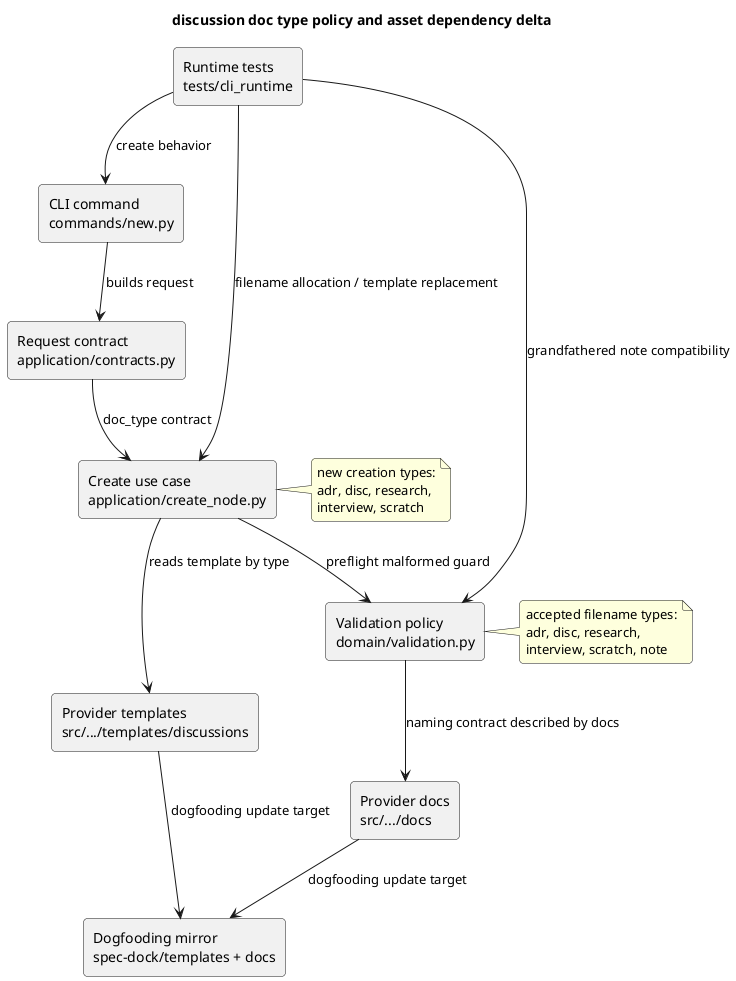

# iss-00100 Discussion template taxonomy and elicitation/capture expansion — 設計（HOW）

## 親 Diagram 参照
- Initiative / Epic の構造判断:
  - 本 issue は `src/spec_dock/assets/spec_dock/...` を provider-side 正本、`spec-dock/...` を dogfooding mirror として扱う。
  - runtime は `cli` / `commands` / `application` / `domain` / `infra` / `presentation` の layered architecture を維持する。
- 再利用する決定:
  - discussion original は initiative / epic / issue 配下の `discussions/` に timestamp-prefixed file として作成する。
  - template 正本は `src/spec_dock/assets/spec_dock/templates/discussions/` に置き、dogfooding mirror も検証対象にする。
  - command-driven creation は `./spec-dock/scripts/spec-dock new doc <type> --{initiative|epic|issue} <id> --title "<title>"` を維持する。

## 目的・制約
- 目的:
  - discussion template catalog を `scratch` / `interview` / `research` / `disc` / `adr` の5種類に整理し、人間への質問、事実調査、議論整理、意思決定、未整理 capture の境界を明確にする。
  - `note` は新規作成 catalog から外し、既存 file は grandfathered artifact として validate / doctor が壊さない。
  - エージェントが思考、知識、未確定情報を外部化し、必要なものだけを `adr` / `requirement.md` / `design.md` / `plan.md` へ固定化する workflow guidance を残す。
- 必須 / 禁止:
  - `interview` は複数回答案、選択肢比較、メリット/デメリット、リスク、ベストプラクティス分析、推奨案を必須欄として持つ。
  - `scratch` は低摩擦の raw capture とし、本文は自由記述を主役にする。
  - 文書そのものを昇格させる command / type は作らない。
  - `disc` を万能 template にしない。
- 前提:
  - `authority` は runtime enforcement ではなく docs / template guidance の契約として実装する。
  - 通常は doc type から authority を推定し、例外時だけ front matter の `authority` で override できる。
  - `note` の既存 file は timestamp 形式も legacy sequential 形式も引き続き valid とする。

## 既存実装 / 規約の理解
- 参照した実装 / docs:
  - `src/spec_dock/assets/spec_dock/scripts/spec_dock_runtime/application/create_node.py`
  - `src/spec_dock/assets/spec_dock/scripts/spec_dock_runtime/application/contracts.py`
  - `src/spec_dock/assets/spec_dock/scripts/spec_dock_runtime/domain/validation.py`
  - `src/spec_dock/assets/spec_dock/scripts/spec_dock_runtime/app.py`
  - `src/spec_dock/assets/spec_dock/templates/discussions/`
  - `src/spec_dock/assets/spec_dock/docs/rules/{initiative,epic,issue}/discussions.md`
  - `src/spec_dock/assets/spec_dock/docs/workflow_{initiative,epic,issue}.md`
  - `src/spec_dock/assets/spec_dock/docs/reference_naming.md`
  - `tests/cli_runtime/test_new.py`
  - `tests/cli_runtime/test_runtime_new_doc_s09.py`
  - `tests/cli_runtime/test_validate.py`
- 現状理解:
  - CLI parser の `commands/new.py` は `_discussion_doc_types` と argparse `choices` で `doc_type` を先に絞っている。
  - runtime create allowlist と filename regex は `adr` / `disc` / `research` / `note` に固定されている。
  - validation も同じ type set で discussion filename を判定するため、新 type 追加には create path と validation path の両方の更新が必要である。
  - template replacement は `<ADR_ID>` / `<DISC_ID>` / `<RESEARCH_ID>` / `<NOTE_ID>` のように type-specific placeholder を持つ。
  - docs の create command 例も `note` を公式 type として示している。
- 採用するパターン:
  - create path の public allowlist と validation path の accepted filename type set を分ける。
  - provider-side asset を先に更新し、dogfooding mirror は shipped result の確認対象として揃える。
  - tests は runtime behavior と validation compatibility を分けて更新する。
- 採用しないもの:
  - `note` を `scratch` の alias として silently create すること。新規作成で `note` を残すと境界整理の効果が弱くなる。
  - 既存 `note` file の自動 rename。既存 history とリンクを壊すため、本 issue では行わない。
  - `authority` の runtime 必須検証。全 artifact に front matter 追加を強制しない要件と衝突する。

## 採用方針 / トレードオフ

### discussion catalog
| type key | 日本語名 | authority default | 新規作成 | validation | 主責務 |
|---|---|---:|---|---|---|
| `scratch` | 作業メモ | `raw` | yes | yes | 未整理の思考、発話、下書き、作業ログを低摩擦に置く |
| `interview` | ヒアリング記録 | `raw` | yes | yes | 人間へ質問し、回答候補と推奨案つきで回答を得る |
| `research` | 調査記録 | `synthesized` | yes | yes | 検証可能な根拠、事実、未確実性、判断への示唆を残す |
| `disc` | 議論記録 | `proposed` | yes | yes | 論点、評価軸、選択肢、合意/未合意を整理する |
| `adr` | 意思決定記録 | `accepted` | yes | yes | 長期的な判断、理由、影響、見直し条件を固定化する |
| `note` | 旧メモ | `raw` 相当 | no | yes | 既存 file の互換維持だけを目的に grandfather する |

### `note` compatibility
- 新規作成:
  - `new doc note ...` は unknown / retired type として失敗させる。
  - error message は `scratch` への移行を示す。
- 既存 file:
  - `20260329t123456z-note-current.md` のような timestamp `note` は valid。
  - `001-note-legacy.md` のような legacy sequential `note` も valid。
  - doctor / validate の duplicate detection は `note` を含む既存 family も扱う。
- template asset:
  - provider-side `note.md` は削除し、新規 install の公式 catalog から外す。
  - managed `spec-dock/templates/discussions/note.md` は `spec-dock update` の `_sync_tree` により pruned される前提にする。
  - 既存 discussion artifact の `*-note-*.md` は `templates/` とは別領域なので削除・rename しない。

### authority / reflection
- `authority` は doc type default を docs と template guidance に明示する。
- front matter の `authority` は optional override として許可するが、全 artifact に必須化しない。
- `derived_from` / `reflected_to` は任意 metadata として guidance に載せる。
- `promoted_from` / `promoted_to` は採用しない。反映は「元文書の昇格」ではなく「文脈をもとに新しい正本を作成・修正」として扱う。

## 依存関係分析
- module 依存:
  - `commands/new.py` は CLI args から `CreateDiscussionDocRequest` を作る入口であり、argparse `choices` を外すか creatable type set に更新して、`scratch` / `interview` を parse できるようにする。
  - `new doc note ...` は argparse の generic invalid choice ではなく、use case 側の retired message に到達させるため、parser では raw `doc_type` を受ける。
  - `application/create_node.py` は create allowlist、template path、filename allocation、placeholder replacement を持つ。
  - `domain/validation.py` は accepted filename type set と malformed detection を持つ。ここは create allowlist より広く、grandfathered `note` を含む必要がある。
  - `presentation` は create result の表示だけで type set 依存は小さい。
- file 依存:
  - templates を追加/削除すると、create path と installer/init/update tests に影響する。
  - docs の command examples を変えると、wrappers / docs copy tests の期待文言ではなく shipped asset content validation が主な確認対象になる。
  - dogfooding mirror は provider asset と同じ catalog を持つ必要がある。
- 上流 / 前提:
  - requirement gate は pass 済み。
  - design では `note` を new creation から外す判断を固定する。
- 下流 / 依存先:
  - plan は docs/templates step、runtime/tests step、dogfooding/quality step の順に分ける。
  - implementation step は docs-only と runtime/tests を混ぜず、reviewer gate を分ける。
- 実装起点:
  - 先に docs/templates の target catalog を固定し、次に runtime allowlist / validation / tests を合わせる。
- 順序への影響:
  - provider templates/docs が先、runtime contract が次、dogfooding mirror と final docs impact が最後。

## Module Dependency Diagram
- Title: discussion doc type policy and asset dependency delta
- Question answered: 新規 catalog type と grandfathered `note` を、どの module / asset がどう扱うか。
- Scope: `new doc` create path、validation path、provider assets、dogfooding mirror、tests。
- Excluded details: 全 CLI parser、全 graph build、GitHub sync、scaffold installer internals。
- Update trigger: create allowlist、validation accepted types、template catalog、note compatibility 方針を変えるとき。



## インターフェース契約
- CLI:
  - `./spec-dock/scripts/spec-dock new doc scratch --issue <id> --title "<title>"`
  - `./spec-dock/scripts/spec-dock new doc interview --issue <id> --title "<title>"`
  - 既存 `adr` / `disc` / `research` はそのまま作成できる。
  - `new doc note ...` は失敗し、`note` retired と `scratch` 利用を案内する。
  - parser は `doc_type` を choices で早期 reject せず、`application/create_node.py` が creatable / retired / unknown を分類した error を返す。
- Filename:
  - 新規: `<ts>-<kind>-<slug>.md` / `<ts>-<nn>-<kind>-<slug>.md`
  - `<kind>` の新規作成対象は `adr` / `disc` / `research` / `interview` / `scratch`
  - validation accepted `<kind>` は上記に `note` を加えた6種類。
- Template placeholders:
  - `interview.md`: `<INTERVIEW_ID>` / `<INTERVIEW_TITLE>` / `<SCOPE_ID>` / `<YOUR_NAME>` / `YYYY-MM-DD`
  - `scratch.md`: `<SCRATCH_ID>` / `<SCRATCH_TITLE>` / `<SCOPE_ID>` / `<YOUR_NAME>` / `YYYY-MM-DD`
  - `adr` / `disc` / `research` は既存 placeholder を維持しつつ、日本語項目と reflection guidance を拡充する。
- Interview question granularity:
  - `interview` は原則として 1 file で 1つのヒアリング主題を扱い、その中に複数の質問ブロックを持てる。
  - 「質問」section を repeatable block にし、各 block が質問主題、回答してほしいこと、なぜ質問するのか、背景、詳細説明、事前分析、回答候補、選択肢比較、メリット/デメリット、リスク、ベストプラクティス分析、推奨案、未回答時の影響、回答欄、回答後 follow-up を持つ。
  - 複数質問が独立した意思決定を要求する場合は、1 file に詰めず `interview` を分ける guidance を template に置く。

## Sequence Delta（必要時）
- 変更する相互作用:
  - `new doc` の通常 sequence は変えない。doc type validation と template lookup の対象だけ変える。
- retry / transaction / external API / queue:
  - N/A: 外部 API、queue、transaction は関係しない。
- UML:
  - N/A: module dependency diagram で十分に表現できる。

## Domain Model Delta（必要時）
- aggregate / entity / value object 変更:
  - N/A: domain model の永続 schema は変更しない。
- 不変条件の変更:
  - discussion filename validation の accepted type set は create allowlist より広くなる。
  - `note` は valid filename だが creatable type ではない。

## ディレクトリ / ファイル変更計画
```text
.
|-- src/
|   `-- spec_dock/
|       `-- assets/
|           `-- spec_dock/
|               |-- templates/
|               |   `-- discussions/
|               |       |-- adr.md          # Modify: decision template に authority/reflection guidance を追加
|               |       |-- disc.md         # Modify: framing 専用化し interview/research/scratch との境界を明記
|               |       |-- research.md     # Modify: 事実/推測/未検証/示唆の分離を強化
|               |       |-- interview.md    # Add: ヒアリング記録 template
|               |       |-- scratch.md      # Add: 低摩擦 raw capture template
|               |       `-- note.md         # Delete: 新規作成 catalog から retired
|               |-- docs/
|               |   |-- guide.md                         # Modify: discussions の説明を lifecycle に更新
|               |   |-- reference_naming.md              # Modify: type set と note grandfathering を更新
|               |   |-- workflow_initiative.md           # Modify: new doc examples を新 catalog に更新
|               |   |-- workflow_epic.md                 # Modify: new doc examples を新 catalog に更新
|               |   |-- workflow_issue.md                # Modify: new doc examples と lifecycle guidance を更新
|               |   |-- workflow_spec_authoring.md       # Modify: 外部化/固定化 guidance を補強
|               |   |-- phase_requirement.md             # Modify: requirement-phase の逃がし先を note から scratch/interview に更新
|               |   |-- phase_design.md                  # Modify: 論点の逃がし先を note から scratch/interview に更新
|               |   |-- templates/README.md              # Modify: discussions catalog の inventory を新 catalog に更新
|               |   |-- scripts/README.md                # Modify: new doc type examples と retired note guidance を更新
|               |   `-- rules/
|               |       |-- initiative/discussions.md        # Modify: selection guide と create command
|               |       |-- epic/discussions.md              # Modify: selection guide と create command
|               |       `-- issue/discussions.md        # Modify: selection guide と create command
|               `-- scripts/
|                   `-- spec_dock_runtime/
|                       |-- application/
|                       |   |-- contracts.py     # Modify: creatable doc_type Literal
|                       |   `-- create_node.py  # Modify: create allowlist, validation scan, placeholders, retired note error
|                       |-- commands/
|                       |   `-- new.py          # Modify: parser doc_type choices/custom validation; note retired error reaches use case
|                       |-- domain/
|                       |   `-- validation.py   # Modify: accepted filename types include new types and grandfathered note
|                       `-- app.py               # Modify: legacy compatibility constants / regex を new catalog + grandfathered note に更新
|-- spec-dock/
|   |-- templates/                             # Modify/Add/Delete: dogfooding mirror catalog and templates README
|   `-- docs/                                  # Modify: dogfooding mirror docs for validation and stale guidance removal
`-- tests/
    |-- cli_runtime/
    |   |-- test_new.py                         # Modify: create behavior for scratch/interview, note retired
    |   |-- test_runtime_new_doc_s09.py          # Modify: timestamp allocation, templates, retired note behavior
    |   `-- test_validate.py                    # Modify: validation accepts scratch/interview/note grandfathering
    `-- test_init_update.py                     # Modify if scaffold asset inventory assertions require catalog update
```

## 要件 → 設計マッピング
- AC-001:
  - docs / rules / templates で5種類の目的、authority default、使う場面、使わない場面を明記する。
  - `note` retired と `scratch` 統合理由を docs に残す。
- AC-002:
  - `interview.md` に repeatable な質問ブロックを置き、各ブロックに質問主題、回答してほしいこと、なぜ質問するのか、背景、詳細説明、事前分析、回答候補、選択肢比較、メリット/デメリット、リスク、ベストプラクティス分析、推奨案、未回答時の影響、回答欄、回答後 follow-up を必須欄として置く。
- AC-003:
  - `disc.md` と discussions rules に、`disc` は framing、`interview` は回答収集であることを明記する。
- AC-004:
  - `scratch.md` は front matter と `# <title>`、`## メモ` を中心にし、他は任意の整理補助に留める。
- AC-005:
  - 各 template に `derived_from` / `reflected_to` guidance と反映メモを置く。
- AC-006:
  - runtime create allowlist、validation accepted types、templates、docs、tests を5種類 + grandfathered note に合わせる。
  - shipped `scripts/README.md` の `new doc` examples と type catalog も `scratch` / `interview` / `research` / `disc` / `adr` + retired `note` guidance に合わせる。
- AC-007:
  - 初期実装では `interview` と `scratch` 以外の新 type を追加しない。
- AC-008:
  - docs / templates に selection table と PlantUML 用 section を置く。
- AC-009:
  - `workflow_spec_authoring.md` / `workflow_issue.md` / `phase_design.md` / rules docs に、外部化と固定化の lifecycle guidance を残す。
- AC-010:
  - docs / templates に doc type default authority と optional override を明記する。

## テスト戦略
- 単体 / runtime:
  - `tests/cli_runtime/test_new.py` で `scratch` / `interview` が initiative / epic / issue scope に作成できることを確認する。
  - `tests/cli_runtime/test_runtime_new_doc_s09.py` で timestamp allocation、same-second suffix、template replacement、stdout path が新 type で動くことを確認する。
  - `new doc note` が argparse invalid choice ではなく retired type として失敗し、`scratch` を案内することを確認する。
- validation:
  - `tests/cli_runtime/test_validate.py` で `scratch` / `interview` filename が valid、既存 `note` filename も valid であることを確認する。
  - malformed filename detection が新 type と grandfathered `note` の両方で働くことを確認する。
- installer / scaffold:
  - init/update で `interview.md` / `scratch.md` が provider asset から配置され、managed `templates/discussions/note.md` が pruned されることを確認する。
- docs/template:
  - `./spec-dock/scripts/spec-dock validate`
  - `git diff --check`
  - 必要に応じて targeted `python -m unittest ...`

## 要件 / 例外 -> verification mapping
- AC-001, AC-003, AC-005, AC-008, AC-009, AC-010:
  - docs/template diff inspection + `spec-reviewer` docs/spec alignment review。
- AC-002:
  - automated template-content assertion を required closure とし、`interview.md` の質問ブロックに必須分析項目（質問主題、回答してほしいこと、なぜ質問するのか、背景、詳細説明、事前分析、回答候補、選択肢比較、メリット/デメリット、リスク、ベストプラクティス分析、推奨案、未回答時の影響、回答欄、回答後 follow-up）が揃うことを確認する。reviewer inspection は補助であり、required closure の代替にしない。
- AC-004:
  - `scratch.md` content inspection。必須本文構造が `## メモ` 中心であること。
- AC-006:
  - runtime tests + validation tests + scaffold asset tests。
  - stale-doc scan を required closure とし、shipped provider/dogfooding docs に `new doc note` や `adr|disc|research|note` の旧 catalog 表現が残らないことを確認する。ただし grandfathered `note` compatibility の説明は許容する。
- AC-007:
  - diff inspection。new type は `interview` / `scratch` のみ。
- EC-001〜EC-007:
  - selection guide と template guidance inspection。

## リスク / 移行 / ロールバック
- リスク:
  - `new doc note` を使っていた利用者には breaking change になる。
  - validation accepted type と create allowlist を分けるため、片方だけ更新すると regress しやすい。
  - provider asset と dogfooding mirror の差分が残ると、dogfooding 検証が stale になる。
- 緩和策:
  - error message で `note` retired と `scratch` 移行を明示する。
  - tests で create allowlist と validation grandfathering を分けて固定する。
  - docs に existing `note` は rename / migration 不要と明記する。
- ロールバック:
  - 重大な互換問題が出た場合は、`note` を creatable allowlist と template asset に戻す。ただし docs では deprecated とし、別 issue で warning/alias 方式を検討する。

## 未確定事項
- なし。
- requirement gate で P2 とされた supporting doc drift は、design 前に catalog proposal を更新済み。
