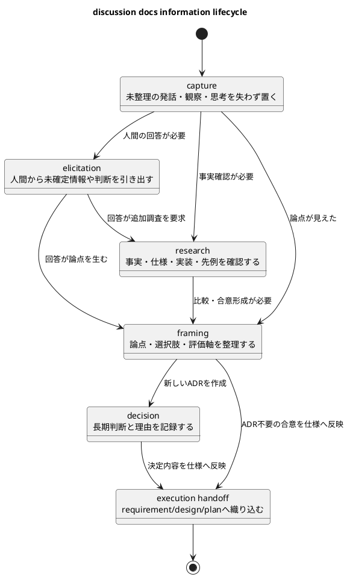
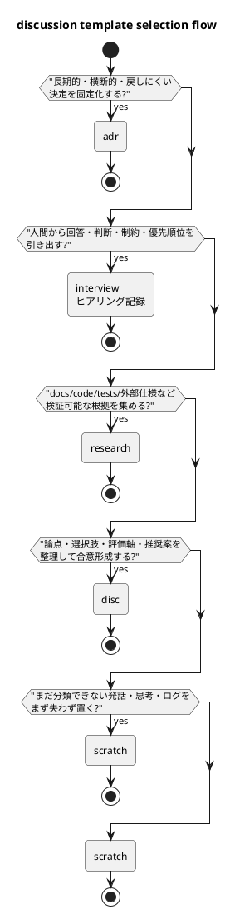
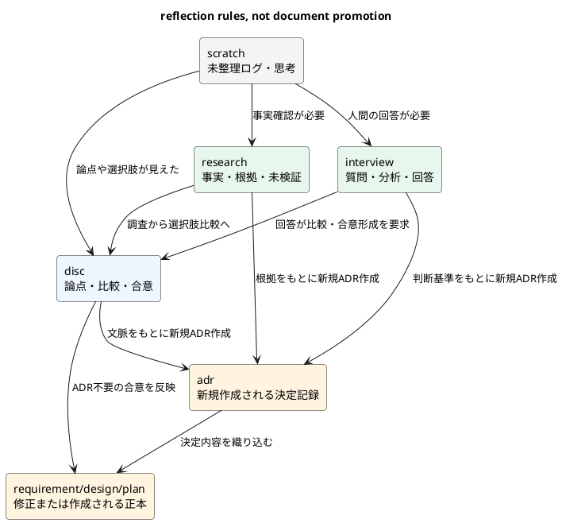

# 20260517t075915z-disc discussion template taxonomy guide

## 議題
- `spec-dock` の `discussions/` 用テンプレート群を、情報ライフサイクル上の役割で整理する。
- 文書そのものを別種別へ昇格させるのではなく、蓄積した文脈をもとに新しい正本 artifact を作成・修正する方針を明確化する。
- 要件定義書へ細部を押し込まず、エージェントが情報を外部化し、固定化する流れを理解するための説明資料として残す。

## 要約
- 本質的な不足は、`elicitation` と `raw capture` である。
  - `elicitation`: 人間から未確定情報、判断基準、制約、回答を引き出す。
  - `raw capture`: まだ分類できない発話、観察、会話ログ、思考を低摩擦に置く。
- 初期 catalog の暫定案は `scratch` / `interview` / `research` / `disc` / `adr` の5種類である。
- `note` は新規 type としては廃止し、`scratch` に統合する。既存 `note` は grandfathered として壊さない。
- `interview` の日本語表示名は「ヒアリング記録」とする。
- `disc` や `research` を `adr` に昇格させるのではなく、それらの文脈を踏まえて新しい `adr` を作成する。
- 作成した `adr` の内容は、必要に応じて `requirement.md` / `design.md` / `plan.md` へ織り込む。

## 情報ライフサイクル



## 推奨 catalog

| template | 日本語名 | lifecycle | 主な役割 | 正本性 |
|---|---|---|---|---|
| `scratch` | 作業メモ | capture | 未整理メモ、思考途中、下書き、会話ログを一時保存する | 低い |
| `interview` | ヒアリング記録 | elicitation | 人間が判断しやすいように、事前分析、選択肢、推奨案、回答欄をまとめる | 中 |
| `research` | 調査記録 | research | 事実、根拠、未検証事項、判断への示唆を分離する | 中 |
| `disc` | 議論記録 | framing | 論点、選択肢、評価軸、合意/未合意を整理する | 中 |
| `adr` | 意思決定記録 | decision | 採用した判断、理由、影響、見直し条件を固定化する | 高い |

```plantuml
@startuml
title current recommended discussion template map

skinparam backgroundColor #ffffff
skinparam shadowing false
skinparam roundcorner 8
skinparam defaultFontName "Hiragino Sans"
skinparam packageStyle rectangle

package "capture" {
  rectangle "scratch\n作業メモ\n未整理・非正本" as scratch #f4f4f4
}

package "elicitation" {
  rectangle "interview\nヒアリング記録\n選択肢・分析・推奨・回答欄" as interview #e8f7ee
}

package "research" {
  rectangle "research\n調査記録\n事実・根拠・未検証" as research #e8f7ee
}

package "framing" {
  rectangle "disc\n議論記録\n論点・比較・合意形成" as disc #eef6ff
}

package "decision" {
  rectangle "adr\n意思決定記録\n決定・理由・影響" as adr #fff4df
}

rectangle "requirement/design/plan\n実行用正本" as spec #fff4df

scratch --> interview : 人間に聞く
scratch --> research : 調査する
scratch --> disc : 論点化する
interview --> disc : 回答が比較を生む
research --> disc : 根拠から比較へ
disc --> adr : 文脈をもとに新規ADR作成
interview --> adr : 判断基準をもとに新規ADR作成
research --> adr : 根拠をもとに新規ADR作成
adr --> spec : 決定を仕様へ織り込む
disc --> spec : ADR不要の合意を仕様へ反映

@enduml
```

## 選択フロー



## `disc` と `interview` の境界

| 観点 | `interview`（ヒアリング記録） | `disc` |
|---|---|---|
| 主目的 | 人間から未確定情報や判断を引き出す | 集まった情報を整理し、合意形成する |
| 読者 | 回答者、意思決定者、依頼者 | reviewer、maintainer、設計参加者 |
| 中心要素 | 質問、事前分析、回答候補、選択肢比較、推奨案、回答欄 | 論点、選択肢、評価軸、比較、推奨案、合意点 |
| 完了条件 | 回答が得られ、正本への反映方針が決まる | 合意または次の判断材料が揃う |
| 反映先 | `requirement` / `design` / `plan` / 新規 `adr` | `requirement` / `design` / `plan` / 新規 `adr` |

## `scratch` と旧 `note` の境界

| 観点 | `scratch` | 旧 `note` |
|---|---|---|
| 主目的 | 未整理情報を失わず置く | 軽量だが整理済みの記録を残す |
| 今回の扱い | 新規作成 type として採用候補 | grandfathered。新規作成は `scratch` へ寄せる |
| 構造 | 最小限。自由記述を妨げない | 背景、事実、検討、次アクション程度の整理あり |
| 正本性 | 低い。正本ではない | 低から中 |
| 必須 guidance | 整理先候補、破棄条件、次にすること | 既存 artifact として保持 |

## 反映フロー



## 設計方針
- `interview` は単なる聞き取りログではなく、人間が回答しやすい意思決定支援シートとして扱う。
  - 回答案
  - 選択肢比較
  - メリット / デメリット
  - リスク
  - ベストプラクティス分析
  - 推奨案
  - 回答欄
- `scratch` は旧 `note` と `freeform` の受け皿を統合する。
- `promotion` type は初期実装では作らない。
- discussion docs は作業面であり、正本化は新規 `adr` の作成、または `requirement.md` / `design.md` / `plan.md` への織り込みで行う。

## 次アクション
- 設計フェーズで `interview` / `scratch` の exact template を確定する。
- authority level は doc type 既定値 + 例外 override 方式で設計する。
- 反映履歴は `derived_from` / `reflected_to` または本文の「反映メモ」で軽量に扱う。
