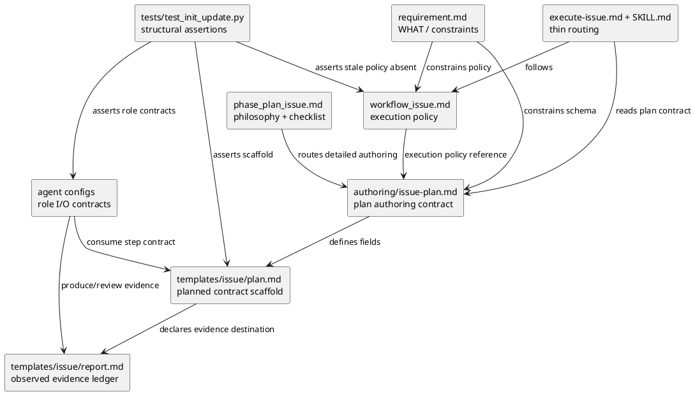
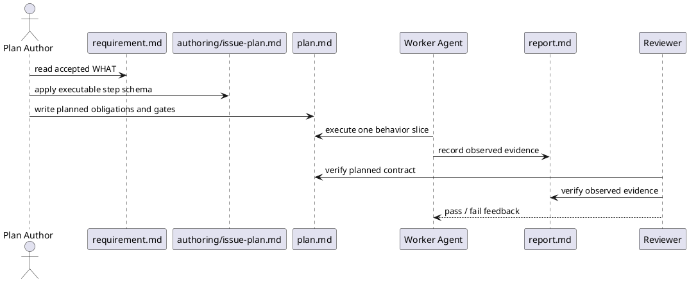

# iss-00102 Agentic TDD plan step contract — 設計（HOW）

## 目的・制約
- 目的:
  - Issue `plan.md` を、Agentic TDD を説明する文書ではなく、実装エージェントが順に実行できる planned contract へ変える。
  - `plan.md` と `report.md` の正本境界を分け、plan は planned obligations / gates / evidence requirements、report は observed evidence ledger を所有する。
  - workflow / authoring docs / template / prompt / skill / agent config の重複を減らし、各文書の所有責務を明確にする。
- 必須:
  - `1〜3件程度` の test count 規範を削除または非規範化し、risk-calibrated test obligation coverage に置換する。
  - `具体テストケース一覧` という見出し名は維持しつつ、完全な test inventory ではなく step-local obligations / concrete seeds と定義する。
  - `phase_plan_issue.md` は plan philosophy + review checklist として残し、field-level 詳細は `docs/authoring/issue-plan.md` に寄せる。
  - provider-side source を先に変更し、dogfooding mirror の整合を確認する。
- 禁止:
  - `plan.md` を従来型の作業一覧のままにして、Agentic TDD の実行規律を workflow docs / prompt / skill だけへ押し込む。
  - `report.md` と `plan.md` の両方を実行 evidence の正本にする。
  - `workflow_issue.md`、`phase_plan_issue.md`、`authoring/issue-plan.md`、template が同じ field-level policy を再定義し続ける状態を残す。
- 対象外:
  - runtime lint command や `validate --strict-docs` の本格実装。
  - 既存 historical issue docs の migration。
  - Agent runtime や model selection policy の変更。

## 既存実装 / 規約の理解
- 参照した実装 / docs:
  - `src/spec_dock/assets/spec_dock/docs/workflow_issue.md`
  - `src/spec_dock/assets/spec_dock/docs/phase_plan_issue.md`
  - `src/spec_dock/assets/spec_dock/docs/authoring/issue-plan.md`
  - `src/spec_dock/assets/spec_dock/templates/issue/plan.md`
  - `src/spec_dock/assets/spec_dock/templates/issue/report.md`
  - `src/spec_dock/assets/install_root/.codex/prompts/execute-issue.md`
  - `src/spec_dock/assets/install_root/.agents/skills/spec-dock-issue-execution/SKILL.md`
  - `src/spec_dock/assets/install_root/.codex/agents/{dev-coder,code-reviewer,qa-reviewer,spec-reviewer}.toml`
  - `tests/test_init_update.py`
- 現状理解:
  - `workflow_issue.md` は Issue execution policy を広く所有しているが、plan authoring field や hard cutover optional pattern も厚く含む。
  - `phase_plan_issue.md` と `templates/issue/plan.md` には `1〜3件程度` の目安が残っており、risk-based coverage と衝突する。
  - `templates/issue/plan.md` は scaffold として重く、`Spec-Locked Closure Index`、`test bundle`、`具体テストケース一覧`、`step closure contract`、`step gate` の役割差が読み取りにくい。
  - `templates/issue/report.md` は closure / delegation / reviewer evidence の土台を持つが、plan 側が planned contract、report 側が observed evidence ledger であることはまだ明示されていない。
  - `execute-issue.md` / skill / agent config は plan step schema を command queue として扱う契約が弱い。
- 採用するパターン:
  - provider-side source first: shipped docs / templates は `src/spec_dock/assets/spec_dock/`、installed agent assets は `src/spec_dock/assets/install_root/` を正本にする。
  - dogfooding mirror verification: provider 変更後、`spec-dock/`、`.codex/`、`.agents/` の mirror が更新または確認される。
  - docs-only / template-only / skill-text-only 変更は `doc-writer` 実装、structural tests は `dev-coder` 実装、レビューは変更種別に応じて `spec-reviewer` / `code-reviewer` / `qa-reviewer` を使う。
- 採用しないもの:
  - すべての test function を `plan.md` に列挙する issue-wide inventory。
  - `1〜3件程度` を floor / cap / usual count として残す表現。
  - prompt / skill へ詳細 policy をコピーして正本を増やす構成。

## 採用方針 / トレードオフ
- 方針:
  - `workflow_issue.md`: lifecycle / execution policy / reviewer gate / completion contract を所有する。
  - `docs/authoring/issue-plan.md`: plan step schema と書き方の正本を所有する。
  - `phase_plan_issue.md`: plan philosophy、粒度、review checklist、正本 routing を所有する。
  - `templates/issue/plan.md`: minimal scaffold と copyable example を所有する。
  - `templates/issue/report.md`: observed evidence ledger を所有する。
  - `execute-issue.md` / skill: active docs と正本文書への thin routing を所有する。
  - agent configs: 各 agent の input / output / review focus を所有する。
- トレードオフ:
  - `具体テストケース一覧` を維持すると既存利用者への連続性が高い。一方で名称だけでは完全一覧に見えるため、authoring docs と template の定義で補正する。
  - `phase_plan_issue.md` を残すと導線は保てる。一方で重複リスクがあるため、field-level 記法と reviewer fail 条件は `docs/authoring/issue-plan.md` に寄せる。
  - `plan.md` に evidence の実行結果まで書かせると正本が増える。したがって plan は evidence requirements / destination まで、実結果は report に置く。

## Document Ownership Matrix
| artifact | owns | must not own |
|---|---|---|
| `workflow_issue.md` | Issue lifecycle, execution order, reviewer gate mapping, completion contract, plan-as-command-queue policy | plan field syntax, long examples, concrete test card format |
| `docs/authoring/issue-plan.md` | plan authoring contract, executable step schema, concrete test card format, reviewer fail conditions | lifecycle policy, completion policy, report ledger contents |
| `phase_plan_issue.md` | plan philosophy, behavior slice granularity, review checklist, routing to authoring/workflow docs | duplicate field-level template instructions, execution policy |
| `templates/issue/plan.md` | minimal scaffold, copyable S01 example, required headings | long policy manual, stale test count guidance, observed evidence ledger |
| `templates/issue/report.md` | observed evidence ledger, red/green/refactor results, discovered tests, closure delta, reviewer status | planned obligations as source of truth |
| `execute-issue.md` | thin execution routing, active docs read order, plan step command queue reminder | duplicated workflow policy and template syntax |
| `spec-dock-issue-execution/SKILL.md` | concise workflow reminder and runtime command reminders | full workflow copy, detailed TDD explanation |
| agent configs | role-specific input/output/review contracts | cross-document policy ownership |

## Plan / Report Boundary
- `plan.md` owns planned contract:
  - behavior goal
  - risk-calibrated test obligation
  - Red evidence requirement or justified alternative path
  - implementation scope and allowed paths
  - Green verification command / evidence destination
  - Refactor / cleanup guardrail
  - closure evidence requirements
  - report evidence destination
  - amendment trigger
- `report.md` owns observed evidence ledger:
  - actual Red / Green / Refactor evidence
  - actual verification result
  - observed deviations and discovered tests
  - closure delta and amendment history
  - delegated worker evidence
  - reviewer gate status
  - step commit / approved-no-op evidence

## Executable Step Schema
`templates/issue/plan.md` の implementation step は、少なくとも次の意味を表現できる構造にする。

```text
Sxx behavior slice
|-- behavior goal
|-- planned contract
|   |-- scope
|   |-- test obligation
|   |-- red or alternative evidence requirement
|   |-- green verification
|   |-- refactor guardrail
|   `-- amendment trigger
|-- delegation contract
|-- 具体テストケース一覧
|-- step closure contract
|-- report evidence destination
`-- step gate
```

- `具体テストケース一覧` は見出し名を維持するが、完全な issue-wide test inventory ではない。
- docs-only / inspect-only / manual-required step は、code test の代わりに代替 evidence path と rationale を持つ。
- step closure は report の observed evidence と reviewer gate によって確認される。

## Module Dependency Diagram
- タイトル:
  - Agentic TDD plan contract document dependency
- 答える問い:
  - 実装順序と正本境界をどの文書が決めるか。
- 範囲:
  - shipped docs / templates / installed agent assets / tests。
- 含めない詳細:
  - runtime command call graph、historical issue migration、agent runtime internals。
- 更新条件:
  - source-of-truth ownership、plan/report boundary、template schema、agent input/output contract が変わるとき。



## ディレクトリ / ファイル変更計画
```text
.
|-- src/spec_dock/assets/spec_dock/docs/
|   |-- workflow_issue.md                 # 変更: plan-as-command-queue policy と optional hard cutover 分離
|   |-- phase_plan_issue.md               # 変更: philosophy + checklist に圧縮
|   |-- reference_hard_cutover.md         # 追加: hard cutover optional pattern の移動先
|   `-- authoring/
|       `-- issue-plan.md                 # 変更: executable step schema の正本
|-- src/spec_dock/assets/spec_dock/templates/issue/
|   |-- plan.md                           # 変更: planned contract scaffold
|   `-- report.md                         # 変更: observed evidence ledger
|-- src/spec_dock/assets/install_root/
|   |-- .codex/
|   |   |-- prompts/execute-issue.md       # 変更: thin routing と plan command queue
|   |   `-- agents/
|   |       |-- dev-coder.toml             # 変更: obligations を満たす最小十分な実装/テスト出力
|   |       |-- code-reviewer.toml         # 変更: step scope / evidence review focus
|   |       |-- qa-reviewer.toml           # 変更: obligation coverage review focus
|   |       `-- spec-reviewer.toml         # 変更: plan schema / docs alignment review focus
|   `-- .agents/skills/spec-dock-issue-execution/
|       `-- SKILL.md                      # 変更: concise reminder only
|-- spec-dock/
|   |-- docs/                             # mirror: provider docs update result
|   `-- templates/issue/                  # mirror: provider templates update result
|-- .codex/
|   |-- prompts/execute-issue.md          # mirror: installed prompt
|   `-- agents/                           # mirror: installed agent configs
|-- .agents/skills/spec-dock-issue-execution/SKILL.md
|                                           # mirror: installed skill
`-- tests/test_init_update.py              # 変更: structural assertions
```

## インターフェース契約
- Plan authoring contract:
  - `docs/authoring/issue-plan.md` は `templates/issue/plan.md` に現れる step fields の意味を定義する。
  - reviewer fail 条件は、missing field ではなく executable TDD cycle として閉じない状態を検出する。
- Execution contract:
  - `workflow_issue.md` は `plan.md` を command queue として扱う policy を持つ。
  - implementation step は原則 behavior slice / Agentic TDD cycle / review scope / commit boundary に対応する。
- Report contract:
  - `templates/issue/report.md` は actual evidence を保持する。
  - plan の evidence destination と report の ledger section が対応する。
- Agent handoff contract:
  - `dev-coder` は plan obligations / allowed paths / verification requirements を満たす最小十分な implementation と tests を返す。
  - `doc-writer` は shipped docs / templates / skill text の bounded update を返す。
  - `spec-reviewer` は requirement / design / plan / docs alignment と plan schema の実行可能性を確認する。
  - `qa-reviewer` は raw test count ではなく obligation coverage と missing high-value tests を確認する。
  - `code-reviewer` は step scope、allowed paths、verification evidence、regression risk を確認する。

## Sequence Delta
- 変更する相互作用:
  - plan 作成から実装・report までの責務境界を明確化する。
- retry / transaction / external API / queue:
  - external API は変更しない。



## 要件 → 設計マッピング
- AC-001 -> `phase_plan_issue.md` / `authoring/issue-plan.md` / `templates/issue/plan.md` の risk-calibrated obligation guidance。
- AC-002 -> step-local red / characterization / covered-existing / inspect-only / manual-required evidence path。
- AC-003 -> executable step schema と `execute-issue.md` / skill routing。
- AC-004 -> reviewer agent configs と report evidence ledger。
- AC-005 -> Document Ownership Matrix と Plan / Report Boundary。
- AC-006 -> provider-side source structural tests and S90 dogfooding mirror sync / inspection evidence.
- AC-007 -> report ledger、reviewer gate status、closure evidence requirements。
- EC-001 -> docs-only / inspect-only / manual-required alternative evidence path。
- EC-002 -> discovered tests / closure delta / plan amendment rules。
- EC-003 -> bundled slice exception criteria in authoring docs and workflow.
- EC-004 -> coverage rationale instead of raw count.

## テスト戦略
- Unit / structural:
  - `tests/test_init_update.py` に shipped docs/templates/installed assets の content assertions を追加する。
  - 古い `1〜3件程度` 規範が provider assets に戻らないことを検査する。
  - `plan.md` template が planned contract / report evidence destination / amendment trigger を持つことを検査する。
  - `report.md` template が observed evidence ledger / discovered tests / closure delta を持つことを検査する。
  - `execute-issue.md` / skill / agent configs が薄い routing と role I/O contract を持つことを検査する。
- Integration:
  - 必要なら `uv run pytest tests/test_init_update.py` を targeted に実行する。
  - 最終段階で `uv run pytest tests/test_init_update.py` と `./spec-dock/scripts/spec-dock validate` を実行する。
- Manual / inspection:
  - S90 で `./spec-dock/scripts/spec-dock sync` を実行し、dogfooding mirror の `spec-dock/docs/`、`spec-dock/templates/`、`.codex/`、`.agents/` が provider source と整合することを確認する。

## 要件 / 例外 -> verification mapping
- AC-001:
  - structural assertion: no normative `1〜3件程度` guidance.
  - inspection: risk-calibrated test obligation language present.
- AC-002 / AC-003:
  - structural assertion: plan template includes red / alternative evidence path, green verification, refactor guardrail, amendment trigger, report destination.
- AC-004 / AC-007:
  - structural assertion: report template includes observed evidence ledger sections and reviewer gate status.
  - agent config assertions: reviewers evaluate obligation coverage and evidence, not raw count.
- AC-005:
  - inspection: ownership table language exists in docs and prompt/skill does not duplicate detailed policy.
- AC-006:
  - tests: provider asset structural assertions.
  - manual / sync: S90 dogfooding mirror evidence.
- EC-001:
  - structural assertion: docs-only / inspect-only alternative evidence path is present.
- EC-002:
  - structural assertion: discovered tests and amendment trigger language is present.
- EC-003:
  - inspection: bundled slice exception criteria exists.
- EC-004:
  - inspection: low-risk few-obligation case uses coverage rationale, not count.

## リスク / 移行 / ロールバック
- Risk: template が重くなりすぎる。
  - Mitigation: template は minimal scaffold と copyable S01 に留め、詳細は `authoring/issue-plan.md` に置く。
- Risk: `plan.md` と `report.md` の evidence authority が再び混ざる。
  - Mitigation: plan owns requirements / destinations, report owns observed results と明記し、tests で主要語を検査する。
- Risk: dogfooding mirror が provider source とずれる。
  - Mitigation: provider first、then update / sync / mirror inspection。
- Rollback:
  - docs/templates/agent asset 変更は file-level revert 可能。
  - 新規 `reference_hard_cutover.md` が不適切なら、standard workflow からの分離方針を維持したまま reference destination を変更する。

## 未確定事項
- 実装着手を止める未確定事項はない。
- `hard cutover evidence contract` の移動先は、この設計では `src/spec_dock/assets/spec_dock/docs/reference_hard_cutover.md` とする。
