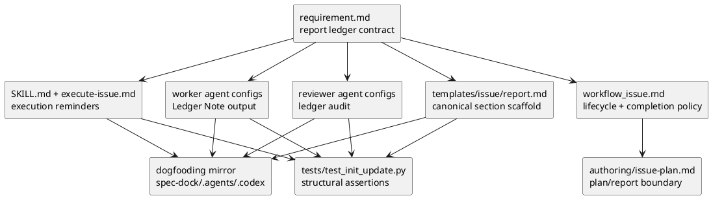

# iss-00103 Agentic TDD report decision ledger — 設計（HOW）

## 目的・制約
- 目的:
  - Issue `report.md` を、observed evidence ledger に加えて `Spec Interpretation / Decision Ledger` を持つ audit trail として拡張する。
  - worker が発見した material decision を structured `Ledger Note` として返し、main orchestrator が canonical `report.md` に統合する責任境界を shipped workflow / skill / agent config に反映する。
  - reviewer が decision traceability、open entry、promotion 漏れ、report-only durable decision を検出できるようにする。
- 必須:
  - `Status` と `Disposition` を分離した ledger entry state model を report template / docs / reviewer instruction に反映する。
  - `Ledger Note` minimum schema を worker-facing instruction に反映する。
  - 小規模 issue の軽量表現 `No material interpretation changes.` / `No decision entries.` を report template に置く。
  - structural tests で template / skill / reviewer docs の重要 marker を固定する。
- 禁止:
  - `implementation-notes.md` を標準 artifact として増やさない。
  - `plan.md` を実装中判断の正本にしない。
  - worker が authoritative ledger entry を直接 close / promote / reject する運用にしない。
- 対象外:
  - runtime strict validator の新規実装。
  - historical issue report の一括 migration。
  - `iss-00102` の plan contract 再設計。

## 既存実装 / 規約の理解
- provider-side source:
  - shipped docs / templates: `src/spec_dock/assets/spec_dock/...`
  - installed agent tooling: `src/spec_dock/assets/install_root/...`
  - structural tests: `tests/test_init_update.py`
- dogfooding mirror:
  - `spec-dock/docs/...`
  - `spec-dock/templates/issue/report.md`
  - `.agents/skills/spec-dock-issue-execution/SKILL.md`
  - `.codex/prompts/execute-issue.md`
  - `.codex/agents/*.toml`
- 現状理解:
  - `report.md` template は Red / Green / Refactor evidence、discovered tests、closure delta、delegation / reviewer / commit gate を持つ。
  - `workflow_issue.md` は lifecycle / execution / report evidence / completion policy を所有する。
  - `spec-dock-issue-execution/SKILL.md` と `execute-issue.md` は workflow への thin routing と実行 reminders を所有する。
  - worker / reviewer configs は observed evidence ledger への言及を持つが、decision ledger、Ledger Note、promotion check は未定義である。
- 採用するパターン:
  - `report.md` に `Spec Interpretation / Decision Ledger` を追加し、既存 evidence ledger section と並べる。
  - worker note は report template に常設せず、skill / worker configs の output contract に置く。
  - `Retrospective` は standard required section にせず、必要時だけ report へ追加できる optional section として docs に説明する。
  - runtime validation は入れず、structural tests と reviewer gate で担保する。

## 採用方針 / トレードオフ
- `Spec Interpretation / Decision Ledger` は単一 section とする。
  - 理由: 仕様解釈と判断を分けると記録場所が増え、reviewer が同じ decision を二重に追う必要がある。
- `Status` と `Disposition` を分離する。
  - `Status`: entry が未確定か、解決済みか、置換済みかを表す。
  - `Disposition`: decision が issue-local に適用されたか、rejected か、design / ADR / plan / follow-up へ昇格したかを表す。
- `Proposed Report Entries` は report template に常設しない。
  - 理由: worker note は worker output contract で十分であり、template 常設は小規模 issue の負担を増やす。
- `Retrospective` は optional とする。
  - 理由: 後知恵は有用だが acceptance evidence と混ぜてはならない。必要時に追加する運用で十分。

## Ledger Entry Contract
`report.md` の canonical section は次の形にする。

```markdown
## Spec Interpretation / Decision Ledger

No material interpretation changes.

No decision entries.

<!-- Or, when decisions exist: -->

| ID | Status | Type | Raised By | Trigger / Gap | Options Considered | Decision / Interpretation | Rationale | Disposition | Evidence | Follow-up |
|---|---|---|---|---|---|---|---|---|---|---|
| D-001 | resolved | interpretation | orchestrator | ... | ... | ... | ... | applied | ... | none |
```

- allowed `Status`:
  - `open`
  - `resolved`
  - `superseded`
- allowed `Disposition`:
  - `applied`
  - `rejected`
  - `promoted_to_design`
  - `promoted_to_adr`
  - `promoted_to_plan`
  - `converted_to_followup`
  - `deferred`
  - `no_action`
  - `superseded`
- allowed `Type`:
  - `interpretation`
  - `scope`
  - `implementation`
  - `compatibility`
  - `test-strategy`
  - `operation`
  - `deviation`
  - `follow-up`

### Disposition Required Evidence

| Disposition | Required evidence | Completion blocker |
|---|---|---|
| `applied` | changed artifact / implementation evidence and why issue-local application is sufficient | missing evidence |
| `rejected` | rejected option, reason, and no remaining blocking impact | missing reason |
| `promoted_to_design` | updated `design.md` reference or explicit design update evidence | missing promoted artifact |
| `promoted_to_adr` | ADR reference or ADR candidate reference with owner / next action | missing ADR reference |
| `promoted_to_plan` | plan amendment reference and re-review evidence | missing plan amendment evidence |
| `converted_to_followup` | follow-up issue / discussion / ADR candidate reference and blocking / non-blocking classification | missing follow-up reference |
| `deferred` | scope-out reason, non-blocking rationale, revisit condition | missing revisit condition or blocking classification |
| `no_action` | reason the decision is issue-local and not durable | durable decision remains report-only |
| `superseded` | replacement entry ID and reason for replacement | missing replacement ID |

Completion blocker rules:

- `Status=open` is always finish-blocking.
- `Status=resolved` without `Disposition` is finish-blocking.
- `Status=superseded` without replacement entry ID is finish-blocking.
- durable design / workflow / public contract decisions cannot complete with `Disposition=no_action`.
- transcript dump, private reasoning, secret, token, or private payload in ledger is finish-blocking when sensitive; otherwise reviewer warning or fail depending severity.

## Ledger Note Contract
worker-facing instruction には、次を `Ledger Note` minimum schema として置く。

```markdown
### Ledger Note

- source-agent: dev-coder | doc-writer | utility-worker
- topic:
- trigger:
- ambiguity / constraint:
- observed facts:
- options considered:
- proposed decision:
- rationale:
- affected files:
- affected tests:
- risk if wrong:
- rollback or revisit:
- confidence: high | medium | low
- needs orchestrator decision: yes | no
```

material decision がない場合:

```markdown
### Ledger Note

- No material implementation decisions beyond the approved plan.
```

worker は `proposed decision` を accepted decision として扱わない。main orchestrator が source docs / diff / tests / reviewer output と照合し、canonical ledger entry として status / disposition / evidence / follow-up を整える。

## Reviewer Gate Contract
reviewer-facing instruction は次を監査する。

- material decision が diff / report / plan / review response にあるのに ledger entry がない場合は finding にする。
- `Status=open` が issue completion 前に残っている場合は blocker。
- `Status=resolved` に `Disposition`、evidence、必要な follow-up がない場合は blocker。
- durable decision が `report.md` のみで `no_action` になっている場合は blocker または major finding。
- `converted_to_followup` / `promoted_to_*` / `deferred` / `superseded` / `no_action` は `Disposition Required Evidence` を満たす必要がある。
- `No material interpretation changes.` / `No decision entries.` が妥当かを、diff と plan/report の内容から確認する。
- transcript dump、private reasoning、secret / token / private payload を ledger に入れない。

## Document Ownership Matrix
| artifact | 変更内容 | owns | must not own |
|---|---|---|---|
| `templates/issue/report.md` | `Spec Interpretation / Decision Ledger`、lightweight no-decision phrase、status/disposition/type values、completion note | issue-local decision audit trail scaffold | worker raw transcript、durable design authority |
| `workflow_issue.md` | report decision ledger の lifecycle / completion policy、worker note integration、promotion gate | issue execution policy | table field manual の長文重複 |
| `docs/authoring/issue-plan.md` | plan/report boundary の補足。plan は decision result を所有しない | plan/report field boundary | report ledger schema の正本 |
| `spec-dock-issue-execution/SKILL.md` | concise reminder: worker Ledger Note / orchestrator-owned report ledger | execution reminder | full workflow copy |
| `execute-issue.md` | prompt route: decision ledger と Ledger Note obligation | command routing | detailed schema の重複 |
| worker agent configs | worker output に Ledger Note を含める | firsthand rationale output | accepted decision finalization |
| reviewer agent configs | ledger audit checks | traceability / promotion review | ledger authoring |
| `tests/test_init_update.py` | shipped asset marker assertions | structural guard | semantic judgement |

## Module Dependency Diagram
- タイトル:
  - Report decision ledger asset dependency
- 答える問い:
  - report decision ledger contract をどの shipped asset へ反映し、どの tests で固定するか。
- 範囲:
  - provider-side docs/templates/install_root assets と dogfooding mirror。
- 含めない詳細:
  - runtime strict validator、historical issue migration。



## ディレクトリ / ファイル変更計画
```text
.
|-- src/spec_dock/assets/spec_dock/
|   |-- templates/issue/report.md          # 変更: decision ledger section / no-decision lightweight mode
|   `-- docs/
|       |-- workflow_issue.md              # 変更: lifecycle / completion / promotion policy
|       `-- authoring/issue-plan.md        # 変更: plan/report boundary補足
|-- src/spec_dock/assets/install_root/
|   |-- .agents/skills/spec-dock-issue-execution/SKILL.md
|   |                                      # 変更: Ledger Note / orchestrator-owned ledger reminder
|   `-- .codex/
|       |-- prompts/execute-issue.md       # 変更: execution prompt reminder
|       `-- agents/
|           |-- dev-coder.toml             # 変更: Ledger Note output obligation
|           |-- doc-writer.toml            # 変更: Ledger Note output obligation
|           |-- utility-worker.toml         # 変更: 存在する場合のみ Ledger Note output obligation
|           |-- code-reviewer.toml         # 変更: ledger audit checks
|           |-- qa-reviewer.toml           # 変更: ledger / open decision completion checks
|           `-- spec-reviewer.toml         # 変更: ledger / promotion / report-only design checks
|-- spec-dock/                             # mirror: sync後に provider source と整合確認
|-- .agents/                               # mirror: sync後に provider source と整合確認
|-- .codex/                                # mirror: sync後に provider source と整合確認
`-- tests/test_init_update.py              # 変更: marker assertions
```

`utility-worker.toml` は現時点で存在しない可能性がある。その場合は新規作成せず、skill / workflow docs の worker role 文言で utility-worker を含め、存在する agent configs のみを更新する。

## 要件 → 設計マッピング
- AC-001 -> `Ledger Note Contract`、`templates/issue/report.md`、worker agent configs、skill。
- AC-002 -> report template の lightweight phrase と reviewer checks。
- AC-003 -> `Ledger Entry Contract`、completion semantics、reviewer agent configs、workflow docs。
- AC-004 -> worker note schema、orchestrator integration policy、skill / prompt。
- AC-005 -> reviewer gate contract、spec-reviewer / qa-reviewer / code-reviewer configs。
- EC-001 -> no-decision lightweight mode。
- EC-002 -> worker note provisional handling。
- EC-003 -> reviewer finding disposition handling。
- EC-004 -> workflow docs の legacy compatibility note。

## テスト戦略
- Red / alternative:
  - 既存 structural tests は `report.md` の observed evidence ledger marker までは検査しているが、decision ledger marker は検査していない。S02 で failing assertion を追加する。
- Green:
  - `tests/test_init_update.py` に shipped asset marker assertions を追加し、provider assets に次が含まれることを検査する。
    - `Spec Interpretation / Decision Ledger`
    - `No material interpretation changes.`
    - `No decision entries.`
    - `Status` / `Disposition`
    - `promoted_to_design`
    - `Ledger Note`
    - `No material implementation decisions beyond the approved plan.`
    - reviewer audit fragments: `Status=open`, `report-only`, `durable decision`
- Integration / dogfooding:
  - `./spec-dock/scripts/spec-dock sync` で dogfooding mirror を更新し、provider-side docs/templates/install_root assets と mirror の差分を確認する。
  - `./spec-dock/scripts/spec-dock validate` を実行する。
- Targeted tests:
  - `uv run python -m unittest tests.test_init_update.TestInitUpdate.test_issue_102_agentic_tdd_contract_assets` を既存 contract の回帰確認として実行する。
  - 新規追加する structural test は `uv run python -m unittest tests.test_init_update.TestInitUpdate.<new_test_method>` 形式で実行する。

## リスク / 移行 / ロールバック
- リスク:
  - `report.md` が長文化し、作業ログ化する。
    - 対策: 記録対象を material decision に限定し、transcript / private reasoning を禁止する。
  - worker が proposed decision を accepted decision と誤表現する。
    - 対策: worker configs と skill に `proposed decision is not accepted decision` を明記する。
  - durable decision が report-only になる。
    - 対策: reviewer configs に promotion 漏れ check を追加する。
  - legacy reports が急に fail になる。
    - 対策: runtime strict validation は対象外にし、legacy report 欠落は遡及 blocker にしない。
- ロールバック:
  - docs/templates/agent config/text のみの変更なので、該当 commit revert で戻せる。
  - runtime behavior / CLI contract は変更しない。

## 未確定事項の設計判断
- Q-001:
  - 決定: `Spec Interpretation / Decision Ledger` を単一 section とする。
- Q-002:
  - 決定: `Proposed Report Entries` は template 常設にせず、worker output schema に留める。
- Q-003:
  - 決定: `Retrospective` は template 常設にせず、必要時 optional section として workflow docs に説明する。
