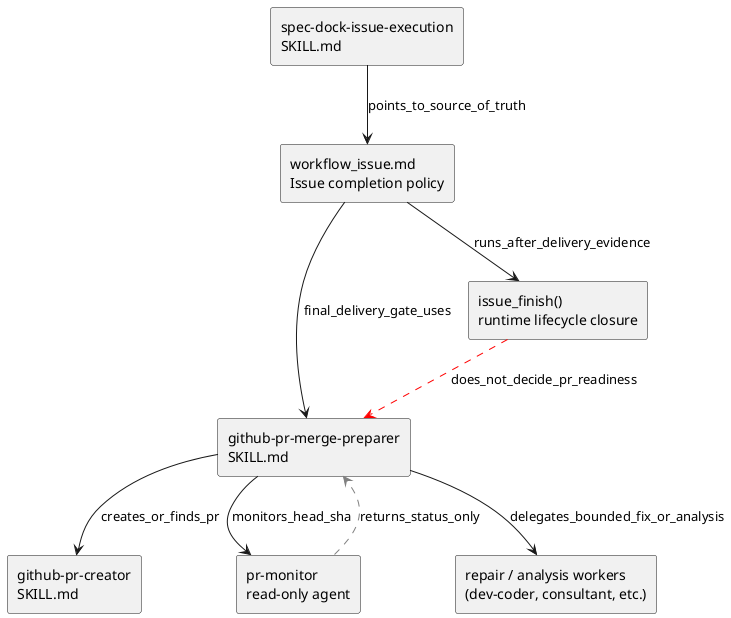
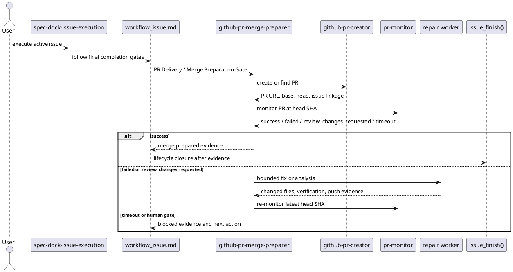

# iss-00105 PR Creation And Merge Ready Monitoring Skill — 設計（HOW）

## 親 Diagram 参照
- Epic:
  - `epic-00067` は agent tooling assets の source of truth を `src/spec_dock/assets/install_root/` にそろえ、dogfooding root の `.agents/`, `.codex/`, `.github/` と parity を保つ方針を持つ。
- 再利用する決定:
  - provider-side authority は `src/spec_dock/assets/install_root/`。
  - checked-in dogfooding mirror は provider asset と byte parity を保つ。
  - `spec-dock/docs/workflow_issue.md` は issue execution lifecycle / completion policy の正本。
  - `spec-dock-issue-execution/SKILL.md` は薄い reminder とし、詳細手順を重複させない。

## 目的・制約
- 目的:
  - `github-pr-merge-preparer` を、PR 作成後の monitor / fix / re-push / re-monitor を束ねる shared skill として追加する。
  - `spec-dock-issue-execution` の final delivery に PR Delivery Gate と Merge Preparation Gate を追加し、issue execution が merge 可能な PR の準備まで進むようにする。
- 必須:
  - 新 skill は既存 `github-pr-creator` と `pr-monitor` を再利用する coordinator として設計する。
  - `pr-monitor` は read-only monitor のまま維持する。
  - `issue_finish()` runtime command の意味は変更しない。
- 禁止:
  - merge、auto-merge enable、review thread resolve、review dismiss、review comment reply、branch delete、GitHub issue close、admin override を行わない。
  - `github-pr-merge-preparer` 単体は spec-dock `issue finish` を実行しない。`issue finish` は `workflow_issue.md` の completion policy に従い、PR readiness evidence 確定後に issue execution 側が lifecycle closure として扱う。
  - `github-pr-merge-preparer` 本体に CI parser、review fixer、runtime API client を詰め込まない。
  - `workflow_issue.md` と `spec-dock-issue-execution/SKILL.md` に同じ詳細手順を二重管理しない。

## 既存実装 / 規約の理解
- 参照した実装 / docs:
  - `src/spec_dock/assets/install_root/.agents/skills/github-pr-creator/SKILL.md`
  - `src/spec_dock/assets/install_root/.agents/skills/github-pr-creator/agents/openai.yaml`
  - `src/spec_dock/assets/install_root/.agents/skills/spec-dock-issue-execution/SKILL.md`
  - `src/spec_dock/assets/install_root/.codex/agents/pr-monitor.toml`
  - `src/spec_dock/assets/install_root/.github/agents/pr-monitor.agent.md`
  - `src/spec_dock/assets/spec_dock/docs/workflow_issue.md`
  - `tests/test_init_update.py`
- 現状理解:
  - `github-pr-creator` は PR 作成 leaf skill で、PR 作成後に `pr-monitor` へ渡すところまでを案内している。
  - `pr-monitor` は read-only agent として GitHub PR の checks / statuses / Codex review を監視し、`success | failed | review_changes_requested | timeout` を返す。
  - `spec-dock-issue-execution` は execution の reminder であり、完了条件の正本は `workflow_issue.md`。
  - installer / update の managed assets と dogfooding parity は `tests/test_init_update.py` の inventory / parity tests が守る。
- 採用するパターン:
  - 新 skill folder は `github-pr-creator` と同じく `SKILL.md` と `agents/openai.yaml` を持つ。
  - provider asset を先に更新し、dogfooding mirror へ同一内容を反映する。
  - `workflow_issue.md` は final delivery gate の詳細契約を持ち、skill は参照と短い handoff guidance に留める。
- 採用しないもの:
  - runtime command に PR readiness を組み込む設計。
  - `pr-monitor` を write-capable にする設計。
  - GitHub plugin skill や direct API wrapper の再実装。

## 採用方針 / トレードオフ
- 論点:
  - PR lifecycle をどこが所有するか。
- 選択肢:
  - `github-pr-creator` に fix loop まで追加する。
  - `pr-monitor` に修正機能を追加する。
  - 新 `github-pr-merge-preparer` を coordinator として追加する。
- 決定:
  - 新 `github-pr-merge-preparer` を coordinator として追加する。
- 理由:
  - `github-pr-creator` は PR creation leaf のまま保てる。
  - `pr-monitor` の read-only 境界を守れる。
  - issue execution からは final delivery gate として呼びやすく、通常の PR 仕上げ依頼からも再利用できる。

## 依存関係分析
- module / file 依存:
  - `spec-dock-issue-execution/SKILL.md` depends on `workflow_issue.md` and references `github-pr-merge-preparer`.
  - `workflow_issue.md` owns final delivery completion policy and references `github-pr-merge-preparer`, `github-pr-creator`, and `pr-monitor`.
  - `github-pr-merge-preparer/SKILL.md` references `github-pr-creator`, `pr-monitor`, repair workers, and analysis workers.
  - `tests/test_init_update.py` asserts managed asset inventory, dogfooding parity, and content contracts.
- 上流 / 前提:
  - Requirement gate passed for `requirement.md`.
  - Existing managed skill inventory and dogfooding parity tests are the protection points.
- 下流 / 依存先:
  - `plan.md` must split docs/skill asset work and tests into reviewable steps.
  - Implementation must update provider and dogfooding mirror consistently.
- 実装起点:
  - Start with new provider skill asset and its dogfooding mirror.
  - Then add workflow / issue-execution references.
  - Then update tests to lock inventory, parity, and critical wording.

## Module Dependency Diagram
- タイトル:
  - PR merge-preparation skill dependency delta
- 答える問い:
  - 新 skill と既存 skill / monitor / workflow docs の責務境界はどこか。
- 範囲:
  - Agent-tooling assets and issue workflow docs only.
- 含めない詳細:
  - GitHub API call graph、CI log parser、個別 review fix 手順。
- 更新条件:
  - `pr-monitor` の read-only 境界、`issue_finish()` 境界、または skill ownership が変わるとき。
- 図:



## Local Diagram Delta
- 変更する境界 / 責務 / 相互作用:
  - `github-pr-merge-preparer` が PR lifecycle coordination を所有する。
  - `pr-monitor` は observation のみを返す。
  - `workflow_issue.md` が issue execution の final delivery evidence を所有する。
  - `issue_finish()` は lifecycle closure だけを所有する。

## インターフェース契約
- `github-pr-merge-preparer` input:
  - active issue context, current branch, optional base branch, optional PR URL/number, issue linkage expectation, local final gate status.
  - Base branch resolution contract:
    - First check whether an existing PR already exists for the current branch.
    - If an existing PR is found, reuse it and do not create a duplicate PR.
    - If a user-specified base conflicts with an existing PR base, do not mutate the PR automatically. Prefer the existing PR base for monitoring and report the conflict as evidence; if the user explicitly required changing the base, stop at human gate before any PR mutation.
    - If no existing PR is found, use user-specified base branch first when explicit.
    - If an existing PR base conflicts with local config or docs, prefer the existing PR base and report the conflict as evidence.
    - Otherwise respect `branch.<current>.gh-merge-base` when present.
    - If docs / config / branch hints conflict and no existing PR base resolves the conflict, stop at human gate before creating a PR.
    - Fall back to repository default branch only when no user-specified base, existing PR base, or branch-specific merge base exists.
  - PR creation mode contract:
    - If local final gates are known to have passed, create or keep a ready PR unless the user explicitly requests draft.
    - If local final gates are incomplete or unknown, create a draft PR or stop at human gate; do not present the PR as ready for merge preparation.
- `github-pr-merge-preparer` output:
  - PR URL, PR number, PR open/closed state, base branch, head branch, latest head SHA, monitor status, fix loop summary, remaining risks, human gate reason if blocked, merge-prepared yes/no.
  - Merge-prepared predicate evidence:
    - PR is open.
    - monitor result is for latest head SHA.
    - no blocking check failure remains.
    - failed non-required checks are treated as blocking unless the check is known optional or the user has explicitly waived it; waived non-required failures must be reported as residual risk.
    - no blocking review feedback remains.
    - merge conflict or equivalent visible merge blocker is not present.
    - unresolved review-thread state limitation, if any, is disclosed and treated as human gate unless explicitly waived.
- `pr-monitor` input:
  - `repo`, `pr`, recommended `head_sha`, `reason`, optional timeout.
- `pr-monitor` output:
  - `overall_status: success | failed | review_changes_requested | timeout`, checks summary, codex review summary, risks / unknowns.
- `workflow_issue.md` report evidence:
  - `PR Delivery Gate`: PR URL, selected base, base-resolution source, base-conflict handling, draft/ready decision, head branch, latest head SHA, issue linkage, existing/new PR decision.
  - `Merge Preparation Gate`: PR open state, monitor status, fix loop count, latest successful head SHA, required check status, non-required check status and waiver evidence, blocking review status, merge conflict / merge blocker status, unresolved-review limitation status, unresolved blockers, final merge-prepared decision.
- Fix-loop stop contract:
  - Each monitor/fix iteration records `iteration_index`, `head_sha`, `monitor_status`, `failure_class`, `action_taken`, and `next_action`.
  - `failure_class` is a stable coarse label, not a full log parser. Use categories such as `check_failure:<job_or_check_name>`, `review_feedback:<topic>`, `merge_conflict`, `base_branch_conflict`, `permission_or_auth`, `external_or_flaky`, `timeout`, `unknown`.
  - Default autonomous repair limit is two repair attempts per same `failure_class` and four total repair attempts per PR preparation invocation.
  - Reaching either limit, seeing the same `failure_class` after a repair, or encountering `permission_or_auth`, `external_or_flaky`, `base_branch_conflict`, `unknown`, requirement expansion, breaking change, migration, secret / deployment setting change, or ambiguous review intent triggers human gate.
  - Human gate evidence must include latest PR URL, head SHA, failure class history, attempted fixes, blocker reason, and recommended next action.

## Sequence Delta
- 変更する相互作用:
  - final commit 後に PR delivery / merge preparation を必須 gate として追加する。
- retry / external API:
  - `pr-monitor` timeout / failed / review_changes_requested は success とせず、`github-pr-merge-preparer` が分類、fix delegation、re-push、re-monitor、または human gate に進める。
  - 同じ `failure_class` の再発、same-class repair limit 到達、total repair limit 到達、または human-gate category は再委譲せず停止する。
- UML:



## Domain Model Delta
- 新しい workflow state:
  - `pr_delivery_pending`: final commit 後、PR 作成または既存 PR 特定前。
  - `merge_preparation_pending`: PR はあるが monitor / fix loop が完了していない。
  - `merge_prepared`: 人間が merge 判断に入れる evidence が揃った。
  - `merge_preparation_blocked`: timeout、permission、external outage、曖昧な review、scope expansion などにより自律継続しない。
- 既存 state との関係:
  - `issue_finish` は `merge_prepared` evidence の後に呼ぶ lifecycle closure であり、`merge_prepared` 自体を計算しない。

## ディレクトリ / ファイル変更計画
```text
src/spec_dock/assets/install_root/
`-- .agents/
    `-- skills/
        |-- github-pr-merge-preparer/
        |   |-- SKILL.md                 # new shared coordinator skill
        |   `-- agents/
        |       `-- openai.yaml           # new skill interface metadata
        |-- github-pr-creator/
        |   `-- SKILL.md                 # update handoff wording if needed
        `-- spec-dock-issue-execution/
            `-- SKILL.md                 # reference final delivery via merge-preparer

.agents/skills/
|-- github-pr-merge-preparer/
|   |-- SKILL.md                         # dogfooding mirror, byte parity with provider
|   `-- agents/
|       `-- openai.yaml                  # dogfooding mirror, byte parity with provider
|-- github-pr-creator/
|   `-- SKILL.md                         # dogfooding mirror if provider wording changes
`-- spec-dock-issue-execution/
    `-- SKILL.md                         # dogfooding mirror, final delivery handoff

src/spec_dock/assets/spec_dock/docs/
`-- workflow_issue.md                    # add PR Delivery / Merge Preparation gates

spec-dock/docs/
`-- workflow_issue.md                    # dogfooding mirror of shipped workflow doc

tests/
`-- test_init_update.py                   # asset inventory, parity, and wording regression
```

## 要件 -> 設計マッピング
| requirement | design response | verification target |
|---|---|---|
| AC-001..AC-006 | `github-pr-merge-preparer` workflow defines create/find, monitor, classify, fix delegation, re-monitor, completion report. | skill content regression |
| AC-007 | Add provider asset inventory and dogfooding parity expectations for new skill files. | `tests/test_init_update.py` |
| AC-008 | `spec-dock-issue-execution` and `workflow_issue.md` point final delivery to `github-pr-merge-preparer`. | skill/doc content regression |
| AC-009 | `workflow_issue.md` marks failed/timeout/blocked PR preparation as incomplete, not complete. | workflow content regression |
| AC-010 | `issue_finish()` semantics remain unchanged and PR readiness is workflow evidence. | workflow wording and existing runtime tests |
| EC-001..EC-007 | Skill and workflow define duplicate PR, base conflict, external failure, review ambiguity, timeout, and `issue finish` boundary. | content regression / spec review |

## テスト戦略
- Unit / runtime tests:
  - No new runtime behavior is required because `issue_finish()` semantics do not change.
  - Existing `issue_finish` tests must continue to pass.
- Installer / scaffold tests:
  - Add `github-pr-merge-preparer` files to managed asset inventory.
  - Assert init/update installs the new skill.
  - Assert checked-in dogfooding agent tooling parity matches install_root assets.
- Content regression tests:
  - Assert `spec-dock-issue-execution` mentions `github-pr-merge-preparer` and final delivery handoff.
  - Assert `workflow_issue.md` mentions `PR Delivery Gate`, `Merge Preparation Gate`, non-merge boundary, and blocked/incomplete handling.
  - Assert `github-pr-creator` still remains a PR creation leaf and does not become the lifecycle owner.
- Manual verification:
  - Inspect generated skill text for over-broad authority such as merge, auto-merge, thread resolve, issue close, or admin override.

## 互換性 / 移行 / ロールバック
- 互換性:
  - Existing `github-pr-creator` and `pr-monitor` callers remain valid.
  - `spec-dock-issue-execution` becomes stricter at completion time, but only through workflow guidance, not runtime command behavior.
- 移行:
  - Existing consumer repos receive the new skill and workflow wording through `spec-dock update`.
  - Dogfooding mirror is updated in this repo in the same change set.
- ロールバック:
  - Remove the new skill files from provider and dogfooding mirror.
  - Revert workflow / issue-execution wording and test inventory additions.
  - No runtime data migration is needed.

## リスク / ガードレール
- Risk:
  - Agents may confuse `merge-prepared` with merge execution.
  - Guardrail:
    - Skill and workflow must explicitly forbid merge / auto-merge / branch deletion / GitHub issue close / review comment reply / review thread resolve / review dismiss / admin override.
- Risk:
  - `issue_finish` could be interpreted as proof of PR readiness.
  - Guardrail:
    - Workflow wording keeps `issue_finish()` as lifecycle closure only and requires separate PR evidence before it.
- Risk:
  - Skill becomes too complex and tries to implement CI / review repair itself.
  - Guardrail:
    - Skill only coordinates classification and bounded delegation; repair logic remains with appropriate workers / existing skills.
- Risk:
  - Autonomous repair can loop without converging.
  - Guardrail:
    - The design fixes coarse `failure_class` tracking, two same-class repair attempts, four total repair attempts, and human-gate categories as required stop conditions.
- Risk:
  - Tests become brittle by checking too much prose.
  - Guardrail:
    - Content tests should check stable contract phrases, not full paragraphs.

## 要件 / 例外 -> verification mapping
| ID | verification |
|---|---|
| AC-001 | `github-pr-merge-preparer/SKILL.md` contains one-stage workflow through merge-prepared reporting. |
| AC-002 | skill contains create-or-find PR guidance, issue linkage requirement, base-resolution precedence, and draft/ready decision rule. |
| AC-003 | skill delegates monitoring to `pr-monitor` with latest head SHA. |
| AC-004 | skill classifies failed checks / review feedback / timeout and gates scope expansion. |
| AC-005 | skill requires commit / push confirmation, re-monitoring after fixes, `failure_class` history, same-class repair limit, total repair limit, and human gate evidence. |
| AC-006 | skill completion checklist reports PR URL, PR open state, base/head, latest head SHA, required/non-required checks with waiver evidence, review state, merge conflict / blocker state, unresolved-review limitation state, residual risk, and human merge boundary. |
| AC-007 | installer / dogfooding parity tests include new skill files. |
| AC-008 | `spec-dock-issue-execution` and `workflow_issue.md` contain final delivery integration. |
| AC-009 | `workflow_issue.md` says failed / timeout / blocked merge preparation is incomplete. |
| AC-010 | `workflow_issue.md` keeps `issue_finish()` as lifecycle closure only. |
| EC-001..EC-007 | skill / workflow content includes duplicate PR, base conflict, external failure, review ambiguity, timeout, same-class stop conditions, and boundary rules. |

## Design Gate Handoff
- Plan should use docs / skill text implementation steps delegated to `doc-writer`.
- Tests should be implemented or updated by `dev-coder`.
- Final quality gate must include `spec-reviewer` for skill/docs alignment and `code-reviewer` / `qa-reviewer` if test or runtime-adjacent changes are made.
